# 第一节课：深度学习基础——从零到多层感知机

## 零、课程说明

**课程名称**：零基础深度学习直通大模型  
**适用对象**：准备考研、保研，希望系统入门深度学习与大模型的同学  
**第一节课目标**：理解机器学习/深度学习的基本概念，掌握线性回归、梯度下降、反向传播、激活函数、逻辑回归与交叉熵，并能用 PyTorch 跑通第一个小项目。

### 课程节奏说明

本课程按**周**推进。每一周包含：

| 类型 | 天数 | 说明 |
| --- | ---: | --- |
| **直播上课** | 1 天 | 集中讲解本周核心讲义，答疑，布置任务 |
| **自习任务** | 6 天 | 按下方计划表完成环境配置、视频学习、代码实践与自学 |

> 建议每天投入 **1.5～2.5 小时**。前四天以「搭环境 + 看视频 + 对照讲义」为主；直播后两天以「跑通小项目 + 整理笔记 + 自学 CNN」为主。

---

### 第一周学习计划表

**本周主题**：深度学习基础——从零到多层感知机（MLP）  
**直播日**：第 5 天（讲解本讲义全文 + PyTorch 小项目演示）  
**下周预告**：CNN（卷积神经网络）入门

| 天数 | 类型 | 任务 | 参考资料 / 产出 |
| ---: | --- | --- | --- |
| **第 1 天** | 自习 | 安装并配置 Anaconda + Python 开发环境；创建课程专用虚拟环境；验证 `python` / `conda` 可用 | [【2025】超详细 Anaconda+Python 安装保姆级教程](https://blog.csdn.net/virtuaweaver/article/details/150031173) |
| **第 2 天** | 自习 | 下载安装 Cursor；完成中文界面、Python 解释器、基础 AI 对话等配置；用 Cursor 打开本课程仓库并新建一个 `.py` 文件试运行 | [Cursor 下载安装以及使用教程（详细图文并茂）](https://blog.csdn.net/weixin_36467887/article/details/159619159) |
| **第 3 天** | 自习 | 观看 B 站《PyTorch 深度学习实践》**第 1～2 集**，对照本讲义「一、机器学习与深度学习」「三、线性回归模型」做笔记 | [第 1 集：Overview（深度学习概论）](https://www.bilibili.com/video/BV1Y7411d7Ys?p=1) · [第 2 集：Linear Model（线性模型）](https://www.bilibili.com/video/BV1Y7411d7Ys?p=2) |
| **第 4 天** | 自习 | 观看 **第 3～4 集**，对照本讲义「四、梯度下降法与反向传播」做笔记；尝试手推一次链式法则 | [第 3 集：Gradient Descent（梯度下降）](https://www.bilibili.com/video/BV1Y7411d7Ys?p=3) · [第 4 集：Back Propagation（反向传播）](https://www.bilibili.com/video/BV1Y7411d7Ys?p=4) |
| **第 5 天** | **直播** | 跟随老师系统学习本讲义：评估指标 → 激活函数 → 逻辑回归与交叉熵 → MLP → PyTorch 小项目演示；记录疑问，直播后 24 小时内整理笔记 | 本文件 `讲义.md` + `项目/graduate_admission_mlp.py` |
| **第 6 天** | 自习 | 独立完成**课程小项目**：打开 `graduate_admission.csv` 浏览数据；安装依赖、运行脚本、修改超参数并对比测试集指标 | `项目/graduate_admission.csv` → `pip install -r requirements.txt` → `python graduate_admission_mlp.py` |
| **第 7 天** | 自习 | **复盘 + 自学**：回顾本周公式与代码；开始自学 CNN（卷积神经网络），为后续学习打下基础（见下方 CNN 自学指引） | 见「第一周自习验收清单」与「CNN 自学指引」 |

#### 第一周自习验收清单

完成以下条目，即视为第一周达标：

- [ ] Anaconda 已安装，`conda --version` 与 `python --version` 在终端可正常输出
- [ ] 已创建课程虚拟环境（建议命名 `dl-course`），并在 Cursor 中选中该解释器
- [ ] Cursor 可正常打开本项目文件夹，Chat / Composer 能辅助编写 Python 代码
- [ ] 已看完刘二大人课程前 4 集，能口头解释：线性模型、梯度下降、反向传播三者的关系
- [ ] 已跑通 `graduate_admission_mlp.py`，并至少完成一次超参数对比实验（如修改 `hidden` 或 `lr`）；记录逻辑回归 vs MLP 的测试集 F1 差异
- [ ] 能独立写出：准确率、精确率、召回率、F1、MSE 的含义（不要求默写公式）

#### 第 1～2 天环境配置要点（摘要）

**Anaconda（第 1 天）**

1. 安装路径建议放在非 C 盘（如 `D:\software\anaconda3`）
2. 将 `Anaconda`、`Scripts`、`Library\bin` 加入系统 Path
3. 配置清华镜像源加速下载
4. 创建虚拟环境并安装 PyTorch：

```bash
conda create -n dl-course python=3.10 -y
conda activate dl-course
conda install pytorch torchvision torchaudio cpuonly -c pytorch
conda install matplotlib pandas scikit-learn jupyter -y
python -c "import torch; print(torch.__version__)"
```

**Cursor（第 2 天）**

1. 从 [cursor.com](https://www.cursor.com/cn) 下载安装，注册账号以使用 AI 功能
2. 安装「Chinese (Simplified) Language Pack」切换中文界面
3. 安装 Python 扩展，`Ctrl+Shift+P` → `Python: Select Interpreter` 选择 `dl-course` 环境
4. 用 Cursor 打开 `D:\27pr`（或你的课程根目录），在 `第一节课/项目/` 下新建测试脚本验证运行

#### 第 3～4 天视频与讲义对照表

| 视频集数 | 视频主题 | 对应本讲义章节 |
| --- | --- | --- |
| P1 Overview | 深度学习概论、框架选型 | 一、机器学习与深度学习是什么？ |
| P2 Linear Model | 线性模型与损失 | 三、线性回归模型 |
| P3 Gradient Descent | 梯度下降、学习率 | 四、梯度下降法与反向传播（前半） |
| P4 Back Propagation | 计算图、链式法则 | 四、梯度下降法与反向传播（后半） |

#### 第 6～7 天：小项目与 CNN 自学

**小项目（第 6 天）**

进入 `项目/` 目录，按 `README.md` 分段阅读 `graduate_admission_mlp.py` 中的 `【Part 1/2/3】`，重点理解：

- 数据划分与归一化
- `loss.backward()` 与 `optimizer.step()` 的训练循环
- 分类指标 `classification_metrics` 的计算

**CNN 自学（第 7 天，为后续深度学习课程做准备）**

无需深入推导，先建立直觉即可：

1. 了解「卷积（Convolution）」：用一个小窗口（卷积核）在图像上滑动，提取局部特征（边缘、纹理等），理解"局部感受野"的含义
2. 了解「池化（Pooling）」：Max Pooling 和 Average Pooling，降采样的作用——减少计算量、保留主要特征
3. 了解 CNN 的基本架构：卷积层 → 激活函数 → 池化层 → 全连接层，以及 LeNet-5 这个经典网络

**推荐自学资源**：

- [刘二大人《PyTorch 深度学习实践》第 10 集：CNN Basic（卷积神经网络基础）](https://www.bilibili.com/video/BV1Y7411d7Ys?p=10)
- 搜索「CNN 卷积神经网络 通俗讲解」或「李宏毅 CNN」快速建立直观理解
- 动手体验：[CNN Explainer](https://poloclub.github.io/cnn-explainer/)——网页端可视化 CNN 逐层提取特征的过程

> CNN 是 CV（计算机视觉）的基石，也是后续理解 ViT、CLIP（第三节课）的必要铺垫。第一周不需要手写 CNN 代码，重点理解**卷积核如何提取特征**即可。

---

## 一、机器学习与深度学习是什么？

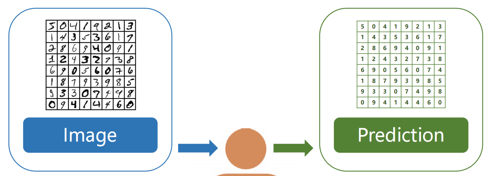

样本集：$\{(x_1,y_1),(x_2,y_2),\dots,(x_n,y_n)\}$

输入数据 → 模型 → 重复迭代 → 输出  
计算损失（对比输出值和标签值）→ 优化模型参数 → 最优模型参数

---

## 二、数据集与评估指标

### 数据集

- **训练集**：用于训练模型，让模型学习数据中的特征和规律。

- **验证集**（不一定有）：用来调整模型的超参数，在训练过程中评估模型性能，防止过拟合。

- **测试集**：在模型训练完成后，评估模型的泛化能力，在训练过程中不参与模型调整。

- **数据集划分示意图（Mermaid）**：

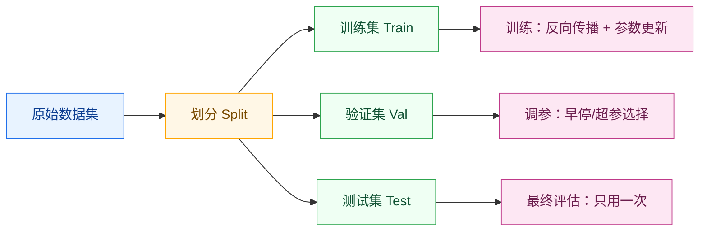

- **常见划分比例（示例）**：

| 场景 | 训练集 | 验证集 | 测试集 |
| --- | ---: | ---: | ---: |
| 数据充足 | 80% | 10% | 10% |
| 数据较少 | 70% | 15% | 15% |
| 只有 Train/Test | 90% | — | 10% |

- **加载流程**:

  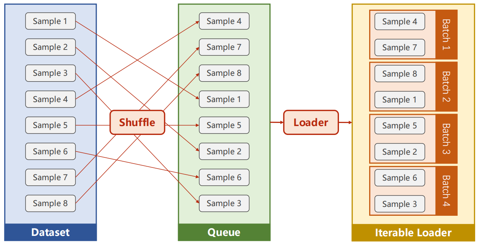

### 深度学习常用的指标及计算公式

#### (1)分类任务指标

1.准确率(Accuracy)

概念:准确率是指模型预测正确的样本数占总样本数的比例,反映了模型在所有样本上的整体预测正确程度。

公式:

$$
\text{Accuracy} = \frac{\text{TP} + \text{TN}}{\text{TP} + \text{TN} + \text{FP} + \text{FN}}
$$

其中,TP(True Positive)表示真正例,TN(True Negative)表示真反例,FP(False Positive)表示假正例,FN(False Negative)表示假反例。

2.精确率(Precision)

概念:精确率是指在模型预测为正类的样本中,实际为正类的样本所占的比例。它衡量了模型预测为正类的准确性。

公式:

$$
\text{Precision} = \frac{\text{TP}}{\text{TP} + \text{FP}}
$$

3.召回率(Recall)

概念:召回率也叫真正率(TPR),是指在所有实际为正类的样本中,被正确预测为正类的样本所占的比例,体现了模型对正类样本的覆盖能力。

公式:

$$
\text{Recall} = \frac{\text{TP}}{\text{TP} + \text{FN}}
$$

4.F1分数(F1-Score)

概念:F1分数是综合考虑精确率和召回率的指标,它是精确率和召回率的调和平均数,能够更全面地评估模型性能。当精确率和召回率都高时,F1分数才会高。

公式:

$$
F1 = 2 \cdot \frac{\text{Precision} \cdot \text{Recall}}{\text{Precision} + \text{Recall}}
$$

#### (2)回归任务指标

##### 1.均方误差(Mean Squared Error, MSE)(损失函数?)

概念:常用于回归任务,计算预测值与真实值之间差值的平方的平均值,能反映预测值的平均误差程度。MSE值越小,说明预测值与真实值越接近,模型的预测效果越好。

公式:

$$
\text{MSE} = \frac{1}{n} \sum_{i=1}^n (\hat{y}_i - y_i)^2
$$

其中 $y_i$ 是真实值, $\hat{y}_i$ 是预测值, $n$ 是样本数量。

##### 2.平均绝对误差(Mean Absolute Error, MAE)

概念:同样用于回归任务,计算预测值与真实值之间差值的绝对值的平均值,能直观地反映预测值与真实值的平均偏离程度。MAE值越小,表明模型预测值与真实值的平均偏差越小,模型性能越好。

公式:

$$
\text{MAE} = \frac{1}{n} \sum_{i=1}^n |\hat{y}_i - y_i|
$$

##### 3.R方值(R-squared)

概念:用于衡量回归模型对观测数据的拟合程度,取值范围在0到1之间。越接近1,表示模型对数据的拟合效果越好;越接近0,说明模型的拟合效果越差。

公式:

$$
R^2 = 1 - \frac{\sum_{i=1}^n (\hat{y}_i - y_i)^2}{\sum_{i=1}^n (y_i - \bar{y})^2}
$$

其中 $\bar{y}$ 是真实值的均值。

例题:

假设有一个二分类模型和一个简单的回归模型,数据如下:

(1)总样本数为200个,实际正类样本100个,实际负类样本100个。模型预测正确的正类样本80个,错误预测为正类的样本30个,预测正确的负类样本70个,错误预测为负类的样本20个。

(2)对5个样本进行预测,真实值分别为[3,5,7,9,11],预测值分别为[4,6,8,10,12]。请分别计算二分类模型的准确率、精确率、召回率、F1分数,以及回归模型的MSE和MAE。

答案:

准确率: $\frac{80+70}{200} = 0.75$

精确率: $\frac{80}{80+30} = \frac{8}{11} \approx 0.727$

召回率: $\frac{80}{80+20} = 0.8$

F1分数: $2 \cdot \frac{0.727 \cdot 0.8}{0.727 + 0.8} \approx 0.762$

MSE: $\frac{(4-3)^2 + (6-5)^2 + (8-7)^2 + (10-9)^2 + (12-11)^2}{5} = \frac{5}{5} = 1$

MAE: $\frac{|4-3| + |6-5| + |8-7| + |10-9| + |12-11|}{5} = \frac{5}{5} = 1$

#### AUC

AUC是评估二分类模型性能的重要指标之一,它表示ROC曲线下的面积。ROC曲线是一个以假正率(False Positive Rate, FPR)为横轴,真正率(True Positive Rate, TPR)为纵轴的图,用于展示分类模型在不同阈值下的性能。

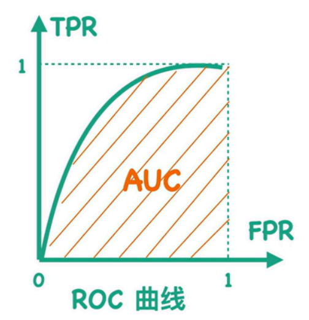

真正率也被称为召回率(Recall),计算公式为:

$$
\text{TPR} = \text{Recall} = \frac{\text{TP}}{\text{TP} + \text{FN}}
$$

假正率计算公式为:

$$
\text{FPR} = \frac{\text{FP}}{\text{FP} + \text{TN}}
$$

AUC可以通过以下公式计算:

$$
\text{AUC} = \int_0^1 \text{TPR}(d) \, d(\text{FPR}(d))
$$

其中, $\text{TPR}(d)$ 是在阈值 $d$ 下的真正率, $\text{FPR}(d)$ 是在阈值 $d$ 下的假正率。

在实际应用中,由于我们是离散地计算TPR和FPR,所以上述积分公式通常被近似为求和的形式:

$$
\text{AUC} \approx \sum_{i=1}^{N-1} (\text{TPR}_i - \text{TPR}_{i+1}) \times \frac{\text{FPR}_i + \text{FPR}_{i+1}}{2}
$$

其中, $N$ 是不同阈值的数量, $\text{TPR}_i$ 和 $\text{FPR}_i$ 分别是在第 $i$ 个阈值下的真正率和假正率。

#### 交叉验证

交叉验证是评估模型性能的一种方法,将数据集分成 $k$ 个互不相交的子集。每次用 $k-1$ 个子集作为训练集,剩下1个子集作为测试集,如此进行 $k$ 次训练和测试,最终将 $k$ 次测试结果的平均值作为模型评估指标,能更充分利用数据,减少划分偏差。

常见方法有 $k$ 折交叉验证(k-fold Cross Validation)、留一法交叉验证(Leave-One-Out Cross Validation)。

练习题: 对于10折交叉验证,假设有100个样本,每次训练集和测试集分别有多少个样本?

答案: 每次训练集有90个样本,测试集有10个样本。

#### 监督学习与非监督学习

监督学习

监督学习的训练数据集中同时有输入特征和对应的标签。模型学习输入特征与标签之间的映射关系,以对新输入数据进行预测。像线性回归、逻辑回归、决策树、支持向量机等都属于监督学习算法。

非监督学习

非监督学习的数据集中只有输入特征,无预先定义的标签。旨在发现数据中的内在结构和模式,如聚类、降维、关联规则挖掘等。常见算法有 $k$ 均值聚类(k-Means Clustering)、主成分分析(PCA)。

练习题: 判断以下任务属于监督学习还是非监督学习: 根据学生成绩预测其是否能考上大学。

答案: 监督学习。

## 三、线性回归模型

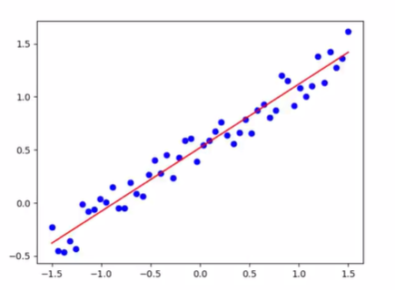

如上图,我们可以看到一些离散的点和一条根据这些点拟合出来的曲线,如果把这样的标量形式转化到矩阵形式,那么就是机器学习中的线性回归模型:

$$
y = \omega^T x + b
$$

我们可以把上述公式转化为增广矩阵的形式,如下:

$$
\begin{bmatrix} 
c_1 \\ 
c_2 \\ 
\vdots \\ 
c_n 
\end{bmatrix} = 
\begin{bmatrix} 
\omega_1 & \omega_2 & \cdots & \omega_n 
\end{bmatrix} 
\begin{bmatrix} 
x_1 \\ 
x_2 \\ 
\vdots \\ 
x_n \\ 
1 
\end{bmatrix}
$$

两种形式实际上是等价的:

$$
y = \omega^T x
$$

在机器学习中,我们需要定义一个损失函数来评估模型与真实值之间的差距,比如在线性回归模型中,我们可以采用一个均方误差函数来表示这个损失值,对于单个样本,我们可以这样计算:

$$
L(\omega) = (\hat{y} - \omega^T x)^2
$$

对于 $n$ 个样本,求和得到下式:

$$
L(\omega) = \frac{1}{2n} \sum_{i=1}^n (\hat{y}^{(i)} - \omega^T x^{(i)})^2
$$

定义完模型之后,我们就可以进行训练了,当前我们实际上就是要求一个使得损失函数最小的参数矩阵 $\omega$,任务描述如下:

$$
\omega^* = \arg\min L(\omega, X, y) = \arg\min \frac{1}{2n} \sum_{i=1}^n (\hat{y}^{(i)} - \omega^T x^{(i)})^2
$$

这实际上是一个关于 $\omega$ 的二次函数,我们可以尝试对它进行求导得到我们需要的参数矩阵,但在这之前,我们先试着简化一下算式。对于一组包含 $N$ 个样本,每个样本包含 $n$ 个特征的数据集:

$$
X = \begin{bmatrix}
x_1^{(1)} & x_1^{(2)} & \cdots & x_1^{(N)} \\
x_2^{(1)} & x_2^{(2)} & \cdots & x_2^{(N)} \\
\vdots & \vdots & \ddots & \vdots \\
x_n^{(1)} & x_n^{(2)} & \cdots & x_n^{(N)} \\
1 & 1 & \cdots & 1
\end{bmatrix}
$$

$$
X^T \omega = \begin{bmatrix}
x_1^{(1)} & x_2^{(1)} & \cdots & x_n^{(1)} & 1 \\
x_1^{(2)} & x_2^{(2)} & \cdots & x_n^{(2)} & 1 \\
\vdots & \vdots & \ddots & \vdots & \vdots \\
x_1^{(N)} & x_2^{(N)} & \cdots & x_n^{(N)} & 1
\end{bmatrix} \omega = \begin{bmatrix}
x^{(1)T} \omega \\
x^{(2)T} \omega \\
\vdots \\
x^{(N)T} \omega
\end{bmatrix}
$$

样本的预测值即为:

$$
\begin{bmatrix}
\omega^T x^{(1)} \\
\omega^T x^{(2)} \\
\vdots \\
\omega^T x^{(N)}
\end{bmatrix}
$$

计算真实值与预测值之间的误差:

$$
Y - X^T \omega = \begin{bmatrix}
y^{(1)} - \omega^T x^{(1)} \\
y^{(2)} - \omega^T x^{(2)} \\
\vdots \\
y^{(N)} - \omega^T x^{(N)}
\end{bmatrix}
$$

对于样本误差向量的二范数为:

$$
\|Y - X^T \omega\|_2 = \sqrt{\sum_{i=1}^n (\hat{y}^{(i)} - \omega^T x^{(i)})^2}
$$

损失函数转化为:

$$
L(\omega) = \frac{1}{2n} \sum_{i=1}^n (\hat{y}^{(i)} - \omega^T x^{(i)})^2 = \frac{1}{2n} \|Y - X^T \omega\|_2^2
$$

这里补充一点关于向量求导的知识: 

$$ \frac{\partial \|x\|_2^2}{\partial x} = 2x \quad\quad \frac{\partial Ax}{\partial x} = A^T $$

对损失函数求导得：
$$
\frac{\partial L(\omega)}{\partial \omega} = \frac{\partial}{\partial \omega} \frac{1}{2n} \|Y - X^T \omega\|_2^2 = 2 \cdot \frac{1}{2n} \cdot X \cdot (Y - X^T \omega) = \frac{1}{n} \cdot X \cdot (Y - X^T \omega)
$$

令:

$$
\frac{1}{n} \cdot X \cdot (Y - X^T \omega) = 0
$$

得到:

$$
X \cdot Y - X \cdot X^T \omega = 0
$$

最优参数矩阵：
$$
\omega_{\mathbb{K}} = (X \cdot X^T)^{-1} \cdot X \cdot Y
$$

### 拟合效果与正则化

过拟合指模型在训练集上表现优异,几乎能完美拟合训练数据,但在测试集或新数据上表现很差,泛化能力弱。原因是模型学习到了训练数据中的噪声和细节,这些细节不代表数据真实分布。

在下面的例子中,哪些元素代表预测值、真实值?

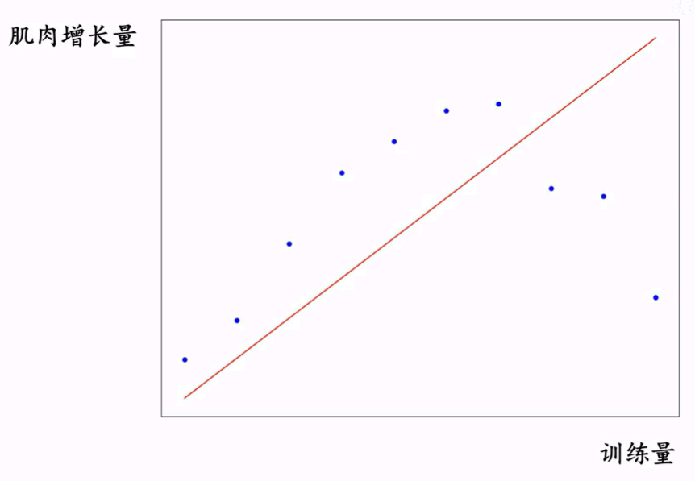

这样一个关系,使用线性回归模型拟合之后,你会发现效果不太好,这种由于模型表达能力弱,无法发现数据集中的一般规律,导致拟合结果不佳的情况就叫做欠拟合,比较容易的一个想法就是,提高模型的复杂度。如下图,通过提高拟合函数的次数,可以得到一个更精确的函数。

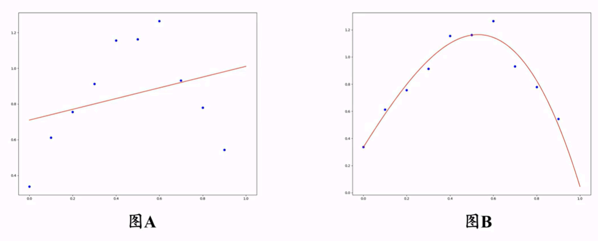

上述解决办法,实际上是扩展了线性回归,这叫做多项式回归,模型的函数如下所示:

$$
y = \omega^T \varphi(x)
$$

其中参数向量为:

$$
\omega = \begin{bmatrix}
\omega_0 \\
\omega_1 \\
\omega_2 \\
\vdots \\
\omega_m
\end{bmatrix}
$$

特征向量为:

$$
\varphi(x) = \begin{bmatrix}
1 \\
x^1 \\
x^2 \\
\vdots \\
x^m
\end{bmatrix}
$$

多项式次数为:

$$
y = \omega_0 + \omega_1 x^1 + \omega_2 x^2 + \cdots + \omega_m x^m
$$

多项式回归的损失函数:

$$
L(\omega) = \frac{1}{2n} \sum_{i=1}^n (\hat{y}^{(i)} - \omega^T \varphi(x^{(i)}))^2
$$

最小化损失:

$$
\omega^* = \arg\min \frac{1}{2n} \sum_{i=1}^n (\hat{y}^{(i)} - \omega^T \varphi(x^{(i)}))^2
$$

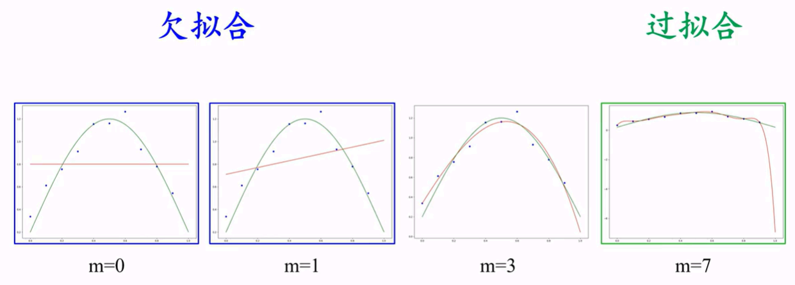

解决过拟合问题需要减少模型的复杂度,这时我们需要在损失函数中加入一个正则化项惩罚系数,这是一个超参数,需要在训练过程中选取合适的值,加入正则化项的损失函数如下所示:

$$
L(\omega) = \frac{1}{2n} \sum_{i=1}^n (\hat{y}^{(i)} - \omega^T \varphi(x^{(i)}))^2 + \frac{\lambda}{2} \omega^T \omega
$$

其实,我们还可以通过增加样本集的数量,使得模型趋向于正常拟合。

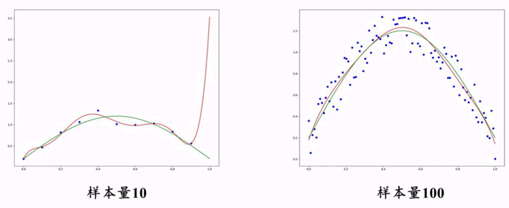

练习题:以下哪种做法可能导致过拟合?

A.增加训练数据量
B.减少模型复杂度
C.增加模型复杂度
D.使用正则化

## 四、梯度下降法与反向传播

**训练循环示意图（Markdown/mermaid）**：把“训练”拆成 4 步，你会更容易把梯度下降和反向传播对上号。


对于一个二元函数 $ Z = f(x, y)$：

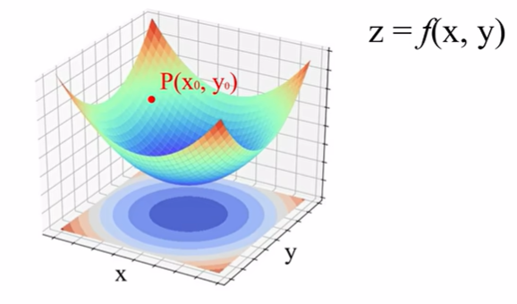
$$
\nabla f(x_0, y_0) = \{f_x(x_0, y_0), f_y(x_0, y_0)\} = f_x(x_0, y_0) \mathbf{i} + f_y(x_0, y_0) \mathbf{j}
$$

对于损失函数,一点处的梯度为:

$$
\nabla L = \frac{\partial L}{\partial \omega} \mathbf{i} + \frac{\partial L}{\partial b} \mathbf{j}
$$

我们知道,梯度的方向是函数增长最快的方向,证明如下:

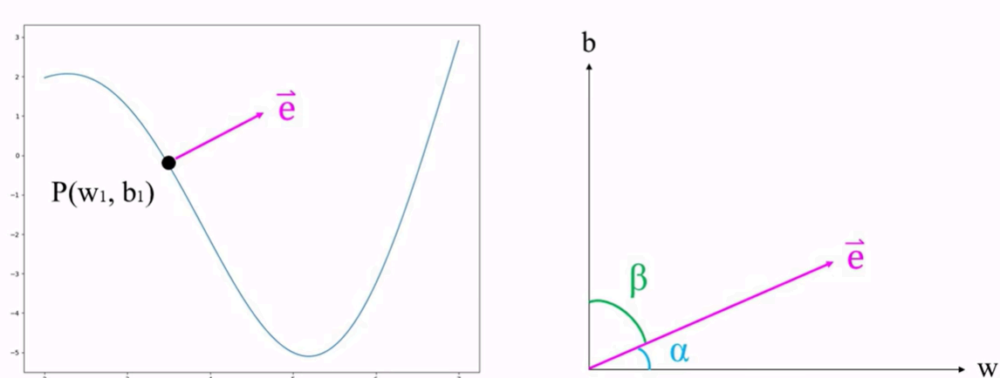

#### 方向导数的定义

设函数 $f(x, y)$ 在点 $P_0(x_0, y_0)$ 的某邻域内有定义，$\mathbf{l}$ 是从点 $P_0$ 出发的一个方向（单位向量），$P(x_0 + t\cos\alpha, y_0 + t\cos\beta)$ 是射线 $\mathbf{l}$ 上的另一点，其中 $\alpha$ 和 $\beta$ 分别是方向 $\mathbf{l}$ 与 $x$ 轴、$y$ 轴正向的夹角（方向角）。

若极限
$$
\lim_{t \to 0^+} \frac{f(x_0 + t\cos\alpha, y_0 + t\cos\beta) - f(x_0, y_0)}{t}
$$
存在，则称此极限为函数 $f$ 在点 $P_0$ 沿方向 $\mathbf{l}$ 的**方向导数**，记作 $\frac{\partial f}{\partial \mathbf{l}}\bigg|_{P_0}$ 或 $D_{\mathbf{l}}f(P_0)$。

#### 方向导数的计算公式

**定理**：如果函数 $f(x, y)$ 在点 $P_0(x_0, y_0)$ 可微，则函数在该点沿任一方向 $\mathbf{l}$ 的方向导数存在，且

$$
\frac{\partial f}{\partial \mathbf{l}}\bigg|_{P_0} = f_x(x_0, y_0) \cos\alpha + f_y(x_0, y_0) \cos\beta
$$

**证明**：

由于 $f(x, y)$ 在点 $P_0$ 可微，函数的全微分为：
$$
df = f_x(x_0, y_0) \, dx + f_y(x_0, y_0) \, dy
$$

设 $\Delta x = t\cos\alpha$，$\Delta y = t\cos\beta$（$t > 0$），则函数增量可写为：
$$
\Delta f = f(x_0 + \Delta x, y_0 + \Delta y) - f(x_0, y_0)
$$

由可微性定义：
$$
\Delta f = f_x(x_0, y_0) \Delta x + f_y(x_0, y_0) \Delta y + o(\rho)
$$

其中 $\rho = \sqrt{(\Delta x)^2 + (\Delta y)^2} = |t|$。

因此：
$$
\begin{aligned}
\frac{\partial f}{\partial \mathbf{l}}\bigg|_{P_0} &= \lim_{t \to 0^+} \frac{\Delta f}{t} \\
&= \lim_{t \to 0^+} \frac{f_x(x_0, y_0) \cdot t\cos\alpha + f_y(x_0, y_0) \cdot t\cos\beta + o(t)}{t} \\
&= f_x(x_0, y_0) \cos\alpha + f_y(x_0, y_0) \cos\beta
\end{aligned}
$$

证毕。

#### 方向导数与梯度的关系

将方向导数公式写成向量内积形式：
$$
\frac{\partial f}{\partial \mathbf{l}}\bigg|_{P_0} = \underbrace{(f_x(x_0, y_0), f_y(x_0, y_0))}_{\nabla f(P_0)} \cdot \underbrace{(\cos\alpha, \cos\beta)}_{\mathbf{e}_l}
$$

其中 $\nabla f(P_0)$ 是函数在 $P_0$ 点的**梯度向量**，$\mathbf{e}_l = (\cos\alpha, \cos\beta)$ 是方向 $\mathbf{l}$ 的单位向量。

利用向量内积的性质：
$$
\frac{\partial f}{\partial \mathbf{l}}\bigg|_{P_0} = \nabla f(P_0) \cdot \mathbf{e}_l = \|\nabla f(P_0)\| \cdot \|\mathbf{e}_l\| \cdot \cos\theta = \|\nabla f(P_0)\| \cos\theta
$$

其中 $\theta$ 是梯度向量与方向 $\mathbf{l}$ 之间的夹角。

#### 4梯度是增长最快方向的证明

由上式可知：
$$
\frac{\partial f}{\partial \mathbf{l}}\bigg|_{P_0} = \|\nabla f(P_0)\| \cos\theta
$$

由于 $-1 \leq \cos\theta \leq 1$，因此：

- **当 $\theta = 0$（方向与梯度同向）时**：$\cos\theta = 1$，方向导数取得**最大值** $\|\nabla f(P_0)\|$
- **当 $\theta = \pi$（方向与梯度反向）时**：$\cos\theta = -1$，方向导数取得**最小值** $-\|\nabla f(P_0)\|$
- **当 $\theta = \frac{\pi}{2}$（方向与梯度垂直）时**：$\cos\theta = 0$，方向导数为 $0$

**结论**：
1. **梯度方向是函数值增长最快的方向**，增长速率为 $\|\nabla f\|$
2. **梯度的反方向是函数值下降最快的方向**，下降速率为 $\|\nabla f\|$
3. 沿着与梯度垂直的方向移动，函数值不变（等值线/等高线方向）

#### 推广到高维情况

对于 $n$ 元函数 $f(x_1, x_2, \ldots, x_n)$：

**梯度定义**：
$$
\nabla f = \left( \frac{\partial f}{\partial x_1}, \frac{\partial f}{\partial x_2}, \ldots, \frac{\partial f}{\partial x_n} \right)^T
$$

**方向导数**：
$$
D_{\mathbf{l}} f = \nabla f \cdot \mathbf{e}_l = \sum_{i=1}^{n} \frac{\partial f}{\partial x_i} \cos\alpha_i
$$

---

既然梯度方向指向函数增长最快的方向,那么梯度下降的方向就是函数下降最快的方向,利用这个原理更新模型的参数的方式,我们叫做梯度下降法,如下图所示,某个参数与损失函数值的关系图假设为:

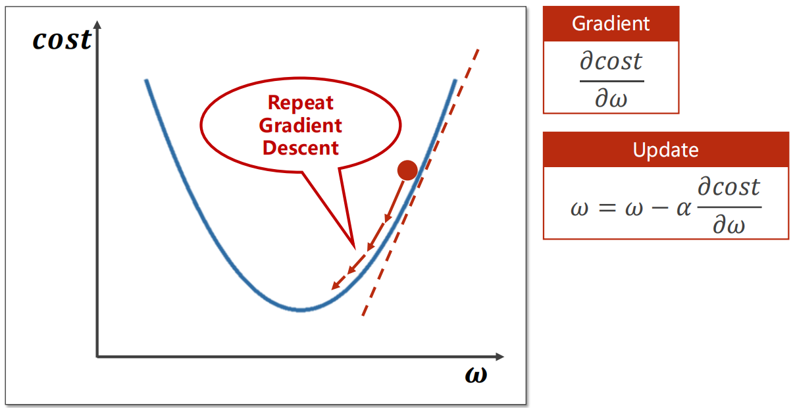

更新参数的过程如下:

$$
\Theta_{t+1} = \Theta_t - \lambda \cdot \frac{d f(\Theta_t)}{d \Theta_t}
$$

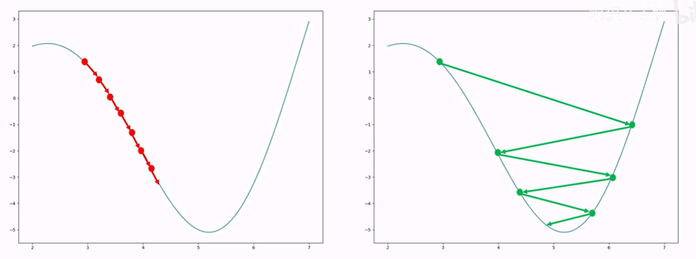

梯度下降法的一个缺点就是,每次更新参数都需要数据集中的所有样本参与运算,也就是说,每更新一次都会带来巨大的运算量,有没有办法避免呢?这就引出了梯度下降法的变种——**随机梯度下降法**。也就是每次都抽取一个数据进行损失计算来更新参数,但这会导致损失值忽高忽低,不断抖动,因此我们想到,可以每次不止选取一个样本,而是选取一批样本,这就是当前最常应用的**小批量梯度下降法**。

#### 梯度下降与反向传播原理数学推导

在机器学习与深度学习中，模型训练的核心目标是最小化预测值与真实值之间的误差，而**梯度下降**（Gradient Descent）是实现这一目标的基础优化算法，负责通过迭代更新模型参数以逼近最优解；**反向传播**（Back Propagation）则是高效计算梯度的核心方法，尤其适用于复杂神经网络，通过链式法则将梯度从输出层反向传播至输入层，大幅降低梯度计算的复杂度。两者共同构成了现代神经网络训练的基石。为简化原理讲解，首先以单参数线性模型为研究对象，模型表达式为：

$$
\hat{y} = x \cdot \omega
$$
其中，$x$ 为输入特征，$\omega$ 为模型参数（权重），$\hat{y}$ 为模型预测值。

为衡量模型预测误差，定义**均方误差**（Mean Square Error, MSE）作为代价函数，计算所有样本预测值与真实值误差的平均值：
$$
cost(\omega) = \frac{1}{N} \sum_{n=1}^{N} (\hat{y}_n - y_n)^2
$$
其中，$N$ 为样本总数，$y_n$ 为第 $n$ 个样本的真实值，$\hat{y}_n = x_n \cdot \omega$ 为对应预测值。

代价函数的核心意义：将模型参数 $\omega$ 与误差关联，形成关于 $\omega$ 的函数，训练目标即找到使 $cost(\omega)$ 最小的最优参数 $\omega^*$：
$$
\omega^* = \arg\min_{\omega} cost(\omega)
$$

梯度下降的核心是利用代价函数对参数的梯度（偏导数）指引参数更新方向，需先推导 $\frac{\partial cost(\omega)}{\partial \omega}$：

1. 代入预测值表达式，将代价函数展开：

$$
cost(\omega) = \frac{1}{N} \sum_{n=1}^{N} (x_n \cdot \omega - y_n)^2
$$

2. 对 $\omega$ 求偏导，利用复合函数求导法则：

$$
\begin{aligned}
\frac{\partial cost(\omega)}{\partial \omega} &= \frac{\partial}{\partial \omega} \left[ \frac{1}{N} \sum_{n=1}^{N} (x_n \cdot \omega - y_n)^2 \right] \\
&= \frac{1}{N} \sum_{n=1}^{N} \frac{\partial}{\partial \omega} (x_n \cdot \omega - y_n)^2 \\
&= \frac{1}{N} \sum_{n=1}^{N} 2 \cdot (x_n \cdot \omega - y_n) \cdot \frac{\partial (x_n \cdot \omega - y_n)}{\partial \omega} \\
&= \frac{2}{N} \sum_{n=1}^{N} x_n \cdot (x_n \cdot \omega - y_n)
\end{aligned}
$$

梯度表示代价函数在当前参数点的变化率方向，由于梯度指向函数增长最快的方向，因此参数需沿梯度的反方向更新，以减小代价函数值。更新公式为：
$$
\omega = \omega - \alpha \cdot \frac{\partial cost(\omega)}{\partial \omega}
$$
其中，$\alpha$ 为**学习率**（Learning Rate），控制每次参数更新的步长：

- 学习率过大会导致参数震荡，无法收敛；
- 学习率过小会导致训练速度极慢，需迭代大量次数才能逼近最优解。

当模型从简单线性模型扩展为多层神经网络时，直接计算代价函数对每一层参数的梯度会面临"维度爆炸"问题。反向传播通过**计算图**（Computational Graph）和**链式法则**，将梯度计算分解为局部梯度的乘积，从输出层反向逐层传递梯度，高效求解所有参数的梯度。

计算图是对模型运算过程的可视化表达，将每个运算步骤抽象为"节点"，变量传递抽象为"边"，分为两步：

1. **前向传播（Forward Pass）**：从输入层到输出层，依次执行运算，计算预测值与代价函数值；

2. **反向传播（Backward Pass）**：从输出层到输入层，沿计算图反向传递梯度，利用链式法则计算每个参数的梯度。

   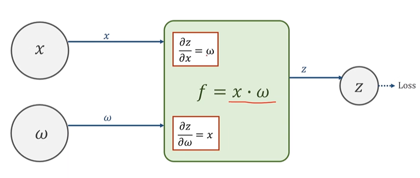

**核心原理：链式法则**

链式法则是反向传播的数学基础，用于求解复合函数的导数。假设存在复合函数 $z = f(g(x))$，则其导数为：
$$
\frac{dz}{dx} = \frac{dz}{dg} \cdot \frac{dg}{dx}
$$

对于神经网络中的多层运算，设存在变量链 $x \rightarrow a \rightarrow b \rightarrow loss$，则代价函数对 $x$ 的梯度为：
$$
\frac{\partial loss}{\partial x} = \frac{\partial loss}{\partial b} \cdot \frac{\partial b}{\partial a} \cdot \frac{\partial a}{\partial x}
$$
其中，每个局部梯度（如 $\frac{\partial b}{\partial a}$）可独立计算，最终通过乘积得到全局梯度，这是反向传播高效性的关键。

以线性模型 $\hat{y} = x \cdot \omega$、损失函数 $loss = (\hat{y} - y)^2$ 为例，详细拆解反向传播过程：

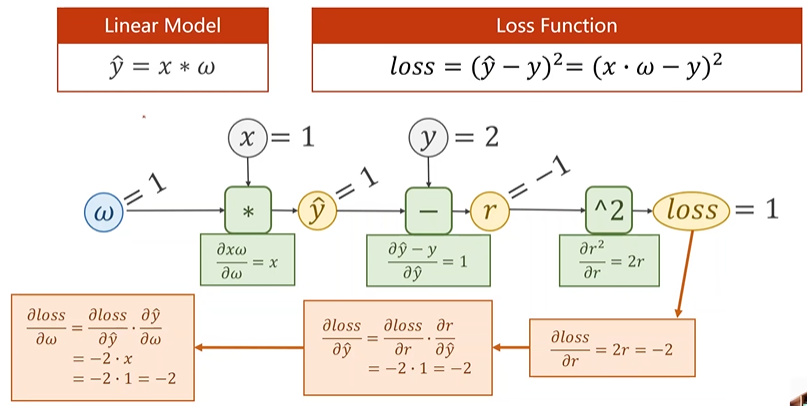

**步骤1：前向传播计算中间变量**

- 计算预测值：$\hat{y} = x \cdot \omega$；
- 计算误差：$r = \hat{y} - y$；
- 计算损失：$loss = r^2$。

**步骤2：反向传播计算梯度**

1. 计算损失对误差的局部梯度：

$$
\frac{\partial loss}{\partial r} = 2r
$$

2. 计算误差对预测值的局部梯度：

$$
\frac{\partial r}{\partial \hat{y}} = \frac{\partial (\hat{y} - y)}{\partial \hat{y}} = 1
$$

3. 计算预测值对参数 $\omega$ 的局部梯度：

$$
\frac{\partial \hat{y}}{\partial \omega} = \frac{\partial (x \cdot \omega)}{\partial \omega} = x
$$

4. 利用链式法则计算损失对 $\omega$ 的全局梯度：

$$
\frac{\partial loss}{\partial \omega} = \frac{\partial loss}{\partial r} \cdot \frac{\partial r}{\partial \hat{y}} \cdot \frac{\partial \hat{y}}{\partial \omega} = 2r \cdot 1 \cdot x = 2x(\hat{y} - y)
$$

**练习**：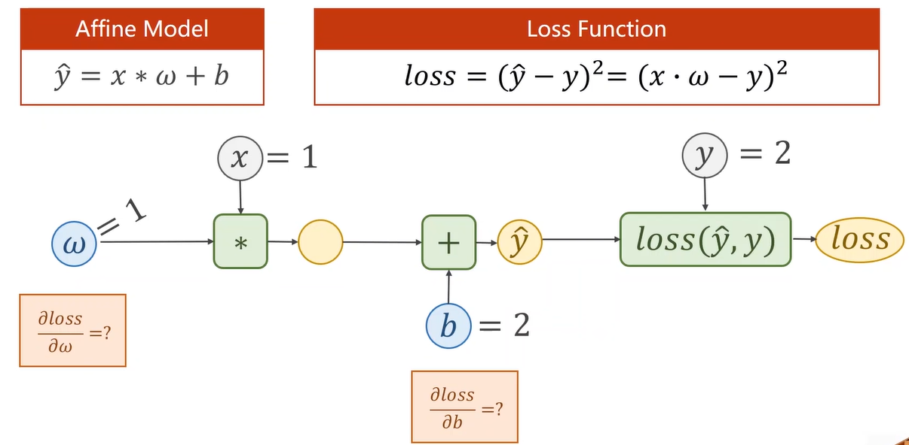

**复杂网络的反向传播：两层神经网络的启示**

考虑两层线性神经网络：
$$
\hat{y} = W_2(W_1 \cdot X + b_1) + b_2
$$
展开后可得：
$$
\hat{y} = (W_2 \cdot W_1) \cdot X + (W_2 \cdot b_1 + b_2) = W \cdot X + b
$$
即两层线性网络等价于单层线性网络，无法学习非线性关系。因此，**每层输出后需加入非线性激活函数**（如 Sigmoid、ReLU），使网络具备拟合非线性数据的能力。（常见激活函数的公式、导数与选型详见 **第六节**。）下面先简要回顾三种最基础的激活函数：

**Sigmoid函数**

Sigmoid函数将输入值映射到区间(0,1),早期神经网络常用,但存在梯度消失问题。

$$
\sigma(x) = \frac{1}{1 + e^{-x}}
$$

**ReLU函数**

ReLU(Rectified Linear Unit)函数在 $x > 0$ 时,输出为 $x$;在 $x \leq 0$ 时,输出为0。解决了梯度消失问题,计算效率高,是目前广泛使用的激活函数之一。

$$
\text{ReLU}(x) = \max(0, x)
$$

**Tanh函数**

Tanh函数将输入值映射到区间(-1,1),与Sigmoid函数类似,但性能更优,在一些场景有应用。

$$
\tanh(x) = \frac{e^x - e^{-x}}{e^x + e^{-x}}
$$

练习题: 已知 $x_1 = 0.5$, $x_2 = -0.5$, 分别计算Sigmoid函数、ReLU函数和Tanh函数的输出值。

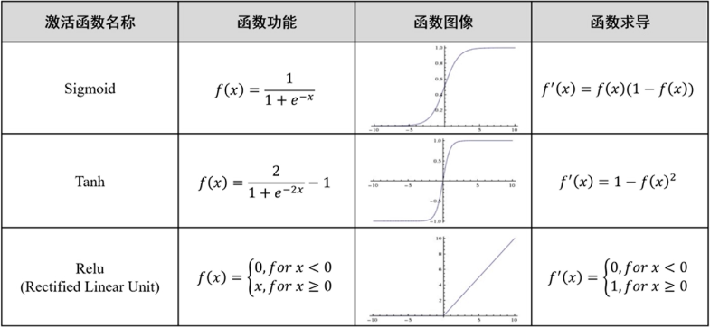

**含激活函数的反向传播**

设含激活函数的两层网络为：
$$
\begin{aligned}
a_1 &= W_1 \cdot X + b_1 \\
z_1 &= \sigma(a_1) \quad (\sigma \text{ 为非线性激活函数}) \\
a_2 &= W_2 \cdot z_1 + b_2 \\
\hat{y} &= \sigma(a_2)
\end{aligned}
$$
反向传播时，需额外计算激活函数的局部梯度 $\frac{\partial z_1}{\partial a_1} = \sigma'(a_1)$，最终通过链式法则逐层传递梯度，得到 $W_1, b_1, W_2, b_2$ 的梯度。

---


## 六、激活函数

> **为什么单独讲这一节？** 反向传播里我们已经看到：多层线性网络等价于单层线性网络，**非线性激活函数**才是神经网络能拟合复杂数据的钥匙。本节系统梳理常见激活函数，并说明在反向传播中如何计算其导数。

### 6.1 为什么需要激活函数？

考虑两层**不含激活函数**的网络：
$$
\hat{y} = W_2(W_1 X + b_1) + b_2 = (W_2 W_1) X + (W_2 b_1 + b_2)
$$
无论堆多少层，最终仍是**一个线性变换**，只能拟合直线/超平面，无法处理 XOR 等非线性可分问题。

**解决办法**：在每一层线性变换之后插入非线性函数 $\sigma(\cdot)$：
$$
a_1 = W_1 X + b_1,\quad z_1 = \sigma(a_1),\quad \hat{y} = W_2 z_1 + b_2
$$


### 6.2 Sigmoid 函数

将输入映射到 $(0, 1)$，可解释为概率；二分类输出层常用。

$$
\sigma(x) = \frac{1}{1 + e^{-x}}
$$

**导数**（推导中常用）：
$$
\sigma'(x) = \sigma(x)\bigl(1 - \sigma(x)\bigr)
$$

**优点**：输出有概率含义，平滑可导。  
**缺点**：**梯度消失**——当 $|x|$ 较大时 $\sigma'(x) \approx 0$，深层网络难以训练；输出非零中心，收敛较慢。

**数值例子**：$x_1 = 0.5 \Rightarrow \sigma(0.5) \approx 0.622$；$x_2 = -0.5 \Rightarrow \sigma(-0.5) \approx 0.378$。

### 6.3 Tanh 函数

将输入映射到 $(-1, 1)$，是零中心版的 Sigmoid。

$$
\tanh(x) = \frac{e^x - e^{-x}}{e^x + e^{-x}} = 2\sigma(2x) - 1
$$

**导数**：
$$
\tanh'(x) = 1 - \tanh^2(x)
$$

**优点**：零中心，比 Sigmoid 收敛更快。  
**缺点**：仍存在梯度消失，深层隐藏层中已较少单独使用。

**数值例子**：$\tanh(0.5) \approx 0.462$；$\tanh(-0.5) \approx -0.462$。

### 6.4 ReLU 函数（Rectified Linear Unit）

$$
\text{ReLU}(x) = \max(0, x)
$$

**导数**：
$$
\text{ReLU}'(x) =
\begin{cases}
1, & x > 0 \\
0, & x \leq 0
\end{cases}
$$

**优点**：计算极快；正区间梯度恒为 1，**缓解梯度消失**；产生稀疏激活，有正则化效果。  
**缺点**：**Dead ReLU**——若神经元长期落在 $x \leq 0$ 区域，梯度为 0，参数不再更新。

**数值例子**：$\text{ReLU}(0.5) = 0.5$；$\text{ReLU}(-0.5) = 0$。

### 6.5 Leaky ReLU 与 GELU

**Leaky ReLU** 在负区间保留小斜率 $\alpha$（通常 $\alpha = 0.01$），缓解 Dead ReLU：
$$
\text{LeakyReLU}(x) = \max(\alpha x, x)
$$

**GELU**（Gaussian Error Linear Unit）在大模型（BERT、GPT 等）中广泛使用：
$$
\text{GELU}(x) = x \cdot \Phi(x)
$$
其中 $\Phi(x)$ 是标准正态分布的累积分布函数。PyTorch 中直接调用 `torch.nn.GELU()`。

**Swish / SiLU**：$\text{Swish}(x) = x \cdot \sigma(x)$，与 GELU 类似，在部分架构中表现优异。

### 6.6 Softmax：多分类的"激活函数"

Softmax 将 logits 向量转为概率分布，通常用于**输出层**（配合交叉熵损失）：
$$
\text{Softmax}(z_i) = \frac{e^{z_i}}{\sum_{j=1}^{K} e^{z_j}}
$$

注意：Softmax 是对**向量**操作，而非逐元素标量函数。

### 6.7 激活函数选型指南

| 位置 | 推荐 | 原因 |
| --- | --- | --- |
| 隐藏层（通用） | ReLU / Leaky ReLU | 训练快、梯度稳定 |
| 隐藏层（Transformer） | GELU | 大模型标准配置 |
| 二分类输出层 | Sigmoid | 输出 $(0,1)$ 概率 |
| 多分类输出层 | Softmax | 输出概率分布 |
| 回归输出层 | 无激活（恒等） | 输出任意实数 |

### 6.8 含激活函数的反向传播

设含激活函数的两层网络为：
$$
\begin{aligned}
a_1 &= W_1 X + b_1 \\
z_1 &= \sigma(a_1) \\
a_2 &= W_2 z_1 + b_2 \\
\hat{y} &= \sigma(a_2)
\end{aligned}
$$

反向传播时，需额外乘以激活函数的局部梯度：
$$
\frac{\partial \mathcal{L}}{\partial a_1} = \frac{\partial \mathcal{L}}{\partial z_1} \odot \sigma'(a_1)
$$

以 ReLU 为例，$\frac{\partial \mathcal{L}}{\partial z_1}$ 中对应 $a_1 \leq 0$ 的位置会被 mask 为 0——这与 MLP 手算例题中的 $\mathbf{1}[Z > 0]$ 完全一致。

**练习题**：已知 $x_1 = 0.5$, $x_2 = -0.5$，分别计算 Sigmoid、ReLU、Tanh 的输出值。

<details>
<summary>参考答案</summary>

- Sigmoid：$\sigma(0.5) \approx 0.622$，$\sigma(-0.5) \approx 0.378$
- ReLU：$0.5$，$0$
- Tanh：$\approx 0.462$，$\approx -0.462$

</details>

---

## 七、线性分类问题

| 申请人 | 征信状况 | 负债情况   | 个人资产   | 月收入    |
| :----- | :------- | :--------- | :--------- | :-------- |
| A      | 1        | 0.00       | 100,000.00 | 10,000.00 |
| B      | 0        | 50,000.00  | 200,000.00 | 8,000.00  |
|        |          |            |            |           |
| Z      | -1       | 170,000.00 | 0.00       | 0.00      |

由于各列的尺度不同,我们可以对特征列进行归一化:

| 申请人 | 征信状况 | 负债情况 | 个人资产 | 月收入 |
| :----- | :------- | :------- | :------- | :----- |
| A      | 1.0      | 0.0      | 0.2      | 0.2    |
| B      | 0.5      | 0.29     | 0.4      | 0.16   |
|        | ：       |          |          |        |
| Z      | 0.0      | 1.0      | 0.0      | 0.0    |

解决离群点问题,只需要加一个阈值函数即可:
$$
g(f(x; \omega)) = \begin{cases} 
1 & \text{if } f(x; \omega) > 0 \\
0 & \text{if } f(x; \omega) < 0 
\end{cases}
$$

这样,就可以利用线性回归函数解决分类问题了。

#### 逻辑回归

虽然上述线性分类方法通过阈值函数可以实现二分类,但这种方法存在一些问题:输出不是概率,且不可导,不利于梯度下降。逻辑回归(Logistic Regression)是解决这些问题的更好方法。

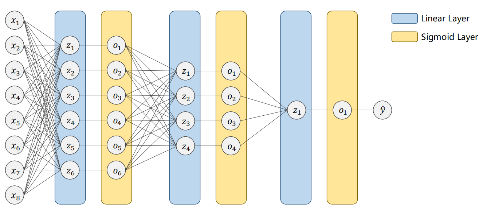

逻辑回归使用Sigmoid函数将线性回归的输出映射到(0,1)区间,表示样本属于正类的概率:

$$
P(y=1|x) = \sigma(\omega^T x) = \frac{1}{1 + e^{-\omega^T x}}
$$

其中 $\omega^T x$ 是线性回归的输出。

对于二分类问题,样本属于负类的概率为:

$$
P(y=0|x) = 1 - P(y=1|x) = 1 - \sigma(\omega^T x)
$$

#### Softmax回归

当分类问题有多个类别（$K > 2$）时,Softmax回归（又称多项逻辑回归）是逻辑回归的自然推广。

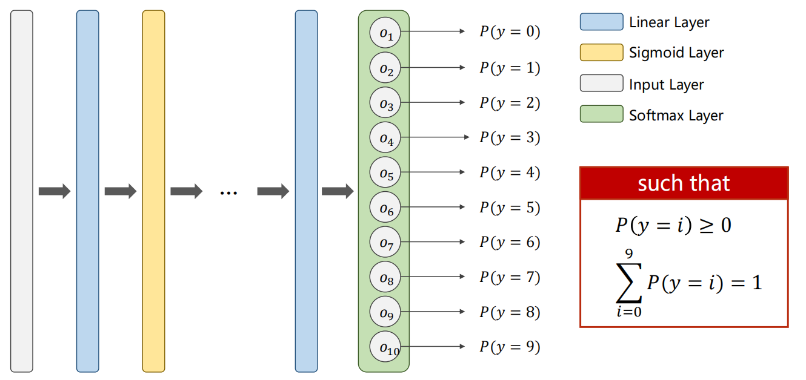

Softmax函数将线性回归的输出向量转换为概率分布:

$$
P(y=k|x) = \frac{e^{\omega_k^T x}}{\sum_{j=1}^K e^{\omega_j^T x}}, \quad k = 1, 2, \ldots, K
$$

其中 $\omega_k$ 是对应第 $k$ 类的权重向量。

#### Softmax回归与逻辑回归的关系

当类别数 $K=2$ 时,Softmax回归退化为逻辑回归。此时:

$$
P(y=1|x) = \frac{e^{\omega_1^T x}}{e^{\omega_1^T x} + e^{\omega_2^T x}} = \frac{1}{1 + e^{(\omega_2 - \omega_1)^T x}}
$$

令 $\omega = \omega_1 - \omega_2$,就得到了逻辑回归的形式。

<figure><span>线性回归 → Sigmoid → 逻辑回归  
线性回归 → Softmax → Softmax回归</span></figure>

练习题: 对于一个三分类问题,已知某个样本的线性输出为 $z = [2.0, 1.0, 0.1]$,计算其Softmax概率分布。

答案:  
$P(y=1) = \frac{e^{2.0}}{e^{2.0} + e^{1.0} + e^{0.1}} = \frac{7.39}{7.39 + 2.72 + 1.11} = \frac{7.39}{11.22} \approx 0.66$  
$P(y=2) = \frac{e^{1.0}}{11.22} \approx 0.24$  
$P(y=3) = \frac{e^{0.1}}{11.22} \approx 0.10$

##### 逻辑回归的损失函数

逻辑回归使用交叉熵损失函数(Cross-Entropy Loss):

$$
L(\omega) = -\frac{1}{n} \sum_{i=1}^n [y_i \log(\sigma(\omega^T x^{(i)})) + (1 - y_i) \log(1 - \sigma(\omega^T x^{(i)}))]
$$

这个损失函数可以通过最大似然估计推导得到,具有很好的数学性质。

##### Softmax回归的损失函数

对于多分类问题,使用多类交叉熵损失函数:

$$
L(\omega) = -\frac{1}{n} \sum_{i=1}^n \sum_{k=1}^K \mathbb{I}(y_i = k) \log\left(\frac{e^{\omega_k^T x^{(i)}}}{\sum_{j=1}^K e^{\omega_j^T x^{(i)}}}\right)
$$

其中 $\mathbb{I}(\cdot)$ 是指示函数。

## 八、交叉熵损失函数

> 分类模型怎么衡量“当前概率”与“理想概率”的差距？**交叉熵**就是那个尺子；  
> 怎么让差距变小？**梯度**就是那只手，推着 输出往正确方向跑。  

**Softmax + 交叉熵：从前向到反向的一张图（Mermaid）**


熵是指系统的混乱程度，而在计算机中，熵也是 **“编码长度期望”** 的含义：
| 事件  | 概率  | 理想码长  | 贡献               |
| ----- | ----- | --------- | ------------------ |
| $x_i$ | $p_i$ | $log_2 N$ | $p_i\cdot\log_2 N$ |

把全部可能性加起来，就是**平均码长**的期望：  
$$
\mathbb{E}[\text{码长}]=\sum_{i=1}^{N}p_i\cdot\log_2 N=-\sum_{i=1}^{N}p_i\log_2 p_i \equiv H(X)
$$
熵：  
$$
\text{Entropy}
=\sum_{i=1}^{N}p(i)\cdot\log_2{N}
=\sum_{i=1}^{N}p(i)\cdot\log_2\frac{1}{p(i)}
=-\sum_{i=1}^{N}p(i)\log_2 p(i)
$$
正是同一条式子——**熵 = 最小平均编码长度**。

用估计分布 $q$ 设计码长 $l_i=-\log q_i$，再按真实 $p$ 平均：  
$$
H(p,q)\triangleq -\sum_{i=1}^{N}p_i\log q_i
$$

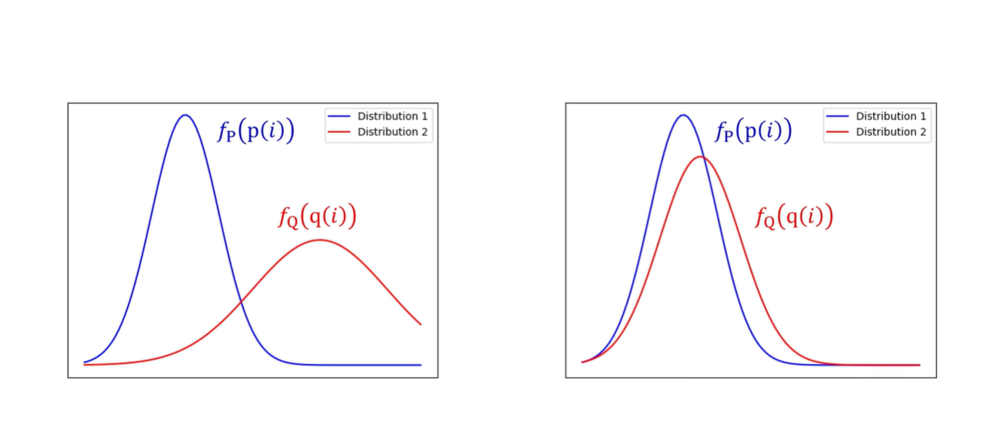

$$
\log_2 x=\frac{\ln x}{\ln 2}\quad\Longrightarrow\quad H_{\text{nat}}(X)=-\sum p_i\ln p_i
$$

深度学习里直接丢掉常数 $\ln 2$，因为优化只关心梯度方向。

---

已知集合$D$的信息熵的定义为
$$
\operatorname{Ent}(D)=-\sum_{k=1}^{|\mathcal{Y}|} p_{k} \log_{2} p_{k}
$$


其中，$|\mathcal{Y}|$表示样本类别总数，$p_k$表示第$k$类样本所占的比例，有$0\leqslant p_k \leqslant 1,\sum_{k=1}^{n}p_k=1$。若令$|\mathcal{Y}|=n,p_k=x_k$，那么信息熵$\operatorname{Ent}(D)$就可以看作一个$n$元实值函数，即

$$
\operatorname{Ent}(D)=f(x_1,\cdots,x_n)=-\sum_{k=1}^{n} x_{k} \log_{2} x_{k}
$$

其中$0 \leqslant x_k \leqslant 1,\sum_{k=1}^{n}x_k=1$。

下面考虑求该多元函数的最值. 首先我们先来求最大值，如果不考虑约束$0
\leqslant x_k \leqslant
1$而仅考虑$\sum_{k=1}^{n}x_k=1$，则对$f(x_1,\cdots,x_n)$求最大值等价于如下最小化问题：
$$
\begin{array}{ll}{
\operatorname{min}} & {\sum\limits_{k=1}^{n} x_{k} \log_{2} x_{k} }\\
{\text { {\rm s.t.} }} & {\sum\limits_{k=1}^{n}x_k=1}
\end{array}
$$


显然，在$0 \leqslant x_k \leqslant 1$时，此问题为凸优化问题。对于凸优化问题来说，使其拉格朗日函数的一阶偏导数等于0的点即最优解。根据拉格朗日乘子法可知，该优化问题的拉格朗日函数为

$$
L(x_1,\cdots,x_n,\lambda)=\sum_{k=1}^{n} x_{k} \log _{2} x_{k}+
\lambda\left(\sum_{k=1}^{n}x_k-1\right)
$$


其中，$\lambda$为拉格朗日乘子。对$L(x_1,\cdots,x_n,\lambda)$分别关于$x_1,\cdots,x_n,\lambda$求一阶偏导数，并令偏导数等于0可得

$$
\begin{aligned}
\dfrac{\partial L(x_1,\cdots,x_n,\lambda)}{\partial
x_1}&=\dfrac{\partial }{\partial x_1} \left[\sum_{k=1}^{n} x_{k}
\log _{2} x_{k}+\lambda
\left(\sum_{k=1}^{n}x_k-1\right)\right]\\
&=\log _{2} x_{1}+x_1\cdot \dfrac{1}{x_1\ln2}+\lambda \\
&=\log _{2} x_{1}+\dfrac{1}{\ln2}+\lambda=0 \\
&\Rightarrow \lambda=-\log _{2} x_{1}-\dfrac{1}{\ln2}\\
\end{aligned}
$$


$$
\begin{aligned}
\dfrac{\partial L(x_1,\cdots,x_n,\lambda)}{\partial x_2}&=\dfrac{\partial }{\partial x_2}\left[\sum_{k=1}^{n} x_{k} \log _{2} x_{k}+\lambda\left(\sum_{k=1}^{n}x_k-1\right)\right]=0\\
&\Rightarrow \lambda=-\log _{2} x_{2}-\dfrac{1}{\ln2}\\
\cdots\\
\dfrac{\partial L(x_1,\cdots,x_n,\lambda)}{\partial x_n}&=\dfrac{\partial }{\partial x_n}\left[\sum_{k=1}^{n} x_{k} \log _{2} x_{k}+\lambda\left(\sum_{k=1}^{n}x_k-1\right)\right]=0\\
&\Rightarrow \lambda=-\log _{2} x_{n}-\dfrac{1}{\ln2};\\
\dfrac{\partial L(x_1,\cdots,x_n,\lambda)}{\partial \lambda}&=\dfrac{\partial }{\partial \lambda}\left[\sum_{k=1}^{n} x_{k} \log _{2} x_{k}+\lambda\left(\sum_{k=1}^{n}x_k-1\right)\right]=0\\
&\Rightarrow \sum_{k=1}^{n}x_k=1\\
\end{aligned}
$$

整理得：

$$
\left\{ \begin{array}{lr}
\lambda=-\log _{2} x_{1}-\frac{1}{\ln2}=-\log _{2} x_{2}-\frac{1}{\ln2}=\cdots=-\log _{2} x_{n}-\frac{1}{\ln2} \\
\sum\limits_{k=1}^{n}x_k=1
\end{array}\right.
$$

解得：

$$
x_1=x_2=\cdots=x_n=\dfrac{1}{n}
$$

又因为$x_k$还需满足约束$0 \leqslant x_k \leqslant 1$，显然$0\leqslant\frac{1}{n}\leqslant
1$，所以$x_1=x_2=\cdots=x_n=\frac{1}{n}$是满足所有约束的最优解，即当前最小化问题的最小值点，同时也是$f(x_1,\cdots,x_n)$的最大值点。将$x_1=x_2=\cdots=x_n=\frac{1}{n}$代入$f(x_1,\cdots,x_n)$中可得
$$
f\left(\dfrac{1}{n},\cdots,\dfrac{1}{n}\right)
=-\sum_{k=1}^{n} \dfrac{1}{n} \log _{2}
\dfrac{1}{n}=-n\cdot\dfrac{1}{n} \log _{2} \dfrac{1}{n}=\log _{2}
n
$$


所以$f(x_1,\cdots,x_n)$在满足约束$0 \leqslant x_k \leqslant 1,\sum_{k=1}^{n}x_k=1$时的最大值为$\log _{2} n$。


显然$x_k=1,x_1=x_2=\cdots=x_{k-1}=x_{k+1}=\cdots=x_n=0$一定是$f(x_1,\cdots,x_n)$在满足约束$\sum_{k=1}^{n}x_k=1$和$0\leqslant x_k \leqslant 1$的条件下的最小值点，此时$f$取到最小值0。

综上可知，当$f(x_1,\cdots,x_n)$取到最大值时：$x_1=x_2=\cdots=x_n=\frac{1}{n}$，此时样本集合纯度最低；当$f(x_1,\cdots,x_n)$取到最小值时：$x_k=1,x_1=x_2=\cdots=x_{k-1}=x_{k+1}=\cdots=x_n=0$，此时样本集合纯度最高。

**理解到这里，我们从概率分布角度解释一下交叉熵为什么能衡量分布差异？**

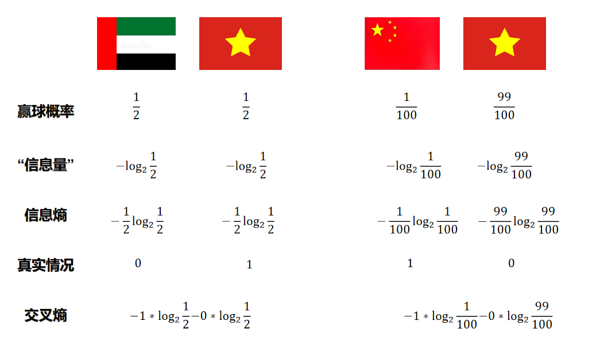
$$
\begin{align*} \boldsymbol{D_{KL}(P||Q)} &:= \sum_{i=1}^n p_i \cdot \bigl(f_Q(q_i) - f_P(p_i)\bigr) \\ &= \sum_{i=1}^n p_i \cdot \bigl((-\log_2 q_i) - (-\log_2 p_i)\bigr) \\ &= \underbrace{\sum_{i=1}^n p_i \cdot (-\log_2 q_i)}_{\text{这是P的交叉熵 } H(P,Q)} - \sum_{i=1}^n p_i \cdot (-\log_2 p_i) \end{align*}
$$

#### 交叉熵损失函数：多分类推导

##### 1.把标签变成“ one-hot 向量”

真实标签只有一个数 $y$，但我们希望它与模型输出的 $C$ 个概率一一对应，于是构造  
$$
p_k=\delta_{ky}= \begin{cases}
1,&k=y\\[2pt]
0,&k\ne y
\end{cases}
$$
**例子**：$C=3$，真实类别 $y=2$，则 one-hot 向量为  
$$
\mathbf{p}=[0,\;1,\;0]
$$

##### 2.交叉熵损失（通用定义）

对任意两个分布 $\mathbf{p}$（真实）和 $\mathbf{q}$（预测），交叉熵为  
$$
\mathcal{L}_{\text{CE}}=-\sum_{k=1}^{C}p_k\ln q_k
$$
把 $\mathbf{p}$ 的 one-hot 形式代入，**99% 的项被乘 0 干掉**，只剩第 $y$ 项：  
$$
\mathcal{L}_{\text{CE}}=-\Bigl(0\cdot\ln q_1+\;1\cdot\ln q_y+\;0\cdot\ln q_3+\dots\Bigr)=-\ln q_y
$$
**结论**：多分类交叉熵就是 **“负 log 正确类概率”**。

##### 3.对 logits 求梯度（反向传播核心）

训练时要回传梯度，但 $\mathbf{q}$ 是由 logits $\mathbf{z}$ 经 softmax 算出来的，所以我们要算  
$$
\frac{\partial\mathcal{L}}{\partial z_k},\quad k=1\dots C
$$

**第一步**：写出 softmax 导数（先记住，后面给证明）  
$$
\frac{\partial q_j}{\partial z_k}=q_j(\delta_{jk}-q_k)
$$
其中 $\delta_{jk}$ 又是 Kronecker delta：$j=k$ 时为 1，否则 0。

**第二步**：链式法则  
$$
\frac{\partial\mathcal{L}}{\partial z_k}
=\frac{\partial}{\partial z_k}\Bigl(-\ln q_y\Bigr)
=-\frac{1}{q_y}\frac{\partial q_y}{\partial z_k}
$$
把 softmax 导数代入：  
$$
=-\frac{1}{q_y}\Bigl[q_y(\delta_{yk}-q_k)\Bigr]
=-(\delta_{yk}-q_k)=q_k-\delta_{yk}
$$
**结果**：  
$$
\frac{\partial\mathcal{L}}{\partial z_k}=q_k-\delta_{yk}
$$
**一句话解读**：梯度 = 预测概率 − 真实概率

##### 4.梯度可视化例子

继续上面的例子：$C=3,\;y=2$，假设 softmax 输出  
$$
\mathbf{q}=[0.20,\;0.65,\;0.15]
$$
则梯度向量  
$$
\frac{\partial\mathcal{L}}{\partial\mathbf{z}}=\mathbf{q}-\mathbf{p}=[0.20,\;0.65-1,\;0.15]=[0.20,\;-0.35,\;0.15]
$$

- 正确类（第 2 位）梯度为负：**增加它的 logit** 会让损失下降。  

- 错误类梯度为正：**减小它们的 logit** 会让损失下降。  
  完全符合直觉——**把 logits 往正确类方向推，远离错误类**。
  
- ***判断以下代码输出：***
  
  ```python
  import torch
  
  criterion = torch.nn.CrossEntropyLoss()
  Y = torch.LongTensor([2, 0, 1])
  Y_pred1 = torch.Tensor([[0.1, 0.2, 0.9],
  [1.1, 0.1, 0.2],
  [0.2, 2.1, 0.1]])
  Y_pred2 = torch.Tensor([[0.8, 0.2, 0.3],
  [0.2, 0.3, 0.5],
  [0.2, 0.2, 0.5]])
  l1 = criterion(Y_pred1, Y)
  l2 = criterion(Y_pred2, Y)
  if(l1.data>l2.data)
  	print("Batch Loss1 > Batch Loss2")
  else
  	print("Batch Loss1 < Batch Loss2")
  ```

##### 5.softmax 导数证明

softmax函数：
$$
q_j=\frac{e^{z_j}}{\sum_{m}e^{z_m}}
$$

令
$$
z_j = \mathbf{w}_j^\top \mathbf{x} + b_j
$$

则 softmax 概率可写成
$$
q_j = \frac{e^{\,\mathbf{w}_j^\top \mathbf{x} + b_j}}{\sum_{m=1}^{C} e^{\,\mathbf{w}_m^\top \mathbf{x} + b_m}}
$$

- 分子：第 $j$ 类自己的“加权得分”指数化  
- 分母：所有类别同时“抢”得分，归一化成概率  

权重 $\mathbf{w}_j$ 越大、偏置 $b_j$ 越高，对应 logit 越大，该类概率就被指数级放大——这就是“线性模型 + softmax”把原始特征映射成类别概率的完整链路。

**情况 1**：$j=k$（对角）  
$$
\frac{\partial q_j}{\partial z_k}
=\frac{\partial q_j}{\partial z_j}
=\frac{e^{z_j}\cdot\sum_{m}e^{z_m}-e^{z_j}\cdot e^{z_j}}{(\sum_{m}e^{z_m})^2}
=\frac{e^{z_j}}{\sum_{m}e^{z_m}}\Bigl(1-\frac{e^{z_j}}{\sum_{m}e^{z_m}}\Bigr)
=q_j(1-q_j)
$$

**情况 2**：$j\ne k$（非对角）  
$$
\frac{\partial q_j}{\partial z_k}
=\frac{0-e^{z_j}\cdot e^{z_k}}{(\sum_{m}e^{z_m})^2}
=-q_j q_k
$$

合并写在一起就是  
$$
\frac{\partial q_j}{\partial z_k}=q_j(\delta_{jk}-q_k)
$$
证毕。

---

#### 二分类特例：sigmoid 交叉熵

##### 1. 标签 $y\in\{0,1\}$

模型输出  
$$
\hat{y}=\sigma(z)=\frac{1}{1+e^{-z}},\quad z=wx+b
$$

##### 2. 损失

$$
\mathcal{L}=-y\ln\hat{y}-(1-y)\ln(1-\hat{y})
$$

##### 3. 梯度推导

$$
\begin{aligned}
\frac{\partial \mathcal{L}}{\partial w}
&=\frac{\partial \mathcal{L}}{\partial \hat{y}}\cdot
 \frac{\partial \hat{y}}{\partial z}\cdot
 \frac{\partial z}{\partial w}\\[4pt]
&=\left(-\frac{y}{\hat{y}}+\frac{1-y}{1-\hat{y}}\right)\cdot
 \hat{y}(1-\hat{y})\cdot x\\[4pt]
&=\bigl[(1-y)\hat{y}-y(1-\hat{y})\bigr]\cdot x\\[4pt]
&=(\hat{y}-y)x
\end{aligned}
$$

同理  
$$
\frac{\partial \mathcal{L}}{\partial b}=\hat{y}-y
$$
**结论**：梯度 = 误差 × 输入。

## 九、多层感知机（MLP）

### 神经元模型

神经元是神经网络的基本单元,也叫节点。简单的神经元模型可表示为:其中,是输入特征,是对应的权重,是偏置,是激活函数。神经元通过加权求和整合输入信号,再经激活函数进行非线性变换,输出最终结果。

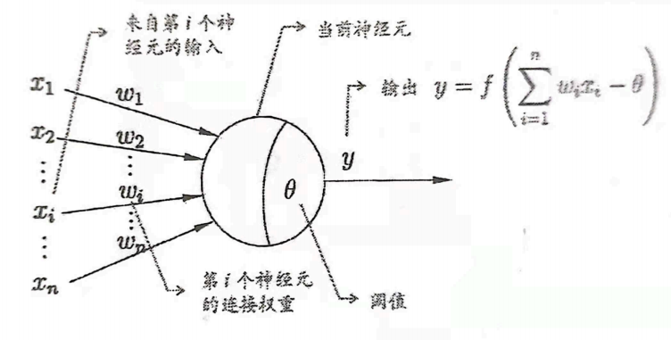

下面用一个**完整数值例子**来讲前向传播与后面的反向传播

这个例子固定：

- 输入维度 $n_x=4$，样本数 $m=2$（样本按列堆叠）

- 结构：$4\to 3\to 4\to 3$

- 激活：前两层 ReLU，最后一层 Softmax

  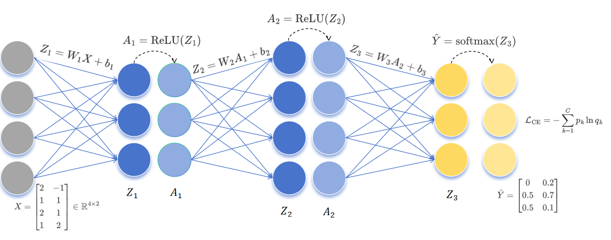

### 前向传播

#### 1) 输入 $X$

$$
X=\begin{bmatrix}
2 & -1\\
1 & 1\\
2 & 1\\
1 & 2
\end{bmatrix}\in\mathbb{R}^{4\times 2}
$$

#### 2) Layer 1（$4\to 3$）：$Z_1=W_1X+b_1,\ A_1=\mathrm{ReLU}(Z_1)$

$$
W_1=
\begin{bmatrix}
1 & 0 & -1 & 1\\
0 & 1 & 1 & 0\\
1 & -1 & 0 & 0
\end{bmatrix},
\quad
b_1=
\begin{bmatrix}
1\\
1\\
0
\end{bmatrix}
$$

$$
Z_1=W_1X+b_1=
\begin{bmatrix}
2 & 1\\
4 & 3\\
1 & -2
\end{bmatrix},
\quad
A_1=\mathrm{ReLU}(Z_1)=
\begin{bmatrix}
2 & 1\\
4 & 3\\
1 & 0
\end{bmatrix}
$$

#### 3) Layer 2（$3\to 4$）：$Z_2=W_2A_1+b_2,\ A_2=\mathrm{ReLU}(Z_2)$

$$
W_2=
\begin{bmatrix}
0 & -1 & 2\\
-1 & 1 & 0\\
0 & 1 & 1\\
-1 & 0 & 0
\end{bmatrix},
\quad
b_2=
\begin{bmatrix}
1\\
2\\
1\\
3
\end{bmatrix}
$$

$$
Z_2=W_2A_1+b_2=
\begin{bmatrix}
-1 & -2\\
4 & 4\\
6 & 4\\
1 & 2
\end{bmatrix},
\quad
A_2=\mathrm{ReLU}(Z_2)=
\begin{bmatrix}
0 & 0\\
4 & 4\\
6 & 4\\
1 & 2
\end{bmatrix}
$$

#### 4) Layer 3（$4\to 3$）：$Z_3=W_3A_2+b_3,\ \hat{Y}=\mathrm{softmax}(Z_3)$

$$
W_3=
\begin{bmatrix}
0 & -1 & -1 & 2\\
1 & 0 & 0 & 0\\
-1 & 0 & 1 & 0
\end{bmatrix},
\quad
b_3=
\begin{bmatrix}
5\\
2\\
-4
\end{bmatrix}
$$

$$
Z_3=W_3A_2+b_3=
\begin{bmatrix}
-3 & 1\\
2 & 2\\
2 & 0
\end{bmatrix}\in\mathbb{R}^{3\times 2}
$$

Softmax（对每个样本列做 softmax）：

$$
\hat{y}^{(i)}_k=\frac{e^{z^{(i)}_k}}{\sum_{t=1}^{3} e^{z^{(i)}_t}}
$$

因此（与图片一致）：

$$
\hat{Y}=
\begin{bmatrix}
0 & 0.2\\
0.5 & 0.7\\
0.5 & 0.1
\end{bmatrix}
$$

### 反向传播

#### 1) 目标 $Y$ 与输出层梯度 $dZ_3$

图中 one-hot 标签为：

$$
Y=
\begin{bmatrix}
0 & 0\\
0 & 1\\
1 & 0
\end{bmatrix}
$$

而前向已算出：

$$
\hat{Y}=
\begin{bmatrix}
0 & 0.2\\
0.5 & 0.7\\
0.5 & 0.1
\end{bmatrix}
$$

因此：

$$
dZ_3=\frac{\partial\mathcal{L}}{\partial Z_3}=\hat{Y}-Y=
\begin{bmatrix}
0 & 0.2\\
0.5 & -0.3\\
-0.5 & 0.1
\end{bmatrix}
$$

---

#### 2) 输出层参数梯度：$dW_3,db_3$，以及传回 $dA_2$

输出层前向：$Z_3=W_3A_2+b_3$，所以局部梯度是：

$$
\frac{\partial\mathcal{L}}{\partial W_3}=\frac{\partial\mathcal{L}}{\partial Z_3}\cdot \frac{\partial\mathcal{Z3}}{\partial W_3}=\frac{\partial\mathcal{L}}{\partial Z_3}\cdot A_2^T,\qquad
\frac{\partial\mathcal{L}}{\partial b_3}=\sum_{i=1}^{m} \frac{\partial\mathcal{L}}{\partial Z_3}^{(i)}
$$

其中 $A_2$ 来自前向：

$$
A_2=
\begin{bmatrix}
0 & 0\\
4 & 4\\
6 & 4\\
1 & 2
\end{bmatrix}
$$

计算得到：

$$
\frac{\partial\mathcal{L}}{\partial W_3}=
\begin{bmatrix}
0 & 0.8 & 0.8 & 0.4\\
0 & 0.8 & 1.8 & -0.1\\
0 & -1.6 & -2.6 & -0.3
\end{bmatrix},
\qquad
\frac{\partial\mathcal{L}}{\partial b_3}=
\begin{bmatrix}
0.2\\
0.2\\
-0.4
\end{bmatrix}
$$

传回上一层激活（链式法则）：

$$
\frac{\partial\mathcal{L}}{\partial A_2}=W_3^T \frac{\partial\mathcal{L}}{\partial Z_3}=
\begin{bmatrix}
1 & -0.4\\
0 & -0.2\\
-0.5 & -0.1\\
0 & 0.4
\end{bmatrix}
$$

---

#### 3) Layer 2 过 ReLU：$dZ_2$，再求 $dW_2,db_2$ 与 $dA_1$

ReLU 的导数：

$$
\mathrm{ReLU}'(z)=
\begin{cases}
1,& z>0\\
0,& z\le 0
\end{cases}
$$

因为：

$$
Z_2=
\begin{bmatrix}
-1 & -2\\
4 & 4\\
6 & 4\\
1 & 2
\end{bmatrix}
$$

所以第 1 行始终为负，其余为正，mask 为：

$$
\mathbf{1}[Z_2>0]=
\begin{bmatrix}
0 & 0\\
1 & 1\\
1 & 1\\
1 & 1
\end{bmatrix}
$$

因此：

$$
\frac{\partial\mathcal{L}}{\partial Z_2}=\frac{\partial\mathcal{L}}{\partial A_2} \odot \mathbf{1}[Z_2>0]=
\begin{bmatrix}
0 & 0\\
0 & -0.2\\
-0.5 & -0.1\\
0 & 0.4
\end{bmatrix}
$$

Layer 2 前向：$Z_2=W_2A_1+b_2$，故：

$$
\frac{\partial\mathcal{L}}{\partial W_2}=\frac{\partial\mathcal{L}}{\partial Z_2}A_1^T,\qquad
\frac{\partial\mathcal{L}}{\partial b_2}=\sum_{i=1}^{m} \frac{\partial\mathcal{L}}{\partial Z_2}^{(i)},\qquad
\frac{\partial\mathcal{L}}{\partial A_1}=W_2^T \frac{\partial\mathcal{L}}{\partial Z_2}
$$

其中：

$$
A_1=
\begin{bmatrix}
2 & 1\\
4 & 3\\
1 & 0
\end{bmatrix}
$$

计算得到：

$$
\frac{\partial\mathcal{L}}{\partial W_2}=
\begin{bmatrix}
0 & 0 & 0\\
-0.2 & -0.6 & 0\\
-1.1 & -2.3 & -0.5\\
0.4 & 1.2 & 0
\end{bmatrix},
\qquad
\frac{\partial\mathcal{L}}{\partial b_2}=
\begin{bmatrix}
0\\
-0.2\\
-0.6\\
0.4
\end{bmatrix}
$$

并且：

$$
\frac{\partial\mathcal{L}}{\partial A_1}=W_2^T \frac{\partial\mathcal{L}}{\partial Z_2}=
\begin{bmatrix}
0 & -0.2\\
-0.5 & -0.3\\
-0.5 & -0.1
\end{bmatrix}
$$

---

#### 4) Layer 1 过 ReLU：$dZ_1$，再求 $dW_1,db_1$

已知：

$$
Z_1=
\begin{bmatrix}
2 & 1\\
4 & 3\\
1 & -2
\end{bmatrix}
$$

因此 mask：

$$
\mathbf{1}[Z_1>0]=
\begin{bmatrix}
1 & 1\\
1 & 1\\
1 & 0
\end{bmatrix}
$$

$$
\frac{\partial\mathcal{L}}{\partial Z_1}=\frac{\partial\mathcal{L}}{\partial A_1}\odot \mathbf{1}[Z_1>0]=
\begin{bmatrix}
0 & -0.2\\
-0.5 & -0.3\\
-0.5 & 0
\end{bmatrix}
$$

Layer 1 前向：$Z_1=W_1X+b_1$，故：

$$
\frac{\partial\mathcal{L}}{\partial W_1}=\frac{\partial\mathcal{L}}{\partial Z_1}X^T,\qquad
\frac{\partial\mathcal{L}}{\partial b_1}=\sum_{i=1}^{m} \frac{\partial\mathcal{L}}{\partial Z_1}^{(i)}
$$

其中：

$$
X=
\begin{bmatrix}
2 & -1\\
1 & 1\\
2 & 1\\
1 & 2
\end{bmatrix}
$$

计算得到（未平均）：

$$
\frac{\partial\mathcal{L}}{\partial W_1}=
\begin{bmatrix}
0.2 & -0.2 & -0.2 & -0.4\\
-0.7 & -0.8 & -1.3 & -1.1\\
-1 & -0.5 & -1 & -0.5
\end{bmatrix},
\qquad
\frac{\partial\mathcal{L}}{\partial b_1}=
\begin{bmatrix}
-0.2\\
-0.8\\
-0.5
\end{bmatrix}
$$

---

### 权重和偏置的更新

如果使用学习率 $\eta$，参数矩阵更新为：
$$
W_i = W_i-\eta \cdot \frac{\partial\mathcal{L}}{\partial W_i},\qquad
b_i = b_i-\eta \cdot \frac{\partial\mathcal{L}}{\partial b_i}\qquad(i=1,2,3)
$$

---


## 十一、PyTorch 实战项目

本课所有知识点已整合到 **`项目/graduate_admission_mlp.py`** 中，数据来自固定文件 **`项目/graduate_admission.csv`**（800 条合成样本，保研正样本约 35%）。同一份 CSV 上反复调参，测试集 F1 / MSE 才具有可比性。

| 讲义章节 | 代码对应 |
| --- | --- |
| 二、数据集与评估指标 | `load_dataset_from_csv`、`train_test_split`、准确率/精确率/召回率/F1 |
| 三、线性回归 | `LinearRegressionModel` + MSE 损失 |
| 四、梯度下降 | `optimizer.step()` 与学习率设置 |
| 五、反向传播 | `loss.backward()` 自动求导 |
| 六、激活函数 | `MLPClassifier` 中的 `ReLU` |
| 七、逻辑回归 | `LogisticRegressionModel` + Sigmoid |
| 八、交叉熵 | `nn.CrossEntropyLoss()` |
| 九、MLP | 三层全连接网络 + 手算结构对照 |

**数据说明（合成演示，非真实保研数据）**

| 列 | 含义 |
| --- | --- |
| 绩点GPA ~ 综合排名分位 | 0~1 归一化特征 |
| 综合评分 | 回归标签，线性加权 + 噪声 |
| 保研资格 | 分类标签；latent 分数含「高绩点 × 低科研」非线性惩罚，Top 35% 为 1 |

分类边界含非线性项，因此 MLP 通常优于纯线性逻辑回归——修改 `hidden` 或 `lr` 后对比测试集 F1 即可观察差异。

**阅读代码**：`graduate_admission_mlp.py` 内已按 `【讲义·二】`～`【讲义·九】` 分段注释；更系统的逐段解读见 `项目/README.md` 末尾「代码逐段对照解读」。

### 运行方式

```bash
cd 项目
pip install -r requirements.txt
python graduate_admission_mlp.py
```

若 CSV 丢失，运行 `python generate_dataset_csv.py` 重新生成。

**可视化输出**：运行后在 `项目/outputs/` 生成 9 张 PNG（损失曲线、散点图、混淆矩阵、模型对比等），便于观察训练是否收敛、是否过拟合。

---

## 十、本节总结

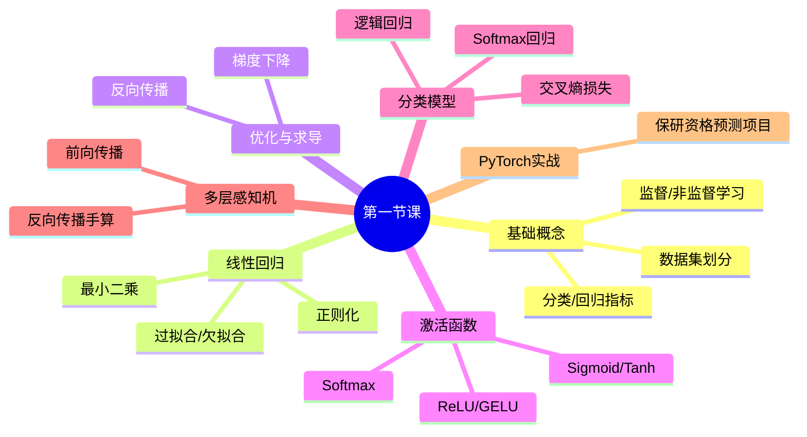

### 附录：矩阵/向量微积分公式汇总

在机器学习和深度学习中，经常需要对涉及矩阵和向量的表达式求导。以下是常用的求导公式，分类整理供参考。

#### 1. 基本向量求导公式

设 $\mathbf{x} \in \mathbb{R}^n$ 为列向量，$\mathbf{a} \in \mathbb{R}^n$ 为常数向量，$A \in \mathbb{R}^{m \times n}$ 为常数矩阵。

| 函数 $f$                              | 导数 $\frac{\partial f}{\partial \mathbf{x}}$ | 备注               |
| :------------------------------------ | :-------------------------------------------- | :----------------- |
| $\mathbf{a}^T \mathbf{x}$             | $\mathbf{a}$                                  | 标量对向量         |
| $\mathbf{x}^T \mathbf{a}$             | $\mathbf{a}$                                  | 同上               |
| $\mathbf{x}^T \mathbf{x}$             | $2\mathbf{x}$                                 | 二范数平方         |
| $\|\mathbf{x}\|_2^2$                  | $2\mathbf{x}$                                 | 同上               |
| $\mathbf{x}^T A \mathbf{x}$           | $(A + A^T)\mathbf{x}$                         | 二次型             |
| $\mathbf{x}^T A \mathbf{x}$ ($A$对称) | $2A\mathbf{x}$                                | 二次型（对称矩阵） |

#### 2. 矩阵-向量乘积的导数

| 函数 $f$                           | 导数                                                        | 备注                   |
| :--------------------------------- | :---------------------------------------------------------- | :--------------------- |
| $A\mathbf{x}$                      | $\frac{\partial (A\mathbf{x})}{\partial \mathbf{x}} = A^T$  | 向量对向量（分母布局） |
| $\mathbf{x}^T A$                   | $\frac{\partial (\mathbf{x}^T A)}{\partial \mathbf{x}} = A$ | 行向量形式             |
| $\|A\mathbf{x} - \mathbf{b}\|_2^2$ | $2A^T(A\mathbf{x} - \mathbf{b})$                            | 最小二乘损失           |

#### 3. 神经网络中常用的矩阵求导

设：

- $W \in \mathbb{R}^{m \times n}$：权重矩阵
- $\mathbf{x} \in \mathbb{R}^n$：输入向量
- $\mathbf{b} \in \mathbb{R}^m$：偏置向量
- $L$：标量损失函数

**线性层**：$\mathbf{z} = W\mathbf{x} + \mathbf{b}$

| 求导目标                                 | 结果                                 | 维度检查     |
| :--------------------------------------- | :----------------------------------- | :----------- |
| $\frac{\partial L}{\partial \mathbf{z}}$ | 上游传回的梯度 $\boldsymbol{\delta}$ | $m \times 1$ |
| $\frac{\partial L}{\partial W}$          | $\boldsymbol{\delta} \mathbf{x}^T$   | $m \times n$ |
| $\frac{\partial L}{\partial \mathbf{b}}$ | $\boldsymbol{\delta}$                | $m \times 1$ |
| $\frac{\partial L}{\partial \mathbf{x}}$ | $W^T \boldsymbol{\delta}$            | $n \times 1$ |

#### 5. 激活函数的导数

| 激活函数                                               | 导数                                                       | 备注         |
| :----------------------------------------------------- | :--------------------------------------------------------- | :----------- |
| $\sigma(x) = \frac{1}{1+e^{-x}}$ (Sigmoid)             | $\sigma(x)(1-\sigma(x))$                                   | 容易梯度消失 |
| $\tanh(x)$                                             | $1 - \tanh^2(x)$                                           | 输出零中心   |
| $\text{ReLU}(x) = \max(0, x)$                          | $\mathbf{1}_{x > 0}$                                       | 稀疏激活     |
| $\text{LeakyReLU}(x) = \max(\alpha x, x)$              | $\begin{cases} 1 & x > 0 \\ \alpha & x \leq 0 \end{cases}$ | 避免死神经元 |
| $\text{Softmax}(z_i) = \frac{e^{z_i}}{\sum_j e^{z_j}}$ | $q_i(\delta_{ij} - q_j)$                                   | 无           |
