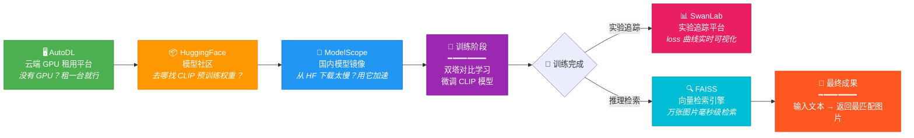
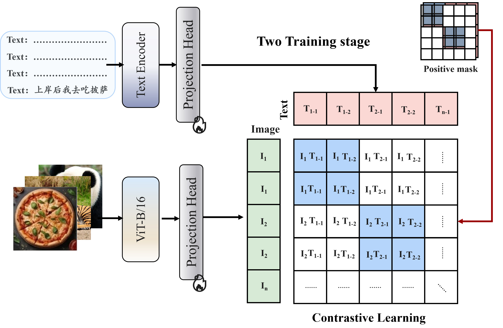

# CLIP 课堂实战项目

> 读一百遍论文，不如亲手跑一遍代码。

本项目是**《零基础深度学习直通大模型》第三节课**的配套实战代码。你将用 PyTorch 从零搭建一个 CLIP（Contrastive Language-Image Pre-training）图文检索系统——输入一句文本描述，模型自动从图库中找到最匹配的图片。

本文档会手把手带你完成：环境搭建 → 数据集准备 → 模型训练 → 推理评测 → Notebook 实验。

---

## 目录

- [0. 工具平台速览：五大工具一站式介绍](#0-工具平台速览五大工具一站式介绍)
- [1. 论文核心速览](#1-论文核心速览)
- [2. 项目是如何对应论文的](#2-项目是如何对应论文的)
- [3. 硬件要求](#3-硬件要求)
- [4. 完整运行流程](#4-完整运行流程)
- [5. 项目结构详解](#5-项目结构详解)
- [6. 代码怎么读](#6-代码怎么读)
- [7. 常见问题](#7-常见问题)
- [8. 关键实现细节](#8-关键实现细节)
- [9. 与论文的主要差异](#9-与论文的主要差异)

---

## 0. 工具平台速览：五大工具一站式介绍

深度学习项目会用到很多工具平台。本节一次性介绍本项目涉及的五种工具，让你知道它们各自解决什么问题、在本项目中分别扮演什么角色。

先看一张全景图——**它们是如何串联起来的**：



---

### 0.1 AutoDL：云端 GPU 租用平台

**一句话**：你没有 GPU，租一台就行。

你很可能没有一块 NVIDIA 显卡。没关系，[AutoDL](https://www.autodl.com/) 提供**按小时计费**的云端 GPU 实例，租一台 RTX 4090 跑完整个项目也就几块钱，用完关机不扣费。

| 问题 | 不用 AutoDL | 用 AutoDL |
|------|------------|----------|
| 硬件 | 需要自购 GPU（RTX 4090 ≈ 1.3 万元） | 按小时租，RTX 4090 约 2 元/小时 |
| 环境 | 自己配 CUDA、PyTorch、一堆依赖 | 预装 CUDA + PyTorch 的镜像，秒级开箱即用 |
| 数据 | 本地下载几百 MB 数据集要等半天 | 机房内网，下载只需几十秒 |
| 存储 | 占用本地磁盘、显存焦虑 | 云端 50-100 GB 数据盘，用完关机不扣费 |

**三步上手**：

1. 打开 [autodl.com](https://www.autodl.com/)，注册并充值（最低 10 元即可）
2. 「创建实例」→ 选 RTX 3090 或 RTX 4090 → 镜像选 `PyTorch 2.x + Python 3.10 + CUDA 12.x`
3. 拿到 JupyterLab 地址，上传项目代码，开干

> **费用参考**：RTX 4090 约 2 元/小时，训练 Flickr-30k 全量约 3-5 小时，**总花费不到 10 元**。

---

### 0.2 HuggingFace：模型社区与预训练权重仓库

**一句话**：模型不用从零训练，去 HF 下载别人训好的就行。

[HuggingFace](https://huggingface.co/)（简称 HF）是全球最大的开源模型托管平台，上面有几十万个预训练模型可供直接下载使用。

**在本项目中，HF 提供了什么？**

```python
# transformers 是 HuggingFace 的核心 Python 库
from transformers import CLIPTextModel, CLIPTokenizer

# 一行代码加载 OpenAI 开源的 CLIP 文本编码器
text_encoder = CLIPTextModel.from_pretrained("openai/clip-vit-base-patch32")
tokenizer = CLIPTokenizer.from_pretrained("openai/clip-vit-base-patch32")
```

| HF 提供的组件 | 对应代码 | 作用 |
|-------------|---------|------|
| `CLIPTextModel` | `models/encoders.py` → `TextEncoder` | 12 层 Transformer，输出 512 维文本向量 |
| `CLIPTokenizer` | `dataset/dataset_loader.py` / `inference/inference.py` | 把英文句子切分成 token ID |
| `ViTModel` | `models/encoders.py` → `ImageEncoder`（备选路径） | 本地加载时用 HF 版 ViT 替代 timm |

**核心概念**：

- **Model Hub**：就像一个 GitHub，但托管的是模型权重（`.bin` / `.safetensors`）而非代码
- **from_pretrained()**：HF 最核心的 API——自动下载模型权重 + 配置文件，返回可直接使用的 PyTorch 模型
- **tokenizer**：把自然语言文本转换为模型能理解的数字序列

> **延伸阅读**：除了 CLIP，HuggingFace 上还有 BERT、GPT-2、LLaMA、Stable Diffusion 等几乎所有主流模型。学会用 HF，等于打开了一座免费模型金矿。

---

### 0.3 ModelScope：国内模型镜像，下载快 10 倍

**一句话**：HuggingFace 服务器在海外下载慢，用 ModelScope 镜像下载，速度飞起。

[ModelScope](https://modelscope.cn/)（魔搭社区）是阿里云开源的模型平台，你可以把它理解为 **HuggingFace 的国内镜像版**。它的核心价值就一个：**下载快**。

**在本项目中，ModelScope 做了什么？**

```python
# download_models.py 的核心逻辑
from modelscope import snapshot_download

# 从 ModelScope 下载 CLIP 权重（国内镜像，速度远快于从 HF 直接拉）
clip_dir = snapshot_download("openai-mirror/clip-vit-base-patch32")
vit_dir = snapshot_download("google/vit-base-patch16-224")
```

| 下载方式 | 速度 | 可靠性 |
|---------|------|-------|
| HuggingFace 直接下载 | 慢（几十 KB/s，还可能断连） | 不稳定 |
| **ModelScope 镜像下载** | **快（几 MB/s，国内 CDN 加速）** | 稳定 |

**你只需要知道**：运行 `python download_models.py` 时，它自动走 ModelScope 下载，你不用操心。但如果自己以后在其他项目中想从 HF 下载模型，记得先看看 ModelScope 上有没有同名镜像——能省很多时间。

---

### 0.4 SwanLab：实验追踪与可视化

**一句话**：训练时 loss 曲线实时显示在网页上，不用盯着终端看数字。

[SwanLab](https://swanlab.cn) 是开源的深度学习实验管理平台，功能对标 Weights & Biases（WandB），**国内访问快、完全免费**。

**它在本项目中做什么？**

- 每训练一步，自动把 `loss`、`accuracy`、`learning_rate` 上传到云端
- 训练结束后，在网页上看到完整的 loss 曲线图（能一眼看出是否收敛、有没有过拟合）
- 多次实验可以放在同一个 Project 下对比——「lr=1e-5 和 lr=5e-5 哪个好？」一目了然
- 实验可设为「公开」，生成分享链接发给同学/老师

**三步配置**：

1. 打开 [swanlab.cn](https://swanlab.cn)，注册账号
2. 右上角「个人设置」→ 复制你的 **API Key**
3. 编辑项目根目录的 `run.sh`，填入 API Key：

```bash
SWANLAB_API_KEY="粘贴你的 API Key 到这里"
```

4. 正常执行 `bash run.sh`，打开 swanlab.cn 就能实时看到训练面板。

> 不填 API Key 也能训练，只是没有云端实验记录。**强烈建议填上**——亲眼看到 loss 曲线下降，是学习过程中最直观的正反馈。

**训练时 SwanLab 面板显示的指标**：

| 指标 | 含义 | 健康趋势 |
|------|------|---------|
| `train/loss` | 对比学习损失 | ↓ 持续下降 |
| `train/text_accuracy` | 文本→图像的 Top-1 匹配准确率 | ↑ 上升 |
| `train/image_accuracy` | 图像→文本的 Top-1 匹配准确率 | ↑ 上升 |
| `valid/loss` | 验证集损失 | ↓ 下降（若上升说明过拟合） |

---

### 0.5 FAISS：十亿级向量相似度搜索

**一句话**：你有 3 万张图的向量，要从中找出和 query 最相似的 9 张——FAISS 帮你毫秒级搞定。

[FAISS](https://github.com/facebookresearch/faiss)（Facebook AI Similarity Search）是 Meta 开源的高性能向量检索引擎。它的核心能力就一个：**在一个巨大的向量集合中，快速找出与目标向量最相似的那几个**。

**为什么本项目需要 FAISS？**

CLIP 训练完后，你拿到了几千甚至几万张图片的 256 维嵌入向量。现在给定一个文本 query，你要从这几万个向量中找出余弦相似度最高的 9 个——**笨办法是逐个算一遍**，3 万张图 × 256 维点积 ≈ 很快，但 100 万张呢？1 亿张呢？

FAISS 用**索引结构**和**近似搜索算法**把这个问题加速了几个数量级：

| 方法 | 1 万张图 | 100 万张图 | 1 亿张图 |
|------|---------|-----------|---------|
| 暴力遍历 | 几毫秒 | 几秒 | 几分钟 |
| **FAISS 索引** | **< 0.1 毫秒** | **< 1 毫秒** | **< 10 毫秒** |

**在本项目中，FAISS 出现在哪里？**

- `notebooks/02_按文本检索图像`：用 FAISS 构建图像向量索引，加速检索 Demo
- `notebooks/03_图像聚类`：用 FAISS 做 K-means 聚类，把语义相似的图片归为一组

**核心概念（理解即可，不需要手写）**：

- **向量索引（Index）**：把一堆向量组织成便于快速搜索的数据结构（类比：书的目录页）
- **IndexFlatL2**：最简单的索引——啥优化都不做，就是暴力遍历。小数据量够用
- **IndexIVFFlat**：先把向量做粗聚类，搜索时只搜最近的几个簇——大数据量显著加速
- **余弦相似度 vs L2 距离**：FAISS 默认用 L2 距离，但 CLIP 嵌入已做 L2 归一化，此时 L2 距离和余弦相似度等价

> FAISS 是工业界图文检索、推荐系统、RAG（检索增强生成）等系统的核心组件。初次接触只需知道「它能加速向量搜索」+ 会用 `notebooks/` 里的示例代码即可。

---

### 0.6 五者关系总结

| 工具 | 解决什么问题 | 在本项目中的位置 | 你需要做什么 |
|------|------------|----------------|------------|
| **AutoDL** | 没有 GPU | 整个项目的运行环境 | 注册 → 租 GPU → 上传代码 |
| **HuggingFace** | 去哪找预训练模型 | `models/encoders.py` 加载 CLIP/ViT 权重 | 基本无感——代码自动处理 |
| **ModelScope** | 国内下载 HF 模型太慢 | `download_models.py` 预下载权重 | 运行 `python download_models.py` |
| **SwanLab** | 训练过程怎么追踪 | `experiment_tracker/` + `run.sh` | 注册 → 填 API Key → 网页看曲线 |
| **FAISS** | 几万张图怎么快速检索 | `notebooks/02` 和 `03` 中的检索/聚类 | 会用 Notebook 示例即可 |

---

## 1. 论文核心速览

### 1.1 CLIP 要解决什么问题？

传统图像分类模型（如 ResNet）有一个根本局限：**只能识别训练时见过的固定类别**。你想让它识别「哈士奇 vs 萨摩耶」，就得先收集几百张标注好的图片重新训练。

CLIP 的核心洞察是：**用自然语言监督替代固定类别标签**。互联网上有 4 亿图文对——一张柯基图片配文「a cute corgi sitting on the sofa」。如果把图片和文本编码到同一向量空间，让「柯基图」的向量靠近「关于柯基的文本」的向量，模型就能理解任意的视觉概念。

### 1.2 CLIP 是怎么做到的？

CLIP 的架构可以概括为「**双塔 + 对比学习**」：



**关键概念**：

| 概念 | 大白话解释 |
|------|-----------|
| **双塔（Dual Encoder）** | 图像走图像塔，文本走文本塔，两塔独立编码，只在最后用余弦相似度"碰头" |
| **对比学习（Contrastive Learning）** | 不是让模型预测文本，而是让模型判断「哪段文本属于哪张图」——正确配对的拉近，错误配对的推远 |
| **投影空间** | 图像和文本的原始维度不同（768 vs 512），投影到相同的 256 维空间后才能算相似度 |
| **L2 归一化** | 把向量长度压缩到 1，此时点积 = 余弦相似度，数值稳定 |
| **Temperature τ** | 温度参数，控制 softmax 的"锐度"。τ 越小，相似度差异被放大，loss 对难样本更敏感 |
| **对称损失** | 既有「给定图找文本」的损失，也有「给定文本找图」的损失，双向约束更稳定 |

### 1.3 论文的核心公式（伪代码）

这是 CLIP 论文 Figure 3 的伪代码，对应本项目 `models/model.py` 的 `forward` 函数：

```numpy
# 1. 编码
I_f = image_encoder(I)           # [N, 768]  图像特征
T_f = text_encoder(T)            # [N, 512]  文本特征

# 2. 投影 + 归一化
I_e = l2_normalize(I_f @ W_i)    # [N, 256]  图像嵌入
T_e = l2_normalize(T_f @ W_t)    # [N, 256]  文本嵌入

# 3. 相似度矩阵
logits = I_e @ T_e.T * exp(t)    # [N, N]  温度缩放后余弦相似度

# 4. 对称交叉熵
labels = arange(N)               # 对角线 = 正确匹配
loss_i = cross_entropy(logits, labels, axis=0)  # 图→文
loss_t = cross_entropy(logits, labels, axis=1)  # 文→图
loss = (loss_i + loss_t) / 2
```

---

## 2. 项目是如何对应论文的

| 论文内容 | 对应代码文件 | 做了什么 |
|---------|-------------|---------|
| **Section 2: 对比式预训练** | `models/model.py` | 双塔架构 + 对称 InfoNCE 损失 + L2 归一化 + temperature 缩放 |
| **图像编码器（ViT）** | `models/encoders.py` → `ImageEncoder` | 用 timm 的 ViT-B/16，输出 768 维图像特征 |
| **文本编码器（Transformer）** | `models/encoders.py` → `TextEncoder` | 用 HuggingFace CLIP Text Model，取 EOS token 输出作为句子表示（512 维） |
| **投影头** | `models/encoders.py` → `ProjectionHead` | 将 768/512 维投影到 256 维共同空间 |
| **L2 归一化 + Cosine Similarity** | `models/model.py` forward 中的 `F.normalize` + `@` 操作 | 归一化后点积 = 余弦相似度 |
| **Temperature 参数** | `config.py` 中的 `temperature = 0.07` | 控制 softmax 分布锐度 |
| **过零样本迁移** | `notebooks/` 下的 01-05 号 notebook | 零样本分类、图文检索、图像聚类、相似度计算、LoRA 微调 |
| **训练超参** | `config.py` + `run.sh` | batch_size, lr, epochs, warmup 等 |
| **数据：图文对** | `dataset/dataset_loader.py` | 加载 Flickr-8k/30k 的 image-caption 对 |

**核心代码一目了然**——打开 `models/model.py` 的 `forward` 函数，每一行都能在论文伪代码中找到对应。

---

## 3. 硬件要求

### 3.1 不同场景的需求

| 场景 | GPU 要求 | 显存要求 | 预计耗时 | 建议平台 |
|------|---------|---------|---------|---------|
| **仅推理**（用预训练模型检索） | 不需要 GPU；CPU 也可 | 4-6 GB 内存 | 几秒到几分钟 | 个人电脑、AutoDL CPU 实例均可 |
| **快速测试**（假数据，1 epoch） | 不需要 GPU | 4 GB 内存 | < 2 分钟 | 个人电脑即可 |
| **正式训练**（Flickr-8k，10 epoch） | RTX 3060 及以上 | 6-8 GB 显存 | ~30 分钟 | AutoDL RTX 3060（约 1 元/小时） |
| **全量训练**（Flickr-30k，40 epoch） | RTX 4090 / A100 | 16-24 GB 显存 | 3-5 小时 | AutoDL RTX 4090（约 2 元/小时） |

### 3.2 详细配置要求

| 资源 | 最低配置 | 推荐配置 |
|------|---------|---------|
| **GPU** | 1 张 NVIDIA 显卡（GTX 1080 Ti，11 GB） | RTX 4090 / A100 |
| **显存** | 12 GB（bf16 混合精度，batch_size=128） | 24 GB |
| **内存** | 16 GB | 32 GB |
| **磁盘** | ~10 GB（代码 + 预训练权重 + 数据集） | ~20 GB |
| **CUDA** | 12.x | 12.8+ |
| **Python** | 3.10 | 3.10 |

### 3.3 为什么需要 GPU？

CLIP 的图像编码器是 ViT-B/16（约 86M 参数），文本编码器是 12 层 Transformer。完整训练需要做大量矩阵乘法和反向传播，CPU 做的话会慢 10-100 倍。即便只是推理，用 CPU 处理几千张图片也要几分钟。

### 3.4 没有 GPU 怎么办？

1. 用 AutoDL 租（推荐，教程见第 0.1 节）
2. 使用 `run_quick_test.py` 做快速冒烟测试（CPU 即可）
3. 只跑 `notebooks/` 下的推理实验（不需要训练）
4. Google Colab 免费版（有 T4 GPU，但内存和时长有限）

---

## 4. 完整运行流程

> 本节假设你已在项目根目录下。如果是在 AutoDL 上新开的实例，终端就是 bash，直接用。

### 第一步：环境搭建

```bash
# 1. 创建 Python 虚拟环境（推荐 conda）
conda create -n clip python=3.10 -y
conda activate clip

# 2. 安装 PyTorch（CUDA 12.x 版本）
pip install torch torchvision --index-url https://download.pytorch.org/whl/cu121

# 3. 安装项目其余依赖
pip install -r requirements.txt
```

> 如果是 AutoDL 的 PyTorch 镜像，第 1-2 步已预装，直接从第 3 步开始。

**验证安装是否成功**：

```bash
python -c "import torch; print(torch.cuda.is_available(), torch.cuda.get_device_name(0))"
```

应该输出 `True` 和你的 GPU 型号。

---

### 第二步：下载预训练权重（约 3 GB，需联网）

```bash
python download_models.py
```

执行后会在 `checkpoint/` 目录下自动下载：

| 模型 | 来源 | 用途 |
|------|------|------|
| `openai-mirror/clip-vit-base-patch32` | ModelScope 镜像（国内下载快） | 文本编码器的预训练权重 |
| `google/vit-base-patch16-224` | ModelScope 镜像 | 图像编码器（ViT）的预训练权重 |

> 这两个模型合计约 3 GB。下载速度取决于网络，通常在 5-15 分钟内完成。如果下载卡住，可以重试（支持断点续传）。

**它做了什么？**

`download_models.py` 用 `modelscope` 库从国内镜像下载预训练权重，然后生成一个 `checkpoint/model_paths.json` 记录本地路径。`config.py` 在启动时会自动读取这个 json 文件，优先从本地加载（不联网也能用）。

---

### 第三步：下载数据集

运行以下命令下载数据集：

```bash
python dataset/download_dataset.py
```

脚本默认下载 Flickr-8k（约 1.1 GB）。你也可以编辑 `dataset/download_dataset.py` 顶部的 `DATASET` 变量来切换：

```python
DATASET = "flickr8k"    # 可选: flickr8k | flickr30k | coco | cifar10
```

| 数据集 | 下载大小 | 图片数量 | 文字描述数 | 适合场景 |
|--------|---------|---------|-----------|---------|
| **flickr8k** | ~1.1 GB | 8,000 张 | 5 条/图 = 40,000 对 | **快速实验（推荐新手）** |
| **flickr30k** | ~4.9 GB | 31,000 张 | 5 条/图 = 155,000 对 | 正式训练 |
| **coco** | ~6 GB | 40,000 张 | 5 条/图 | 大规模评测 |
| **cifar10** | ~130 MB | 60,000 张 | 各有类别标签 | 零样本分类评测 |

**数据集结构说明**（以 Flickr-8k 为例）：

```
dataset/flickr8k/
├── Images/                  # 8000 张 JPEG 图片
│   ├── 1000268201_693b08cb0e.jpg
│   ├── 1001773457_577c3a7d70.jpg
│   └── ...
├── captions.csv             # 图片与描述对应表
│   image      | caption                         | id
│   dog.jpg    | A black dog runs on the beach   | 0
│   dog.jpg    | The dog is playing in the sand  | 0
│   cat.jpg    | A white cat sleeping on a chair | 1
│   ...
```

**关键点**：每张图片有 5 条描述，同一张图的 5 条描述共享同一个 `id`。这个 `id` 在训练时被用来定义**什么是"正样本"**——同 `id` 的图文对互为匹配对。

---

### 第四步：快速冒烟测试（确保一切正常）

在正式训练之前，先用假数据跑一次，验证代码能正常工作：

```bash
python run_quick_test.py
```

这个脚本会：
1. 自动生成 20 张随机图片 + 假 caption
2. 跑 1 个 epoch 训练
3. 跑一次推理

**整个过程约 1-2 分钟**，不需要下载数据集，CPU 也能跑。如果输出 `脚本: 通过` 和 `Notebook: 通过`，说明环境没问题，可以继续。

---

### 第五步：配置 SwanLab（推荐但可选）

去 [swanlab.cn](https://swanlab.cn) 注册，拿到 API Key，编辑 `run.sh`：

```bash
SWANLAB_API_KEY="粘贴你的 API Key"
PROJECT="CLIP"
```

训练时所有指标会自动上传到云端，可以在网页上实时看 loss 曲线。

---

### 第六步：开始训练

编辑 `run.sh` 中的参数，然后执行：

```bash
bash run.sh
```

**关键参数说明**（都在 `run.sh` 顶部）：

| 参数 | 默认值 | 说明 |
|------|-------|------|
| `DATASET` | `"flickr30k"` | 数据集选择：`flickr8k`（快速）/ `flickr30k`（正式） |
| `GPU` | `"0"` | 单卡 `"0"`，多卡 `"0,1,2,3"` |
| `EPOCHS` | `40` | 训练轮数。flickr8k 建议 10-20，flickr30k 建议 30-40 |
| `BATCH_SIZE` | `128` | 每张卡的批大小 |
| `GRAD_ACCUM_STEPS` | `2` | 梯度累积步数。**有效 batch = BATCH_SIZE × GRAD_ACCUM_STEPS × GPU 数** |
| `FREEZE_ENCODER_EPOCHS` | `3` | 前 N 轮只训练投影头（冻结编码器），之后全量微调 |
| `LR` | `"1e-5"` | 学习率 |
| `MIXED_PRECISION` | `"bf16"` | 混合精度：`bf16`（推荐）、`fp16`、`no`（关） |

**新手建议**：

1. 先把 `DATASET` 改成 `"flickr8k"`，`EPOCHS` 改成 `10`，在 3060 上约 15 分钟跑完，快速验证
2. 确认没问题后，再换成 `"flickr30k"`、`EPOCHS=40`，做正式实验

**训练过程中你会看到**：

```
Epoch: 1/40 ━━━━━━━━━━━━━━ 15% 0:45:23<2:30:00
train/loss: 3.245  train/text_acc: 0.312  train/img_acc: 0.298
valid/loss: 2.876  valid/text_acc: 0.401  valid/img_acc: 0.387
```

- `train/loss` 持续下降 → 模型在学习 ✅
- `train/text_acc` 上升 → 给定文本，找到正确图片的比例在提高 ✅
- `valid/loss` 不再下降甚至上升 → 可能开始过拟合，考虑早停

训练完成后会在项目根目录生成 `best.pt`（约 573 MB），这是验证集 loss 最低的那轮检查点。

---

### 第七步：推理——用文本检索图片

训练完成后，在 Python 或 Jupyter 中运行：

```python
from train.train import make_train_valid_dfs
from inference.inference import get_image_embeddings, find_matches

# 加载数据
_, valid_df = make_train_valid_dfs()

# 提取所有验证集图片的嵌入
model, image_embeddings = get_image_embeddings(valid_df, "best.pt")

# 用文本检索图片
find_matches(model, image_embeddings, "a dog running on the beach", valid_df["image"].values)
```

这会弹出一个 3×3 的图片网格，展示与查询文本最匹配的 9 张图片。

**推理时发生了什么？**

1. `get_image_embeddings`：遍历验证集所有图片，用训练好的图像编码器 + 投影头提取 256 维向量，拼成一个大矩阵
2. `find_matches`：把你的文本 query 用文本编码器 + 投影头也变成 256 维向量
3. 两个向量做 L2 归一化后点积 → 得到余弦相似度
4. 按相似度从高到低排序，取 Top-9 展示

---

### 第八步：运行 Notebook 实验

项目包含 5 个教学 Notebook，覆盖了 CLIP 的核心应用场景：

```bash
jupyter lab
```

打开 `notebooks/baseCLIP_project/` 下的 notebook：

| Notebook | 内容 | 对应论文概念 |
|----------|------|------------|
| **01_零样本图像分类** | 直接用 CLIP 对 CIFAR-10 做零样本分类，不需要任何训练 | 论文 Section 4：Zero-Shot Prediction |
| **02_按文本检索图像** | FAISS 向量索引加速的大规模图文检索 | 双塔嵌入 + 余弦相似度检索 |
| **03_图像聚类** | 用 CLIP 嵌入对图像做语义层面聚类 | 证明了 CLIP 嵌入的语义质量 |
| **04_图像相似度** | 计算两张图片之间的语义相似度 | 嵌入空间中的距离 = 语义距离 |
| **05_CLIP微调_LoRA** | 用 LoRA（低秩适配）在 OxfordPets 上微调 CLIP | 高效微调大模型的方法 |

> 每个 Notebook 都可以独立运行，互不依赖。从 01 开始按顺序体验最佳。

---

## 5. 项目结构详解

```
项目/
├── config.py                  # 🎯 全局超参和路径（修改参数从这里开始）
├── run.sh                     # 🚀 训练启动脚本（bash run.sh 一键训练）
├── run_train.py               # 命令行入口（解析参数 → 覆盖 config → 调训练）
├── run_quick_test.py          # ⚡ 快速冒烟测试（假数据 + 1 epoch + 推理）
├── download_models.py         # 📥 从 ModelScope 下载预训练权重
├── requirements.txt           # 📦 Python 依赖清单
├── README.md                  # 📖 本文件
│
├── dataset/                   # 📊 数据模块
│   ├── dataset_loader.py      #    CLIPDataset：读 caption，tokenize，加载图片
│   ├── download_dataset.py    #    下载 Flickr-8k/30k、COCO、CIFAR-10
│   ├── process_flickr8k.py    #    Flickr-8k 数据预处理
│   └── process_flickr30k.py   #    Flickr-30k 数据预处理
│
├── models/                    # 🧠 模型模块
│   ├── encoders.py            #    ImageEncoder（ViT）、TextEncoder（CLIP）、ProjectionHead
│   └── model.py               #    CLIPModel：双塔前向 + 对比损失 + 多卡 all_gather
│
├── train/                     # 🏋️ 训练模块
│   └── train.py               #    数据划分、DataLoader、train/valid loop、存 checkpoint
│
├── inference/                 # 🔍 推理模块
│   ├── inference.py           #    图像嵌入提取 + 文本检索 + matplotlib 3×3 可视化
│   └── inference_multi_gpu.py #    多卡推理入口
│
├── utils/                     # 🛠 工具模块
│   └── utils.py               #    AvgMeter（loss 滑动平均）、get_lr
│
├── notebooks/                 # 📓 Jupyter Notebook 教程
│   └── baseCLIP_project/      #    5 个独立实验 Notebook
│
├── experiment_tracker/        # 📈 SwanLab 实验追踪
│   ├── tracker.py             #    ExperimentTracker 类（初始化、log、保存）
│   └── secrets.py            #    API Key（已加入 .gitignore）
│
└── checkpoint/                # 💾 预训练权重缓存（运行 download_models.py 后生成）
```

---

## 6. 代码怎么读

如果你是第一次看这个项目，按以下顺序读最容易理解：

### 第 1 步：`config.py` — 所有参数都在这里

这是项目的"控制面板"。只要改这里或 `run.sh` 的值，就能控制训练行为。不需要深入理解每行代码。

需要关注的关键配置：

```python
model_name = 'vit_base_patch16_224'    # 图像编码器型号
image_embedding = 768                   # 图像编码器输出维度
text_embedding = 512                    # 文本编码器输出维度
projection_dim = 256                    # 投影后的共享空间维度
temperature = 0.07                      # 对比学习温度系数
max_length = 77                         # CLIP 文本最大长度（论文设定）
```

### 第 2 步：`models/encoders.py` — 编码器是什么

这个文件定义了三个组件：

- **ImageEncoder**：用 timm 加载 ViT-B/16，输入图片输出 768 维向量
- **TextEncoder**：用 HuggingFace 加载 CLIP Text Model，输入 token IDs 输出 512 维向量。关键细节：取**EOS token**（不是 BERT 的 CLS）作为整句表示
- **ProjectionHead**：把 768/512 维投影到 256 维共同空间。结构是 Linear→GELU→Linear+残差+LayerNorm

### 第 3 步：`models/model.py` — 核心！对比学习如何实现

**这是整个项目最重要的文件**，只有约 100 行，但包含了 CLIP 的核心思想。看 `CLIPModel.forward` 函数：

```python
# 1. 分别编码
image_features = self.image_encoder(batch["image"])     # [N, 768]
text_features = self.text_encoder(...)                   # [N, 512]

# 2. 投影
image_embeddings = self.image_projection(image_features) # [N, 256]
text_embeddings = self.text_projection(text_features)    # [N, 256]

# 3. L2 归一化（归一化后点积 = 余弦相似度）
image_embeddings = F.normalize(image_embeddings, p=2, dim=-1)
text_embeddings = F.normalize(text_embeddings, p=2, dim=-1)

# 4. 相似度矩阵 ÷ temperature
logits = (text_embeddings @ image_embeddings.T) / self.temperature  # [N, N]

# 5. 用 id 构建正样本 mask，一图多 caption 均分 1
targets = ...  # 同 id 的行/列均为正样本，soft label

# 6. 对称交叉熵
texts_loss = cross_entropy(logits, targets)      # 文→图方向
images_loss = cross_entropy(logits.T, targets.T) # 图→文方向
loss = (texts_loss + images_loss) / 2
```

每一行都能在论文 Figure 3 的伪代码中找到对应。

### 第 4 步：`dataset/dataset_loader.py` — 数据是怎么喂进去的

`CLIPDataset` 在初始化时用 tokenizer 把所有 caption 预先 tokenize，`__getitem__` 时一次取一条（图片 + tokenized caption + id）。同一张图的 5 条 caption 共享同一个 `id`。

### 第 5 步：`train/train.py` — 训练循环

常规的 PyTorch 训练流程：划分训练/验证集（按 id 8:2 随机分）→ 建 DataLoader → 每个 epoch 训一遍再验证一遍 → 如果 valid loss 比之前低就覆盖保存 `best.pt`。

### 第 6 步：`inference/inference.py` — 用训练好的模型检索

加载 `best.pt` → 对验证集所有图片跑图像编码器 → 对 query 文本跑文本编码器 → 算余弦相似度 → Top-k 展示。

---

## 7. 常见问题

### Q1：`pip install -r requirements.txt` 报错？

常见原因是 PyTorch 版本和 CUDA 不匹配。建议先装 PyTorch 再装其余依赖：

```bash
pip install torch torchvision --index-url https://download.pytorch.org/whl/cu121
pip install -r requirements.txt
```

### Q2：显存不够，CUDA Out of Memory？

几个办法（从简单到复杂）：

1. **减小 `BATCH_SIZE`**：在 `run.sh` 中把 `BATCH_SIZE` 从 128 降到 64 或 32
2. **增大 `GRAD_ACCUM_STEPS`**：保持有效 batch 不变，比如 `BATCH_SIZE=64, GRAD_ACCUM_STEPS=4`
3. **改混合精度**：确保 `MIXED_PRECISION="bf16"` 已开启
4. **换小数据集**：用 `flickr8k` 替代 `flickr30k`

### Q3：训练不收敛，loss 不降？

检查这些：
- 是否正确下载了预训练权重（`checkpoint/model_paths.json` 存在且路径有效）
- `config.py` 中 `pretrained = True` 是否开启
- 学习率是否太大：试试把 `LR` 从 `1e-5` 降到 `5e-6`
- 打印几个 batch 看看数据是否正常加载（图片是不是全黑或全是噪声）

### Q4：文本→图像检索结果和 query 完全不相关？

- 检查训练是否充分（valid loss 是否降到足够低，通常在 1.5-2.5 之间）
- 确认加载的是最新的 `best.pt`（不是第一次训练的权重）
- 试试英文 query，CLIP 的文本编码器主要训练在英文上

### Q5：SwanLab 上没有数据显示？

- 确认 `run.sh` 中 `SWANLAB_API_KEY` 填写正确（没有多余空格或引号）
- 训练是在有网络的环境下运行的吗？
- 去 swanlab.cn → 个人设置中确认 API Key 未被重置

### Q6：`download_models.py` 下载太慢或失败？

ModelScope 在国内通常很快，但如果遇到问题：
- 检查网络连接
- 重新运行脚本（支持断点续传）
- 如果持续失败，可以手动从 HuggingFace 下载对应模型放到 `checkpoint/` 目录

---

## 8. 关键实现细节

以下是理解本项目必须知道的几个技术点：

### 8.1 为什么用 `id` 而不是 `arange(N)` 做正样本？

论文伪代码中用 `labels = arange(N)`（对角线 = 正样本），**前提是每个 batch 内一张图只有一条 caption**。

但在 Flickr 数据集中，**一张图有 5 条 caption**，batch 内可能出现同图不同 caption 的情况。如果用 `arange(N)`，同图的两条 caption 会被当成负样本——这不合理。

本项目的做法：用 `id` 判断哪些行/列属于同一张图，同一张图的多条 caption 共享正样本权重（均分 1）。

```python
# 同 id = 正样本
positive_mask = ids.unsqueeze(1) == ids.unsqueeze(0)    # [N, N] bool
positive_counts = positive_mask.sum(dim=-1, keepdim=True)
targets = positive_mask.float() / positive_counts.clamp_min(1.0)  # soft label
```

### 8.2 EOS 不是 CLS

BERT 习惯用第 0 个 token（CLS token，token id = 101）作为句子表示。CLIP 不同——**它用最后一个有效 token（EOS）的输出作为句子向量**。

CLIP tokenizer 中 EOS 的 token id 是 49407（词表中的最大值），所以代码中直接 `input_ids.argmax(dim=-1)` 定位。

### 8.3 L2 归一化为什么重要

归一化有三大好处：
1. **数值稳定**：防止向量模长过大导致数值溢出
2. **等价余弦相似度**：归一化后点积 = cos(θ)，有界在 [-1, 1]
3. **与论文一致**：论文明确用的就是 L2 归一化 + 余弦相似度

### 8.4 Temperature τ 的作用

temperature 控制 logits 进入 softmax 前的缩放程度：

- τ 越大 → softmax 分布越均匀 → loss 对所有样本一视同仁
- τ 越小 → softmax 分布越尖锐 → loss 主要关注最难区分的那几个负样本

本项目默认 `temperature = 0.07`（CLIP 论文的初始化值），在训练过程中也可被学习。

### 8.5 梯度累积

`GRAD_ACCUM_STEPS=2` 的意思是：每累积 2 个 micro-batch 的梯度才更新一次参数。这样在显存不够时，可以减小单次 batch_size，用梯度累积来保持相同的 **有效 batch size**。

```
有效 batch = BATCH_SIZE × GRAD_ACCUM_STEPS × GPU 数
          = 128 × 2 × 1 = 256
```

---

## 9. 与论文的主要差异

| 方面 | 论文（CLIP 原版） | 本项目 |
|------|-----------------|-------|
| **训练数据规模** | 4 亿图文对（WIT 数据集） | ~8000（flickr8k）或 ~31000（flickr30k） |
| **图像编码器** | 自研 ViT-L/14 或 ResNet-50x64 | timm 的 ViT-B/16（轻量，易获取） |
| **文本编码器** | 自研 12 层 Transformer（从头训练） | HuggingFace CLIP Text Model（预训练权重） |
| **投影头** | 单层线性投影（无激活函数） | Linear→GELU→Linear+残差+LayerNorm（多一层非线性） |
| **从头训练** | 所有参数随机初始化 | 加载预训练权重后微调 |
| **训练 GPU** | 256 × V100，12 天 | 1 × RTX 4090，3-5 小时 |
| **Batch Size** | 32,768 | 256（有效 batch） |

**为什么这些差异不影响学习？**

CLIP 的核心是「双塔 + 对比学习 + L2 归一化 + 对称 InfoNCE」这一整套**方法论**，而不是具体的模型大小或数据量。本项目的实现完整包含了论文的全部核心思想，只是规模缩小了，更适合教学和理解。理解了这个小规模版本，再看论文的 4 亿对版本就只是「加数据、加 GPU」的区别。

---

## 学习建议

1. **先跑通再深读**：按第 4 节的流程完整跑一遍，看到检索结果后再回头看代码
2. **对着论文看代码**：打开 `models/model.py`，旁边打开论文 Figure 3 伪代码，逐行对照
3. **改参数做实验**：调大 batch_size、改 temperature、换 image_encoder，观察 loss 曲线变化
4. **跑完所有 Notebook**：5 个 Notebook 覆盖了 CLIP 的 5 种典型应用场景
5. **关注 SwanLab**：训练时多看 loss 曲线，下降是否稳定、valid loss 有没有反弹

---

> 论文原文 `CLIP_paper.pdf` 在上一级目录。课程讲义 `讲义.md` 也在上一级目录，建议配合阅读。
