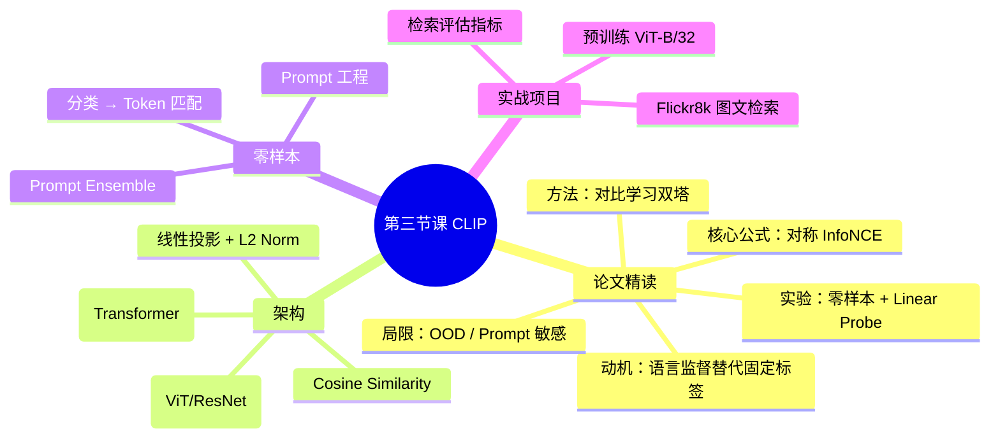

# 第三节课：多模态大模型——CLIP 论文精读

## 零、课程说明

**课程名称**：零基础深度学习直通大模型  
**适用对象**：已完成前两节课、具备 PyTorch 基础的同学  
**第三节课目标**：精读 CLIP 论文原文，理解对比学习的核心思想、双塔架构和零样本迁移的原理；动手实现基于 CLIP 的零样本图文检索项目

### 课程节奏说明

| 类型 | 天数 | 说明 |
| --- | ---: | --- |
| **直播上课** | 1 天 | 集中讲解 CLIP 论文全文 + 零样本检索项目演示 |
| **自习任务** | 6 天 | 按下方计划表完成论文阅读、代码实践和实验 |

> **本节核心**：CLIP 是连接文本与图像的里程碑工作，DALL·E 2、Stable Diffusion 等均以其为基座。  
> **论文原文**：见本目录下 `CLIP_paper.pdf`

---

### 第三周学习计划表

**本周主题**：CLIP —— 对比语言-图像预训练  
**直播日**：第 5 天（讲解本讲义全文 + 项目演示）  
**论文**：[Learning Transferable Visual Models From Natural Language Supervision](https://arxiv.org/abs/2103.00020) (Radford et al., PMLR 2021)

| 天数 | 类型 | 任务 | 参考资料 |
| ---: | --- | --- | --- |
| **第 1 天** | 自习 | 通读本讲义「一～三」节（论文 1-4 章）：动机、对比学习、CLIP 架构与训练 | 本讲义 + `CLIP_paper.pdf` |
| **第 2 天** | 自习 | 读本讲义「四～五」节（论文 5-6 章）：实验设计与零样本迁移原理 | 本讲义 + 论文原文 |
| **第 3 天** | 自习 | 读本讲义「六」节（论文 7 章）：实验分析、Pareto 曲线、Prompt 工程；浏览附录 | `CLIP_paper.pdf` Figure 5-14 |
| **第 4 天** | 自习 | 浏览 Flickr8k 样例图与标签，理解图文检索任务定义；配置项目环境、下载 CLIP 预训练模型 | `项目/README.md` |
| **第 5 天** | **直播** | 系统讲解 CLIP 完整架构与零样本机制；演示 `clip_retrieval.py` 图文检索流程；答疑 | 本讲义 + `项目/` 全部代码 |
| **第 6 天** | 自习 | 独立运行项目：命令行执行图文检索、尝试 Web 可视化界面 `streamlit run web_demo.py`、修改检索 query 做对比实验 | `项目/README.md` |
| **第 7 天** | 自习 | 复盘 CLIP 论文贡献（对比学习、双塔、零样本）；浏览 CLIPBenchmark / OpenCLIP 等后续工作 | 见「拓展阅读」 |

#### 第三周自习验收清单

- [ ] 能口述 CLIP 的「双塔架构」各是什么，为什么用对比学习而非预测
- [ ] 能写出 CLIP 核心伪代码（图 3）
- [ ] 理解「零样本迁移」：分类任务如何转换为 token 匹配
- [ ] 环境中已安装 `clip` 或 `open_clip`，运行 `clip_retrieval.py` 可正常输出 Top-5 检索结果
- [ ] 至少完成一次 query 修改实验（如改检索文本，观察结果变化）

---

## 一、论文动机与背景（1. Introduction + 2. Related Work）

### 1.1 传统计算机视觉的局限

**核心痛点**：SOTA 视觉模型训练时依赖**预定义固定类别**（如 ImageNet 1000 类）。每新增一个视觉概念，就需要新的标注数据。

- ImageNet 提供了约 14M 标注图片，但类别空间封闭、泛化差
- 若想识别「哈士奇 vs 萨摩耶」，需要专门标注好的二分类数据
- **语言监督**天然解决了这个问题：文本可以描述任意视觉概念

### 1.2 CLIP 的出发点：从文本中学习视觉

> "Learning directly from raw text about images is a promising alternative which leverages a much broader source of supervision."

CLIP 的核心思想：

| 传统方式 | CLIP |
| --- | --- |
| 标注约束（固定类别标签） | 自然语言监督（任意文本描述） |
| 每类需要几百张标注图 | 利用互联网 4 亿图文对 |
| 新任务需重新训练 | 零样本迁移（zero-shot transfer） |

### 1.3 数据集：WebImageText (WIT)

- 4 亿 (image, text) 对，从互联网爬取
- 不做人工清洗和平衡（避免引入标注偏差）
- 规模远大于此前任何图文数据集（如 Conceptual Captions: 3.3M）

**代价**：噪声大——互联网文本有时与图无关。CLIP 用**大规模 + 强模型**包容噪声。

---

## 二、方法：对比式预训练（3. Approach）

### 2.1 为什么是"对比学习"（Contrastive）而不是"预测"（Predictive）？

论文对比了两种范式：

| 方式 | 代表性方法 | 问题 |
| --- | --- | --- |
| 预测式（Predictive）| VirTex, ICMLM | 需要逐词预测文本，计算量大且效率低 |
| 对比式（Contrastive）| CLIP | 只判断「哪个文本属于哪张图」，更简单高效 |

论文实验证明：对比方法比 Bag-of-Words 预测训练**快 4 倍**即达到同等零样本性能。

### 2.2 核心架构：双塔（Dual Encoder）

```
┌──────────┐                    ┌──────────┐
│  Image   │                    │   Text   │
│ Encoder  │                    │ Encoder  │
│ (ViT/    │                    │(Trans-   │
│  ResNet) │                    │ former)  │
└────┬─────┘                    └────┬─────┘
     │ I_f [N, d_i]                 │ T_f [N, d_t]
     ▼                              ▼
  Linear + L2                    Linear + L2
     │                              │
     ▼                              ▼
  I_e [N, d_e]                  T_e [N, d_e]
      \                            /
       \     Cosine Similarity    /
        └────────────────────────┘
              logits [N, N]
```

| 组件 | 论文选择 | 本项目使用 |
| --- | --- | --- |
| 图像编码器 | ResNet-50/101/RN50x4 或 ViT-B/32 | `openai/clip-vit-base-patch32` |
| 文本编码器 | Transformer (12 层) | 同上 |
| 投影层 | 线性投影（无激活函数）→ 共享 d_e 维 | 同上 |

**关键设计**：
- **不做非线性投影**：与 SimCLR 不同，论文发现线性投影足够
- **L2 归一化**后做内积 = cosine similarity
- **可学习温度参数 t**：初始化为 `exp(log(1/0.07)) ≈ 14.3`，自动缩放 logits

### 2.3 损失函数：对称 InfoNCE

**直觉**：给定 N 对图文，构造 N×N 相似度矩阵，对角线为正确匹配，其余为负样本。

```numpy
# CLIP 核心伪代码（论文 Figure 3）

I_f = image_encoder(I)          # [N, d_i]
T_f = text_encoder(T)           # [N, d_t]
I_e = l2_normalize(I_f @ W_i)   # [N, d_e]
T_e = l2_normalize(T_f @ W_t)   # [N, d_e]
logits = I_e @ T_e.T * exp(t)   # [N, N]，scaled pairwise cosine similarity
labels = arange(N)              # [0, 1, 2, ..., N-1]
loss_i = cross_entropy_loss(logits, labels, axis=0)  # image → text 方向
loss_t = cross_entropy_loss(logits, labels, axis=1)  # text → image 方向
loss = (loss_i + loss_t) / 2
```

**为什么是对称的？**

- `loss_i`：给定一张图，从 N 个文本中找到正确描述
- `loss_t`：给定一个文本，从 N 张图中找到匹配的图片
- 对称约束让两种模态的嵌入空间**互相拉近真实对、推远负配对**

损失函数等价于 InfoNCE（Van den Oord et al., 2018），又称多类 N-pair 损失（Sohn, 2016）。

### 2.4 训练细节

| 超参 | 值 |
| --- | --- |
| 批大小 | 32,768 |
| 优化器 | Adam (β₁=0.9, β₂=0.98, ε=10⁻⁶) |
| 学习率 | 余弦衰减 |
| 训练数据 | 4 亿图文对 |
| 总训练量 | 32 epoch |
| V100 GPU × 天 | ViT-L/14: 12天 × 256 GPU |

**注意**：所有模型从**随机初始化**开始训练，不加载 ImageNet 预训练权重。

---

## 三、图像编码器（3.1 Model）

### 3.1 ResNet 系列

| 模型 | 变体 | 说明 |
| --- | --- | --- |
| ResNet-50 | 标准 | 含 BlurPool 抗锯齿 |
| ResNet-101 | — | 比 ResNet-50 深 |
| RN50x4 | EfficientNet 缩放 | 宽度 ×4、深度 ×1.5，约 87M 参数 |
| RN50x16 | 更大缩放 | 宽度 ×16，约 167M 参数 |
| RN50x64 | 最大缩放 | 宽度 ×64，约 589M 参数 |

### 3.2 Vision Transformer (ViT)

| 模型 | 参数 |
| --- | --- |
| ViT-B/32 | 12 层 × 12 头，patch=32 |
| ViT-B/16 | 12 层 × 12 头，patch=16（更细粒度） |
| ViT-L/14 | 24 层 × 16 头，patch=14 |

论文主要用 **ViT-L/14** 做实验，本项目用 **ViT-B/32**（轻量、可在 CPU 上运行）。

### 3.3 文本编码器

- 架构：**12 层 Transformer**，8 头注意力，512 维
- 输入：BPE（Byte Pair Encoding）分词，词汇表 49,152
- 序列长度上限：76 token
- `[EOS]` token 的输出作为整句的**文本嵌入**

---

## 四、零样本迁移机制（4. Zero-Shot Prediction）

### 4.1 如何把分类任务转化为图文匹配？

传统分类器：softmax(Wx + b)，输出类名概率。  
CLIP 零样本分类：**用文本描述替代类别权重**。

```
零样本分类 = 找出与图片最相似的文本描述

步骤：
1. 对每个类别，构造文本："a photo of {class_name}"
2. 文本编码器 T_enc 将所有描述转为嵌入 T₁, T₂, ..., T_K
3. 图像编码器 I_enc 将测试图转为嵌入 I
4. 取 I 与 Tⱼ 余弦相似度最高的 j 作为预测类别
```

### 4.2 Prompt 工程

原始类别名（如 `bird`）可能被 CLIP 误解（如歧义或缩写）。论文使用了多种 Prompt 模板：

```
"A photo of a {label}, a type of {context}."
"A blurry photo of a {label}."
"A picture of many {label}."
```

**Prompt Ensemble**：对每个类别取 80 个模板的嵌入平均值，提升约 4% 准确率。

### 4.3 零样本评估

| 数据集 | ResNet-101 CLIP | ImageNet 训练 ResNet-101 |
| --- | ---: | ---: |
| ImageNet | 76.2% | 77.9% |
| **零样本结果与全监督几乎持平** | | |

更重要的是，CLIP 在 27 个数据集中有 16 个**超越**或持平全监督基线，无需任一数据集的标注。

---

## 五、实验与结果（5. Experiments）

### 5.1 零样本迁移

论文在 27 个数据集上测试了零样本分类：

- **强项**：Fine-Grained 数据集（CIFAR-100, STL-10, OxfordPets 等）
- **弱项**：专业领域（卫星图 EuroSAT、淋巴图 PatchCamelyon 等）
- **原因**：互联网数据缺乏卫星/医学文本描述，产生数据偏差

### 5.2 Linear Probe（线性探针）

用 CLIP 冻住的图像特征 + 只训练 Linear 分类头：

| 数据集 | CLIP ViT-L Linear Probe | EfficientNet-B7 全监督 |
| --- | ---: | ---: |
| 平均 Top-30 数据集 | **88.8%** | 85.4% |

**结论**：CLIP 的特征在冻结后依然极强，适合做下游 backbone。

### 5.3 Few-Shot 对比

CLIP Zero-Shot ≈ BiT-M (ResNet) 4-shot ≈ SimCLRv2 16-shot

BiT-M 在 16-shot 后才超越 CLIP Zero-Shot → 说明 CLIP 已学到很强的零样本知识。

---

## 六、分析与局限（6. Limitations & Broader Impact）

### 6.1 Pareto 效率曲线

以训练计算量（GPU×天）为 x 轴，在 ViT L/14 系列上绘 Pareto 最优曲线：

- CLIP 在相同计算量下零样本性能 **SOTA**
- 增大模型比增加训练数据对零样本的增益更陡

### 6.2 为什么不用非线性投影？

论文发现线性投影 + L2 Norm 已经足够好，取消投影头（隐藏层 + 激活）反而更简洁。

### 6.3 局限性

| 局限 | 说明 |
| --- | --- |
| **弱于专用模型** | 在特定 fine-grained 数据集上仍弱于全监督 SOTA（差 2-5 个点） |
| **OOD 泛化有限** | 对 MNIST 等完全训练集外的分布表现差（仅 88%） |
| **数据偏见** | 训练数据来自互联网，继承了刻板印象（见图 14 人口统计偏差） |
| **Prompt 敏感** | 不同 prompt 模板性能有差异，需 Prompt 工程 |

### 6.4 更广泛的影响

- **正向**：降低 AI 使用门槛，无需大量标注
- **风险**：盗用训练数据中的隐私/版权素材；公平性问题

---

## 七、论文总结（关键贡献）

| 贡献 | 详情 |
| --- | --- |
| **对比学习 + 语言监督** | 用 4 亿互联网图文对训练双塔架构，避免固定标签 |
| **零样本 SOTA** | 在没有 ImageNet 标注的情况下匹配 ResNet-50 全监督 |
| **通用视觉特征** | 冻住图像编码器做 Linear Probe 超越多数全监督模型 |
| **Prompt 工程** | 发现好的文本模板可显著提升分类性能 |
| **开源影响** | 带动了 DALL·E 2、Stable Diffusion、BLIP 等后续工作 |

---

## 八、小结与与课程衔接



> **下一节课预告**：大模型时代的多模态应用（RAG 与 Agent）—— 如何在 CLIP 基础上构建图像问答系统。

---

### 拓展阅读

1. [CLIP 论文原文](https://arxiv.org/abs/2103.00020) — 见本目录 `CLIP_paper.pdf`
2. [OpenAI CLIP GitHub](https://github.com/openai/CLIP)
3. [OpenCLIP](https://github.com/mlfoundations/open_clip) — 开源复现 + 更大模型
4. [BLIP-2](https://arxiv.org/abs/2301.12597) — 更先进的视觉-语言模型
5. LiT (Zhai et al., 2022) — Locked-image Tuning：图像编码器冻结只训文本塔

---

## 九、PyTorch 实战项目

详见 `项目/README.md` 与 `项目/clip_retrieval.py`。

**项目内容**：基于 CLIP 预训练模型（ViT-B/32）在 Flickr8k 数据集上实现零样本图文检索。

| 文件 | 用途 |
| --- | --- |
| `clip_retrieval.py` | 命令行主程序，支持文本→图像和图像→文本双向检索 |
| `web_demo.py` | **Web 可视化界面**，基于 Streamlit 构建，提供交互式检索体验 |

### 运行方式

```bash
# 命令行方式：修改 QUERY_TEXT 变量后运行
python clip_retrieval.py "a dog running in the park"

# Web 可视化方式（推荐）：浏览器中交互式检索
streamlit run web_demo.py
```

### Web 界面功能

| 功能 | 说明 |
| --- | --- |
| 🎨 以文搜图 | 输入中文/英文描述 → 实时返回 Top-K 张匹配图片 |
| 📷 以图搜文 | 上传任意图片 → 搜索相似图片并展示其原始描述 |
| 📊 相似度柱状图 | 自动生成 Top-K 结果的余弦相似度分布图 |
| ⚙️ 参数调节 | 侧边栏自由调整 Top-K 返回数量（1~20） |
| 💡 预设示例 | 一键点击预设 query 快速体验 |

| 功能 | 对应讲义 |
| --- | --- |
| 图像编码 | 三、图像编码器 |
| 文本编码 | 三、文本编码器 |
| Cosine Similarity 检索 | 二、核心架构 |
| 零样本（无需额外训练）| 四、零样本迁移 |
| Flickr8k 数据加载 | 五、实验设计 |

### 训练模块 (`clip_train.py`)

除了零样本推理，项目还提供了**对比学习训练模块**，让学生亲手跑一次 InfoNCE 训练：

```bash
python clip_train.py                      # 默认：500 对，5 epoch（CPU 约 30-60 分钟）
python clip_train.py --epochs 10 --lr 1e-4 --batch-size 8  # 自定义参数
```

**设计思路**：完整训练 CLIP 需要 4 亿图文对 + 数百 GPU 天。本模块采用 `冻结编码器 + 可训练投影头` 的轻量方案：
- CLIP 图像/文本编码器冻结（150M 参数不参与训练）
- 仅在编码器后各接一个 2 层 MLP 投影头（约 0.5M 可训练参数）
- 用对称 InfoNCE 损失训练投影头，演示「对比学习如何拉近匹配对、推远非匹配对」

**训练产出**：
| 文件 | 说明 |
| --- | --- |
| `outputs/train_loss_curve.png` | 训练损失 / 准确率 / 召回率曲线 |
| `outputs/sim_matrix_epoch*.png` | 各 epoch 相似度矩阵（对角线应逐渐变亮） |
| `cache/clip_projection_head.pt` | 训练好的投影头权重 |

**关键观察**：
1. InfoNCE Loss 从 ~5.5 降至 ~4.0
2. 对角线匹配准确率从 ~20% 升至 ~60%+
3. 相似度矩阵从「对角线不明显」变为「对角线显著亮于周围」
4. 验证集 Recall@5 逐步提升

> 详细说明见 `项目/README.md`「对比学习训练模块」章节及 `clip_train.py` 源码注释。
