# 第三节课：多模态大模型——CLIP 论文精读

> 🔖 **目录**
>
> **论文逐段精读**
> 1. [摘要](#摘要abstract) —— CLIP 的核心结果：零样本匹配 ResNet-50
> 2. [一、引言与动机](#一引言与动机1-introduction-and-motivating-work) —— 为什么 NLP 的革命还没烧到视觉？
> 3. [二、方法](#二方法2-approach) —— 自然语言监督 + 对比学习 + 双塔架构
> 4. [三、实验](#三实验3-experiments) —— 零样本迁移 / 表示学习 / 鲁棒性（论文最长章）
> 5. [四、与人类对比](#四与人类对比4-comparison-to-human-performance) —— CLIP 比 ImageNet 模型更像人
> 6. [五、数据重叠分析](#五数据重叠分析5-data-overlap-analysis) —— CLIP 有没有作弊？
> 7. [六、局限性](#六局限性6-limitations) —— 零样本 ≠ 万能，计算量是硬伤
> 8. [七、更广泛影响与偏见](#七更广泛影响与偏见7-broader-impacts--bias) —— 社会偏见与监控风险
> 9. [八、论文核心贡献总结](#八论文核心贡献总结) —— 9 条 take-home message
> 10. [九、论文遗留的开放问题](#九论文遗留的开放问题) —— 留给未来的研究方向
> 11. [十、PyTorch 实战项目](#十pytorch-实战项目) —— TinyCLIP 图文检索
>
> **拓展阅读**
> 12. [扩展阅读一：文本大模型极简史](#扩展阅读一文本大模型极简史) —— GPT-1/2/3、BERT、LLaMA 串讲
> 13. [扩展阅读二：CLIP 相关延伸](#扩展阅读二clip-相关延伸) —— OpenCLIP / BLIP-2 / LiT / SigLIP
> 14. [扩展阅读三：LLaVA 论文解读](#扩展阅读三llava-论文解读) —— 从图文对齐到多模态对话
> 15. [扩展阅读四：具身智能与 SigLIP](#扩展阅读四具身智能与-siglip) —— OpenVLA / TinyVLA
> 16. [扩展阅读五：多模态大模型的演变](#扩展阅读五多模态大模型的演变) —— 从 CLIP 到 GPT-4o，所有 LIP + LLaVA + Qwen-VL

---

## 零、课程说明

**课程名称**：零基础深度学习直通大模型  
**适用对象**：已完成前两节课、具备 PyTorch 基础的同学  
**第三节课目标**：精读 CLIP 论文原文，理解对比学习的核心思想、双塔架构和零样本迁移的原理；动手实现基于 CLIP 的图文检索项目

### 课程节奏说明

| 类型 | 天数 | 说明 |
| --- | ---: | --- |
| **论文研读** | 前 4 天 | 阅读 GPT-1/2/3 和 LLaMA 论文原文（扩展阅读），建立对大语言模型发展脉络的认知 |
| **直播上课** | 第 5 天 | CLIP 论文精讲 + TinyCLIP 项目演示 |
| **项目实践** | 第 6-7 天 | 运行项目 + 复盘 + LLaVA 多模态论文阅读 |

> **本节核心**：CLIP 是连接文本与图像的里程碑工作，DALL·E 2、Stable Diffusion 等均以其为基座。同时辅以「文本大模型发展脉络」作为课外阅读，帮你理解 CLIP 出现之前 NLP 领域发生了什么。  
> **论文原文**：见本目录下 `CLIP_paper.pdf`（Radford et al., PMLR 2021）

---

### 第三周学习计划表

**本周主题**：从 GPT 到 CLIP —— 文本大模型 + 多模态大模型全景  
**直播日**：第 5 天（CLIP 论文精讲 + TinyCLIP 项目演示）

| 天数 | 类型 | 任务 | 参考资料 |
| ---: | --- | --- | --- |
| **第 1 天** | 自习 | 阅读 GPT-1 和 GPT-2 论文：理解"预训练+微调"范式和"大就是好"的 Scaling Law | `扩展资料/GPT1_paper.pdf` + `扩展资料/GPT2_paper.pdf` + 讲义「扩展阅读一」 |
| **第 2 天** | 自习 | 阅读 GPT-3 论文：理解 In-Context Learning 和 Few-Shot 的涌现能力 | `扩展资料/GPT3_paper.pdf` + 讲义「扩展阅读一」 |
| **第 3 天** | 自习 | 阅读 LLaMA 论文上半部分：架构设计、数据策略、为什么小模型+好数据>大模型+脏数据 | `扩展资料/LLaMA_paper.pdf` + 讲义「扩展阅读一」 |
| **第 4 天** | 自习 | 阅读 LLaMA 论文下半部分 + 对比 GPT 系列：梳理从 GPT-1 到 LLaMA 的发展逻辑 | `扩展资料/` 全部论文 + 讲义「扩展阅读一」 |
| **第 5 天** | **直播** | CLIP 论文逐段精讲：对比学习、双塔架构、零样本迁移、Prompt 工程；TinyCLIP 项目演示 | 本讲义 CLIP 论文解读 + `项目/` 全部代码 |
| **第 6 天** | 自习 | 独立运行 TinyCLIP 项目：图文检索、Web 可视化、修改 query 做对比实验；复盘 CLIP 核心贡献 | `项目/README.md` |
| **第 7 天** | 自习 | 阅读 LLaVA 论文：理解 CLIP → LLaVA 的跨越（多模态对话）；对比 CLIP 的"选择题"与 LLaVA 的"简答题" | `LLaVA论文解读.md` + `LLaVA_paper.pdf` |

#### 第三周自习验收清单

- [ ] 能口述 GPT-1 → GPT-3 的核心演进：预训练+微调 → Zero-Shot → In-Context Learning
- [ ] 理解 LLaMA 的核心理念：数据质量 > 模型大小
- [ ] 能口述 CLIP 的「双塔架构」各是什么，为什么用对比学习而非预测
- [ ] 能写出 CLIP 核心伪代码（Figure 3）
- [ ] 理解「零样本迁移」：分类任务如何转换为 token 匹配
- [ ] 理解 LLaVA 如何把 CLIP 的视觉能力 + LLaMA 的语言能力结合成多模态对话
- [ ] 环境中已安装依赖，运行项目可正常输出 Top-5 检索结果
- [ ] 至少完成一次 query 修改实验（如改检索文本，观察结果变化）

---

# 论文逐段精读

> 以下按照论文章节顺序，逐段给出**原文**、**中文翻译**、**大白话解读**。
> 建议阅读方式：先看原文 → 看翻译 → 看大白话 → 再回看原文。
> 标记 🎯 表示考试/面试高频考点。

---

## 摘要（Abstract）

**原文：**

> State-of-the-art computer vision systems are trained to predict a fixed set of predetermined object categories. This restricted form of supervision limits their generality and usability since additional labeled data is needed to specify any other visual concept. Learning directly from raw text about images is a promising alternative which leverages a much broader source of supervision.

**翻译：**

> 当前最先进的计算机视觉系统被训练来预测一组固定的预定义物体类别。这种受限的监督形式限制了它们的通用性和可用性，因为指定任何其他视觉概念都需要额外的标注数据。直接从关于图像的原始文本中学习是一种有前景的替代方案，它利用了更广泛的监督来源。

**大白话：**

传统图像识别模型有一个致命问题——它们只会认训练时见过的那几类东西。ImageNet 模型能分 1000 类，但你要它分辨"哈士奇和萨摩耶"？对不起，不在列表里。每新增一个概念就得重新花钱花时间找人标注。CLIP 的 idea 很简单：**别用死板的类别标签做监督，用互联网上已有的图片配文本来做监督**。一段文字可以描述任意的视觉概念，比固定标签灵活一万倍。

---

**原文：**

> We demonstrate that the simple pre-training task of predicting which caption goes with which image is an efficient and scalable way to learn SOTA image representations from scratch on a dataset of 400 million (image, text) pairs collected from the internet.

**翻译：**

> 我们证明，预测哪个标题与哪张图片匹配这一简单预训练任务，是一种高效且可扩展的方法，可以在从互联网收集的 4 亿（图像，文本）对数据集上从零开始学习最先进的图像表示。

**大白话：**

CLIP 的做法出奇简单：收集 4 亿张网络图片和它们附带的文字，然后让模型做一道判断题——"这段文字是不是描述这张图的？" 是就拉近它们的向量，不是就推远。就这么简单，但管用。注意"from scratch"——不是拿 ImageNet 预训练好的模型接着训，而是**完全随机初始化**从零开始。

---

**原文：**

> After pre-training, natural language is used to reference learned visual concepts (or describe new ones) enabling zero-shot transfer of the model to downstream tasks.

**翻译：**

> 预训练之后，自然语言被用来引用已学到的视觉概念（或描述新概念），使模型能够零样本迁移到下游任务。

**大白话：**

🎯 训练完之后，你想让模型识别"柯基犬"——不需要任何柯基的标注图片。你只需要把"a photo of a corgi"这段文字输入文本编码器，模型就能从图片库中找到柯基。这就是**零样本迁移（zero-shot transfer）**：模型没见过这个任务的训练数据，但可以通过文字描述直接完成任务。

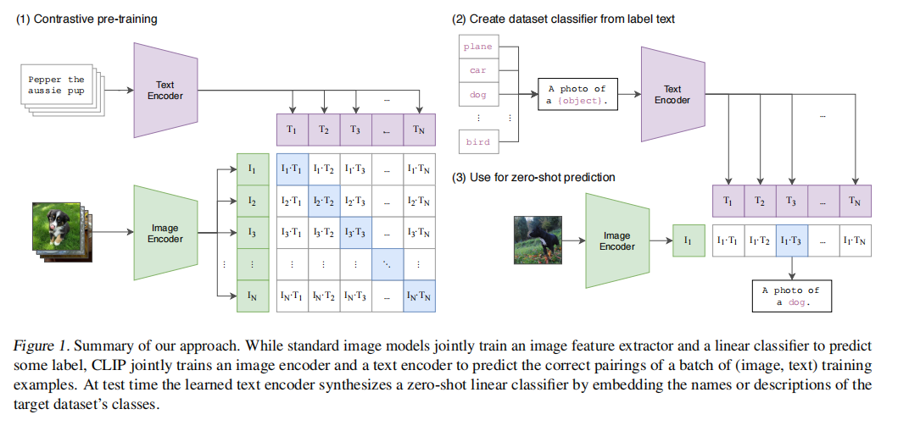

*论文 Figure 1：CLIP 的核心设计。左：对比预训练——同时训练图像编码器和文本编码器，让配对的图文向量靠近、不配对的远离。右：零样本推理——用文本描述替代传统标签，实现零样本分类。*

---

**原文：**

> We study the performance of this approach by benchmarking on over 30 different existing computer vision datasets, spanning tasks such as OCR, action recognition in videos, geo-localization, and many types of fine-grained object classification. The model transfers non-trivially to most tasks and is often competitive with a fully supervised baseline without the need for any dataset specific training. For instance, we match the accuracy of the original ResNet-50 on ImageNet zero-shot without needing to use any of the 1.28 million training examples it was trained on.

**翻译：**

> 我们通过在 30 多个现有计算机视觉数据集上进行基准测试来研究该方法的性能，这些数据集涵盖 OCR、视频动作识别、地理定位以及多种细粒度物体分类等任务。模型在大多数任务上都能进行非平凡的迁移，并且在没有使用任何数据集特定训练的情况下，通常能与全监督基线模型相媲美。例如，我们在 ImageNet 上以零样本方式匹配了原始 ResNet-50 的准确率，而无需使用它所训练的 128 万张训练样本中的任何一张。

**大白话：**

🎯 这是 CLIP 最震撼的结果：**不靠任何 ImageNet 标注数据，零样本的 CLIP 在 ImageNet 上的准确率和 ResNet-50（用 128 万张标注图训练的）持平**。而且 CLIP 不只会分类——它还在 OCR（看图识字）、视频动作识别、地理位置识别等 30 多个数据集上都展示了强大的零样本能力。这说明 CLIP 学到的是真正的通用视觉理解，而不是某个特定数据集的"套路"。

---

## 一、引言与动机（1. Introduction and Motivating Work）

### 1.1 NLP 革命的启示

**原文：**

> Pre-training methods which learn directly from raw text have revolutionized NLP over the last few years. Task-agnostic objectives such as autoregressive and masked language modeling have scaled across many orders of magnitude in compute, model capacity, and data, steadily improving capabilities.

**翻译：**

> 直接从原始文本学习的预训练方法在过去几年中彻底改变了自然语言处理。自回归和掩码语言建模等任务无关目标在计算量、模型容量和数据规模上跨越了多个数量级，持续提升了能力。

**大白话：**

CLIP 的灵感其实来自 NLP（自然语言处理）。BERT、GPT 这些模型证明了：只要在大规模文本上做预训练（比如让模型填空、预测下一个词），模型就能学到通用的语言理解能力，然后零样本迁移到各种下游任务。CLIP 想的就是——**能不能把这一套搬到视觉领域？** 用互联网上海量的图文对来做预训练，让模型学会通用的视觉理解。

---

### 1.2 为什么视觉领域还没被"革命"？

**原文：**

> These results suggest that the aggregate supervision accessible to modern pre-training methods within web-scale collections of text surpasses that of high-quality crowd-labeled NLP datasets. However, in other fields such as computer vision it is still standard practice to pre-train models on crowd-labeled datasets such as ImageNet. Could scalable pre-training methods which learn directly from web text result in a similar breakthrough in computer vision?

**翻译：**

> 这些结果表明，现代预训练方法通过大规模网络文本获得的聚合监督，已经超过了高质量众包标注的 NLP 数据集。然而，在计算机视觉等其他领域，在 ImageNet 等众包标注数据集上预训练模型仍然是标准做法。直接从网络文本学习的可扩展预训练方法能否在计算机视觉领域带来类似的突破？

**大白话：**

NLP 领域已经不用人工标注了——用网上现成的文本就行，规模是碾压级的。但视觉领域呢？大家还在用 ImageNet 那 1000 类人工标注来预训练。CLIP 论文的核心问题就是：**视觉领域能不能也直接用网络上的文本做监督，跳过人工标注这一步？** 如果 NLP 能，视觉也应该能。

---

### 1.3 弱监督的历史演进

**原文：**

> Over 20 years ago Mori et al. (1999) explored improving content based image retrieval by training a model to predict the nouns and adjectives in text documents paired with images... Joulin et al. (2016) modernized this line of work and demonstrated that CNNs trained to predict words in image captions learn useful image representations.

**翻译：**

> 20 多年前，Mori 等人（1999）探索了通过训练模型预测与图像配对的文本文档中的名词和形容词来改进基于内容的图像检索……Joulin 等人（2016）将这一研究方向现代化，证明训练 CNN 预测图像标题中的单词可以学到有用的图像表示。

**大白话：**

用文本监督来训练视觉模型这个 idea 其实不新鲜——20 多年前就有人干了。但以前的方法效果不好，比如 2017 年的 Visual N-Grams 在 ImageNet 上零样本只有 11.5% 的准确率，跟瞎猜差不多（ImageNet 1000 类随机猜也就 0.1%）。那 CLIP 凭什么能做成功？答案就一个字——**规模（Scale）**。

---

### 1.4 规模是关键差异

**原文：**

> A crucial difference between these weakly supervised models and recent explorations of learning image representations directly from natural language is scale. While Mahajan et al. (2018) and Kolesnikov et al. (2019) trained their models for accelerator years on millions to billions of images, VirTex, ICMLM, and ConVIRT trained for accelerator days on one to two hundred thousand images. In this work, we close this gap and study the behaviors of image classifiers trained with natural language supervision at large scale.

**翻译：**

> 这些弱监督模型与最近直接从自然语言学习图像表示的探索之间的关键区别在于规模。Mahajan 等人（2018）和 Kolesnikov 等人（2019）用数百万到数十亿张图像训练了数年的加速器时间，而 VirTex、ICMLM 和 ConVIRT 只用一到二十万张图像训练了数天的加速器时间。在这项工作中，我们弥补了这一差距，并研究了在大规模自然语言监督下训练的图像分类器的行为。

**大白话：**

🎯 这段揭示了 CLIP 最核心的秘密——规模碾压一切。之前用文本监督的方法之所以不行，是因为大家都在用小数据集（10-20 万张图），训练几天就完了。而那些用 Instagram 标签的弱监督方法效果好，是因为用了千万到亿级别的数据。CLIP 做的就是把"自然语言监督"和"超大规模数据"结合起来：4 亿图文对 + 大规模 GPU 训练 = 效果质变。

**通俗类比**：10 万张图就像一本小字典，4 亿张图像百科全书。让模型看字典和看百科全书，学到的东西天差地别。

---

### 1.5 CLIP 的设计与发现

**原文：**

> Enabled by the large amounts of publicly available data of this form on the internet, we create a new dataset of 400 million (image, text) pairs and demonstrate that a simplified version of ConVIRT trained from scratch, which we call CLIP, for Contrastive Language-Image Pre-training, is an efficient method of learning from natural language supervision.

**翻译：**

> 借助互联网上大量公开可用的此类数据，我们创建了一个包含 4 亿（图像，文本）对的新数据集，并证明从头训练的一个简化版 ConVIRT——我们称之为 CLIP（对比语言-图像预训练）——是一种从自然语言监督中学习的高效方法。

**大白话：**

CLIP = Contrastive Language-Image Pre-training。名字本身就是方法论：**对照着语言和图像做预训练**。它不是凭空发明的，而是基于前人的 ConVIRT 方法做了简化，然后放到超大规模数据上训练。关键词：simplified（简化）+ large scale（大规模）。论文在引言里就透露了一个重要哲学——**方法不需要多复杂，规模够了，简单方法也能出奇迹**。

---

### 1.6 缩放规律与涌现能力

**原文：**

> We study the scalability of CLIP by training a series of eight models spanning almost 2 orders of magnitude of compute and observe that transfer performance is a smoothly predictable function of compute. We find that CLIP, similar to the GPT family, learns to perform a wide set of tasks during pre-training including OCR, geo-localization, action recognition, and many others.

**翻译：**

> 我们通过训练跨越近两个数量级计算量的 8 个模型系列来研究 CLIP 的可扩展性，并观察到迁移性能是计算量的平滑可预测函数。我们发现 CLIP 与 GPT 系列类似，在预训练过程中学会了执行广泛的任务，包括 OCR、地理定位、动作识别等多种能力。

**大白话：**

🎯 CLIP 有一个和 GPT 家族一样的特性：**计算量增大 → 性能可预测地提升**。给 4 倍的计算量，零样本准确率就会按一定规律上升。而且 CLIP 在训练过程中自然涌现了各种能力——没人专门教它做 OCR（看图识字），但它自己学会了。这是因为训练数据里本来就是各种各样的图文对：有人名和脸、地标和地名、文字截屏、体育动作描述等等。数据的多样性带来了能力的多样性。

---

### 1.7 鲁棒性发现

**原文：**

> We additionally find that zero-shot CLIP models are much more robust than equivalent accuracy supervised ImageNet models which suggests that zero-shot evaluation of task-agnostic models is much more representative of a model's capability.

**翻译：**

> 我们还发现零样本 CLIP 模型比同等精度的监督 ImageNet 模型具有更强的鲁棒性，这表明对任务无关模型的零样本评估更能代表模型的能力。

**大白话：**

🎯 一个非常反直觉的发现：两个模型在 ImageNet 上准确率一样（比如都是 76%），一个是零样本 CLIP，一个是用 ImageNet 全监督训练的。把它们拿去测试其他数据分布（比如素描图、自然场景图），CLIP 的表现远好于监督模型。为什么？因为监督模型学会了"在 ImageNet 分布上作弊"（利用一些数据集特有的假关联，比如草地上的一定是狗），而 CLIP 没见过 ImageNet 的训练集，学的才是真正的通用视觉理解。

---

## 二、方法（2. Approach）

### 2.1 自然语言监督（Natural Language Supervision）

**原文：**

> At the core of our approach is the idea of learning perception from supervision contained in natural language... We emphasize that what is common across this line of work is not any of the details of the particular methods used but the appreciation of natural language as a training signal. All these approaches are learning from natural language supervision.

**翻译：**

> 我们方法的核心是从自然语言中包含的监督信号中学习感知……我们要强调的是，这类工作的共同点不在于任何具体方法的技术细节，而在于认识到自然语言可以作为一种训练信号。所有这些方法都是从自然语言监督中学习。

**大白话：**

整篇论文的方法可以归结为一句话：**把互联网上的文字当作免费标签来训练视觉模型**。以前你需要雇人标注"这是一只猫""这是一只狗"，现在你直接从网上爬"一只橘猫躺在沙发上.jpg" + 配文"my orange cat sleeping on the sofa"，文本本身就是标签，而且信息量远超单一类别名。

---

**原文：**

> Learning from natural language has several potential strengths over other training methods. It's much easier to scale natural language supervision compared to standard crowd-sourced labeling for image classification since it does not require annotations to be in a classic "machine learning compatible format"... Instead, methods which work on natural language can learn passively from the supervision contained in the vast amount of text on the internet. Learning from natural language also has an important advantage over most unsupervised or self-supervised learning approaches in that it doesn't "just" learn a representation but also connects that representation to language which enables flexible zero-shot transfer.

**翻译：**

> 从自然语言中学习相比其他训练方法有几个潜在优势。与标准的众包标注相比，自然语言监督更容易扩展，因为它不需要标注是经典的"机器学习兼容格式"……相反，基于自然语言的方法可以被动地从互联网上大量文本中包含的监督信号中学习。从自然语言中学习与大多数无监督或自监督学习方法相比还有一个重要优势：它不仅"仅仅"学习表示，还将该表示与语言连接起来，从而实现了灵活的零样本迁移。

**大白话：**

这段总结了自然语言监督的三大优势：

1. **可扩展（Scalable）**：互联网上的图文对是无限的，不需要花钱请人标注。你不需要定义"什么是猫"——网友已经帮你写了"我家猫今天又打翻花盆了"
2. **被动学习（Passive Learning）**：不需要设计精巧的标注任务，文本天然附在图片旁边，爬就完事了
3. **连接语言**：🎯 自监督学习方法（如 SimCLR、MoCo）只是学了一个"好用"的图像特征，但这个特征和人类语义是割裂的——你没法告诉模型"帮我找哈士奇"。CLIP 学的特征直接连到语言上——你说"哈士奇"，它就知道往哪个方向找。这让零样本迁移成为可能。

---

### 2.2 构建超大规模数据集（Creating a Sufficiently Large Dataset）

**原文：**

> A major motivation for natural language supervision is the large quantities of data of this form available publicly on the internet. Since existing datasets do not adequately reflect this possibility, considering results only on them would underestimate the potential of this line of research. To address this, we constructed a new dataset of 400 million (image, text) pairs collected from a variety of publicly available sources on the Internet.

**翻译：**

> 自然语言监督的一个主要动机是互联网上公开可用的此类数据数量巨大。由于现有数据集不能充分反映这种可能性，仅在它们上考虑结果会低估这一研究方向的潜力。为了解决这个问题，我们从互联网上各种公开来源构建了一个包含 4 亿（图像，文本）对的新数据集。

**大白话：**

现有的图文数据集太小了——MS-COCO 只有约 10 万张图，Visual Genome 也是 10 万量级。靠这么点数据根本体现不出自然语言监督的威力——就像你用一滴水来测试水龙头的出水能力。所以 OpenAI 自己造了一个超级数据集 WIT（WebImageText），4 亿图文对，规模碾压所有前人。

---

**原文：**

> To attempt to cover as broad a set of visual concepts as possible, we search for (image, text) pairs as part of the construction process whose text includes one of a set of 500,000 queries. We approximately class balance the results by including up to 20,000 (image, text) pairs per query. The resulting dataset has a similar total word count as the WebText dataset used to train GPT-2. We refer to this dataset as WIT for WebImageText.

**翻译：**

> 为了尽可能覆盖广泛的视觉概念，我们在构建过程中搜索其文本包含 50 万个查询词之一的（图像，文本）对。我们通过每个查询最多包含 20,000 个（图像，文本）对来大致平衡类别。最终数据集的总词数与用于训练 GPT-2 的 WebText 数据集相似。我们将此数据集称为 WIT（WebImageText）。

**大白话：**

🎯 WIT 数据集是怎么造的？不是随便爬——先选 50 万个查询词（覆盖英文维基百科的所有常用词和词对），然后每个查询词爬最多 2 万张图。这就保证了数据集的多样性和覆盖面，从"量子力学"到"炒鸡蛋"都包含了。每个查询词最多 2 万对是为了**大致类别均衡**——避免"猫"有几百万张而"犰狳"只有 3 张。最终数据量和 GPT-2 的训练文本在一个量级——OpenAI 的哲学就是数据规模说话。

---

📎 **延伸阅读：从 CLIP 的数据均衡，到大模型的"马嘉祺事件"**

这里讨论的数据不均衡问题，在 2026 年有一个极其生动的现实案例——MiniMax 大模型的"马嘉祺事件"（[官方技术报告](https://www.minimaxi.com/blog/sparse-token-forgetting-investigation)）。

**事情经过**：用户发现 MiniMax M2 系列模型虽然能正确回答"马嘉祺是时代少年团的队长"，但**永远无法在输出中生成"嘉祺"这两个字**——就像模型"认识他但喊不出他的名字"。随后社区还发现其他低频词（如"王郸""无痛人流""地税"等）也存在类似问题。

**根因**：问题出在 SFT（有监督微调）阶段的数据不均衡。预训练阶段，"嘉祺"这个 token 在大量互联网语料中出现过，模型学会了它的语义——"认识"。但到了 SFT 阶段，训练数据中"嘉祺"这个词出现不足 5 次（而"猫"出现了几万次）。**语言模型的输出层（`lm_head`）在微调过程中，低频 token 对应的权重向量发生了漂移**——模型仍然"理解"它，但在生成时被近邻的高频 token 替代了（比如"嘉祺"的向量漂到了"祺"和"嘉"这两个独立字的向量附近，生成时就只能分别输出）。

这和 CLIP 面临的"犰狳只有 3 张图"是**完全同构的问题**，只是从图文空间转移到了 token 空间：

| | CLIP 面临的问题 | MiniMax 马嘉祺事件 |
|---|---|---|
| **什么不均衡** | 图文对按类别不均衡 | token 在训练数据中的出现频率不均衡 |
| **低频对象** | "犰狳"只有 3 张图 | "嘉祺"这个 token 出现不足 5 次 |
| **后果** | 模型不认识稀有类别 | 模型"理解"但"说不出来" |
| **修复思路** | 限制每个查询词最多 2 万对 | 补充全词表覆盖的合成数据，确保每个 token 都有最低生成频率 |

**对 CLIP 的启发**：CLIP 在数据集构造阶段就主动做了均衡（每个查询词上限 2 万对），这是**预防性**的。而 MiniMax 是在问题暴露后才做**补救性**的数据补充。OpenAI 的远见在于——他们在设计数据 pipeline 时就意识到"不同类别的样本数不能差太多"。这种数据工程的素养，也是我们学习多模态模型时必须建立的一个意识。

MiniMax 的修复方案也很巧妙：他们在 SFT 数据中混入了一小批"覆盖全词表"的合成数据（让模型逐字复读每个 token），以极低的成本为每个 token 建立了一个"生成频率下限"，最终将日语 token 的退化率从 29.7% 降到了 0。

---

### 2.3 选择高效的预训练方法（Selecting an Efficient Pre-Training Method）

**原文：**

> State-of-the-art computer vision systems use very large amounts of compute. Mahajan et al. (2018) required 19 GPU years to train their ResNeXt101-32x48d and Xie et al. (2020) required 33 TPUv3 core-years to train their Noisy Student EfficientNet-L2. When considering that both these systems were trained to predict only 1000 ImageNet classes, the task of learning an open set of visual concepts from natural language seems daunting. In the course of our efforts, we found training efficiency was key to successfully scaling natural language supervision and we selected our final pre-training method based on this metric.

**翻译：**

> 最先进的计算机视觉系统使用非常大的计算量。Mahajan 等人（2018）需要 19 个 GPU 年训练他们的 ResNeXt101-32x48d，Xie 等人（2020）需要 33 个 TPUv3 核心年训练他们的 Noisy Student EfficientNet-L2。考虑到这些系统都只是被训练来预测 1000 个 ImageNet 类别，从自然语言中学习开放的视觉概念集合的任务似乎令人生畏。在我们的努力过程中，我们发现训练效率是成功扩展自然语言监督的关键，我们基于这个指标选择了最终的预训练方法。

**大白话：**

如果用低效的方法，训练 CLIP 需要的计算量可能大到无法承受。光是预测 ImageNet 的 1000 个类就要几十个 GPU 年，那要预测"任意文本描述"该要多少？所以**训练效率是成败关键**——高效的方法才可能规模化。论文在这里揭示了一个重要的工程哲学：选择方法的标准首先是"算得快不快"，然后才是"效果好一点还是差一点"。

---

**原文（Figure 2 相关——为什么放弃预测式而选择对比式）：**

> Our initial approach, similar to VirTex, jointly trained an image CNN and text transformer from scratch to predict the caption of an image. However, we encountered difficulties efficiently scaling this method. In Figure 2 we show that a 63 million parameter transformer language model learns to recognize ImageNet classes three times slower than a much simpler baseline that predicts a bag-of-words encoding of the same text.

**翻译：**

> 我们最初的方法类似于 VirTex，联合训练一个图像 CNN 和文本 Transformer 从零开始预测图像的标题。然而，我们在有效扩展这种方法时遇到了困难。在图 2 中，我们展示了一个 6300 万参数的 Transformer 语言模型识别 ImageNet 类别的速度比预测相同文本的 Bag-of-Words 编码的简单基线慢 3 倍。

**大白话：**

🎯 论文试了三种预训练方式，效率差异巨大：

| 方法 | 做法 | 相对效率 |
|------|------|---------|
| Transformer 语言模型 | 逐词预测整个 caption | 基准线（最慢） |
| Bag-of-Words 预测 | 预测文本的词袋编码（不关心词语顺序，只关心出现了哪些词） | 快 3 倍 |
| **对比学习（CLIP）** | 只判断图文是否配对 | **再快 4 倍（共 12 倍于基线）** |

为什么对比学习最高效？想象一下——你看到一张日落照片，10 个人可能用 10 种不同的文字描述它："beautiful sunset"、"sun going down over ocean"、"golden hour sky"、"夕阳西下"……预测式方法要求模型精准预测具体用了哪个词，这太难了，而且对模型理解能力的要求过高。对比学习只要求判断"这段话是不是在说这张图"——难度低得多，因此学得更快。论文的智慧就在于选择了**更容易的代理任务**。

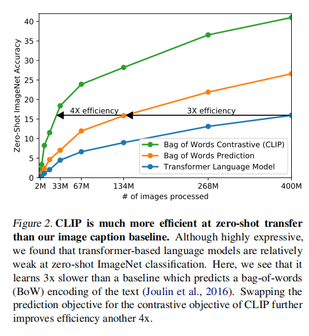

*论文 Figure 2：Transformer 语言模型（预测式，最慢）→ Bag-of-Words 预测（快 3 倍）→ 对比学习（再快 4 倍）。选择更容易的代理任务是成功的关键。*

---

**原文（对比学习的具体机制——这是 CLIP 最核心的段落）：**

> Given a batch of N (image, text) pairs, CLIP is trained to predict which of the N × N possible (image, text) pairings across a batch actually occurred. To do this, CLIP learns a multi-modal embedding space by jointly training an image encoder and text encoder to maximize the cosine similarity of the image and text embeddings of the N real pairs in the batch while minimizing the cosine similarity of the embeddings of the N² − N incorrect pairings. We optimize a symmetric cross entropy loss over these similarity scores.

**翻译：**

> 给定一批 N 个（图像，文本）对，CLIP 被训练来预测在一个批次中 N × N 种可能的（图像，文本）配对中哪些实际发生了。为此，CLIP 通过联合训练图像编码器和文本编码器来学习一个多模态嵌入空间，最大化 N 个真实配对的图像和文本嵌入之间的余弦相似度，同时最小化 N² − N 个错误配对的嵌入之间的余弦相似度。我们优化这些相似度分数上的对称交叉熵损失。


**大白话：**

🎯 这是 CLIP 训练的核心逻辑——理解它就理解了整篇论文：

1. 一个 batch 有 N 张图和 N 段文本（一一配对，比如 batch=32768）
2. 构造一个 N×N 的相似度矩阵（32768×32768 ≈ 10 亿个格子！）
3. 对角线上的格子 = 正确配对（图1配文1，图2配文2...），应该相似度最高
4. 非对角线的 N²-N 个格子 = 错误配对，应该相似度最低
5. **对称损失**：既从图找文（给定图，从 N 段文字中找到对的），也从文找图（给定文字，从 N 张图中找到对的），两个方向的损失取平均

为什么是对称的？因为图文匹配是双向的——"这张图说的是这段话"和"这段话描述的是这张图"是同一个事实，两个方向约束让学习更稳定。

---

**原文（关键简化——CLIP 为什么比 SimCLR 更简单）：**

> We train CLIP from scratch without initializing the image encoder with ImageNet weights or the text encoder with pre-trained weights. We remove the non-linear projection between the representation and the contrastive embedding space, a change which was introduced by Bachman et al. (2019) and popularized by Chen et al. (2020b). We use only a linear projection to map from each encoder's representation to the multi-modal embedding space. We did not notice a difference in training efficiency between the two versions and speculate that non-linear projections may be co-adapted with details of current image only self-supervised representation learning methods.

**翻译：**

> 我们从零开始训练 CLIP，不使用 ImageNet 权重初始化图像编码器，也不使用预训练权重初始化文本编码器。我们移除了表示与对比嵌入空间之间的非线性投影——这一改变由 Bachman 等人（2019）引入，由 Chen 等人（2020b）推广。我们只使用线性投影将每个编码器的表示映射到多模态嵌入空间。我们没有注意到两个版本之间的训练效率差异，推测非线性投影可能与当前仅图像的自监督表示学习方法的细节共同适应。

**大白话：**

和 SimCLR 比，CLIP 的简化体现在：

1. **不要非线性投影头**——SimCLR 在编码器后加了一个 MLP（隐藏层+ReLU），推理时扔掉。CLIP 发现这纯属多此一举——线性映射就够了。为什么？因为 SimCLR 是在"同一个图像的两种增强"之间做对比，同一张照片旋转一下还是同一张，这需要一些非线性来"忘记"增强带来的噪声。而 CLIP 的图像和文本天然来自不同模态，本身就是不同分布，线性映射已经足够区分。

2. **数据增强极简**——只做随机裁剪（Random Crop），不做颜色抖动、高斯模糊等复杂增强。因为 CLIP 不需要像自监督那样从同一张图中制造"两个不同视角"。

3. **Temperature τ 设为可学习参数**——初始化为 0.07（即 exp(t) = 1/0.07 ≈ 14.3），让模型自己调整 softmax 的锐度。

4. **从零开始训练**——图像编码器不用 ImageNet 预训练权重，文本编码器不用 GPT/BERT 预训练。完完全全的白纸一张，证明对比学习本身就足够强大。

---

**原文（Figure 3 伪代码——必背！）：**

```numpy
# CLIP 核心伪代码（论文 Figure 3）
# image_encoder - ResNet or Vision Transformer
# text_encoder  - CBOW or Text Transformer
# I[n, h, w, c] - minibatch of aligned images
# T[n, l]       - minibatch of aligned texts
# W_i[d_i, d_e] - learned proj of image to embed
# W_t[d_t, d_e] - learned proj of text to embed
# t             - learned temperature parameter

# extract feature representations of each modality
I_f = image_encoder(I)       # [n, d_i]
T_f = text_encoder(T)        # [n, d_t]

# joint multimodal embedding [n, d_e]
I_e = l2_normalize(np.dot(I_f, W_i), axis=1)
T_e = l2_normalize(np.dot(T_f, W_t), axis=1)

# scaled pairwise cosine similarities [n, n]
logits = np.dot(I_e, T_e.T) * np.exp(t)

# symmetric loss function
labels = np.arange(n)
loss_i = cross_entropy_loss(logits, labels, axis=0)
loss_t = cross_entropy_loss(logits, labels, axis=1)
loss   = (loss_i + loss_t)/2
```

**大白话（逐行解释）：**

1. **第 1-2 行**：分别把图像和文本输进各自的编码器，得到原始特征。图像编码器输出 768 维（ViT-B），文本编码器输出 512 维
2. **第 3-4 行**：用可学习的投影矩阵把特征压到同一个维度（d_e），然后 **L2 归一化**让向量长度变成 1。这一步极其关键——归一化后点积 = 余弦相似度，有界在 [-1,1]，数值稳定
3. **第 5 行**：算 N×N 相似度矩阵，乘以 exp(t) 做温度缩放。t 越大 → softmax 越均匀 → 对所有负样本一视同仁；t 越小 → softmax 越尖锐 → 重点关注最难区分的负样本
4. **第 6-8 行**：对称交叉熵。labels = [0,1,2,...,N-1]，即对角线是正确匹配。两个方向的 loss 取平均

> 🎯 **面试/考试高频考点**：这段伪代码请熟读背诵，理解每一步在做什么、为什么这样做。

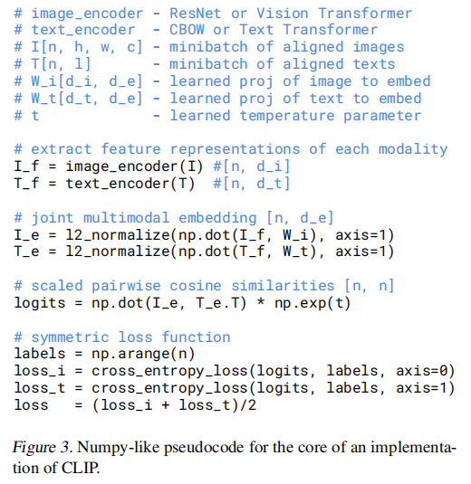

*论文 Figure 3：CLIP 核心训练的 Numpy 风格伪代码——对称交叉熵损失在 N×N 相似度矩阵上优化。*

---

### 2.4 模型架构选择与缩放（Choosing and Scaling a Model）

**原文：**

> We consider two different architectures for the image encoder. For the first, we use ResNet-50 as the base architecture for the image encoder due to its widespread adoption and proven performance. We make several modifications... using the ResNet-D improvements from He et al. (2019) and the antialiased rect-2 blur pooling from Zhang (2019). We also replace the global average pooling layer with an attention pooling mechanism... For the second architecture, we experiment with the recently introduced Vision Transformer (ViT).

**翻译：**

> 我们考虑了两种不同的图像编码器架构。对于第一种，我们使用 ResNet-50 作为图像编码器的基础架构，因为它被广泛采用且性能经过验证。我们做了几项修改……使用 He 等人（2019）的 ResNet-D 改进和 Zhang（2019）的抗锯齿 rect-2 模糊池化。我们还将全局平均池化层替换为注意力池化机制……对于第二种架构，我们实验了最近引入的 Vision Transformer（ViT）。

**大白话：**

图像编码器有两个选择：

| 编码器类型 | 具体型号 | 关键改进 |
|-----------|---------|---------|
| ResNet 系列 | RN50 / RN101 / RN50x4 / RN50x16 / RN50x64 | 加了 Attention Pooling（用注意力机制代替简单的全局平均池化）+ 抗锯齿模糊池化 |
| Vision Transformer | ViT-B/32 / ViT-B/16 / ViT-L/14 | 在 patch embedding 和 position embedding 合并后加了额外的 LayerNorm |

RN50x4 意思是宽度×4、计算量≈4×RN50。缩放策略是**等比例增加宽度、深度和分辨率**（参考 EfficientNet 的思路），而不是只加一个维度。

最终结论：**ViT 的计算效率比 ResNet 高约 3 倍**——同样的计算量，ViT 学到的特征更好。这在论文 Figure 10 中清晰可见。

---

**原文（文本编码器设计）：**

> The text encoder is a Transformer with the architecture modifications described in Radford et al. (2019). As a base size we use a 63M-parameter 12-layer 512-wide model with 8 attention heads... The text sequence is bracketed with [SOS] and [EOS] tokens and the activations of the highest layer of the transformer at the [EOS] token are treated as the feature representation of the text which is layer normalized and then linearly projected into the multi-modal embedding space.

**翻译：**

> 文本编码器是一个 Transformer，采用了 Radford 等人（2019）描述的架构修改。作为基础尺寸，我们使用一个 6300 万参数、12 层、512 维、8 个注意力头的模型……文本序列用 [SOS] 和 [EOS] token 括起来，Transformer 最高层在 [EOS] token 位置的激活值被用作文本的特征表示，经过层归一化后线性投影到多模态嵌入空间。

**大白话：**

🎯 文本编码器的几个关键细节（每个都可能成为考点）：

1. **架构**：12 层 Transformer，仅 6300 万参数——比 GPT-2 Small（1.24 亿）还小！说明 CLIP 对文本编码器的容量要求不高，因为文本侧的语义已经在 HF 预训练权重里了
2. **分词方式**：BPE（Byte Pair Encoding），词表大小 49,152
3. **最大长度**：76 个 token（论文说"出于计算效率考虑"）
4. **🎯 取 EOS 做句子表示**：用 [SOS]...[EOS] 包裹输入，取最后一层 EOS 位置的输出来代表整个句子。为什么不用 BERT 的 CLS？
   - CLIP 文本编码器的注意力是**因果掩码（causal mask）**——每个位置只能看到前面的 token
   - EOS 是序列末尾，能"看到"整个句子的所有 token
   - CLS（BERT 风格）需要双向注意力才有效，但 CLIP 为了兼容"用预训练语言模型初始化"（future work），保留了因果掩码设计
5. 文本编码器的宽度随 ResNet 宽度按比例缩放，但**深度从不缩放**——论文发现 CLIP 性能对文本编码器的容量不敏感，瓶颈在图像侧

---

### 2.5 训练细节（Training）

**原文：**

> We train a series of 5 ResNets and 3 Vision Transformers... We train all models for 32 epochs. We use the Adam optimizer with decoupled weight decay regularization applied to all weights that are not gains or biases, and decay the learning rate using a cosine schedule... We use a very large minibatch size of 32,768. Mixed-precision was used to accelerate training and save memory. To save additional memory, gradient checkpointing, half-precision Adam statistics, and half-precision stochastically rounded text encoder weights were used.

**翻译：**

> 我们训练了 5 个 ResNet 和 3 个 Vision Transformer 系列……所有模型都训练 32 个 epoch。我们使用 Adam 优化器，对非增益或偏置的所有权重应用解耦权重衰减正则化，并使用余弦调度衰减学习率……我们使用非常大的小批量大小 32,768。混合精度用于加速训练和节省内存。为节省额外内存，使用了梯度检查点、半精度 Adam 统计量和半精度随机舍入的文本编码器权重。

**大白话：**

🎯 CLIP 训练的超参和技巧一览：

| 超参/技巧 | 值 | 为什么这样设置 |
|-----------|-----|-------------|
| Epochs | 32 | 数据量太大（4 亿对），基本不会过拟合 |
| **Batch Size** | **32,768** | 🎯 核心！对比学习需要大量负样本，batch 越大，N²-N 个负样本就越多，对比信号越强 |
| 优化器 | Adam (β₁=0.9, β₂=0.98) | 标准选择，注意 β₂ 比默认 0.999 小，适应大规模训练 |
| 学习率衰减 | 余弦调度（Cosine Schedule） | 平滑衰减到接近 0 |
| 权重衰减 | 解耦式（AdamW 风格） | 不对 gain/bias 做衰减 |
| 混合精度 | bf16/fp16 | 省一半显存，几乎不掉精度 |
| 梯度检查点 | 是 | 用时间换空间——不存所有中间激活，反向传播时重算 |
| Temperature τ | 可学习，初始 0.07 | 自动调，限制不超过 log(100)（防止 softmax 过于尖锐导致训练不稳定） |
| 数据增强 | **仅随机裁剪** | 极简！和 SimCLR 形成鲜明对比（SimCLR 需要复杂的颜色抖动、模糊等） |

**训练资源消耗**：

| 模型 | GPU 数量 | 训练时长 |
|------|---------|---------|
| RN50x64（最大 ResNet） | 592 张 V100 | 18 天 |
| ViT-L/14（最大 ViT） | 256 张 V100 | 12 天 |
| ViT-L/14@336px | 256 张 V100 | +1 epoch（额外 1 天） |

ViT-L/14@336px 是论文中最强的模型——在基础 ViT-L/14 训练完后，把输入分辨率从 224 提升到 336，再训练一个 epoch。这类似于 FixRes 的 trick——更高分辨率意味着更多细节，但训练代价只增加了一个 epoch。

**相似度计算的分片（Sharding）**：由于 batch 大小为 32768，计算 N×N 的相似度矩阵（约 10 亿对）即使对 GPU 也是巨大的负担。论文采用了一个精妙的技巧：每个 GPU 只计算自己本地 batch 的嵌入与其他 GPU 嵌入之间的相似度子集，避免了全量 N×N 矩阵的显存开销。

---

## 三、实验（3. Experiments）

### 3.1 零样本迁移（Zero-Shot Transfer）

#### 3.1.1 动机——什么是"零样本"？

**原文：**

> In computer vision, zero-shot learning usually refers to the study of generalizing to unseen object categories in image classification. We instead use the term in a broader sense and study generalization to unseen datasets. We motivate this as a proxy for performing unseen tasks, as aspired to in the zero-data learning paper of Larochelle et al. (2008).

**翻译：**

> 在计算机视觉中，零样本学习通常指研究在图像分类中泛化到未见过的物体类别。我们则在更广泛的意义上使用这个术语，研究泛化到未见过的数据集。我们将其作为执行未见任务的代理来使用，正如 Larochelle 等人（2008）的零数据学习论文所追求的那样。

**大白话：**

CLIP 重新定义了"零样本"的含义：

- **传统零样本**：训练时见过猫和狗，测试时识别"哈士奇"（没见过的类别、但同一数据集）
- **CLIP 的零样本**：在 4 亿互联网图文对上训练后，直接去 CIFAR-10、ImageNet、Food101 等**完全没见过的数据集**上做分类

论文进一步把这个提升为**任务学习能力（task-learning capability）**的评测——模型在没有见过任何特定任务训练数据的情况下，能不能理解"你想让我干什么"并完成它。这比单纯的表示学习评测更进一步。

---

#### 3.1.2 CLIP 如何进行零样本分类

**原文：**

> CLIP is pre-trained to predict if an image and a text snippet are paired together in its dataset. To perform zero-shot classification, we reuse this capability. For each dataset, we use the names of all the classes in the dataset as the set of potential text pairings and predict the most probable (image, text) pair according to CLIP.

**翻译：**

> CLIP 被预训练来判断图像和文本片段在训练数据中是否配对。为了执行零样本分类，我们复用这一能力。对于每个数据集，我们使用数据集中所有类别的名称作为备选文本配对的集合，并预测 CLIP 认为最可能的（图像，文本）配对。

**大白话：**

🎯 零样本分类的完整步骤——以 CIFAR-10（10 个类）为例：

1. 把所有类别名变成句子：`"a photo of a airplane"`, `"a photo of a automobile"`, ..., `"a photo of a truck"`
2. 用**文本编码器**把 10 句话编码成 10 个向量（缓存起来，只需要算一次）
3. 用**图像编码器**把测试图片编码成 1 个向量
4. 算余弦相似度：图片向量和 10 个文本向量分别做归一化点积
5. 温度缩放 + softmax → 得到 10 个类别的概率分布
6. 取概率最高的类别 = 预测结果

本质上就是把传统分类器的「可学习权重矩阵 W」替换成了「文本编码器生成的文本嵌入」。这是一个**生成式分类器**——分类器的参数不是学出来的，而是根据任务描述动态生成的。

---

**原文（可解释性视角——CLIP 分类器就是一个"逻辑回归"）：**

> Note that this prediction layer is a multinomial logistic regression classifier with L2-normalized inputs, L2-normalized weights, no bias, and temperature scaling. When interpreted this way, the image encoder is the computer vision backbone which computes a feature representation for the image and the text encoder is a hypernetwork which generates the weights of a linear classifier based on the text specifying the visual concepts that the classes represent.

**翻译：**

> 注意，这个预测层是一个多项逻辑回归分类器，具有 L2 归一化的输入、L2 归一化的权重、无偏置和温度缩放。按这种方式理解，图像编码器是计算图像特征表示的计算机视觉骨干网络，而文本编码器是一个超网络，它根据指定类别所代表视觉概念的文本生成线性分类器的权重。

**大白话：**

这个视角非常精妙——把 CLIP 的零样本分类解构为传统分类器的三个组件：

- **Backbone（图像编码器）** = 特征提取器（和 ResNet 一样）
- **分类头（权重矩阵）** = 🎯 不是学出来的！是由**文本编码器根据类别名称实时生成的**
- **文本编码器** = 一个"超网络（Hypernetwork）"，输入类名，输出分类权重

这个设计的巧妙之处在于：传统分类器的类别数量是固定的（1000 类就是 1000 组权重），而 CLIP 的分类器可以在推理时**动态创建**——你给 3 个类名就生成 3 组权重，给 1000 个就生成 1000 组，零成本切换任务。

从这个角度看，**CLIP 预训练的每一步**都可以理解为：随机创建一个包含 32768 个类的小型分类数据集，每个类的定义就是一段自然语言文本，然后在这个"随机数据集"上训练一个 epoch。因为没有两个 step 的"数据集"完全相同，所以模型被迫学习通用的视觉-语言对应关系，而非任何特定分布的模式。

---

#### 3.1.3 与 Visual N-Grams 的初步对比

**原文：**

> The best CLIP model improves accuracy on ImageNet from a proof of concept 11.5% to 76.2% and matches the performance of the original ResNet-50 despite using none of the 1.28 million crowd-labeled training examples available for this dataset.

**翻译：**

> 最佳 CLIP 模型将 ImageNet 上的准确率从概念验证的 11.5% 提高到 76.2%，并匹配了原始 ResNet-50 的性能，尽管没有使用该数据集 128 万张众包标注训练样本中的任何一张。

**大白话：**

| 方法 | ImageNet 准确率 | 用了多少 ImageNet 标注数据 |
|------|:--------------:|:-------------------------:|
| Visual N-Grams (2017) | 11.5% | 0 |
| CLIP ViT-L/14@336px | **76.2%** | **0** |
| **ResNet-50（全监督）** | **76.2%** | **128 万张** |

同样的准确率，一个用 0 张 ImageNet 标注，一个用 128 万张。而且 CLIP 的 Top-5 准确率高达 95%，说明即使 Top-1 没猜对，正确答案大概率在 Top-5 里。另外 aYahoo 从 72.4% → 98.4%，SUN 从 23.0% → 58.5%，全面碾压。

论文也坦诚说这不是公平对比——CLIP 训练数据大 10 倍、模型算力大近 100 倍、total 训练算力可能大 1000 倍以上。但趋势是明确的：**把规模做大，量变引起质变**。

---

#### 3.1.4 Prompt 工程与集成（Prompt Engineering and Ensembling）

**原文：**

> A common issue is polysemy. When the name of a class is the only information provided to CLIP's text encoder it is unable to differentiate which word sense is meant due to the lack of context. In some cases multiple meanings of the same word might be included as different classes in the same dataset! This happens in ImageNet which contains both construction cranes and cranes that fly.

**翻译：**

> 一个常见问题是多义性。当类别的名称是提供给 CLIP 文本编码器的唯一信息时，由于缺乏上下文，它无法区分指的是哪个词义。在某些情况下，同一个词的多个含义可能作为不同的类别出现在同一个数据集中！ImageNet 就是如此，它既包含建筑起重机（construction cranes），也包含飞翔的鹤（cranes that fly）。

**大白话：**

🎯 "Crane" 这个词有两个不相关的意思——起重机和鹤。如果只用裸词 "crane" 做分类，CLIP 的文本编码器收到一个歧义词，根本不知道你指的是哪个——因为预训练时它看到的都是"a crane lifting steel beams"或"a crane standing in the water"这样有上下文的完整句子。

这就是 Prompt 工程出场的理由：给词加上上下文。

**问题根源**：CLIP 的预训练数据中，文字几乎都是完整的句子（"a cute dog playing in the park"），极少出现孤立的单个词。所以推理时给裸词（"dog"）会造成**分布偏移（distribution gap）**——训练时的输入和推理时的输入格式不一样。

**解决方案：Prompt 模板**

| 策略 | 示例 | ImageNet 准确率提升 |
|------|------|:-------------------:|
| 裸词（baseline） | `"crane"` | 基线 |
| 通用 Prompt | `"A photo of a crane."` | **+1.3%** |
| 任务定制 Prompt（宠物） | `"A photo of a {label}, a type of pet."` | 显著提升 |
| 任务定制 Prompt（食物） | `"A photo of {label}, a type of food."` | 显著提升 |
| 任务定制 Prompt（卫星图） | `"A satellite photo of a {label}."` | 显著提升 |
| 任务定制 Prompt（OCR） | `'"{label}"'`（加引号） | 显著提升 |
| **Prompt Ensemble（80 个模板取平均）** | 多个模板的文本嵌入在嵌入空间中取平均 | **额外 +3.5%** |

**为什么取平均在嵌入空间而不是概率空间？** 因为嵌入空间的平均只需要算一次然后缓存，概率空间需要每次都对每个模板算一遍 softmax。算一次缓存后，推理时和单个分类器的开销一样，几乎是**免费的精度提升**。

**Prompt 工程 + Ensemble 合计带来约 5% 的零样本分类提升**——相当于**把模型计算量翻 4 倍才能达到的收益**，却几乎不增加推理成本。这也是为什么后来 Stable Diffusion 等模型大量使用 prompt 工程。

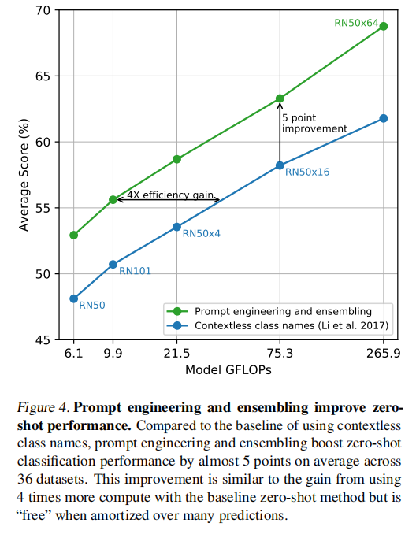

*论文 Figure 4：左边是标准零样本分类（裸词），右边是 Prompt 工程 + Ensemble（多个模板嵌入取平均）。几乎免费的 5% 准确率提升。*

---

#### 3.1.5 零样本性能深度分析

**原文（Figure 5——零样本 CLIP vs ResNet-50 逻辑回归，27 数据集对比）：**

> Zero-shot CLIP outperforms this baseline slightly more often than not and wins on 16 of the 27 datasets... On fine-grained classification tasks, we observe a wide spread in performance. On two of these datasets, Stanford Cars and Food101, zero-shot CLIP outperforms logistic regression on ResNet-50 features by over 20% while on two others, Flowers102 and FGVCAircraft, zero-shot CLIP underperforms by over 10%.

**翻译：**

> 零样本 CLIP 在 27 个数据集中以微弱优势赢下 16 个……在细粒度分类任务上，我们观察到性能差异很大。在 Stanford Cars 和 Food101 这两个数据集上，零样本 CLIP 比 ResNet-50 特征的逻辑回归高出 20% 以上，而在 Flowers102 和 FGVCAircraft 上，零样本 CLIP 低 10% 以上。

**大白话：**

🎯 CLIP 在不同任务上的零样本表现差异巨大，能看出很多门道：

**CLIP 的强项**（远超 ResNet-50 linear probe）：

| 数据集 | CLIP 超越幅度 | 可能原因 |
|--------|:------------:|---------|
| STL10 | +34.8% | 数据集故意只给少量标签强调从无标注数据学习，CLIP 天然符合 |
| Stanford Cars | +28.9% | 网络上有大量车评、汽车论坛的图文对 |
| Country211 | +23.2% | 地理定位——地标照片天然配有位置文本 |
| Food101 | +22.5% | 食谱、美食博客满是食物图文 |
| Kinetics700 | +14.5% | 动作识别——自然语言中动词丰富，ImageNet 只有名词类 |
| UCF101 | +7.7% | 同上，动作类任务 CLIP 有天然优势 |

**CLIP 的弱项**（远不如 ResNet-50）：

| 数据集 | CLIP 落后幅度 | 可能原因 |
|--------|:------------:|---------|
| EuroSAT | -37.1% | 卫星图像——互联网上极少有卫星图+描述文本的组合 |
| KITTI Distance | -34.0% | 自动驾驶测距——完全超出网络图文对的覆盖范围 |
| PatchCamelyon | -19.5% | 病理组织切片——医学图文对几乎不存在 |
| GTSRB | -18.4% | 德国交通标志——互联网上少见 |
| CLEVRCounts | -18.2% | 数物体数量——对比学习不教这种系统性推理任务 |

**结论**：CLIP 的零样本能力完全取决于训练数据的覆盖范围。数据里有，它就会；数据里没有，它就懵。这不是真正的"理解"，而是海量数据下的**统计模式匹配**。论文自己也清楚这一点（见局限性部分）。

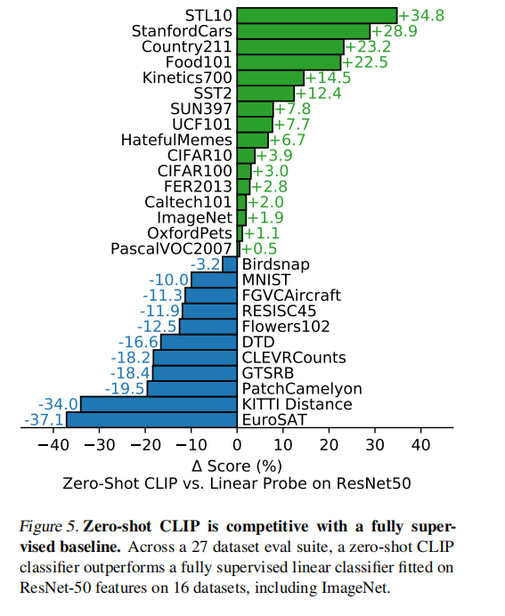

*论文 Figure 5：横轴是 27 个数据集，纵轴是 CLIP 相对 ResNet-50 linear probe 的准确率差值。绿色 = CLIP 胜，红色 = CLIP 败。*

---

**原文（Figure 6——零样本 vs 少样本，零样本 CLIP ≈ 4-shot 线性分类器）：**

> Zero-shot CLIP matches the performance of 4-shot logistic regression on the same feature space. This is likely due to an important difference between the zero-shot and few-shot approach. First, CLIP's zero-shot classifier is generated via natural language which allows for visual concepts to be directly specified ("communicated"). By contrast, "normal" supervised learning must infer concepts indirectly from training examples.

**翻译：**

> 零样本 CLIP 匹配了相同特征空间上 4-shot 逻辑回归的性能。这可能是因为零样本和少样本方法之间一个重要差异。首先，CLIP 的零样本分类器是通过自然语言生成的，这允许视觉概念被直接指定（"传达"）。相比之下，"普通"监督学习必须从训练样本中间接推断概念。

**大白话：**

🎯 一个令人震惊的发现：**零样本 CLIP ≈ 4-shot 线性分类器**。给模型看 4 张标注图片才能达到的准确率，CLIP 用一句话就达到了。

为什么语言比样本更高效？论文给出了一个深刻的解释：

- **零样本（语言）**：直接告诉你"这是哈士奇，长这样"——**概念被直接传达**
- **少样本（图片）**：给你 4 张哈士奇照片让你自己猜什么是哈士奇的共同特征——**概念需要被旁敲侧击地推断**

人类教小孩认识动物也是用语言（"这是狗狗"），而不是扔一堆照片让他/她自己总结。语言提供了**先验知识的高效传递通道**。当然，前提是你的语言描述能准确刻画视觉概念——这就是为什么 Prompt 工程如此重要。

**有效的少样本学习方法应该是什么样的？** 论文提出了一个方向：用 CLIP 的零样本分类器作为少样本学习的先验（prior），比如给学到的权重加一个向零样本权重靠拢的正则化项。但实验发现超参优化总是选择最强的正则化——最终几乎退化回零样本分类器。**如何优雅地结合零样本的先验和少样本的灵活性，仍然是开放问题。**

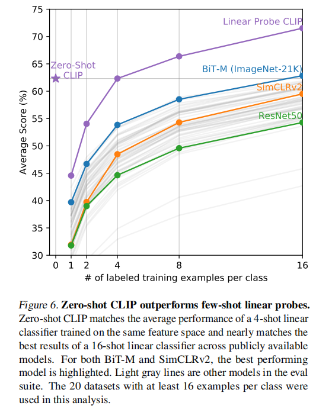

*论文 Figure 6：零样本 CLIP ≈ 每个类别看 4 张标注图片训练的线性分类器。语言比样本更高效。*

---

**原文（Figure 7——零样本的"等效数据量"）：**

> We find that zero-shot transfer can have widely varying efficiency per dataset from less than 1 labeled example per class to 184. Two datasets, Flowers102 and EuroSAT underperform one-shot models. Half of the datasets require less than 5 examples per class with a median of 5.4. However, the mean estimated data efficiency is 20.8 examples per class.

**翻译：**

> 我们发现零样本迁移在每个数据集上的效率差异很大，从每个类别不到 1 个标注样本到 184 个不等。两个数据集 Flowers102 和 EuroSAT 的性能不如单样本模型。一半的数据集需要每个类别不到 5 个样本，中位数为 5.4。然而，平均估计数据效率为每个类别 20.8 个样本。

**大白话：**

论文做了一件很有创意的事：估算"零样本 CLIP ≈ 每个类需要多少张标注图训练的线性分类器"。

- **最好情况**（STL10、CIFAR10 等）：零样本 CLIP 等价于用 >100 张/类的标注数据训练的分类器
- **最差情况**（Flowers102、EuroSAT）：零样本 CLIP 还不如用 1 张/类训练的 one-shot 分类器
- **中位数**：约 5.4 张/类——即零样本 CLIP 在大多数任务上 ≈ 每个类看了 5 张标注图的效果

这个"等效数据量"的概念很有用——它把零样本的语言监督效率量化成了传统监督学习的"标注数据等价量"。中位数 5.4 意味着文本描述提供的信息量大约等效于 5 张标注图片。考虑到文本是免费的而标注图片是昂贵的，CLIP 的性价比不言而喻。

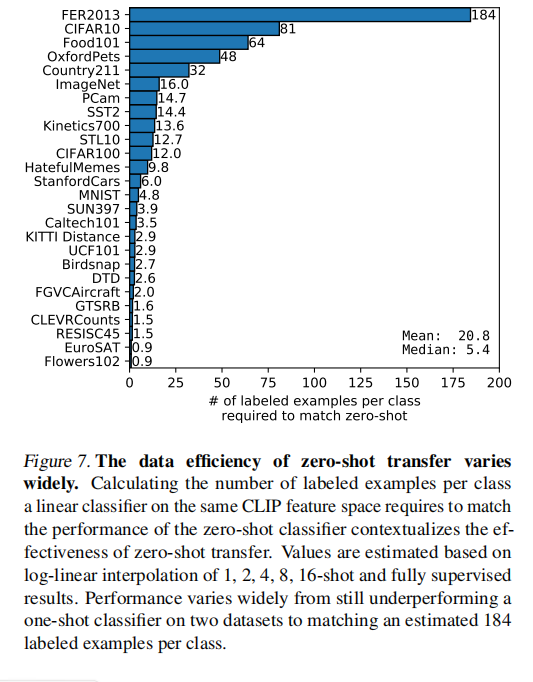

*论文 Figure 7：每个数据集的零样本 CLIP ≈ 每个类别需要多少标注样本训练的线性分类器。中位数约 5.4 张/类。*

---

**原文（Figure 8——零样本 vs 全监督上限）：**

> For most datasets, the performance of zero-shot classifiers still underperform fully supervised classifiers by 10% to 25%, suggesting that there is still plenty of headroom for improving CLIP's task-learning and zero-shot transfer capabilities.

**翻译：**

> 对于大多数数据集，零样本分类器的性能仍然比全监督分类器低 10% 到 25%，这表明 CLIP 的任务学习和零样本迁移能力仍有很大的提升空间。

**大白话：**

零样本 CLIP 虽然惊艳，但距离"完美"还有很大距离。拿 Linear Probe（用 CLIP 特征 + 全量标注数据训练）作为上界，零样本 CLIP 在各数据集上普遍低 10-25 个百分点。

**相关性分析**：零样本性能与 Linear Probe 性能的相关系数 r = 0.82（p < 10⁻⁶）——CLIP 特征好的任务，零样本也好；特征差的任务，零样本也差。这说明**零样本迁移能力的瓶颈主要在于特征质量，而非"怎么把文本转成分类器"这个机制**。

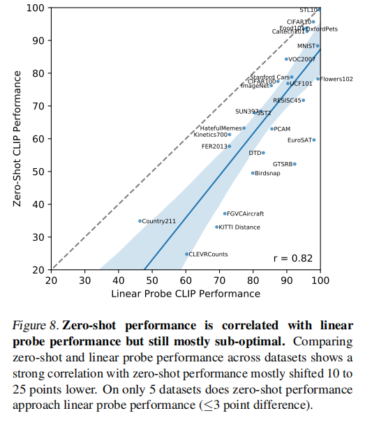

*论文 Figure 8：零样本 CLIP 距离全监督上限还有 10-25% 差距，但零样本与线性探针性能高度相关（r=0.82）。*

---

**原文（Figure 9——CLIP 的缩放定律）：**

> We plot the average error rate of the 5 ResNet CLIP models across 39 evaluations on 36 different datasets and find that a similar log-log linear scaling trend holds for CLIP across a 44x increase in model compute. While the overall trend is smooth, we found that performance on individual evaluations can be much noisier.

**翻译：**

> 我们绘制了 5 个 ResNet CLIP 模型在 36 个不同数据集上的 39 次评估的平均错误率，并发现类似的 log-log 线性缩放趋势在 CLIP 的 44 倍模型计算量增加范围内成立。虽然整体趋势是平滑的，但我们发现单个评估上的性能可能要嘈杂得多。

**大白话：**

CLIP 的性能遵循**对数-对数线性缩放定律（Log-Log Linear Scaling Law）**——计算量每翻 N 倍，错误率就以可预测的比例下降。论文图 9 很清晰：x 轴是模型计算量（log 尺度），y 轴是平均错误率（log 尺度），5 个 ResNet 模型几乎完美落在一条直线上。

**这意味着什么？**
- 你可以根据小模型的性能预测大模型的性能
- 给更多算力 = 确定性地获得更好性能
- 没有出现"瓶颈"或"性能饱和"的迹象——至少在 44 倍范围内
- 缩放定律是继续投入计算资源的理论支撑

但也要注意：虽然平均趋势平滑，单个数据集上的性能波动很大。模型变大了不一定在所有任务上都变好了——有些任务可能对模型容量不敏感，有些甚至变差。

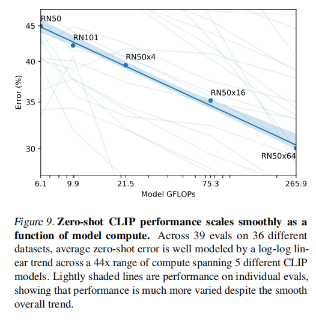

*论文 Figure 9：x 轴模型计算量（log），y 轴平均错误率（log）。5 个 ResNet 模型几乎完美落在一条直线上——计算量翻倍，性能可预测提升。*

---

### 3.2 表示学习（Representation Learning）

**原文（为什么用 Linear Probe 而不是 Fine-tuning）：**

> While the high performance of fine-tuning motivates its study for practical reasons, we still opt for linear classifier based evaluation for several reasons. Our work is focused on developing a high-performing task and dataset-agnostic pre-training approach. Fine-tuning, because it adapts representations to each dataset during the fine-tuning phase, can compensate for and potentially mask failures to learn general and robust representations during the pre-training phase.

**翻译：**

> 尽管微调的高性能促使人们出于实际原因研究它，但我们仍然选择基于线性分类器的评估，理由有几个。我们的工作专注于开发高性能、任务和数据集无关的预训练方法。微调因为在微调阶段针对每个数据集调整了表示，可以补偿并可能掩盖预训练阶段学习通用和鲁棒表示的失败。

**大白话：**

为什么用 Linear Probe（线性探针）而不是 Fine-tuning 来评测？

- **Fine-tuning 太灵活了**——它允许修改所有层的参数，即使预训练学得一塌糊涂，Fine-tune 也可以"补救"。这就像考砸了然后说"我可以重考"——评价的不是真实水平
- **Linear Probe 很诚实**——只允许学一个线性分类器放在预训练特征之上。特征本身不够好，分类器怎么学都白搭。这才能反映预训练阶段学到的特征质量
- **公平对比**：Fine-tuning 的超参空间太大了（learning rate、epochs、是否冻层……不同论文用了完全不同的 Fine-tuning 策略），很难公平比较。Linear Probe 的超参少得多（基本只需要调 L2 正则化系数），统一用 sklearn 的逻辑回归就能复现

一种简单理解：**Linear Probe 评测的是"特征有多好"，Fine-tuning 评测的是"模型有多灵活"。CLIP 关心的是前者。**

---

**原文（Figure 10——Linear Probe 结果，CLIP 超越所有现有模型）：**

> Our best overall model is a ViT-L/14 that is fine-tuned at a higher resolution of 336 pixels on our dataset for 1 additional epoch. This model outperforms the best existing model across this evaluation suite by an average of 2.6%. On this broader evaluation suite, the benefits of CLIP are more clear. All CLIP models, regardless of scale, outperform all evaluated systems in terms of compute efficiency. The improvement in average score of the best model over previous systems increases from 2.6% to 5%.

**翻译：**

> 我们最好的整体模型是 ViT-L/14，它在我们的数据集上以更高的 336 像素分辨率微调了一个额外的 epoch。该模型在这个评估套件上平均优于最佳现有模型 2.6%。在这个更广泛的评估套件上，CLIP 的优势更加明显。所有 CLIP 模型——无论规模——在计算效率方面都优于所有评估系统。最佳模型比先前系统的平均得分提升从 2.6% 增加到 5%。

**大白话：**

Linear Probe 的核心结果（论文图 10）：

| 对比维度 | 12 数据集套件（Kornblith et al.） | 27 数据集套件（更广泛） |
|---------|:-------------------------------:|:-----------------------:|
| CLIP vs 最佳 ImageNet 模型 | 领先 2.6% | 领先 5% |
| 小 CLIP (ResNet-50) 定位 | 超过 ImageNet-1K 训练的 ResNet，但不如 ImageNet-21K 训练的 BiT-M | — |
| ViT vs ResNet（同 CLIP 训练） | ViT 计算效率高约 3 倍 | 同样 |

**几个关键观察**：

1. **CLIP 在更广泛的数据集上优势更大**（5% vs 2.6%）——说明之前以 ImageNet 为中心的评测套件有**选择偏差**。ImageNet 相关的评测天然利好 ImageNet 训练的模型，不是公平比较

2. **自监督模型在更广泛的评测套件上表现更好**——SimCLRv2 在 12 数据集上不如 BiT-M，但在 27 数据集上反超。这说明自监督学习学到的特征更"通用"，而非局限在 ImageNet 的 1000 个名词类别

3. **按计算量归一化后，CLIP 全面碾压**——给定相同的推理算力（GFLOPs），CLIP 模型在所有数据量规模上都表现最优。这是衡量"性价比"的体现

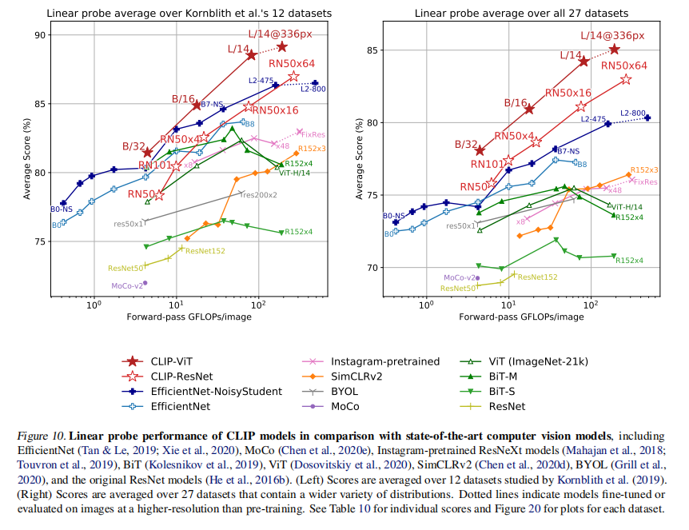

*论文 Figure 10：左：12 数据集套件，CLIP ViT-L 平均领先 2.6%。右：27 数据集套件，领先扩大到 5%。计算效率全面碾压。*

---

**原文（Figure 11——逐任务对比 CLIP vs Noisy Student EfficientNet-L2）：**

> CLIP outperforms the Noisy Student EfficientNet-L2 on 21 of the 27 datasets. CLIP improves the most on tasks which require OCR (SST2 and HatefulMemes), geo-localization and scene recognition (Country211, SUN397), and activity recognition in videos (Kinetics700 and UCF101).

**翻译：**

> CLIP 在 27 个数据集中的 21 个上优于 Noisy Student EfficientNet-L2。CLIP 在需要 OCR（SST2 和 HatefulMemes）、地理定位和场景识别（Country211、SUN397）以及视频动作识别（Kinetics700 和 UCF101）的任务上提升最大。

**大白话：**

逐任务对比——CLIP 在 21/27 数据集上超过当时最强的 ImageNet 模型（Noisy Student EfficientNet-L2）：

**CLIP 大幅领先的任务**：

| 任务 | CLIP 领先幅度 | 为什么 |
|------|:------------:|--------|
| SST2（情感分析 via OCR） | +23.6% | 文本截图中读文字——CLIP 有 OCR 能力 |
| Country211（地理定位） | +22.7% | 地标照片天然带位置文字 |
| HatefulMemes（仇恨表情包） | +18.8% | 需要同时理解图片和文字（OCR） |
| Stanford Cars（车型识别） | +15.9% | 网络上有海量车评图文 |
| GTSRB（交通标志） | +14.7% | 这种模式识别 CLIP 已有基础 |

**EfficientNet 仍然领先的任务**：

| 任务 | EfficientNet 领先 | 可能原因 |
|------|:-----------------:|---------|
| ImageNet | +3.0% | EfficientNet 就是在这个数据上训的，主场作战 |
| CLEVRCounts | +2.4% | 数数——非 CLIP 的强项 |
| CIFAR10/100 | +0.8-1.7% | 低分辨率，CLIP 没有做尺度增强 |

**一个有趣的推测**：GTSRB 上 CLIP 领先 14.7%，可能是因为 ImageNet 只有 1 个"交通标志"类，把所有标志混为一谈。ImageNet 训练的模型学会了忽略标志之间的细节差异，在需要细粒度区分时反而吃亏。这暗示 ImageNet 的类别设计（过于粗糙）可能在阻碍细粒度任务的迁移。

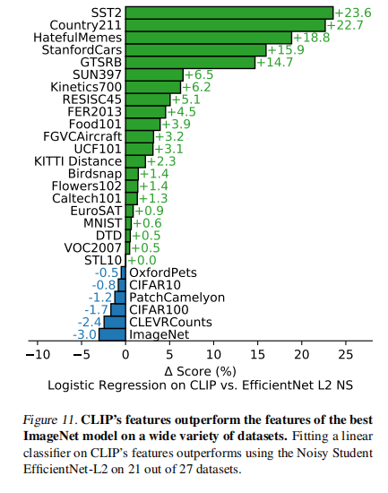

*论文 Figure 11：CLIP 在 27 个数据集中的 21 个上超越当时最强的 ImageNet 模型，尤其在 OCR、地理定位、动作识别上大幅领先。*

---

### 3.3 自然分布偏移下的鲁棒性（Robustness to Natural Distribution Shift）

**原文（问题背景）：**

> In 2015, it was announced that a deep learning model exceeded human performance on the ImageNet test set. However, research in the subsequent years has repeatedly found that these models still make many simple mistakes... A common theme of proposed explanations is that deep learning models are exceedingly adept at finding correlations and patterns which hold across their training dataset and thus improve in-distribution performance. However many of these correlations and patterns are actually spurious and do not hold for other distributions.

**翻译：**

> 2015 年，宣布深度学习模型在 ImageNet 测试集上超过了人类表现。然而，随后几年的研究反复发现这些模型仍然会犯很多简单错误……提出的解释的一个共同主题是，深度学习模型极其擅长发现在训练数据集中成立的关联和模式，从而提高分布内性能。然而，这些关联和模式中有许多实际上是虚假的，在其他分布上不成立。

**大白话：**

2015 年就有人说 AI 在 ImageNet 上超过了人类。后来的研究发现根本不是那么回事——把同样的模型拿到素描图、自然场景图、对抗样本上一测，准确率暴跌。为什么？

因为神经网络太擅长**走捷径（shortcut learning）**了：
- 如果 ImageNet 训练集中 90% 的"狗"照片有草地背景 → 模型学会了"绿色背景 = 狗"
- 如果"滑雪"照片总是有雪 → 模型学会了"白色背景 = 滑雪"
- 换个没有草地的测试集（比如素描图），准确率立刻崩盘

这些就是**虚假关联（Spurious Correlations）**——在训练集上成立，但和真正的视觉概念无关。

---

**原文（Figure 13——CLIP 在分布偏移下的鲁棒性）：**

> All zero-shot CLIP models improve effective robustness by a large amount and reduce the size of the gap between ImageNet accuracy and accuracy under distribution shift by up to 75%.

**翻译：**

> 所有零样本 CLIP 模型都大幅提升了有效鲁棒性，将 ImageNet 准确率与分布偏移下准确率之间的差距缩小了多达 75%。

**大白话：**

🎯 论文图 13 是整篇论文最震撼的图之一。它展示了零样本 CLIP 在 7 个自然分布偏移数据集上的表现，结果让众多 ImageNet 模型汗颜：

**关键的鲁棒性对比**（以"香蕉"类为例）：

| 测试集 | ResNet-101（ImageNet 训练） | Zero-Shot CLIP | CLIP 相对改善 |
|--------|:--------------------------:|:--------------:|:------------:|
| ImageNet（原分布） | 76.2% | 76.2% | 基准线 |
| ImageNetV2（新收集） | 64.3% | 70.1% | **+5.8%** |
| ImageNet-R（艺术/素描） | 37.7% | 88.9% | **+51.2%** |
| ObjectNet（不同视角） | 32.6% | 72.3% | **+39.7%** |
| ImageNet Sketch（素描） | 25.2% | 60.2% | **+35.0%** |
| ImageNet-A（对抗自然图） | 2.7% | 77.1% | **+74.4%** |

**这个结果太过震撼需要解释一下**：

- ResNet-101 在 ImageNet 上 76.2%，CLIP 零样本也是 76.2%——"起点"相同
- 但到了素描图（ImageNet Sketch），ResNet 暴跌到 25.2%，CLIP 还能保持 60.2%
- 到了对抗性自然图像（ImageNet-A），ResNet 只剩 2.7%（几乎瞎猜），CLIP 还有 77.1%——**比在原 ImageNet 上还高！**

为什么？因为监督模型在 ImageNet 上学会的是"这 1000 个类在 ImageNet 照片中长什么样"，而 CLIP 学会的是"这 1000 个类是什么，在各种视觉表现形式下"。前者是死记硬背，后者是真理解（至少更接近真理解）。

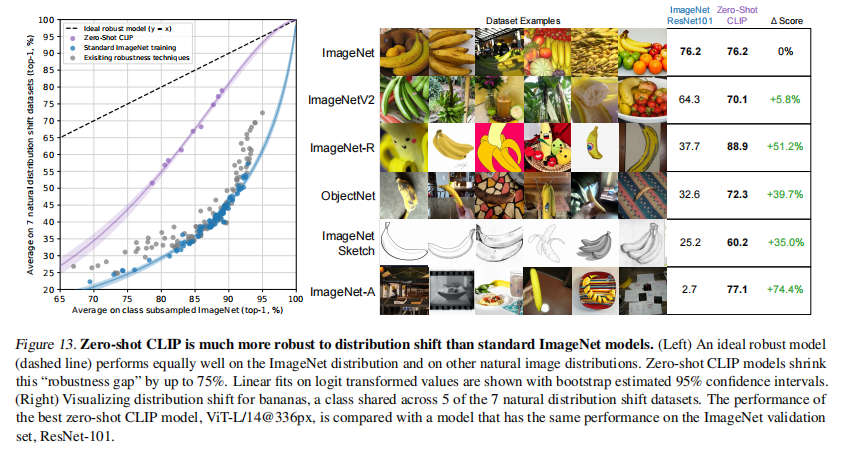

*论文 Figure 13：ImageNet 上准确率相同的模型，在分布偏移数据集（素描、艺术、不同视角）上表现天差地别。零样本 CLIP 将分布偏移差距缩小了 75%。*

---

**原文（反直觉发现——适配到 ImageNet 反而降低鲁棒性）：**

> Although adapting CLIP to the ImageNet distribution increases its ImageNet accuracy by 9.2% to 85.4% overall, and ties the accuracy of the 2018 SOTA, average accuracy under distribution shift slightly decreases.

**翻译：**

> 尽管将 CLIP 适配到 ImageNet 分布使 ImageNet 准确率提高了 9.2% 达到 85.4%，与 2018 年 SOTA 持平，但分布偏移下的平均准确率却略有下降。

**大白话：**

🎯 这是整篇论文最反直觉的发现——**越适配 ImageNet，鲁棒性越差**：

- **零样本 CLIP**：ImageNet 76.2%，分布偏移平均 ≈ 较高
- **用 ImageNet 训练集 fine-tune CLIP 后**：ImageNet 85.4%（+9.2%！），分布偏移平均 ≈ **反而下降**

更具体地看每个偏移数据集的变化（Figure 14 右图）：

| 分布偏移数据集 | Fine-tune 后变化 |
|:---:|:---:|
| ImageNetV2（相似分布） | **+5.8%** |
| ImageNet | **+9.2%** |
| ImageNet-R（艺术/素描） | **-4.7%** ⬇ |
| ObjectNet（不同视角） | **-3.8%** ⬇ |
| ImageNet Sketch | **-2.8%** ⬇ |
| ImageNet-A | **-1.9%** ⬇ |

**这揭示了什么？**

Fine-tune 带来的 9.2% 提升几乎全部集中在"接近 ImageNet 分布"的数据上（ImageNetV2 获益最大），而在更偏离 ImageNet 分布的数据上性能反而退化。这说明：
1. Fine-tune 让模型学会了 ImageNet 特有的拍摄风格、构图、背景模式——这些都是"假关联"
2. 模型牺牲了一部分真正理解图像的能力来换取在 ImageNet 上的高分
3. **高 ImageNet 准确率 ≠ 真正的视觉理解能力**——这是我们衡量模型好坏的标准出了问题

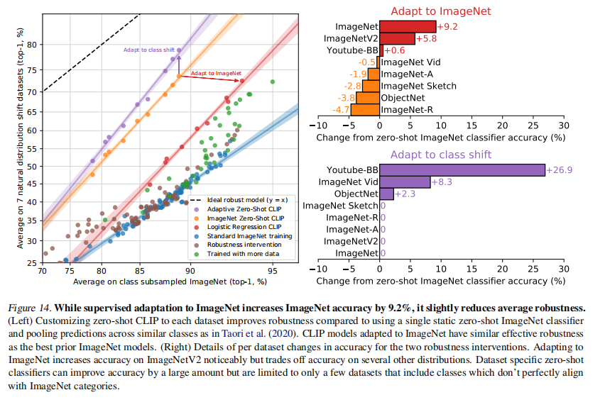

*论文 Figure 14：右图展示了从零样本到 fine-tune 后每个分布偏移数据集的准确率变化——相似分布提升，偏移分布反而退步。*

---

**原文（Figure 15——从零样本到全监督，鲁棒性的连续退化）：**

> We see that while few-shot models also show higher effective robustness than existing models, this benefit fades as in-distribution performance increases with more training data and is mostly, though not entirely, gone for the fully supervised model. Across our experiments, high effective robustness seems to result from minimizing the amount of distribution specific training data a model has access to, but this comes at a cost of reducing dataset-specific performance.

**翻译：**

> 我们看到，虽然少样本模型也比现有模型表现出更高的有效鲁棒性，但随着更多训练数据使分布内性能提升，这一优势逐渐消退，对于全监督模型几乎（但并未完全）消失。在我们的实验中，高有效鲁棒性似乎来自于最小化模型可访问的分布特定训练数据量，但这以减少数据集特定性能为代价。

**大白话：**

Paper 图 15 展示了从 0-shot → 1-shot → 2-shot → ... → 128-shot → 全监督，鲁棒性和准确率的连续变化。形成了一个清晰的**准确率-鲁棒性权衡（Accuracy-Robustness Trade-off）**：

| 给模型多少 ImageNet 数据 | ImageNet 准确率 | 分布偏移鲁棒性 |
|:---:|:---:|:---:|
| 0-shot（零张） | 最低 | **最高** 🏆 |
| 1-shot | ↑ | ↓ |
| 4-shot | ↑↑ | ↓↓ |
| 16-shot | ↑↑↑ | ↓↓↓ |
| 全监督（全部 128 万张） | **最高** 🏆 | 最低 |

**这个结论对 AI 研究和实践有深远影响**：

1. **当前的"SOTA"评测体系有系统性偏差**——只看单一数据集（ImageNet）的准确率，会鼓励模型过拟合到这个分布的假关联上
2. **零样本/少样本评测更反映真实能力**——不给你训练数据，你还能行，说明你学到的是真本事
3. **泛化和任务特定性能可能是内在矛盾的**——你想在某一个任务上做到极致，就不可避免地会牺牲在其他任务上的表现

这也解释了为什么 GPT-3/4 这样的零样本/少样本模型在实践中远比在特定任务上微调的模型好用——用户不会按照标准数据集的分布来提问。

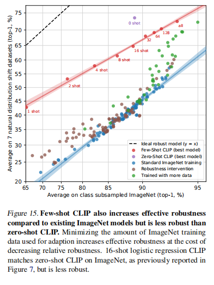

*论文 Figure 15：从左到右，给模型的 ImageNet 数据越多，准确率越高，但鲁棒性越差。零样本鲁棒性最高，全监督鲁棒性最低。这是一个根本性的权衡。*

---

## 四、与人类对比（4. Comparison to Human Performance）

**原文：**

> How does CLIP compare to human performance and human learning?... We had five different humans look at each of 3669 images in the test split of the Oxford IIT Pets dataset and select which of the 37 cat or dog breeds best matched the image... Interestingly, humans went from a performance average of 54% to 76% with just one training example per class, and the marginal gain from an additional training example is minimal.

**翻译：**

> CLIP 与人类表现和人类学习相比如何？……我们让五名不同的人查看 Oxford IIT Pets 数据集测试集中共 3669 张图片，选择 37 种猫或狗品种中哪一种最匹配图像……有趣的是，人类仅凭每个类别一个训练样本就从平均 54% 的表现提高到 76%，额外训练样本的边际增益很小。

**大白话：**

论文做了一个很有创意的人类对比实验：

| 设置 | 人类准确率 | CLIP 准确率 | 解读 |
|------|:---------:|:----------:|------|
| 零样本（不给参考图） | 53.7% | **93.5%** | CLIP 远超人类——但它"偷看"了 4 亿张图 |
| 单样本（给 1 张参考图/类） | **75.7%** | ≈4-shot 水平 | 人类看 1 张图涨 22%，CLIP 看 4 张图才能涨同样的量 |
| 双样本（给 2 张参考图/类） | 75.7% | — | 人类一张图就饱和了 |

**这个对比揭示了一个惊人的差异**：

- **人类的"一次学习"（One-Shot Learning）极其高效**：看一张哈士奇的照片就能抓住"蓝眼睛、黑白毛、尖耳朵"这些关键特征，然后运用到所有测试图上
- **CLIP 的少样本学习很低效**：线性分类器需要看 4-16 张标注图才能匹敌零样本的性能
- **人类会"知之为知之，不知为不知"**（选"I don't know"），而模型总是硬选一个。人类在不确定的图像上选择了"我不知道"，在有把握的图像上准确率高达 69.7%

**人类从 0-shot 到 1-shot 的巨大跳跃说明什么？** 人类拥有强大的先验知识（prior knowledge）——即使从没见过"萨摩耶"这个品种，一旦看到一张样例，就能利用已有知识（"狗的大致形态"、"白毛"、"微笑表情"）快速锁定关键特征。而 CLIP 的少样本学习只是在已有特征上训练线性分类器，缺乏这种**先验引导的快速推理**能力。

**论文对此的反思**：找到一种方法将 CLIP 强大的零样本先验（通过语言编码的知识）融入到少样本学习中，而不是简单地拟合线性分类器，是未来的重要研究方向。

---

## 五、数据重叠分析（5. Data Overlap Analysis）

**原文：**

> A concern with pre-training on a very large internet dataset is unintentional overlap with downstream evals. This is important to investigate since, in a worst-case scenario, a complete copy of an evaluation dataset could leak into the pre-training dataset and invalidate the evaluation as a meaningful test of generalization.

**翻译：**

> 在非常大的互联网数据集上进行预训练的一个担忧是与下游评估的无意重叠。这很重要需要调查，因为在最坏情况下，评估数据集的完整副本可能泄漏到预训练数据集中，使得评估不再是泛化能力的有意义测试。

**大白话：**

一个自然的质疑——你说 CLIP 零样本这么厉害，会不会是因为它的训练数据里就包含了测试图片？毕竟 4 亿图文对这么大的规模，不小心把 ImageNet 的测试图也爬进去了完全可能。

论文花了很大篇幅做**数据重叠分析（Data Overlap Analysis）**来认真回应这个质疑：

**检测方法**：
1. 对每个评估数据集的每张图，在训练集中找最相似的图片（用预训练的重复检测器）
2. 人工检查找到的"疑似重复"，设定阈值来平衡精度和召回率
3. 把所有图片分成三组：All（全部）、Overlap（与训练集有重叠的）、Clean（确认无重叠的）
4. 比较 CLIP 在 Overlap 和 Clean 上的准确率差异

**结果**（论文图 17）：

| 发现 | 数据 |
|------|------|
| 完全无重叠的数据集 | 9/35（MNIST、CLEVR、GTSRB、ObjectNet、Hateful Memes 等） |
| 中位重叠率 | 2.2% |
| 平均重叠率 | 3.2% |
| 重叠导致的准确率膨胀 | 绝大多数 < 0.1% |
| 最大准确率膨胀 | 0.6%（Birdsnap 数据集） |
| 统计显著（Bonferroni 校正后） | 仅 2 个数据集 |

**最重要的结论**：**CLIP 的好成绩不是靠数据作弊。重叠率很低，即使有重叠，对准确率的影响也微乎其微。**

有意思的是，有些数据集重叠样本上的准确率反而更低——如 Kinetics-700 的"重叠"很多是全黑过渡帧，属于噪声。

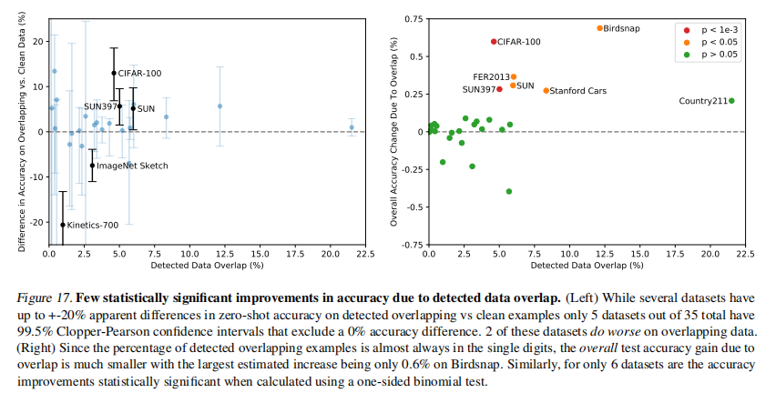

*论文 Figure 17：对训练数据和评估数据的重叠分析。中位重叠率仅 2.2%，重叠导致的准确率膨胀绝大多数 < 0.1%。*

**一个重要的方法论选择**：论文故意不去重，而是事后分析重叠的影响。为什么不事先去重？因为如果事先去重了：
- 你永远不知道去得干不干净（可能有过杀也可能有漏网）
- 新增加一个评测数据集需要**重新训练整个模型**——不现实
- 事后分析更透明，让读者自己判断影响有多大

---

## 六、局限性（6. Limitations）

**原文：**

> While scaling has so far steadily improved performance and suggests a route for continued improvement, we estimate around a 1000x increase in compute is required for zero-shot CLIP to reach overall state-of-the-art performance. This is infeasible to train with current hardware. Further research into improving upon the computational and data efficiency of CLIP will be necessary.

**翻译：**

> 尽管扩展迄今为止稳步提升了性能并指出了持续改进的路径，我们估计需要大约 1000 倍的计算量增加才能使零样本 CLIP 达到整体最先进性能。这在当前硬件上无法训练。进一步研究改进 CLIP 的计算和数据效率将是必要的。

**大白话：**

CLIP 远远没有达到"天花板"，但要继续用 Scaling 的方法往前推，需要 1000 倍的算力——这是当前硬件和预算无法承受的。寄希望于纯粹"堆算力"的路线已经看到瓶颈了。未来需要提高**计算效率**（用更少算力达到同样效果）和**数据效率**（用更少数据学到同样知识）。

---

**原文（CLIP 在哪些任务上不行）：**

> CLIP's zero-shot performance is still quite weak on several kinds of tasks. When compared to task-specific models, the performance of CLIP is poor on several types of fine-grained classification such as differentiating models of cars, species of flowers, and variants of aircraft. CLIP also struggles with more abstract and systematic tasks such as counting the number of objects in an image. Finally for novel tasks which are unlikely to be included in CLIP's pre-training dataset, such as classifying the distance to the nearest car in a photo, CLIP's performance can be near random.

**翻译：**

> CLIP 的零样本性能在几种任务上仍然相当薄弱。与任务特定模型相比，CLIP 在几种细粒度分类任务上表现较差，如区分汽车型号、花卉种类和飞机变体。CLIP 在更抽象和系统性的任务上也表现困难，如计算图像中的物体数量。最后，对于那些不太可能包含在 CLIP 预训练数据集中的新型任务，如判断照片中距离最近的汽车有多远，CLIP 的性能可能接近随机水平。

**大白话：**

CLIP 做不到的事情清单——这些是让你对它的能力边界有清醒认识：

| 不行的事 | 严重程度 | 为什么 |
|---------|:-------:|--------|
| 细粒度分类（区分车型/花种/飞机型号） | 中等偏弱 | 训练数据中不够细致——网络文本很少写"这是 2018 款宝马 M3" |
| 计数任务（图里有几个球？） | 很弱 | 对比学习只管"是不是"，不管"有几个"。系统性的推理能力不是 CLIP 的训练目标 |
| 测距（离前车多远？） | **接近随机** | 完全超出网络图文对的覆盖范围 |
| 医学图像（病理切片） | 很弱 | 互联网上几乎没有医学图文对 |
| 卫星图像分类 | 很弱 | 同上 |
| MNIST 手写数字 | 弱（88%，不如原始像素+逻辑回归） | 训练集中几乎没有手写数字的图文对 |

---

**原文（关于暴力美学的自我批评——论文最坦诚的一段）：**

> CLIP does little to address the underlying problem of brittle generalization of deep learning models. Instead CLIP tries to circumvent the problem and hopes that by training on such a large and varied dataset that all data will be effectively in-distribution. This is a naive assumption that, as MNIST demonstrates, is easy to violate.

**翻译：**

> CLIP 几乎没有解决深度学习模型脆弱泛化的根本问题。相反，CLIP 试图绕过这个问题，寄希望于通过在如此庞大且多样化的数据集上训练，使所有数据都有效地处于分布内。正如 MNIST 所证明的那样，这是一个幼稚的假设，很容易被打破。

**大白话：**

这段话是整篇论文里最坦诚、最有深度的自我批评。CLIP 的泛化能力来自**广度**而非**深度**——它不是说"我理解了图像的本质所以什么都能识别"，而是说"我把所有可能的图像类型都训了一遍，所以测试时总在训练分布内"。

MNIST 手写数字干净利落地打了这个假设的脸：CLIP 在 MNIST 上只有 88% 准确率，而**直接对原始像素做逻辑回归都能到 90%+**。为什么？因为 CLIP 的训练数据里几乎没有手写数字——互联网上谁发手写数字的照片配文？MNIST 这种"简单"但对 CLIP 来说完全 OOD（分布外）的数据，暴露了 CLIP 不是在"理解"，而是在"记住见过的模式"。

**这告诉我们**：真正的泛化能力需要的不只是更大的数据，还需要模型能够**举一反三（compositional generalization）**——看到过"印刷体数字 8"和"手写体"，能推理出"手写体数字 8"应该长什么样。CLIP 做不到这一点，目前的深度学习模型普遍做不到。

---

**原文（对比学习的根本局限——选择题 vs 简答题）：**

> Although CLIP can flexibly generate zero-shot classifiers for a wide variety of tasks and datasets, CLIP is still limited to choosing from only those concepts in a given zero-shot classifier. This is a significant restriction compared to a truly flexible approach like image captioning which could generate novel outputs.

**翻译：**

> 尽管 CLIP 可以为各种任务和数据集灵活生成零样本分类器，但 CLIP 仍然仅限于从给定零样本分类器中的概念中进行选择。与真正的灵活方法（如图像描述可以生成新的输出）相比，这是一个显著的限制。

**大白话：**

🎯 CLIP 的根本能力边界：它只能做**选择题（给定候选类别，选出最像的）**，不能做**简答题（这张图里有什么？自由回答）**。

- 你想知道"这是什么动物" → 必须预设候选列表（{猫, 狗, 鸟, 鱼, ...}），CLIP 帮你选
- 你不能问"这张图里有什么？" → CLIP 无法生成"这是一只橘猫坐在沙发上"这样的文本

论文提出了一个有趣的方向：把对比学习（CLIP 的高效性）和生成学习（image captioning 的灵活性）结合起来。后来的 BLIP、BLIP-2 等工作正是沿着这个方向做的。

---

**原文（其他方法论局限）：**

> Our methodology has several significant limitations. Despite our focus on zero-shot transfer, we repeatedly queried performance on full validation sets to guide the development of CLIP. These validation sets often have thousands of examples, which is unrealistic for true zero-shot scenarios... Another potential issue is our selection of evaluation datasets... our main results use a somewhat haphazardly assembled collection of 27 datasets that is undeniably co-adapted with the development and capabilities of CLIP.

**翻译：**

> 我们的方法论有几个显著的局限性。尽管我们专注于零样本迁移，但我们反复查询完整验证集上的性能以指导 CLIP 的开发。这些验证集通常有数千个样本，这对于真正的零样本场景是不现实的……另一个潜在问题是我们选择的评估数据集……我们的主要结果使用了一个有点随意组成的 27 个数据集集合，无可否认地与 CLIP 的开发和能力共同适应。

**大白话：**

论文坦诚承认了两个"方法论作弊"：

1. **反复查询验证集来调参**：虽然论文声称是"零样本"（训练时不看任何 ImageNet 数据），但在开发 CLIP 的过程中，作者肯定反复在 ImageNet 验证集上跑过实验结果来调超参。真正的零样本应该连验证集都不能看。这就好比说"我没复习"，但实际上你已经看过考题了——虽然你没"背答案"，但你知道考试的重点是什么。

2. **评测数据集的筛选偏差**：论文选了 27 个数据集作为评测套件，这些数据集是在了解 CLIP 能力的基础上挑选的。如果 CLIP 在某些数据集上表现不好，可能会被排除在评测套件之外（虽然不一定是故意的）。这就像"只考我擅长的科目"。

这两个问题并非 CLIP 独有——所有声称"零样本/少样本"的工作都面临类似的质疑。这是一个开放的方法论挑战。

---

## 七、更广泛影响与偏见（7. Broader Impacts & Bias）

**原文（双刃剑：灵活性的风险）：**

> CLIP has a wide range of capabilities due to its ability to carry out arbitrary image classification tasks. One can give it images of cats and dogs and ask it to classify cats, or give it images taken in a department store and ask it to classify shoplifters — a task with significant social implications and for which AI may be unfit.

**翻译：**

> 由于能够执行任意的图像分类任务，CLIP 具有广泛的能力。你可以给它猫和狗的图片让它分类猫，也可以给它商场拍摄的图片让它分类扒手——这是一个具有重大社会影响的任务，AI 可能并不适合。

**大白话：**

CLIP 的零样本灵活性是一把双刃剑：
- **正面**：任何人都可以用自然语言创造自己的图像分类器，不需要标注数据，不需要训练
- **负面**：任何人都可以用它来做危险的事——"这个人看起来像罪犯吗？""这个人是不是扒手？"这种任务技术上 CLIP 可以做（给出一个概率），但从伦理上绝不应该做

论文专门用"扒手"这个例子来说明——AI 如果被用来做这种主观判断和人群分类，后果可能是灾难性的。而且因为 CLIP 只需要文字描述就能创造分类器，滥用的门槛极低。

---

**原文（偏见分析——面部分类实验）：**

> We found that 4.9% (confidence intervals between 4.6% and 5.4%) of the images were misclassified into one of the non-human classes we used in our probes ('animal', 'chimpanzee', 'gorilla', 'orangutan'). Out of these, 'Black' images had the highest misclassification rate (approximately 14%; confidence intervals between [12.6% and 16.4%]) while all other races had misclassification rates under 8%.

**翻译：**

> 我们发现 4.9%（置信区间在 4.6% 到 5.4% 之间）的图像被误分类到我们探测中使用的非人类类别（'animal'、'chimpanzee'、'gorilla'、'orangutan'）。其中，"Black"图像的误分类率最高（约 14%；置信区间在 12.6% 到 16.4% 之间），而所有其他种族的误分类率低于 8%。

**大白话：**

这是论文中最令人不安的实验。在 FairFace 数据集上测试 CLIP 的偏见：

**偏见发现 1——种族与动物类的误分类**：
- 黑人面孔被误分为"动物"或灵长类（猩猩/大猩猩）的比例高达 **14%**，是其他种族（均 <8%）的近两倍
- 这不是 CLIP"学坏了"——互联网上的图文对本身就带有这种系统性偏见
- CLIP 不加过滤地"学会"了这些偏见，并在零样本预测中忠实地复现

**偏见发现 2——性别与犯罪类的误分类**：
- 男性图像被误分为"罪犯/小偷/可疑人物"的比例：**16.5%**
- 女性图像同样情况：**9.8%**
- 0-20 岁年龄组比成年人更容易被误分类到犯罪相关类别

**偏见发现 3——年龄与性别分类准确率的交集差异**：

| 分类任务 | 最佳准确率 | 说明 |
|---------|:---------:|------|
| 性别分类 | >95% 所有种族 | 性别分类的偏见相对较小 |
| 种族分类（ZS CLIP） | 58.3%（白人）→ 91.3%（黑人） | 零样本对某些种族的分类很差 |
| 年龄分类 | 54-63% | 年龄判断对所有人种都不太准 |

**这些偏见的根源**：
1. **训练数据的偏见**：互联网上某些种族/性别的图文对本身就带有刻板印象和歧视性描述
2. **数据量的不均**：不同种族在训练数据中的出现频率可能不均匀
3. **文本关联的偏差**：关于某些群体的负面描述在互联网上更常见（不是因为真实情况如此，而是因为社会偏见）

**论文的启示**：CLIP 的"生成式分类器"特性意味着**任何人都可以任意定义类别，CLIP 都会给出一个答案**——即使是错误、歧视性的类别定义。模型本身不知道什么是对的、什么是错的、什么是有害的。在开放部署时，这种灵活性需要配套的防护措施。

---

## 八、论文核心贡献总结

| 贡献 | 一句话 | 在论文中的位置 |
|------|--------|:---:|
| **大规模自然语言监督** | 4 亿图文对证明文本可以替代标签 | Section 2.2 |
| **高效对比学习** | 对比学习比预测式快 4 倍，让大规模训练可行 | Section 2.3, Figure 2 |
| **零样本 SOTA** | ImageNet 上不靠任何标注匹配 ResNet-50；27 数据集中 16 个超越 baseline | Section 3.1, Figure 5 |
| **双塔架构+线性投影** | 极简设计：图像编码器+文本编码器+线性投影 → 比 SimCLR 更简单但更高效 | Section 2.3-2.4 |
| **Prompt 工程** | 文本模板显著影响性能；Ensemble 免费提升约 5% | Section 3.1.4, Figure 4 |
| **鲁棒性发现** | 零样本模型天然比监督模型更鲁棒；微调反而降低鲁棒性 | Section 3.3, Figure 13-14 |
| **缩放定律** | 性能随计算量可预测提升（log-log 线性） | Figure 9 |
| **开放影响** | 开源权重，催生了 DALL·E 2、Stable Diffusion、BLIP 等 | 整个社区 |

---

## 九、论文遗留的开放问题

CLIP 论文在结论部分没有给出"我们已经解决了 XX 问题"的陈述，而是非常诚实地留下了大量开放问题：

1. **计算效率**：需要 1000 倍算力才能零样本达到全监督 SOTA——怎么提高效率？
2. **数据效率**：CLIP 需要看到 128 亿张图（32 epoch × 4 亿），人类只需要几张——差距在哪？
3. **系统性推理**：计数、测距等任务 CLIP 表现差——怎么把推理能力和感知能力结合？
4. **少样本学习的改进**：如何利用 CLIP 的零样本先验来设计更好的少样本学习方法？
5. **真正的零样本评估**：怎么设计不依赖"反复查询验证集调参"的零样本评测协议？
6. **偏见与公平性**：如何在保持灵活性的同时，防止模型被用于歧视性分类？
7. **对比 vs 生成**：能不能结合 CLIP 的高效和图像描述模型的灵活性？（BLIP-2 后来回答了一部分）

---

## 十、PyTorch 实战项目

项目代码和详细运行指南见 `项目/README.md`。

**项目内容**：基于 PyTorch 实现 CLIP 训练与推理，完整覆盖论文核心：
- 双塔架构（ViT-B/16 + CLIP Text Transformer）
- 对称 InfoNCE 对比损失
- 投影头 + L2 归一化
- SwanLab 实验追踪

**快速开始**：

```bash
cd 项目
pip install -r requirements.txt
python download_models.py                    # 下载预训练权重
python dataset/download_dataset.py          # 下载 Flickr-8k
bash run.sh                                  # 开始训练
```

本项目的代码细节与论文 Formula 3 的伪代码一一对应，详见 `项目/README.md` 第 2 节「项目是如何对应论文的」。

---

## 拓展阅读（必读）

1. [CLIP 论文原文](https://arxiv.org/abs/2103.00020) — 见本目录 `CLIP_paper.pdf`
2. [OpenAI CLIP GitHub](https://github.com/openai/CLIP) — 官方开源代码和模型权重
3. 下方「扩展阅读」系列 —— 学期内不要求全部读完，但你至少要知道它们的存在
4. 📁 `扩展资料/` 文件夹新增论文：**FLIP / GLIP / BLIP / BLIP-2 / SigLIP / SigLIP2 / OpenVLA / TinyVLA**（见扩展阅读五）

---

# ⭐ 扩展阅读一：文本大模型极简史 —— 从 Transformer 到 ChatGPT，你家大模型是怎么"长大"的

> 📂 本节为**课外扩展阅读**，不作为必修考核内容。  
> 🎯 目标：用轻松幽默的方式帮你建立大模型的全局认知，知道 GPT-1/2/3、BERT、LLaMA、ChatGPT 这些人名背后到底在说什么。  
> 📁 对应论文 PDF 全部已放在 `扩展资料/` 文件夹中，想看原文随时打开。
>
> **建议阅读节奏**：第 1-4 天每天读一段，和论文 PDF 对照着看效果最佳。

---

## 0、写在前面：为什么要在 CLIP 课里讲文本大模型？

你可能会问："第三节课不是讲 CLIP 吗？怎么冒出来一堆文本模型？"

答案很简单——**CLIP 是站在巨人的肩膀上的**。CLIP 的文本编码器本身就是从 GPT-2 改过来的 Transformer，它的训练方法（对比学习）也是 NLP 领域先玩起来的。如果不了解文本大模型从哪来，你看 CLIP 就像看一座空中楼阁——不知道它的地基是谁打的。

更重要的是，你将来不管是继续学多模态（LLaVA 之类的）还是专注 NLP，这两个领域的知识会越来越重叠。趁早建立大模型的全局认知，后面学什么都能串起来。

---

## 1、GPT-1（2018）—— 祖师爷登场，提出了一个改变了整个 AI 界的 idea

> 📄 `扩展资料/GPT1_paper.pdf`

2018 年，OpenAI 发表了 GPT-1。论文标题巨长——*"Improving Language Understanding by Generative Pre-Training"*（通过生成式预训练改进语言理解）。

**它提了一个在当时看起来很普通、但现在回头看简直是天才的想法**：

> 先在**海量无标注文本**上训练一个语言模型（让它学会"下一个词应该是什么"），然后在**具体任务**上加一个小小的分类头微调一下（让它学会"这句话是正面还是负面"）。

这个想法在今天看来理所当然，但在 2018 年以前，NLP 的主流做法是：**每个任务从头训练一个模型**。做情感分析训一个，做翻译训一个，做问答训一个……研究人员像老黄牛一样为每个任务辛辛苦苦地标注数据、设计模型、调参。GPT-1 说：别这么累了，先训练一个"万事通"模型，然后再针对具体任务微调就行了。

**效果**：117M 参数（按今天的标准就是个"婴儿"，但当年已经不小了），在 12 个 NLP 任务中的 9 个上达到了 SOTA。

> **一句话记住 GPT-1**："预训练+微调"范式的开创者。就像先上完基础教育再专攻一个专业，而不是每换一个专业就从小学生开始读起。

---

## 2、BERT（2018）—— GPT 的双胞胎兄弟，方向完全不同但同样牛逼

> 📄 `扩展资料/BERT_paper.pdf`

GPT-1 论文刚出来不久，Google 就甩出了 BERT —— 同样是预训练+微调，但做法和 GPT 逆着来。

**GPT vs BERT 的核心区别**：

| | GPT | BERT |
|------|------|------|
| 读文本的方式 | 从左往右（单向） | 左右一起看（双向） |
| 预训练任务 | 预测下一个词 | "完形填空"（遮住中间的词猜它是什么） |
| 擅长什么 | **生成**（写文章、对话） | **理解**（分类、问答、搜索） |
| 你现在用过的产品 | ChatGPT、Copilot | Google 搜索、情感分析 API |

GPT 像一个只会"向前看"的人——读"我爱__"，从"我"和"爱"推测后面可能是"你"。BERT 像一个会"来回看"的人——"我 _ 你"，它同时看左边的"我"和右边的"你"，推测中间是"爱"。

**BERT 的经典预训练任务**：随机遮住句子中 15% 的词，让模型猜被遮住的是什么。这听起来像小学生语文题，但它让 BERT 对语言的理解达到了前所未有的深度。

> **一句话记住 BERT**："完形填空"高手，自然语言理解（NLU）的王者。GPT 管"说"，BERT 管"听"。

---

## 3、GPT-2（2019）—— OpenAI 说"这模型太强了我们不敢放出来"，全世界的媒体都疯了

> 📄 `扩展资料/GPT2_paper.pdf`

GPT-2 和 GPT-1 的架构**几乎一模一样**——就是同一套 Transformer Decoder，只不过从 12 层加到了 48 层，参数从 117M 暴增到 1.5B。

但就是这"纯靠堆料"的操作，带来了一个惊人的发现——**模型大了之后，不需要微调就能完成很多任务了！**

GPT-1 还需要你给它标注数据做微调，GPT-2 直接说："你直接跟我说话就行，我能听懂。"——这就是 Zero-Shot Learning（零样本学习）的雏形。

OpenAI 当时的反应极其戏剧化——他们发了一篇博客说："GPT-2 太强大了，可能会被用来生成假新闻，所以我们先不发布完整模型。"整个 AI 圈和科技媒体瞬间炸了锅。有人骂 OpenAI 是在炒作，有人真的担心 AI 被滥用。

最终 OpenAI 分阶段发布了模型——先放最小的（124M），再放中等的（355M），最后才放 1.5B 的完整版。

> **一句话记住 GPT-2**：证明了"大就是好"的 Scaling Law——同样架构，参数量×10，能力直接跃升。顺便还引发了一场关于 AI 安全的全球讨论。

---

## 4、GPT-3（2020）—— 1750 亿参数，让全世界第一次感受到了"涌现能力"的震撼

> 📄 `扩展资料/GPT3_paper.pdf`

如果 GPT-2 是"砸了一堆钱发现有效果"，那 GPT-3 就是"倾家荡产地砸钱，发现效果逆天"。

GPT-3 有 **175B（1750 亿）参数**，训练数据高达 300B tokens。训练一次据说花了 1200 万美元的电费。

但最震撼的不是参数多——而是 GPT-3 展现出了一种全新的能力：**In-Context Learning（上下文学习）**。

什么意思？你不需要微调模型，只需要在 Prompt（提示词）里给出几个例子，GPT-3 就自动学会了你要做什么：

```
你输入：
  把以下句子翻译成英文：
  今天天气真好 → The weather is really nice today
  我喜欢吃苹果 → I like eating apples
  猫在沙发上睡觉 →

GPT-3 输出：
  The cat is sleeping on the sofa
```

你只给了两个例子，GPT-3 就"秒懂"了你要它做什么。这在 GPT-2 上根本做不到！

更诡异的是——**这个能力是突然"冒出来"的**。参数从 1.5B → 175B 的过程中，某些能力（翻译、算术、代码生成）在某个参数阈值之前几乎没有，过了阈值之后突然飙升。研究者管这个叫 **Emergent Ability（涌现能力）**，就像一个人突然开了窍。

> 🎯 你现在用的所有 Prompt Engineering 技巧（给例子、角色扮演、思维链……），源头都是 GPT-3 这篇论文发现的 In-Context Learning。

> **一句话记住 GPT-3**：175B 参数，证明了"涌现能力"的存在——大到一定程度，模型突然什么都会了。它是 ChatGPT 的"前身"。

---

## 5、ChatGPT / InstructGPT（2022）—— GPT-3 很聪明但不会"做人"，于是人类开始教它"情商"

> 📄 `扩展资料/InstructGPT_paper.pdf`

GPT-3 很强，但有一个致命问题——**它不听人话**。

你让它"写一首关于春天的诗"，它可能给你输出一篇关于气候变化的论文。你让它"用简单的语言解释量子力学"，它可能甩出一堆你完全看不懂的公式。GPT-3 像一个智商 180 但情商为零的天才儿童——能力超强，但完全不懂"你想要什么"。

InstructGPT（ChatGPT 的技术基础）的解决方案叫 **RLHF（Reinforcement Learning from Human Feedback，人类反馈强化学习）**：

```
Step 1：请人类老师写"优质回答"，微调 GPT-3 → 模型知道了"好回答长什么样"

Step 2：让模型对同一个问题生成多个回答，请人类排序哪个更好
        → 训练一个"评分模型"，学会了什么是"人类喜欢"的回答

Step 3：用评分模型给回答打分，用强化学习（PPO算法）不断优化模型
        → 模型越来越"听人话"
```

**效果惊呆了所有研究者**：1.3B 的 InstructGPT 在人类评估中居然比 175B 的 GPT-3 更受欢迎！模型小了 100 多倍，但因为"学会做人"了，人类反而更喜欢。

> 🎯 ChatGPT 本质上就是 GPT-3.5 + RLHF + 对话优化。它不是比 GPT-3 更"聪明"，而是比 GPT-3 更"懂你"。

---

## 6、LLaMA（2023）—— Meta 说：谁说一定要砸几十亿？我们开源一个给你们玩玩

> 📄 `扩展资料/LLaMA_paper.pdf`

GPT-3 很强，但不开源、不公开权重。全世界的研究者只能对着论文流口水。2023 年 2 月，Meta 突然发布 LLaMA，直接把模型权重开源了。

LLaMA 的核心理念和 GPT-3 完全相反：

| | GPT-3 | LLaMA |
|------|------|------|
| 理念 | 大模型 + 大量脏数据 | 小模型 + 精选高质量数据 |
| 最大参数 | 175B | 65B |
| 数据量 | 300B tokens | 1.4T tokens |
| 训练策略 | 硬堆算力 | 多训几轮（更多 epoch） |
| 效果 | SOTA | **LLaMA-13B > GPT-3 175B！** |

LLaMA 证明了：与其用 175B 参数在 CommonCrawl 的垃圾数据上训练，不如用 13B 参数在 Wikipedia、StackExchange、书籍等精选数据上多训几遍。**数据质量 > 模型大小**。

LLaMA 的发布引爆了开源大模型的浪潮——Vicuna、Alpaca、LLaVA（就是你第七天要读的那篇！）都是基于 LLaMA 微调的。

> **一句话记住 LLaMA**：开源界的翻身仗，"小模型+好数据"打败"大模型+脏数据"。LLaVA 用的就是它的语言模型部分。

---

## 7、总结：大模型十年进化简表

| 年份 | 模型 | 核心创新 | 参数 | 一句话 |
|:---:|------|------|:---:|------|
| 2017 | Transformer | 自注意力机制 | — | 一切大模型的"发动机" |
| 2018 | GPT-1 | 预训练+微调 | 117M | "先通才后专才"的教育理念 |
| 2018 | BERT | 双向预训练+完形填空 | 340M | NLU 之王，Google 搜索的灵魂 |
| 2019 | GPT-2 | Zero-Shot | 1.5B | "大就是好"的第一次证明 |
| 2020 | GPT-3 | In-Context Learning | 175B | 涌现能力震惊世界 |
| 2022 | InstructGPT/ChatGPT | RLHF 对齐 | 1.3B~175B | AI 学会了"做人" |
| 2023 | LLaMA | 开源+数据质量>模型大小 | 7B~65B | 大模型民主化的开端 |
| 2024 | DeepSeek-V2/V3 | MoE+MLA | 236B/671B | 国产性价比之王，训练成本仅 GPT-4 的 1/20 |

> 🎯 你看完这一段，就掌握了 NLP 领域过去十年的主线剧情。以后在论文的 Related Work 里看到 BERT、GPT、LLaMA 这些名字，你都知道它们是干嘛的了。
>
> 💡 如果你对 DeepSeek 或者 InstructGPT 的 RLHF 细节感兴趣，说明你已经开始**对前沿技术产生好奇了**——这是一个非常好的信号！现阶段先把 GPT-1/2/3 和 LLaMA 的精髓吃透，RLHF 和 MoE 留到以后慢慢啃。

---

## 扩展阅读二：CLIP 相关延伸

这些是 CLIP 论文的直系后代和改进工作。它们都建立在 CLIP 的核心思想（对比学习 + 大规模图文预训练）之上，但各有侧重：

| 工作 | 与 CLIP 的关系 | 一句话 |
|------|:---:|---|
| **[OpenCLIP](https://github.com/mlfoundations/open_clip)** | 开源复现 | LAION 团队复现并超越了 CLIP。不仅开源代码，还开源了 5B 图文对数据集（LAION-5B）和训练好的 ViT-G/14 |
| **[BLIP-2](https://arxiv.org/abs/2301.12597)** | 下游应用 | 用 Q-Former 桥接 CLIP 视觉编码器和 LLM，实现图像→文本的多轮对话 |
| **[LiT](https://arxiv.org/abs/2111.07991)** | 方法改进 | Locked-image Tuning：冻结预训练好的图像编码器，只微调文本塔。效果不降反而更好，是 CLIP 的"懒人训练模式" |
| **[SigLIP](https://arxiv.org/abs/2303.15343)** | 损失函数改进 | 把 CLIP 的 Softmax 对比损失换成 Sigmoid 损失，支持更大的 batch size，训练更稳定。Google 出品，近年越来越多的多模态模型采用 SigLIP 作为视觉编码器 |

> 💡 BLIP-2 和 LLaVA（见扩展阅读三）做的事情是一样的——把视觉编码器接到 LLM 上。区别在于 BLIP-2 用 Q-Former 桥接，LLaVA 用最简单的线性层。两者都证明了：**预训练好的视觉编码器 + LLM 就是多模态对话的基础公式**。

---

## 扩展阅读三：LLaVA —— 从 CLIP 到多模态对话

> 📂 本节为课外扩展阅读，不作为必修考核内容。  
> 📄 完整逐段解读见本目录 `LLaVA论文解读.md`  
> 📄 论文原文见本目录 `LLaVA_paper.pdf`

### 一句话：LLaVA 是什么？

**LLaVA = CLIP 的眼睛 + LLaMA 的大脑 + 一个极简的连接器。**

```
CLIP 视觉编码器 → 一个可训练的投影矩阵 → Vicuna/LLaMA 语言模型
```

CLIP 教会了模型"图像和文本怎么对应"（对比学习），LLaVA 在此基础上教会了模型"怎么根据图像和问题聊起来"（指令微调）。从"理解"到"交互"的跨越。

### 核心设计（全篇最精妙的地方）

**GPT-4 根本看不到图像，却能生成高质量的图文对话。**

LLaVA 的训练数据是这样来的：先把 COCO 数据集里的每张图转成文字描述（caption + 物体位置的边界框坐标），然后把这些**纯文本**喂给 GPT-4，让它编对话：

```
喂给 GPT-4："一群人站在一辆黑色 SUV 旁边，周围有行李"
GPT-4 生成：
  问："图中是什么类型的车？"
  答："这是一辆黑色运动型多功能车（SUV）……"
  问："这些人在做什么？"
  答："他们正在往 SUV 里装行李，好像在准备旅行……"
```

GPT-4 虽然看不到图，但它有世界知识和顶级的语言能力。基于文字描述编的对话，质量仍然非常高。

### 三种训练数据

| 类型 | 数量 | 训练的能力 |
|------|:---:|------|
| 对话（Conversation） | 58K | 多轮交互——"图里有几个人？他们是谁？" |
| 详细描述（Detail） | 23K | 全局观察——"请详细描述这张图" |
| 复杂推理（Reasoning） | 77K | 逻辑推理——"这些人面临什么挑战？为什么？" |

> 🎯 总共只用了 **158K 条数据**（对比 GPT-3 的 300B token，九牛一毛），就能让模型学会多模态对话。**数据质量 > 数据数量。**

### 架构：为什么"简单"反而是优势

LLaVA 的架构可能是所有多模态模型中**最简单的**：

1. **看**：把图塞进 CLIP ViT-L/14，拿一个有 256 个 patch token 的特征向量 Z_v
2. **翻**：用一个可学习的投影矩阵 W，把 Z_v 映射到和 LLM 词嵌入相同的维度
3. **说**：把映射后的视觉 token 和用户文本问题拼在一起，丢进 LLM 生成回答

```
[<图1的256个视觉token>] [用户问题"图片里有几只猫？"] → LLM → "图片里有两只猫，一只橘猫和一只黑猫。"
```

对比一下其他多模态模型的做法：

| 模型 | 连接方式 | 复杂度 |
|------|---------|:---:|
| BLIP-2 | Q-Former（可学习的 Transformer 模块，用 BERT 权重初始化） | 高 |
| Flamingo | Perceiver Resampler + 交叉注意力层插入 LLM 每层 | 很高 |
| **LLaVA** | **一个线性投影矩阵** | **极低** |

结论：**CLIP 的视觉特征已经足够好了，不需要花里胡哨的连接器。一个线性层就足够把视觉信号翻译给 LLM 理解。**

### LLaVA 告诉我们什么

1. **视觉编码器的质量是上限**——CLIP 预训练得好，后面的连接方式随便搞都行
2. **语言模型的指令遵循能力是下限**——LLaMA/Vicuna 经过了指令微调，所以能理解"请详细描述这张图"这类复杂指令
3. **数据生成是 hidden gem**——GPT-4 看不到图却能生成图文对话，这个思路启发了后续几乎所有多模态模型的数据管线

---

## 扩展阅读四：具身智能与 SigLIP —— 当 CLIP 走进物理世界

> 📂 本节为课外扩展阅读，不作为必修考核内容。

### 什么是具身智能？

到目前为止我们讨论的 AI 都活在服务器里——它们看图片、读文本、生成回答，但从来没有碰过真实世界。

**具身智能（Embodied Intelligence）** 是把 AI 装进物理身体里——机械臂、人形机器人、自动驾驶汽车。它不再是"看图说话"，而是**"看到 → 理解 → 决策 → 行动"**。

举个例子：你对机器人说"帮我把桌上的红色杯子拿过来"。机器人需要：

1. **看**——用摄像头找到"红色杯子"在哪
2. **理解**——杯子在桌子的哪个位置？周围有没有障碍物？
3. **规划**——手臂应该怎么移动？先伸到哪个点？
4. **执行**——电机转动，物理世界里的杯子被拿起

这里面第一步"看"，用的视觉编码器和 CLIP 是同一个家族的。

### SigLIP 为什么比 CLIP 更适合具身智能？

回顾一下 CLIP 的 loss 函数：在一个 N×N 的相似度矩阵上做 Softmax——每个样本都要和 batch 里所有其他样本比。缺点是**batch size 越大越好，小 batch 时性能掉得很厉害**。

**SigLIP（Sigmoid Loss for Language Image Pre-training）** 换了一个思路：不搞全局 Softmax 了，而是对**每一个图文对独立地判断"这是不是一对"**——用二分类的 Sigmoid 损失。

```python
# CLIP：全局 Softmax，batch 里 N×N 比
loss = cross_entropy(N×N_similarity_matrix, diagonal_labels)

# SigLIP：独立二分类，每个样本只看自己这一对
for i in range(N):
    loss += -log(sigmoid(similarity_i))        # 正确配对 → 应该相似
    loss += -log(1 - sigmoid(similarity_neg))  # 错误配对 → 应该不相似
```

这个改动看着不大，但带了三个关键优势：

| 优势 | 为什么重要 | 对具身智能的意义 |
|------|---------|:---:|
| **不受 batch size 限制** | CLIP 需要大 batch（32K+），SigLIP 小 batch 也能训 | 具身场景往往数据量不大，小 batch 友好 |
| **输出有意义的概率值** | Sigmoid 输出 [0,1]，天然可以当"置信度"用 | 机器人决策时可以从概率判断"我到底看没看清这个物体" |
| **对负样本不那么敏感** | CLIP 的 Softmax 会把所有负样本压到极致（导致过拟合假关联） | 具身场景的视觉噪音多，SigLIP 更鲁棒 |

> 🎯 **具身智能领域正在大规模从 CLIP 转向 SigLIP**——Google 的 RT-2、UC Berkeley 的 Octo、Stanford 的 OpenVLA，全部用了 SigLIP 作为视觉骨干。

### OpenVLA：把多模态 VLM 装进机械臂

**OpenVLA（Open Vision-Language-Action Model）** 是 Stanford 开源的具身模型，2024 年发布，核心思路极其直接：

```
SigLIP 视觉编码器 + Llama 2 语言模型 → 输出不是文字，而是机器人的 7 自由度动作
```

架构和 LLaVA 几乎一模一样，区别只有一点：**LLaVA 输出文字，OpenVLA 输出动作向量（机械臂关节的 7 个角度值）**。

这背后是一个很重要的认知转变：

> 多模态模型的理解能力（"桌上的红色杯子在左边，周围没障碍"）可以直接转化为行动能力（"手臂往左上方移动 15cm，张开夹爪"）。**理解世界和与世界交互，是同一套神经网络的不同输出模式。**

OpenVLA 的实际表现：用 97 万个机器人操作示范训练，在 29 种不同机器人、60 多种任务上实现了零样本泛化——**换一个机器人手臂、换一个环境、换一个新任务，不用重新训练。** 这就是大规模预训练在具身智能里展示出的威力，和 CLIP 在视觉领域的零样本泛化是一模一样的逻辑。

### TinyVLA：把 OpenVLA 压缩到能跑在嵌入式芯片上

OpenVLA 很强，但它有 7B 参数，需要一张 A100 才能实时推理。机器人身上可没有 A100——嵌入式芯片（如 Jetson Orin）算力有限。

**TinyVLA（2025 年）** 的目标是：**把 VLA 模型压缩到 1B 以内，同时保持 90% 的性能。**

具体做法：

| 压缩策略 | 怎么做 | 效果 |
|---------|------|------|
| **换视觉编码器** | 从 SigLIP ViT-L 换成 SigLIP ViT-B | 视觉部分参数减少 4 倍 |
| **换语言模型** | 从 Llama 2 7B 换成 Qwen2.5 0.5B | 语言部分参数减少 14 倍 |
| **知识蒸馏** | 让小模型模仿 OpenVLA 的中间层特征 | 补偿压缩带来的性能损失 |
| **模型量化** | FP16 → INT8 | 内存占用再减半 |

最终结果：在 BridgeData V2 等标准具身评测上，TinyVLA 保持了 OpenVLA 约 85-92% 的成功率，但参数量从 7B 降到了 0.5B，推理速度从 2 FPS 提升到 15 FPS——**可以在 Jetson Orin 上实时运行了。**

### 从 CLIP 到 TinyVLA：一条完整的技术链

```
CLIP（2021）        对比学习预训练，图文对齐
    ↓
SigLIP（2023）      改进损失函数，更适合小 batch 和概率输出
    ↓
LLaVA（2023）       把视觉编码器接上 LLM，实现多模态对话
    ↓
OpenVLA（2024）     把 LLM 的输出从"文字"改成"动作向量"，装进机器人
    ↓
TinyVLA（2025）     蒸馏 + 量化 + 小模型，让 VLA 跑在嵌入式芯片上
```

你学完第三节课，手里已经握着这条技术链最上游的两块积木——**CLIP 和 LLaVA**。剩下的 SigLIP、OpenVLA、TinyVLA 只是在这两块积木上做架构微调和下游适配。具身智能看起来很遥远，但它在视觉编码器这件事上，和 CLIP 的训练方式完全相通。

> 💡 如果你对具身智能产生了兴趣，推荐读 OpenVLA 的[官方博客](https://openvla.github.io/)——写得非常清楚，有大量机器人实操的视频演示。

---

## 扩展阅读五：多模态大模型的演变 —— 从 CLIP 到 GPT-4o，图文理解经历了什么

> 📂 本节为课外扩展阅读，不作为必修考核内容。  
> 📁 所有论文 PDF 见 `扩展资料/` 文件夹，想看哪篇直接打开。

### 路线图：一张图看懂多模态大模型的发展

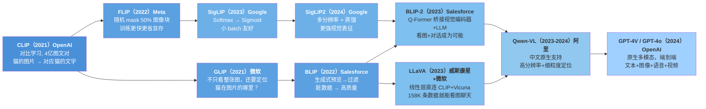

### 第一阶段：把 CLIP 做得更大、更好、更便宜

CLIP 之后，社区的第一个方向很自然——**怎么用更少资源得到更强的图文理解？**

| 论文 | 年份 | 一句话 | 核心创新 |
|------|:---:|--------|---------|
| **FLIP** | 2022 | 遮掉一半图像块照样训 | Masked Image Modeling。训练时随机遮挡 50% 的图像 patch，显存省一半，batch 能翻倍。推理时不遮。**快 4 倍，性能持平** |
| **SigLIP** | 2023 | Softmax → Sigmoid | CLIP 需要大 batch（32768+）才训得好，SigLIP 用独立二分类损失，小 batch 也稳。Google 出品，已被大量后续工作采用 |
| **SigLIP2** | 2024 | 多分辨率 + 蒸馏 | 输入不固定到单一尺寸，允许原生分辨率。蒸馏更大的文本模型到视觉塔，让视觉编码器也"懂"语言 |

**为什么 FLIP 的思路在具身智能里很受欢迎？** 机器人摄像头拿到的图像本身就有关键区域和非关键区域（机械臂在画面左侧，右侧可能是空白桌面）。FLIP 的随机 mask 训练天然教模型"从局部推断全局"——这恰好是机器人操作需要的。

### 第二阶段：从"整图理解"到"精准定位"

CLIP 知道图里有猫，但不知道猫在图片的哪个位置。GLIP 和 BLIP 系列解决的就是这个问题。

| 论文 | 年份 | 一句话 | 核心创新 |
|------|:---:|--------|---------|
| **GLIP** | 2021 | 图文定位 = 目标检测 + 短语匹配 | 把目标检测（bounding box）和图文对齐统一到一个框架里。输入"a red ball"，模型不仅知道图里有红球，还能画出框 |
| **BLIP** | 2022 | 用生成来过滤脏数据 | CLIP 直接从网上爬图文对，很多质量差。BLIP 先生成 caption 再过滤——"模型自己先写一遍图说，写得不好的图文对是脏的" |
| **BLIP-2** | 2023 | Q-Former 桥接视觉和语言 | 不是简单线性层，而是可学习的轻量 Transformer。冻结视觉编码器和 LLM，只训练中间的 Q-Former，参数少但效果好 |

**GLIP → 具身智能的直接桥梁**：机器人抓杯子不是"看图分类"，而是"在图像坐标系里定位杯子 → 把机械臂移过去"。GLIP 的 grounded 能力让视觉模型输出坐标，直接对接运动规划。

### 第三阶段：为什么不直接把 CLIP 接到大语言模型上？

这是 2023 年最重要的 insight——既然 CLIP 能看懂图，LLaMA 能聊天，**两者之间只要一个简单的投影层，就能让模型"看图说话"**。

**LLaVA 和 BLIP-2 的本质相同**：视觉编码器（看） → 连接器（翻译） → 语言模型（说）。区别只在于连接器的复杂度：

| 模型 | 视觉编码器 | 连接器 | 语言模型 | 训练数据 |
|------|:---:|:---:|:---:|:---:|
| BLIP-2 | CLIP/EVA ViT | Q-Former（可学习 Transformer） | OPT/FlanT5 | 129M 图文对 |
| LLaVA-1.0 | CLIP ViT-L | 一个线性层 | Vicuna-7B | 158K（GPT-4 生成）|
| LLaVA-1.5 | CLIP ViT-L | MLP（两层） | Vicuna-7B/13B | 665K |

关键结论：**数据质量 > 连接器复杂度 > 模型大小**。LLaVA 用最简连接器 + GPT-4 生成的高质量数据，在很多任务上持平甚至超越 BLIP-2。

### 第四阶段：原生多模态——文字和图像不再有边界

前三个阶段的模型都有一条清晰的边界——**视觉编码器 → 某种连接器 → 语言模型**。视觉和语言是分开处理的，图像先被"翻译"成视觉 token，再交给 LLM。

**GPT-4o（2024）打破了这个边界**。它从架构层面就是原生的多模态——文本、图像、语音、视频共享同一个 Transformer，不再有"视觉编码器"和"语言模型"的区分。什么都能输入，什么都能输出。

| 模型 | 年份 | 一句话 | 核心特点 |
|------|:---:|--------|---------|
| **Qwen-VL** | 2023-2024 | 中文最强开源多模态 | 原生中英文图文理解，支持 448² 高分辨率，细粒度视觉定位（能标出"图片中第三排左二的人"），完全开源 |
| **GPT-4o** | 2024 | 端到端全模态 | 文本/图像/语音/视频一体训练一体推理。延迟从 GPT-4V 的几秒降到 232ms。开源复现方向：Qwen2.5-VL、InternVL |

**Qwen-VL 特别值得关注**——因为它是中国团队做的，中文原生的多模态能力远超 CLIP+LlaVA 方案。如果你的项目主要服务中文用户，Qwen-VL 几乎是当前最佳的开源选项。

### 未来两年最可能的发展方向

1. **VLA（Vision-Language-Action）的爆发**：看 → 说 → 做，完整闭环。OpenVLA → TinyVLA → π0（Physical Intelligence 2024）——具身智能和多模态大模型的边界正在消失。
2. **纯视觉的放弃与回流**：越来越多证据表明，在具身和视频理解中，直接用 SigLIP 视觉特征比"转成文字再让 LLM 推理"更高效。也许未来的机器人不一定需要一个庞大的 LLM 中间层。
3. **Long-context 视觉**：不是看一张图，是看一段 10 分钟的视频。Qwen2.5-VL 已支持 1 小时视频输入，视频理解正在变成"超长上下文的多模态"问题。

### 一句话时间线

```
CLIP → FLIP/SigLIP（更快更稳）→ GLIP/BLIP（能定位了）→ BLIP-2/LLaVA（能聊天了）
→ Qwen-VL（中文+高分辨率）→ GPT-4o（全模态合一）→ VLA（能动手了）
```

> 📁 本扩展阅读涉及的所有论文 PDF 均已放入 `扩展资料/` 文件夹，方便随时翻阅原文。

---

> **下一节课预告**：大模型时代的多模态应用（RAG 与 Agent）——如何在 CLIP 基础上构建图像问答系统，以及如何把图文检索能力融入 AI Agent 的工具链。
