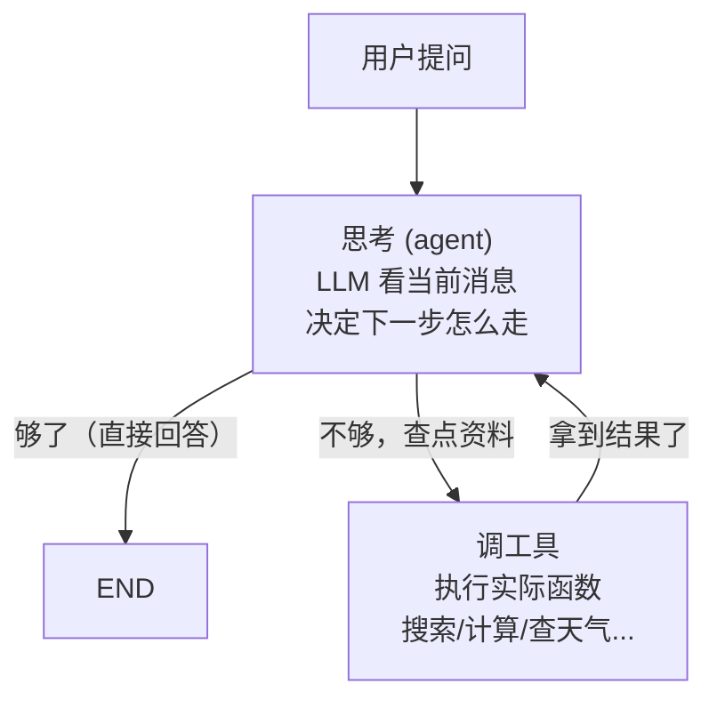
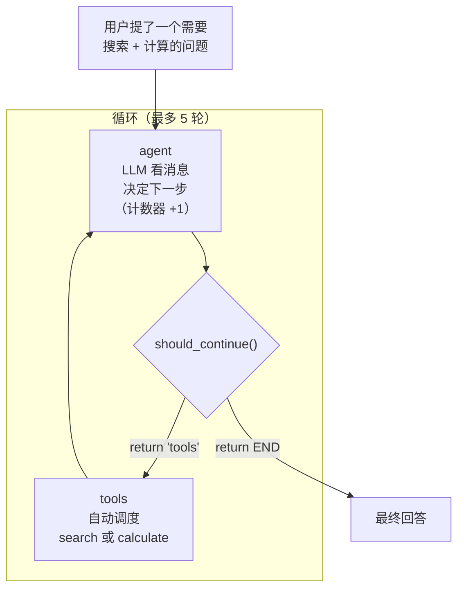

# LangChain、LangGraph 与 OpenAI 库入门指南

> **写给谁**：已经会写一点 Agent 代码（比如 hello-agents 第 4 章的 ReAct），但听到 LangChain、LangGraph、`openai` 这些名字还一头雾水的同学。  
> **怎么学**：和学 Git 一样——**先搞懂名词是什么意思，再借助 AI 写代码**。你不需要背 API，但需要知道"他们在说什么"。  
> **和本课程的关系**：第四节课你手写了 Tiny-Agent；第八节课 hello-agents 也手写了 ReAct。LangChain / LangGraph 是**工业界常用的封装版**——做的事差不多，只是帮你少写很多胶水代码。

---

## 零、学习心法：大模型时代怎么学框架？

你学 Git 的经验可以直接照搬：

| 学 Git 时 | 学 LangChain / LangGraph 时 |
| --- | --- |
| 知道 commit = 存档，push = 上传 | 知道 Chain = 串步骤，Graph = 画流程图 |
| 不用背每条命令参数 | 不用背每个类的全部方法 |
| 忘了就问 AI："帮我 git push 到远程" | 忘了就问 AI："用 LangChain 写一个带搜索工具的 Agent" |
| 看懂 AI 生成的命令在干什么 | 看懂 AI 生成的代码里每个组件在干什么 |

**三句话原则**：

1. **先建立词汇表**——本文档就是词汇表。
2. **再跑一个最小例子**——能跑通比背会重要。
3. **最后用 AI 做项目**——你负责提需求和审代码，AI 负责填细节。

---

## 一、先搞懂：`openai` 这个库到底是什么？

### 1.1 它不是 ChatGPT 本身

实习时你经常看到：

```python
from openai import OpenAI
```

很多人以为这是"调用 ChatGPT 的官方库"——**只对了一半**。

- **ChatGPT**：OpenAI 的产品，一个聊天网站/App。
- **`openai` Python 包**：一个**通用的 HTTP 客户端库**，用来调用"兼容 OpenAI 接口格式"的大模型服务。

类比：

| 现实世界 | 代码世界 |
| --- | --- |
| USB 接口 | OpenAI API 的**接口格式**（请求/响应长什么样） |
| Type-C 数据线 | `openai` 这个 **Python 库**（帮你传输数据） |
| 充电头、电脑、移动电源 | OpenAI、硅基流动、DeepSeek、通义……各家**模型服务** |

你在实习里写 `OpenAI(api_key=..., base_url=...)`，很可能连的根本不是 OpenAI 官网，而是**国内镜像或公司内网**。大家约定用同一套 API 格式，这样换模型不改代码——Python 一行 `base_url` 改完，所有地方自动切换。

### 1.2 你已经会用了，只是不知道它叫这个名字

第八节课 `hello-agents/code/chapter4/llm_client.py` 的核心就三行：

```python
from openai import OpenAI
self.client = OpenAI(api_key="sk-xxx", base_url="https://api.siliconflow.cn/v1/")
response = self.client.chat.completions.create(model="Qwen/Qwen2.5-32B", messages=[...])
```

第四节课 Tiny-Agent 也是同一套：

```python
from openai import OpenAI
client = OpenAI()
client.api_key = os.getenv("OPENAI_API_KEY")
client.base_url = os.getenv("OPENAI_BASE_URL")
response = client.chat.completions.create(messages=self.messages, tools=self.get_tool_schema())
```

**你就是通过 `openai` 这个 Python 库调的硅基流动（或其他模型提供商）。你只是不知道这个库叫 `openai`。**

### 1.3 五个必知概念（拿一句话说完）

`messages` 是核心——它就是你和模型的"聊天记录"。你把一段对话历史扔给模型，模型看完之后接上下一句。

```python
messages = [
    {"role": "system",    "content": "你是一个有帮助的助手。"},
    {"role": "user",      "content": "北京今天天气怎么样？"},
    {"role": "assistant", "content": "我无法获取实时天气……"},
    {"role": "user",      "content": "那告诉我 Python 怎么写 hello world"},
]
```

四种 `role` 名：
- `system`：给模型定规矩（"你是一个 XX 专家"）
- `user`：你说的
- `assistant`：模型回复的
- `tool`：工具返回的结果（后面讲）

两个常用参数：
- `temperature=0`：字面意思——温度越高，回答越"有创意"但也越可能胡编。做 RAG/Agent 一般设 0~0.3。
- `stream=True`：打字机效果（一个一个字蹦）。聊天界面用 True，后台批处理用 False。

### 1.4 Function Calling——让模型知道"我有很多工具可以调"

普通调模型只返回文字。但如果你传了 `tools` 参数，模型就可能会返回一个 **"我想调工具 X，参数是 Y"** 的结构化 JSON，而不是文本。

```python
response = client.chat.completions.create(
    model="gpt-4o",
    messages=messages,
    tools=[{
        "type": "function",
        "function": {
            "name": "search",
            "description": "搜索网页",
            "parameters": {
                "type": "object",
                "properties": {"query": {"type": "string"}},
                "required": ["query"]
            }
        }
    }],
)

# 模型说"我要调用 search 工具"
if response.choices[0].message.tool_calls:
    tc = response.choices[0].message.tool_calls[0]
    print(tc.function.name)       # → "search"
    print(tc.function.arguments)  # → '{"query":"华为最新手机"}'
```

> 这就是第四节课 `handle_tool_call()` 里做的事——LangChain / LangGraph 把这套流程封装好了，你不用手写解析 JSON 的那一堆代码。

### 1.5 一个能跑通的 openai 调通例子

```python
# 文件名：test_openai.py
import os
from dotenv import load_dotenv
from openai import OpenAI

load_dotenv()
client = OpenAI(
    api_key=os.getenv("LLM_API_KEY"),
    base_url=os.getenv("LLM_BASE_URL"),
)

resp = client.chat.completions.create(
    model=os.getenv("LLM_MODEL_ID"),
    messages=[{"role": "user", "content": "用一句话解释什么是 Agent"}],
)
print(resp.choices[0].message.content)
```

配上 `.env` 文件：

```bash
LLM_MODEL_ID=Qwen/Qwen2.5-32B-Instruct
LLM_API_KEY=sk-xxxxxxxx
LLM_BASE_URL=https://api.siliconflow.cn/v1/
```

```bash
pip install openai python-dotenv
python test_openai.py
```

只要跑通上面这个，后面所有 LangChain / LangGraph 的代码底层都是同一套逻辑。

---

## 二、LangChain 是什么——把你的 Agent 代码拆成六块积木

### 2.1 一句话讲清楚

**LangChain = 给大模型搭应用的"乐高积木盒"。**

你在 hello-agents 里手写 ReAct 时，要自己管 Prompt 拼接、LLM 调用、解析输出、记录历史、注册工具……每次改一个小地方就得改好几处代码。LangChain 把这些东西全拆成了**可替换的标准零件**，用 `|` 符号把它们串起来：

```
【原始手写】
"帮我写一个 Prompt 模板" → 写字符串 → f-string 填变量
"调一下模型" → 自己封装 OpenAI client
"把工具注册上" → function_to_json + inspect.signature

【LangChain】
ChatPromptTemplate.from_messages([...]) | ChatOpenAI(...) | StrOutputParser()
```

### 2.2 六个零件总览（先看一眼，后面每个都有详细例子）

| 零件 | 解决的问题 | 日常类比 |
| --- | --- | --- |
| **Model（模型）** | 怎么统一调用各种 LLM？ | 万能遥控器——换台换个频道号就行 |
| **Prompt（提示词模板）** | 怎么把变量塞进提示词？ | 邮件模板——填个名字就自动生成 |
| **Chain（链条）** | 怎么把多个步骤串起来？ | 工厂流水线——原料进去 → 成品出来 |
| **Tool（工具）** | 怎么让模型调用外部函数？ | 瑞士军刀——需要啥就用啥 |
| **Memory（记忆）** | 怎么让模型记住之前聊过啥？ | 助理的记事本 |
| **Retriever（检索器）** | 怎么从文档库里找相关内容？ | Ctrl+F——但用的是"意思相似"不是"字一样" |

### 2.3 零件一：Model——再也不用手写 client 了

**问题**：你每次调模型都要 `from openai import OpenAI`、读 env、设 api_key、base_url……麻烦。

**LangChain 解法**：一个类搞定所有：

```python
from langchain_openai import ChatOpenAI

# 和 openai 库一模一样，多了 langchain 的封装
llm = ChatOpenAI(
    model="Qwen/Qwen2.5-32B-Instruct",
    api_key="sk-xxx",
    base_url="https://api.siliconflow.cn/v1/",
    temperature=0,
)
```

**四种调用方式（依次体验一遍就懂了）**：

```python
# 方式一：invoke —— 一问一答，最常用
result = llm.invoke("用一句话解释什么是 Python 的 GIL")
print(result.content)   # ← 注意：LangChain 返回的是 AIMessage 对象，要 .content 取文字
# 输出：GIL（全局解释器锁）是 CPython 中的一个互斥锁，它确保同一时刻只有一个线程执行 Python 字节码。

# 方式二：invoke 传 messages 列表（和 openai 库一样）
from langchain_core.messages import HumanMessage, SystemMessage
result = llm.invoke([
    SystemMessage(content="你是一个幼儿园老师，用最最简单的话解释。"),
    HumanMessage(content="什么是 Python 的 GIL？"),
])
print(result.content)
# 输出：GIL 就像一个玩具房的钥匙，每次只有一个小朋友能进去玩，其他小朋友要在门口排队。

# 方式三：batch —— 批量调用，并行处理多个问题
questions = [
    "1+1 等于几？",
    "Python 是谁发明的？",
    "列表和元组的区别是什么？",
]
results = llm.batch(questions)
for q, r in zip(questions, results):
    print(f"问：{q}")
    print(f"答：{r.content}\n")

# 方式四：stream —— 打字机效果（做聊天界面时用）
for chunk in llm.stream("写一首关于编程的五言绝句"):
    print(chunk.content, end="", flush=True)
```

> 💡 **四句话**：`invoke` 一次一问、传列表随意控制 prompt、`batch` 批量处理省时间、`stream` 做打字机效果。

**换个模型就像换个充电头**——代码一模一样，只改两个参数：

```python
# 硅基流动的 Qwen
llm_qwen = ChatOpenAI(model="Qwen/Qwen2.5-32B", base_url="https://api.siliconflow.cn/v1/")

# DeepSeek 官方
llm_ds = ChatOpenAI(model="deepseek-chat", base_url="https://api.deepseek.com/v1")

# 通义千问（阿里）
llm_qw = ChatOpenAI(model="qwen-max", base_url="https://dashscope.aliyuncs.com/compatible-mode/v1")

# 各自的 API Key 写在 .env 里，代码完全不用动
```

### 2.4 零件二：Prompt——别再用 f-string 拼提示词了

**问题**：手写 ReAct 时，提示词长这样：

```python
prompt = f"""请注意，你是一个有能力调用外部工具的智能助手。
可用工具如下：{tools_desc}

请严格按照以下格式进行回应：
Thought: ...
Action: ...

现在，请开始解决以下问题：
Question: {question}
History: {history}"""
```

看起来还行是吧？但如果有一天你想**把 system prompt 换成中文**、**改工具描述格式**、**给不同的 Agent 用不同的 prompt**——这种硬拼字符串的做法就崩了。

**LangChain 的 Prompt 模板——把"填空"变得像 Excel 一样直观**：

```python
from langchain_core.prompts import ChatPromptTemplate

# 模板里用 {变量名} 占位
template = ChatPromptTemplate.from_messages([
    ("system", "你是一个{role}，回答风格是{style}。"),
    ("user", "{question}"),
])

# 填空！
prompt_value = template.invoke({
    "role": "喜剧脱口秀演员",
    "style": "用夸张的比喻和冷笑话",
    "question": "解释一下 Python 的内存管理",
})

# 看看填完长什么样
print(prompt_value.messages[0].content)
# → "你是一个喜剧脱口秀演员，回答风格是用夸张的比喻和冷笑话。"
print(prompt_value.messages[1].content)
# → "解释一下 Python 的内存管理"

# 填完直接接上模型就是一条链
chain = template | llm
result = chain.invoke({"role": "严谨的大学教授", "style": "严谨学术", "question": "什么是 GIL？"})
```

**三种字符串变体的实际效果**：

```python
# 1. from_template —— 最简单，只有一个 user 消息
from langchain_core.prompts import PromptTemplate

t = PromptTemplate.from_template("用{language}写一个{data_structure}的实现")
print(t.invoke({"language": "Java", "data_structure": "二叉树"}).text)
# → "用Java写一个二叉树的实现"

# 2. ChatPromptTemplate.from_messages —— 有 system + user 多条消息（最常用）
from langchain_core.prompts import ChatPromptTemplate

t = ChatPromptTemplate.from_messages([
    ("system", "你是{name}，专门解答{domain}问题。"),
    ("user", "{question}"),
])
msgs = t.invoke({"name": "Python 大师", "domain": "Python", "question": "装饰器是什么？"})
print(msgs.messages[0].content)  # → "你是Python 大师，专门解答Python问题。"

# 3. 从文件加载 —— 把 prompt 存在 .txt 里，改 prompt 不用动代码
# prompt.txt 内容：
#   你是一个{role}。请用{lang}回答以下问题：{question}

from langchain_core.prompts import PromptTemplate

with open("prompt.txt") as f:
    t = PromptTemplate.from_template(f.read())
print(t.invoke({"role": "翻译官", "lang": "英文", "question": "你好世界"}).text)
# → "你是一个翻译官。请用英文回答以下问题：你好世界"
```

> 💡 **核心**：模板 = 把经常变的内容（角色、问题、风格）抽象成 `{变量}`，稳定的结构（提示词框架）保持不变。后期你想调 prompt 效果——**改模板字符串就行，一行代码都不用动**。

### 2.5 零件三：Chain——用 `|` 流水线

Chain 就是"把零件串起来"。你学 Git 的 add → commit → push 就是一条链。

**最简链：模板 → 模型**

```python
from langchain_core.prompts import ChatPromptTemplate
from langchain_openai import ChatOpenAI

template = ChatPromptTemplate.from_messages([
    ("system", "把用户输入翻译成{target_lang}。"),
    ("user", "{text}"),
])
llm = ChatOpenAI(model="Qwen/Qwen2.5-32B", base_url="...", temperature=0)

chain = template | llm

result = chain.invoke({"target_lang": "英文", "text": "今天天气真好"})
print(result.content)  # → "The weather is really nice today"
```

**完整 RAG 链：模板 → 模型 → 输出清洗**

```python
from langchain_core.output_parsers import StrOutputParser
from langchain_core.runnables import RunnablePassthrough

def get_context(query):
    """假装这是你的向量数据库"""
    return "CLIP 是 OpenAI 提出的图文对比学习模型，用 4 亿图文对训练。"

chain = (
    {"context": get_context, "question": RunnablePassthrough()}
    | ChatPromptTemplate.from_messages([
        ("system", "根据以下上下文回答问题：\n{context}"),
        ("user", "{question}"),
    ])
    | ChatOpenAI(model="Qwen/Qwen2.5-32B", base_url="...", temperature=0)
    | StrOutputParser()  # ← 把 AIMessage 自动转成纯字符串，不用每次都 .content
)

print(chain.invoke("CLIP 用了多少数据？"))
# → "CLIP 用了 4 亿对图文进行训练。"
```

`RunnablePassthrough()` 的意思就是"原封不动往下传"——你问它"CLIP 用了多少数据？"，它就原样把这个问题往下传给模板。

对比一下手写版的代码量：

```python
# 手写版（你要写这些）
question = "CLIP 用了多少数据？"
context = get_context(question)
prompt = f"根据以下上下文回答问题：\n{context}\n\n问题：{question}"
result = llm.invoke(prompt)
print(result.content)

# Chain 版（你写这个）
chain = ({"context": get_context, "question": RunnablePassthrough()}
         | template | llm | StrOutputParser())
chain.invoke("CLIP 用了多少数据？")
```

Chain 写起来多了一点点抽象，但是**加一个步骤**就很容易——`| StrOutputParser()` 一句话搞定，手写要多一行 `result.content`。加步骤越多，Chain 的优势越明显。

> 💡 **Chain 就是"流水线思维"**——不要在一个大函数里塞所有逻辑，而是每个步骤一个零件，用 `|` 穿起来。改任意一个零件不影响其他。

### 2.6 零件四：Tool——用装饰器就好了，别手写 Schema

你已经手写过 `function_to_json()`——那段用 `inspect.signature` 自动生成 JSON Schema 的代码。LangChain 里只需要 `@tool` 装饰器：

```python
from langchain_core.tools import tool

@tool
def search_web(query: str) -> str:
    """在网上搜索信息。当需要知道事实、新闻、实时数据时使用。
    
    Args:
        query: 搜索关键词
    """
    # 实际调搜索 API（这里用假数据演示）
    return f"搜索结果：关于「{query}」，找到以下信息……"

@tool
def calculate(expression: str) -> str:
    """计算数学表达式。输入如 '3+5*2'。"""
    try:
        return f"计算结果：{eval(expression)}"
    except:
        return "计算失败，请检查表达式"

@tool
def get_weather(city: str) -> str:
    """查询城市天气。输入城市名。"""
    return f"{city}今天的天气：晴，25°C，适合出门散步。"

# 关键：直接把工具列表绑到模型上
llm_with_tools = llm.bind_tools([search_web, calculate, get_weather])
```

**三件事自动完成**：函数名 → tool name；docstring（`"""..."""`） → tool description；类型注解（`: str`） → 参数类型。和你手写的 `function_to_json()` 做的是完全一样的事。

**验证一下工具有没有被正确识别**：

```python
from langchain_core.messages import HumanMessage

# 问一个需要查天气的问题
resp = llm_with_tools.invoke([HumanMessage(content="告诉我北京今天天气怎么样？")])

print(resp.tool_calls)
# → [{"name": "get_weather", "args": {"city": "北京"}, "id": "..."}]
```

模型自动判断"这个问题需要调 `get_weather` 工具，参数是 `city='北京'`"。

**完整调用链条（调工具+拿到结果）**：

```python
from langchain_core.messages import HumanMessage, ToolMessage

# 1. 问一个问题
messages = [HumanMessage(content="北京天气如何？")]
resp = llm_with_tools.invoke(messages)

# 2. 模型决定调 get_weather
tool_call = resp.tool_calls[0]
print(f"模型想调：{tool_call['name']}({tool_call['args']})")
# → 模型想调：get_weather({'city': '北京'})

# 3. 你执行工具
tool_name = tool_call["name"]
tool_args = tool_call["args"]
result = get_weather.invoke(tool_args)  # 调用工具函数
print(f"工具返回：{result}")

# 4. 把结果塞回消息，模型基于结果生成最终回答
messages.append(resp)                                   # assistant 的 tool_calls 消息
messages.append(ToolMessage(content=result, tool_call_id=tool_call["id"]))  # tool 返回结果

final = llm_with_tools.invoke(messages)
print(final.content)
# → "北京今天天气晴朗，气温 25°C，非常适合出门散步！"
```

> 💡 这段逻辑你已经在 Tiny-Agent 的 `handle_tool_call()` 和 `get_completion()` 里写过一遍了。LangChain 帮你少写的就是"解析 JSON、查函数名映射、拼消息"这些胶水代码。

### 2.7 零件五：Memory——自动帮你记聊天记录

**手写版的问题**：你自己维护 `self.messages` 列表，每次手动 `append`。多线程时容易出错，聊天多了记忆爆炸。

**简单方案——用 list 就行**（配合刚才的 Tool 示例继续）：

```python
# 这就是最简单的记忆：一个 list
memory = []

# 第一轮
memory.append(HumanMessage(content="北京天气怎么样？"))
resp = llm_with_tools.invoke(memory)
memory.append(resp)
# ... 执行工具 ...
memory.append(ToolMessage(content=result, tool_call_id=...))
final = llm_with_tools.invoke(memory)

# 第二轮——memory 里已经有上一轮的完整记录了
memory.append(HumanMessage(content="那明天呢？"))
resp2 = llm_with_tools.invoke(memory)  # 模型看到了"北京天气"的上下文，知道你在问北京的明天
```

和 Tiny-Agent 的 `self.messages` 没啥区别。多轮对话靠的就是这个 list 越来越长。

**LangChain 封装版——自动存、自动取、自动截断**：

```python
from langchain_community.chat_message_histories import ChatMessageHistory
from langchain_core.runnables.history import RunnableWithMessageHistory

# 创建一个基于 session_id 的记忆仓库
store = {}

def get_history(session_id):
    if session_id not in store:
        store[session_id] = ChatMessageHistory()
    return store[session_id]

# 把记忆绑到链上
chain_with_memory = RunnableWithMessageHistory(
    chain,           # 你原来的 chain
    get_history,     # 告诉它记忆怎么取
    input_messages_key="question",  # chain 的输入里哪个字段是用户消息
    history_messages_key="chat_history",  # chain 里怎么引用历史（要在 prompt 里加 {chat_history}）
)

# 使用——同一个 session_id 自动保持记忆
resp1 = chain_with_memory.invoke(
    {"question": "我叫小明，帮我记住"},
    config={"configurable": {"session_id": "user_001"}}
)
resp2 = chain_with_memory.invoke(
    {"question": "我叫什么名字？"},
    config={"configurable": {"session_id": "user_001"}}  # 同一个 ID，自动加载历史
)
```

> 💡 **日常开发 99% 的情况用方案一（手动 list）就够**。方案二在需要多用户、自动截断长历史时才用。记住概念就行，忘了让 AI 帮你写。

### 2.8 零件六：Retriever——RAG 检索一步到位

第四节课你手写了 `VectorStore.query()` + `Embeddings.get_embedding()` + 余弦相似度计算。LangChain 里只有三步：

```python
# 第一步：准备文档
docs = [
    "CLIP 是 OpenAI 在 2021 年提出的图文对比学习模型，用 4 亿图文对训练。",
    "RAG 是检索增强生成，让 LLM 先查资料再回答。",
    "Python 是一种解释型编程语言，由 Guido van Rossum 在 1991 年发布。",
    "Transformer 架构由 Google 在 2017 年提出，基于自注意力机制。",
]

# 第二步：建向量库
from langchain_openai import OpenAIEmbeddings
from langchain_community.vectorstores import FAISS

embeddings = OpenAIEmbeddings(
    model="BAAI/bge-m3",          # 和 Tiny-RAG 用的一样的嵌入模型
    base_url="https://api.siliconflow.cn/v1/",
    api_key="sk-xxx",
)
vectorstore = FAISS.from_texts(docs, embeddings)

# 第三步：检索
retriever = vectorstore.as_retriever(search_kwargs={"k": 2})
results = retriever.invoke("关于人工智能的论文")
for doc in results:
    print(doc.page_content)
# → CLIP 是 OpenAI 在 2021 年提出的……
# → RAG 是检索增强生成……
```

**和你的 Tiny-RAG 对照**：

| Tiny-RAG 步骤 | LangChain 对应 |
| --- | --- |
| `ReadFiles().get_content()` | 直接准备 doc 文本列表 |
| `OpenAIEmbedding().get_embedding()` | `OpenAIEmbeddings()` |
| `VectorStore.query()` | `vectorstore.as_retriever().invoke()` |
| 手写余弦相似度 + argsort | FAISS 自动处理 |

**接上 Chain 完成完整 RAG**：

```python
from langchain_core.runnables import RunnablePassthrough
from langchain_core.output_parsers import StrOutputParser
from langchain_core.prompts import ChatPromptTemplate
from langchain_openai import ChatOpenAI

# 把检索结果拼接成字符串
def format_docs(docs):
    return "\n\n".join(doc.page_content for doc in docs)

# RAG 链：检索 → 格式化 → 填模板 → LLM → 输出
rag_chain = (
    {"context": retriever | format_docs, "question": RunnablePassthrough()}
    | ChatPromptTemplate.from_messages([
        ("system", "你是一个知识渊博的助手。根据以下上下文回答。\n\n{context}"),
        ("user", "{question}"),
    ])
    | ChatOpenAI(model="Qwen/Qwen2.5-32B", base_url="...", temperature=0)
    | StrOutputParser()
)

print(rag_chain.invoke("什么是 Transformer？"))
# → "Transformer 是由 Google 在 2017 年提出的架构，基于自注意力机制……"
```

---

## 三、LangGraph 是什么——把直线变成循环

### 3.1 一句话讲清楚

**LangGraph = 给 Agent 画流程图。**

LangChain 的 Chain 只能走直线：`A → B → C`。你只能一个步骤接着一个步骤往下走，没法回头。

但 Agent 不是这样的。回想你手写的 ReAct——它是一个 **while 循环**：思考一下 → 决定调什么工具 → 执行工具 → 看到结果 → 再思考一下 → ……直到问题解决。

LangGraph 就是用来画这种**有循环、有回头路**的工作流的。它把"代码里的 while 循环"变成了"图里的一个环"。

### 3.2 先感受一下——用图的方式理解 Agent 在做什么

你用自然语言描述一个 Agent 的工作过程：

> "用户问了一个问题。LLM 先想：我需要调工具吗？如果需要，就调工具，拿到结果后再想想够不够——不够就再调，够了就直接回答。如果不需要，就直接回答。"

画成图就是：



这就是 hello-agents 里 `ReAct.py` 那个 while 循环的"可视化版本"。**代码里的一条 while 循环 = 图里的一条环**。

### 3.3 四个关键词——先把话说清楚

在往下看代码之前，先把四个词的意思搞懂。它们就是搭图的"基本零件"：

| 关键词 | 大白话解释 | 类比 |
| --- | --- | --- |
| **State（状态）** | 图里"流转的东西"——其实就是 messages 聊天记录列表 | 快递包裹——每个节点往里塞东西，下一个节点拿出来用 |
| **Node（节点）** | 图里的一个"站点"——就是一个 Python 函数，接收 State，处理后返回更新 | 工厂流水线上的一个工位——原料进来，加工一下，传出去 |
| **Edge（普通边）** | "走完 A 必须走 B"，固定路线 | "上完了语文课接下去一定是数学课" |
| **Conditional Edge（条件边）** | "走完 A 之后看情况，可能去 B 也可能去 C"，不固定 | 十字路口——看红绿灯决定左转还是直行 |

> 你不需要记住所有参数。你只需要知道"我要搭一个图，需要 State、Node、Edge 这三样东西"。具体代码让 AI 帮你写。

---

### 3.4 第一步：从最简单的图开始——一个只会聊天的机器人

先从零搭一个**什么特殊功能都没有、只会调用 LLM 回答**的图。虽然简陋，但"搭图的四步骤"全在里面了。

#### 步骤一：定义 State——"包裹里装什么？"

State 就是整个图运行过程中传递的"共享包包"。对聊天机器人来说，这个包里只需要装一样东西——**聊天记录（messages）**。

```python
from typing import Annotated, TypedDict
from langgraph.graph.message import add_messages

class State(TypedDict):
    messages: Annotated[list, add_messages]
```

最后一行 `Annotated[list, add_messages]` 你当成固定写法抄就行。它的意思是："`messages` 是一个列表，有新消息往里加的时候用 `add_messages` 的方式合并"。

> 你就把它当成一个全局的 `messages = []` 来理解。只不过这个 list 会自动在图里的各个节点之间传递。

#### 步骤二：定义 Node——"每个站点干什么活？"

Node 就是一个普通的 Python 函数。它接收当前 State，干活，然后返回"我要往 State 里更新什么"。

```python
from langchain_openai import ChatOpenAI

llm = ChatOpenAI(model="Qwen/Qwen2.5-32B", base_url="...", temperature=0)

def chatbot(state: State):
    """把当前所有聊天记录扔给 LLM，拿到回复，塞进消息列表"""
    response = llm.invoke(state["messages"])  # LLM 看完所有聊天记录后接一句
    return {"messages": [response]}           # 把 LLM 的回复追加到 messages 里
```

这个函数做的事非常简单：**输入 = 到目前为止的聊天记录 → 输出 = LLM 的回复**。就这么一件事。

#### 步骤三：组装图——"站怎么排，路怎么走？"

有了 State 和 Node，接下来就是"把站点排好，用线连起来"。

```python
from langgraph.graph import StateGraph, START, END

graph = StateGraph(State)               # 拿一张白纸，告诉它"我的包裹格式是 State"
graph.add_node("chatbot", chatbot)      # 在纸上画一个站点，叫 "chatbot"，干活的是 chatbot 函数
graph.add_edge(START, "chatbot")        # 入口 → chatbot 站点
graph.add_edge("chatbot", END)          # chatbot 站点 → 出口

app = graph.compile()                   # 画好了，编译成可运行的图
```

就这样，三行 `add_node` / `add_edge` 就搭好了一张图。你告诉它：
- 有一个站点叫 `chatbot`
- 从 START 进来先进 `chatbot`
- `chatbot` 处理完直接 END 结束

#### 步骤四：运行——"往图的入口扔一条消息"

```python
result = app.invoke({"messages": [("user", "你好，用一句话介绍自己")]})
print(result["messages"][-1].content)
# → "你好！我是一个大语言模型助手，可以回答问题、写作、编程和提供各种帮助。"
```

把用户消息扔进去，图自动跑一遍，最后从 `result["messages"]` 里拿最后一条——就是 LLM 的回复。

#### 小结：搭图就这四个动作

```
① State  = 定义包裹的格式（messages 列表）
② Node   = 写干活函数（调 LLM / 调工具 / 做判断）
③ 组装   = 画点 + 连线（add_node + add_edge）
④ 运行   = 往入口扔数据（app.invoke）
```

上面这个图是最简单的情况——没分支、没循环、纯直线。接下来给它加上"分叉能力"。

---

### 3.5 第二步：加上条件分支——让 LLM 自己决定"走哪条路"

上面的图只有一条路：进来 → chatbot → 出去。但真正的 Agent 不是这样的——LLM 要想一下"我现在需要调工具吗？"如果需要，就去调工具；如果不需要，就直接回答。

这个"想一下然后做选择"的动作，在 LangGraph 里叫 **Conditional Edge（条件边）**。

#### 先理解"条件边"是干什么的

想象你在开车，到了一个路口。你不需要提前知道往哪转——你到路口了，看路牌，再做决定。

LangGraph 的条件边就是这样：**图走到某个站点后，不马上决定下一步去哪，而是先跑一个"路由器函数"，根据函数的返回值决定**。

路由函数长这样：

```python
from typing import Literal
from langchain_core.messages import AIMessage

def should_continue(state: State) -> Literal["tools", "__end__"]:
    """看一眼 LLM 的最后一条消息，判断下一步去哪"""
    last_message = state["messages"][-1]

    # 如果 LLM 回复里包含 tool_calls——说明它想调工具
    if isinstance(last_message, AIMessage) and last_message.tool_calls:
        return "tools"    # → 去 tools 站点

    # 如果只是普通文字回复——说明它已经回答了，可以结束了
    return END            # → 结束，输出最终回答
```

就这么简单。它不干别的，就是**看一眼当前状态，说一句"下一步往哪走"**。

#### 完整图：思考 →（有工具调用？）→ 调工具 → 回到思考

把上面的路由函数加上工具节点，和 3.4 节的搭图步骤拼在一起，得到一张"带转弯的图"。

**第一步：准备工具——多准备几个才有感觉**

一个工具太单薄，我们准备两个：

```python
from langchain_core.tools import tool

@tool
def search(query: str) -> str:
    """在网上搜索信息。当你不知道某个事实或需要最新数据时使用。"""
    return f"搜索结果：关于「{query}」……"

@tool
def calculate(expression: str) -> str:
    """计算数学表达式。支持加减乘除，如 '3+5*2'。"""
    try:
        return f"计算结果：{eval(expression)}"
    except:
        return "表达式格式有误，请检查"

tools = [search, calculate]
```

LLM 会自动根据用户的提问判断该用哪个工具。问事实就用 search，问计算就用 calculate。**工具越多，Agent 越像一个真正的"多面手"**。

**第二步：创建带工具的 LLM + 工具执行节点**

```python
llm = ChatOpenAI(model="Qwen/Qwen2.5-32B", base_url="...", temperature=0)
llm_with_tools = llm.bind_tools(tools)     # 告诉 LLM："你有 search 和 calculate 两个工具"

from langgraph.prebuilt import ToolNode
tool_node = ToolNode(tools)                # 自动执行器：收到调用 → 执行 → 返回结果
```

`ToolNode` 就像一个接线员。LLM 说"帮我调 calculate，参数是 3+5"，ToolNode 就自动找到 `calculate` 函数、传入 `3+5`、把返回值包装好再传回去。**你不需要写任何 if/elif 来判断"LLM 到底调了哪个工具"**。

**第三步：定义思考节点**

```python
def agent(state: State):
    """把当前消息扔给 LLM，让它决定：直接回答还是调工具"""
    response = llm_with_tools.invoke(state["messages"])
    return {"messages": [response]}
```

这个函数做的事情：看一眼当前所有聊天记录（包括之前工具的返回结果），让 LLM 接下一句。下一句可能是"我应该调 search 工具"（返回 tool_calls），也可能是"根据搜索结果，答案是……"（返回普通文本）。

**第四步：组装——画站点、画路线**

```python
from langgraph.graph import StateGraph, START, END

graph = StateGraph(State)

# 画两个站点
graph.add_node("agent", agent)     # 思考站
graph.add_node("tools", tool_node)  # 工具站

# 画三条线
graph.add_edge(START, "agent")                          # ① 入口 → 思考
graph.add_conditional_edges("agent", should_continue)   # ② 思考完 → 路由器判断
graph.add_edge("tools", "agent")                        # ③ 工具完 → 回思考（循环！）

app = graph.compile()
```

三条线的作用：

| 线 | 从哪到哪 | 什么时候走 |
| --- | --- | --- |
| ① | START → agent | 程序启动，进入思考 |
| ② | agent → ??? | 思考完后，由 `should_continue` 决定去 tools 还是 END |
| ③ | tools → agent | 工具执行完了，带着结果回去让 LLM 再想一下 |

③ 号边就是**循环边**——tool 执行完永远回到 agent。如果 LLM 觉得还不够，再调工具 → 再回到 agent，无限循环，直到 LLM 觉得够了为止。

**第五步：运行——看看 messages 列表里到底发生了什么**

```python
result = app.invoke({"messages": [("user", "华为最新手机卖多少钱？帮我把价格翻倍算一下")]})
print(result["messages"][-1].content)
```

这背后 messages 的**完整流转过程**是这样的（这才是理解 Agent 的关键）：

```
第1轮 — agent 节点
  输入：["user: 华为最新手机卖多少钱？帮我把价格翻倍算一下"]
  输出：AIMessage(tool_calls=[{"name": "search", "args": {"query": "华为最新手机 价格"}}])
  → should_continue 发现有 tool_calls → 路由到 tools

第2轮 — tools 节点
  执行：search("华为最新手机 价格")
  返回：ToolMessage("搜索结果：Mate 70 Pro，6999 元……")
  → 自动追加到 messages 列表
  → 无条件回到 agent

第3轮 — agent 节点（第二轮思考）
  输入：["user: ……", "AIMessage(tool_calls)", "ToolMessage(搜索结果……)"]
  输出：AIMessage(tool_calls=[{"name": "calculate", "args": {"expression": "6999*2"}}])
  → should_continue 发现有 tool_calls → 路由到 tools

第4轮 — tools 节点
  执行：calculate("6999*2")
  返回：ToolMessage("计算结果：13998")
  → 回到 agent

第5轮 — agent 节点（第三轮思考）
  输入：包含了全部历史 + 两个工具结果
  输出：AIMessage("华为 Mate 70 Pro 售价 6999 元，翻倍后是 13998 元。")
  → should_continue 发现没有 tool_calls → 返回 END
```

你看，LLM 自己决定**先搜再算**——它不需要你告诉它"先调 search 再调 calculate"。这就是 LLM 规划能力的体现。

**加上最大步数限制——防止死循环**

真实项目里你一定要加这个，否则 LLM 可能在"调工具 → 不满意 → 再调工具 → 还是不满意"里无限循环：

```python
class State(TypedDict):
    messages: Annotated[list, add_messages]
    step_count: int       # 新增：计数器

def agent(state: State):
    """思考节点：LLM 决定下一步"""
    response = llm_with_tools.invoke(state["messages"])
    return {"messages": [response], "step_count": state.get("step_count", 0) + 1}

def should_continue(state: State) -> Literal["tools", END]:
    """路由器：加了步数限制"""
    # 超过 5 轮就不让调工具了，强制结束
    if state.get("step_count", 0) >= 5:
        return END

    last_message = state["messages"][-1]
    if isinstance(last_message, AIMessage) and last_message.tool_calls:
        return "tools"
    return END
```

> 💡 这和你手写 `while current_step < self.max_steps` 是一模一样的逻辑，只不过用图的方式表达了出来。

**整张图总结**：



> 你会发现，这跟你手写 ReAct.py 里的 while 循环完全一样——**思考 → 工具 → 观察 → 思考 → 回答**。只不过 LangGraph 用图来表示了，而不是用 while + if。

---

### 3.6 一步到位——`create_react_agent` 是一张"预制图纸"

上面 3.5 节的图你自己搭了一遍，理解了 State / Node / Edge / Conditional Edge 怎么用。但日常开发时，LangGraph 给你准备好了一张"标准 ReAct 图纸"——叫 `create_react_agent`。

它等于是把 3.5 节那几十行图搭代码全部帮你写好了。你只需要告诉它两件事：**用什么模型 + 有哪些工具**。

```python
from langgraph.prebuilt import create_react_agent

agent = create_react_agent(llm, tools=[search, get_time])

# 用起来和 app.invoke 一模一样
result = agent.invoke({"messages": [("user", "现在几点了？华为最新的手机是什么？")]})
print(result["messages"][-1].content)
```

跟手写版对比一下代码量：

```
手写 ReAct.py：while 循环 + Thought/Action 解析 + Finish 判断 + 工具映射 → 约 100 行
create_react_agent：两行代码 → 同样的效果
```

但这里有个重点：**`create_react_agent` 不是让你偷懒不学底层的**。它的真正价值在于——你已经理解了里面那张图长什么样，所以你可以在这张**预制图的基础上自己改**。比如：

- 想加一个"人工审核"环节？在图里插一个 `human_review` 节点
- 想加一个"日志记录"步骤？在图里插一个 `logger` 节点
- 想让 Agent 在做决定前先查一次本地知识库？在图里插一个 `retrieve` 节点

这些都是 LangChain 的 Chain 做不到的——Chain 只能走直线，而 LangGraph 的图随便你怎么改路线。

> 先用 `create_react_agent` 快速跑通，需要定制时再回到 3.5 节手工搭图。这个学习路线和你学 Git 一样——先用 `git add . && git commit -m "..."`，遇到复杂场景再学 `rebase`、`cherry-pick`。

---

## 四、实战：用 AI 从零做一个项目

这是本章最实用的内容。你现在知道 LangChain 和 LangGraph 的零件是什么了，但**还是不知道该从哪下手**。

### 4.1 核心心法：你不是"写代码的人"，你是"产品经理"

| 过去 | 现在（大模型时代） |
| --- | --- |
| 你想"我该怎么用 LangChain 的 RecursiveCharacterTextSplitter？" | 你想"我要把一个 PDF 切成 500 字一块，重叠 50 字" |
| 你去 Google → StackOverflow → 抄代码 | 你告诉 AI 你的需求，它给你代码，你审查 |
| 你被困在 API 细节里 | 你站在架构层面想："这个功能需要哪些组件？" |

### 4.2 实战案例：做一个"论文问答助手"

**需求**：上传一篇论文 PDF，然后可以问里面任何问题。

**第一步：用组件思维拆解需求（这步你自己做）**

```
用户上传 PDF
  → 需要：文档加载器（读取 PDF）
  → 需要：文本分块器（切成小段）
  → 需要：向量库（存向量 + 检索）
用户提问
  → 需要：LLM（回答）
  → 需要：Prompt 模板（指导 LLM 基于上下文回答）
  → 需要：Chain（把上面的串起来）
```

你列好这个清单后，心里就有数了：**需要 6 个零件，分别是 loader / splitter / embeddings / vectorstore / prompt / llm**。

**第二步：给 AI 下任务单**

```
我要用 LangChain 做一个论文问答助手。需求：
- 用户上传一篇 PDF 论文
- 系统把 PDF 切成小段，每段约 500 字，段和段之间重叠 50 字
- 用 BAII/bge-m3 做嵌入，用 FAISS 做向量存储和检索，top_k=3
- 模型用 ChatOpenAI，base_url 和 api_key 从 .env 读
- 用 LCEL 链式调用：检索 → 格式化 → 填模板 → LLM → 输出
- 要求：用户输入问题后，打印检索到的 3 个片段，再打印 LLM 回答

请给出完整可运行代码 + requirements.txt，尽量简洁，一个文件搞定。
```

**第三步：AI 给你代码，你审查**

AI 会输出类似这样的代码（节选关键部分）：

```python
import os
from dotenv import load_dotenv
load_dotenv()

from langchain_community.document_loaders import PyPDFLoader
from langchain_text_splitters import RecursiveCharacterTextSplitter
from langchain_openai import OpenAIEmbeddings, ChatOpenAI
from langchain_community.vectorstores import FAISS
from langchain_core.prompts import ChatPromptTemplate
from langchain_core.output_parsers import StrOutputParser
from langchain_core.runnables import RunnablePassthrough

# 1. 加载 PDF
def load_pdf(file_path):
    loader = PyPDFLoader(file_path)
    return loader.load()  # 返回每页的 Document 对象

# 2. 分块
def split_docs(docs):
    splitter = RecursiveCharacterTextSplitter(
        chunk_size=500,       # 500 字一块
        chunk_overlap=50,     # 块间重叠 50 字
        separators=["\n\n", "\n", "。", "，", " ", ""],
    )
    return splitter.split_documents(docs)

# 3. 建向量库
embeddings = OpenAIEmbeddings(
    model="BAAI/bge-m3",
    base_url=os.getenv("LLM_BASE_URL"),
    api_key=os.getenv("LLM_API_KEY"),
)

def build_index(file_path):
    docs = load_pdf(file_path)
    chunks = split_docs(docs)
    print(f"加载了 {len(docs)} 页，切分成 {len(chunks)} 块")
    return FAISS.from_documents(chunks, embeddings)

# 4. RAG 链
def create_chain(vectorstore):
    retriever = vectorstore.as_retriever(search_kwargs={"k": 3})
    
    llm = ChatOpenAI(
        model=os.getenv("LLM_MODEL_ID"),
        base_url=os.getenv("LLM_BASE_URL"),
        api_key=os.getenv("LLM_API_KEY"),
        temperature=0,
    )
    
    def format_docs(docs):
        return "\n\n---\n\n".join(doc.page_content for doc in docs)
    
    prompt = ChatPromptTemplate.from_messages([
        ("system", """你是一个学术论文助手。根据以下论文片段回答用户问题。
如果片段中没有相关信息，请明确说"论文中没有提到"。
不要编造任何内容。

论文片段：
{context}"""),
        ("user", "{question}"),
    ])
    
    return (
        {"context": retriever | format_docs, "question": RunnablePassthrough()}
        | prompt
        | llm
        | StrOutputParser()
    )

# 5. 主程序
if __name__ == "__main__":
    vectorstore = build_index("paper.pdf")
    chain = create_chain(vectorstore)
    
    while True:
        question = input("\n请输入问题（输入 q 退出）：")
        if question == "q":
            break
        print(f"\n检索到的片段：")
        docs = vectorstore.similarity_search(question, k=3)
        for i, doc in enumerate(docs):
            print(f"  [{i+1}] {doc.page_content[:100]}...")
        print(f"\n回答：{chain.invoke(question)}")
```

**第四步：你审查——按清单逐一检查**

- [x] `base_url` 和 `api_key` 从环境变量读的？ ✅ `os.getenv(...)`
- [x] 工具函数的 docstring 写清楚了吗？ N/A——这个项目没用到 tool
- [x] 分块大小合理吗？ ✅ 500 字 + 50 重叠，合理
- [x] Prompt 里有限制模型不编造的指令吗？ ✅ "如果片段中没有，请明确说论文中没有提到"
- [x] 有错误处理吗？ ❌ 没有——加一个 `try/except` 在 loader 外面

**第五步：迭代优化**

你审查完发现少了个错误处理，直接告诉 AI：

```
在上面代码里，给 load_pdf 加 try/except，如果文件不存在或损坏，打印友好提示并返回空列表
```

AI 帮你改好，你粘贴回去。再测试一下，发现检索出来的片段太长，改成 300 字一块：

```
把 chunk_size 改成 300，overlap 改成 30
```

**这就是用 AI 开发的全部流程**。你的价值不是敲代码，而是：
1. **拆需求**（把"做一个论文问答"拆成 6 个组件）
2. **审代码**（按清单逐一检查）
3. **迭代优化**（发现问题 → 告诉 AI → 测试）

### 4.3 进阶需求怎么提——Agent 版本

上面是固定链路的 RAG。如果你想做 Agent 版——让用户**除了问论文，还能让 Agent 搜索网络补充信息**：

```
在上面的论文问答助手基础上，用 LangGraph 的 create_react_agent 升级为 Agent：
- 保留 PDF 向量检索作为第一个工具
- 新增一个 search_web 工具（用 @tool 装饰器）
- Agent 自主决定：这个问题只需要查论文，还是需要额外搜索网络
- 保留最大步数 5 的限制
请给出完整代码
```

AI 会生成：

```python
@tool
def search_paper(question: str) -> str:
    """在论文 PDF 中搜索。当用户问论文相关内容时优先使用。"""
    docs = vectorstore.similarity_search(question, k=3)
    return "\n\n".join(doc.page_content for doc in docs)

@tool
def search_web(query: str) -> str:
    """搜索网络信息。当需要论文之外的知识时使用。"""
    return f"网络搜索结果：关于「{query}」……"

agent = create_react_agent(llm, tools=[search_paper, search_web])
result = agent.invoke({"messages": [("user", "论文里提到的 CLIP 模型后来有什么改进？")]})
# Agent 会先调 search_paper 看论文里的内容，发现论文是 2021 年的 → 自动调 search_web 查最新进展
```

### 4.4 万能 Prompt 模板——拿这个去问 AI

**搭功能**：
```
我要做一个 [XXX] 功能的 LangChain/LangGraph 应用。需求：
- 模型用 ChatOpenAI，从 .env 读配置
- [你的具体需求1]
- [你的具体需求2]
请给出完整可运行代码，每个函数加中文注释。
```

**调试**：
```
我的 LangChain 代码报错了：[粘贴错误信息]。代码是：[粘贴代码]。请分析原因并给出修改方案。
```

**升级**：
```
我有一段手写的 Agent 代码：[粘贴 hello-agents/ReAct.py]。请用 LangGraph 重写，保留所有功能，重点解释手写版和 LangGraph 版的对应关系。
```

**换模型**：
```
我的 ChatOpenAI 想换成 [DeepSeek / 通义千问 / ...]，原来的代码是：[粘贴]。请给出修改后的配置。
```

### 4.5 动手验证——你现在的任务

选一个，用上面的方法试着跑通：

- [ ] 论文问答助手（RAG 版）——参考 4.2 节
- [ ] 论文问答助手（Agent 版）——参考 4.3 节
- [ ] 把 hello-agents/ReAct.py 用 LangGraph 重写——参考 3.6 节

---

## 五、安装 + 速查 + 推荐资源

### 5.1 安装

```bash
pip install langchain langchain-core langchain-openai langchain-community
pip install langgraph
pip install openai python-dotenv
pip install faiss-cpu pypdf langchain-text-splitters
```

### 5.2 词汇速查卡

| 词汇 | 一句话 |
| --- | --- |
| **openai** | 统一调大模型的 Python 库（不是 ChatGPT） |
| **messages** | 聊天记录列表，含 role + content |
| **ChatOpenAI** | LangChain 封装的大模型调用（底层还是 openai） |
| **ChatPromptTemplate** | 填 `{变量}` 的提示词模板 |
| **`|` 运算符** | 把步骤串成流水线（Chain） |
| **@tool** | 装饰器——把普通函数变成 LLM 可调用的工具 |
| **State** | LangGraph 图里流转的共享数据 |
| **Node** | 图里的一个处理步骤（一个函数） |
| **Conditional Edge** | 条件分支（if/else） |
| **create_react_agent** | LangGraph 预制 ReAct 图 |
| **Retriever** | 从向量库查相关文档 |
| **FAISS** | 向量存储和检索引擎 |

### 5.3 开发心法速记

```
你的任务 = 拆需求（需要哪些组件？）
       → 写 Prompt 给 AI（用本文档的词汇，越具体越好）
       → 审代码（按清单看）
       → 运行 → 发现问题 → 再告诉 AI → 迭代
```

---

> **最后一句话**：你不需要成为 LangChain 专家，就像你不需要成为 Git 专家一样。你只需要知道"有哪些零件、什么时候用哪个"，剩下的交给 AI 和你的审代码能力。这才是大模型时代工程师的核心竞争力。
