# 第八节课讲义：Agent 智能体入门到进阶

> 本讲义将 Agent 篇的 14 个小节用通俗易懂的方式重新编排，先讲故事建立直觉，再讲技术原理。
> 图片均来自 `图片和附件/` 目录，在阅读时请根据实际情况调整图片路径。

---

## 目录

1. [什么是 Agent？——给 AI 装上手和脚](#1-什么是-agent给-ai-装上手和脚)
2. [Agent 有哪几种？——一个人干还是一群人干](#2-agent-有哪几种一个人干还是一群人干)
3. [Planning：Agent 怎么思考？——让 AI 学会"走一步看三步"](#3-planningagent-怎么思考让-ai-学会走一步看三步)
4. [Memory：Agent 怎么记住东西？——AI 也需要记事本](#4-memoryagent-怎么记住东西ai-也需要记事本)
5. [Tool：Agent 怎么用工具？——给 AI 配一个瑞士军刀](#5-toolagent-怎么用工具给-ai-配一个瑞士军刀)
6. [为什么多智能体老是翻车？——三个和尚没水喝](#6-为什么多智能体老是翻车三个和尚没水喝)
7. [MCP：给工具调用装一个"统一插头"](#7-mcp给工具调用装一个统一插头)
8. [Skills：给 Agent 写一本工作手册](#8-skills给-agent-写一本工作手册)
9. [OpenClaw 是怎么设计的？——解剖一个开源 Agent 框架](#9-openclaw-是怎么设计的解剖一个开源-agent-框架)
10. [Hermes：一个会"自我进化"的 Agent](#10-hermes一个会自我进化的-agent)
11. [Harness Engineering：驾驭大模型的"马具"](#11-harness-engineering驾驭大模型的马具)
12. [Harness 综述：ETCLOVG 七层架构](#12-harness-综述etclovg-七层架构)
13. [Loop Engineering：让 Agent 自己跑起来](#13-loop-engineering让-agent-自己跑起来)
14. [Skills 自进化：Agent 越用越聪明](#14-skills-自进化agent-越用越聪明)

---

## 1. 什么是 Agent？——给 AI 装上手和脚

### 先说问题：大模型有什么毛病？

大模型虽然能说会道，但它有一个致命的短板——**它不会主动更新自己的知识**。你问它"今天北京天气怎么样"，它只能瞎编，因为它不知道今天是什么日子，也没有查天气的能力。

这就是"事实幻觉"——大模型有可能会一本正经地胡说八道。

**RAG 是第一步补救**：让大模型先去本地知识库里搜索一下，找到相关材料再回答。这解决了"查本地资料"的问题。

但如果本地知识库里也没有呢？比如你问"帮我订一张明天北京到上海的机票"，这就需要**真正去操作外部系统**——查航班、比较价格、下单购买。

RAG 只负责"查"，不负责"做"。能做这些的就是 **Agent**。

### Agent 是什么？

一句话：**Agent 是大模型 + 规划能力 + 记忆能力 + 工具使用能力的组合体**。它能让大模型不仅仅是"聊天"，而是"干活"。

从结构上看，Agent 就像一个人，有三个部分：

| 人体类比 | Agent 组件 | 做什么 |
|---------|-----------|--------|
| 眼睛、耳朵 | **Perception（感知）** | 接收文字、图片、语音等输入，了解外部世界 |
| 大脑 | **Brain（大脑）** | 存储信息、记忆、做决策、规划路线 |
| 手脚 | **Action（行动）** | 调用 API、执行命令、操作工具 |

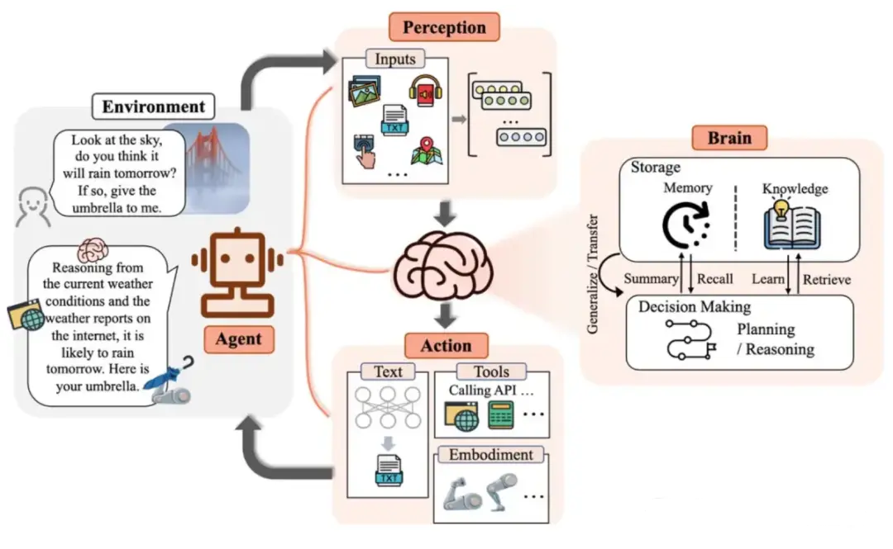

### Agent 的核心三大能力

**① 规划（Planning）**——最核心的能力。就像你接到一个任务"帮我策划一次北京三日游"，你不会直接开始订机票，而是先拆解：
1. 查往返航班
2. 选几个景点
3. 安排每天的路线
4. 订酒店

Agent 也是一样的，先把复杂任务拆成子任务，再逐步执行。执行过程中还要反思——这一步做对了吗？要不要调整？

**② 记忆（Memory）**——分短期和长期：
- **短期记忆**：当前对话的上下文，像你聊天时记得"刚才说过什么"。受限于上下文窗口长度。
- **长期记忆**：存在外部向量数据库里，Agent 可以随时检索。就像你的笔记本。

**③ 工具使用（Tools）**——Agent 不止会说话，还能：
- 调用搜索 API 查信息
- 调用计算器算数学
- 执行代码
- 操作文件系统

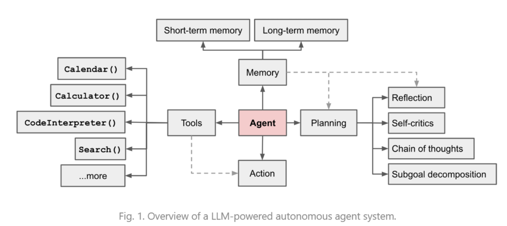

### 人机合作的三种模式

从"人干活"到"AI 干活"，经历了三个阶段：

- **SaaS + AI（人类主导）**：AI 只做特定功能（如人脸识别、OCR），大部分活还是人干。就像 Word 里的拼写检查。
- **Copilot（AI 做助手）**：AI 随时辅助，人主导、AI 辅助。就像 GitHub Copilot 帮你补代码。
- **Agent（AI 主导）**：人只提需求，AI 全程负责执行。这才真正通向 AGI（通用人工智能）。

---

## 2. Agent 有哪几种？——一个人干还是一群人干

### 单 Agent：一个人包办

就像一个自由职业者，一个人接活、一个人干活、一个人交付。

- **优点**：简单，不需要协调沟通
- **缺点**：遇到复杂的活就扛不住了。而且一旦这个人出问题，整个系统就瘫痪了。
- **适用场景**：单一明确的任务，比如专门做市场分析调研的 Agent。

### 多 Agent：一个团队协作

就像一家公司，产品经理、设计师、程序员、测试各司其职，通过沟通协作完成一个产品。

- **优点**：能处理复杂多变的任务，一个人做不来的，团队能做。个别成员即使出问题，系统还能继续运转（鲁棒性强）。
- **缺点**：沟通协调成本高。多个 Agent 之间要同步信息、对齐目标，容易出岔子。
- **经典例子**：斯坦福小镇——多个 AI Agent 在一个模拟小镇里各自生活、互动。

### 混合 Agent：人机配合

人和 AI 一起干活。就像医生看病——Agent 快速分析医疗记录、影像资料，给出初步诊断建议，但最终决定权在医生手里。

- **优点**：结合了 AI 的效率和人类的判断力，质量更高
- **缺点**：开发复杂度高
- **适用场景**：需要人类最终把关的任务（医疗、法律、金融）

---

## 3. Planning：Agent 怎么思考？——让 AI 学会"走一步看三步"

Planning（规划）是 Agent 最核心的大脑功能。接到一个复杂任务时，Agent 需要把它拆成小步骤，一步步执行，执行过程中还要反思和调整。

### 3.1 基础规划方法

#### CoT（Chain of Thought，思维链）：把你的思考过程写出来

**故事**：你是一个数学老师，学生问你"鸡兔同笼"问题。你不能直接说"答案是 23 只鸡和 12 只兔"，你得把推理过程一步一步写出来："假设全是鸡，那就怎么怎么样……"

CoT 就是这个意思——**让大模型把推理过程写出来，而不是只给结论**。

- **怎么做**：很简单，在 Prompt 里加一句"让我们一步一步思考"就行。这叫 Zero-shot CoT。
- **进阶版**：给模型看几个"带着推理过程的例子"，这叫 Few-shot CoT。就像先给孩子看几道例题的完整解题过程。
- **缺点**：思考过程很长，推理时间更久。而且如果模型本身推理能力不够，写了过程也可能会错。

#### ToT（Tree of Thought，思维树）：多想想，选最好的

**故事**：你要从北京去上海，有几种方案？高铁 4.5 小时、飞机 2 小时、自驾 12 小时。你会把每种方案的优缺点列出来，然后选最优的。

CoT 是"一条路走到黑"，ToT 是"先列出多条路，每条评估一下，再选最好的"。

- **怎么做**：把任务分成多个步骤，每个步骤让模型生成多个候选方案，然后用搜索算法（如广度优先或深度优先）找到最优路径。

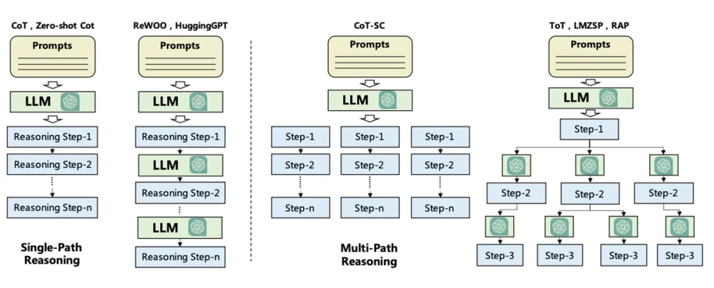

#### LLM+P：大模型写规划，传统算法求解

**故事**：大模型想象力丰富但不擅长精确计算，传统规划算法计算精准但看不懂自然语言。怎么办？让他们合作！

- **大模型负责**：把你的自然语言需求翻译成 PDDL（一种规划领域定义语言）
- **传统规划器负责**：用高效算法求出最优解
- **大模型再负责**：把结果翻译回自然语言

就像你告诉翻译"帮我找个最好的旅行路线"，翻译把需求转给导航软件，导航软件算完，翻译再把结果告诉你。

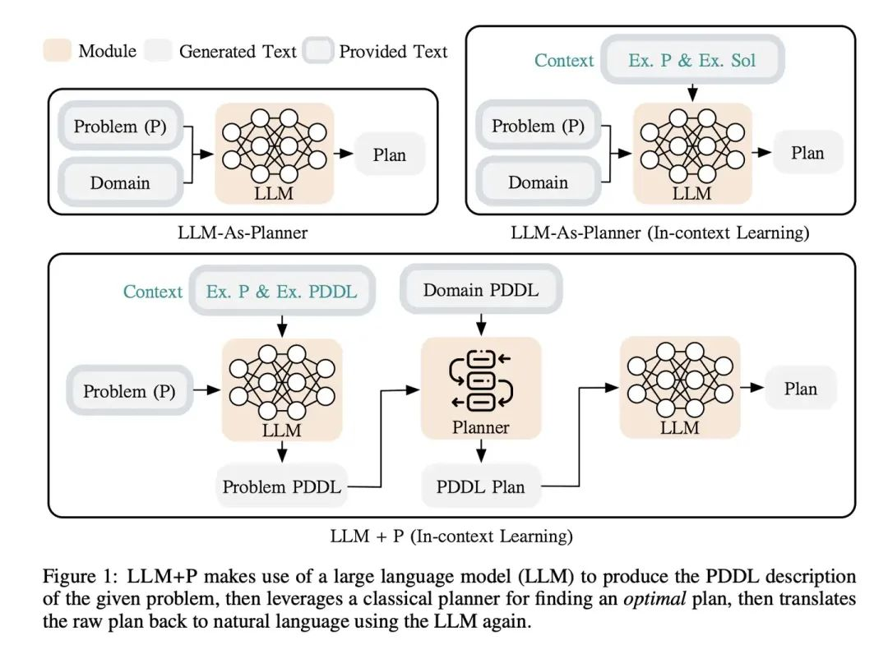

#### ReAct：边想边做，做了再看

这是目前最经典的 Agent 范式。ReAct 是 Reasoning（推理）+ Acting（行动）的结合。

**故事**：你让助手查"微软市值要涨多少才能超过苹果"。助手的做法：

1. **思考（Thought）**：我需要先知道微软和苹果各自的市值。
2. **行动（Action）**：打开搜索引擎，搜索"微软当前市值"。
3. **观察（Observation）**：搜索结果返回"微软市值约 2.8 万亿"。
4. **思考**：好，现在需要苹果的市值。
5. **行动**：搜索"苹果当前市值"。
6. **观察**：返回"苹果市值约 3.2 万亿"。
7. **思考**：苹果市值减去微软市值 = 4000 亿。微软需要再涨 4000 亿才能超过苹果。
8. **行动**：返回最终答案。

这就是经典的 **Thought → Action → Observation** 循环。对比只用 CoT：
- CoT 只能靠模型自己瞎猜"微软市值大概多少"（可能猜错）
- ReAct 会真的去搜一下（拿到真实数据）

**ReAct 解决了什么问题？**
- CoT 容易产生幻觉，ReAct 用搜索验证
- 每一步推理都被记录下来，可解释性强
- 可以调用外部工具获取真实信息

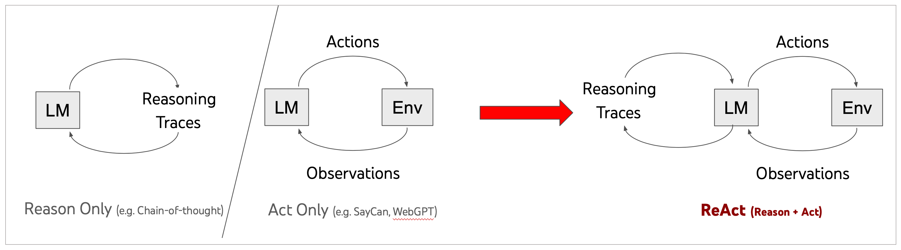

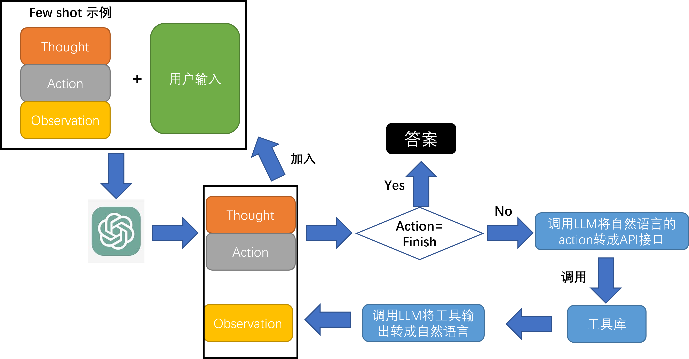

### 3.2 进阶规划方法——怎么省 Token 又提速度？

ReAct 有一个大毛病：**每一步都要把前面所有的思考、行动、观察重新喂给模型**。就像你每做一步工作就要跟老板从头汇报一遍，token 消耗巨大。

下面三个方法就是三个"省 token 妙招"：

#### ReWoo：厨师长派活模式

**故事**：你是餐厅厨师长。客人点了一桌菜。

- **ReAct 的做法（笨）**：每做完一道菜，把前面做过的所有菜再"汇报"一遍。费时费力。
- **ReWoo 的做法（聪明）**：一次性列好菜单，分给三个厨师，最后汇总。

ReWoo 把任务拆给三个角色：
- **Planner（规划师）**：分析问题，拆解成子任务列表，分配给 Worker
- **Worker（工人）**：各自调用工具获取数据，互不干扰
- **Solver（汇总师）**：把所有 Worker 的结果汇总，生成最终答案

**核心优势**：最少只需调两次 LLM（一次规划、一次汇总），比 ReAct 省得多！

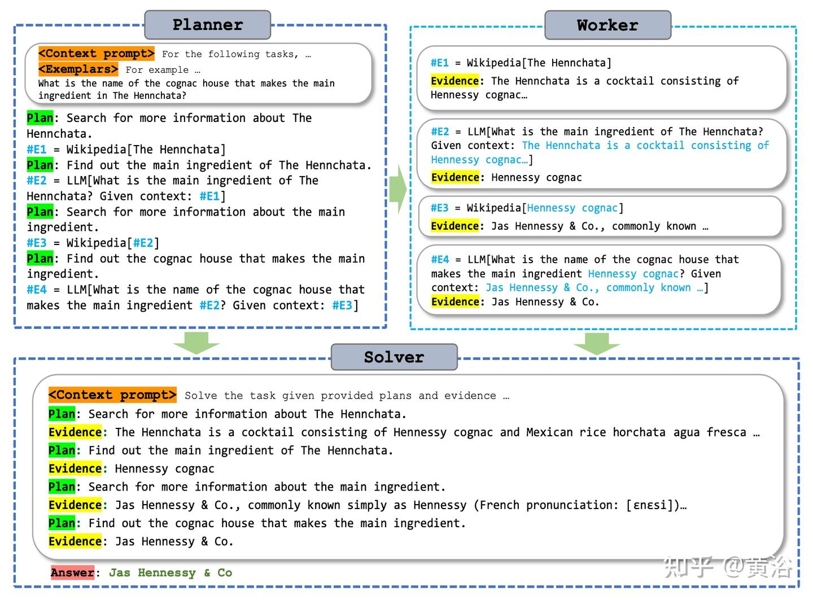
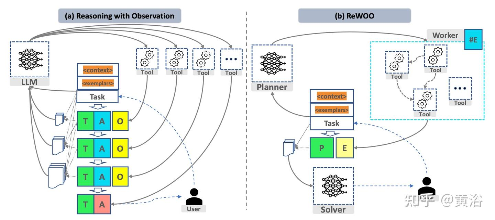

#### Plan and Solve：先列提纲再写作文

**故事**：老师让你写一篇 800 字作文。你可以直接开始写（写着写着可能漏掉重点），也可以先列提纲再写。

CoT 是"走到哪想到哪"，Plan and Solve 是"先画地图再走路"。

**升级版：Plan and Execute + Replan**——多了一个"发现自己走错了可以改地图"的机制。你执行完一个子任务后发现不对，马上调整后面的计划。

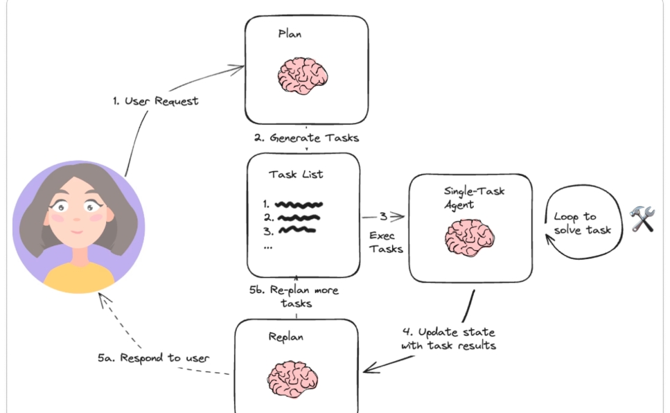

#### LLMCompiler：外卖平台调度模式

**故事**：你同时点了奶茶、麻辣烫、炸鸡。它们之间有没有依赖？

- 奶茶和麻辣烫没依赖 → **可以同时做**
- 炸鸡要先炸、再撒调料、再装袋 → **三步必须串行**

LLMCompiler 做的就是画出**任务依赖图（DAG，有向无环图）**，没依赖的并行，有依赖的串行。

比如"微软市值要涨多少才能超过苹果"：
```
$1 查微软市值 ──┐
               ├──→ $3 计算差值（等 $1 和 $2 都完成）
$2 查苹果市值 ──┘
```
$1 和 $2 互不依赖，**同时查**！

四个模块：
- **函数调用规划器**：拆任务、画依赖图
- **任务获取单元**：按贪婪策略挑能执行的任务发出去
- **执行器**：多个执行器并发干活
- **动态重规划**：中间发现新问题就重新规划

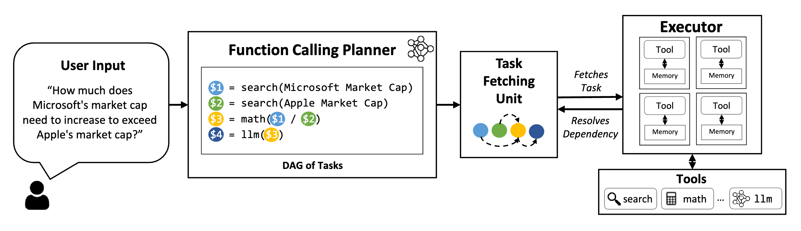
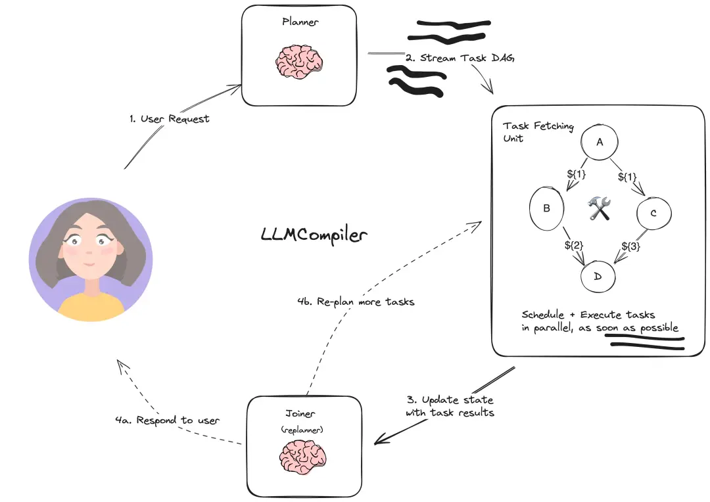

#### 三种方法一句话记忆

| 方法 | 记忆口诀 | 核心优势 |
|------|---------|---------|
| **ReWoo** | 厨师长派活，一次分工一次汇总 | 省 Token，最少 2 次 LLM 调用 |
| **Plan and Solve** | 先画地图再走路，走错了还能改 | 灵活，有容错机制 |
| **LLMCompiler** | 能并行的绝不排队 | 最快，适合有独立子任务的场景 |

---

## 4. Memory：Agent 怎么记住东西？——AI 也需要记事本

### 先说背景

你有没有遇到过这样的聊天机器人——

> 你：我叫小明。
> 机器人：你好小明！
> （过了 5 分钟）
> 你：我刚才说我叫什么？
> 机器人：不好意思，我不知道你叫什么。

这就是没有 Memory 的 AI——**金鱼记忆**。Agent 要实现真正有用，必须能记住东西。

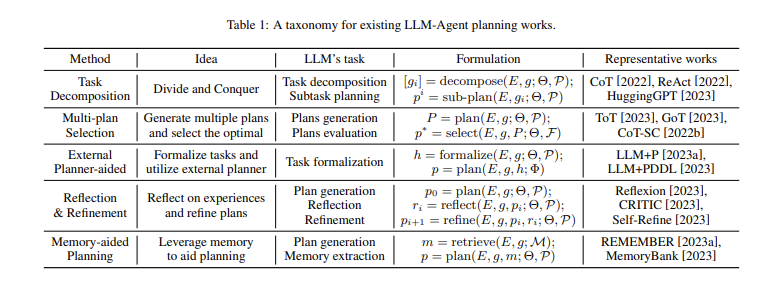

### 三类记忆

| 类型 | 类比 | 存储方式 | 特点 |
|------|------|---------|------|
| **短期记忆** | 你脑子里正在想的事 | 上下文窗口内 | 容量有限，对话结束就忘 |
| **长期记忆** | 你的笔记本 | 外部向量数据库 | 容量大，跨会话保留 |
| **混合记忆** | 脑子 + 笔记本一起用 | 两者结合 | 既能理解当前，又能利用经验 |

### 记忆的三个操作：写、管、读

就像你用记事本的三个动作：

**① 写记忆（Write）**：把当前发生的事情记下来。但不是什么都记——要过滤噪声，只记有用的。比如：
- "小明说他喜欢科幻电影" → 记下来
- "小明说今天天气不错" → 可能不需要记

**② 记忆管理（Manage）**：定期整理。
- 总结高级概念（把"小明看了《星际穿越》、《银翼杀手》、《2001 太空漫游》"总结为"小明喜欢科幻片"）
- 合并相似信息（两条"小明喜欢科幻片"合并）
- 忘记不重要信息

**③ 读记忆（Read）**：需要的时候调出来。根据当前任务，检索最相关的记忆。

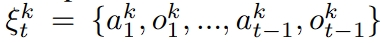
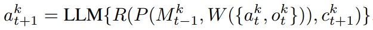
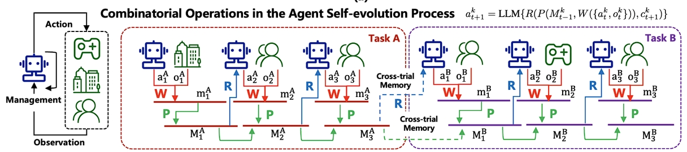

### 记忆的形式：文本 vs 参数化

| 对比维度 | 文本形式记忆 | 参数化形式记忆 |
|---------|-----------|-------------|
| 可解释性 | ✅ 高（自然语言，人能看懂） | ❌ 低（存模型参数里） |
| 写入效率 | ✅ 快 | ❌ 慢（需要微调） |
| 读取效率 | ❌ 每次都塞进上下文，吃 token | ✅ 快（已在参数里） |
| 信息密度 | ❌ 低（自然语言冗长） | ✅ 高（连续空间） |
| 适合场景 | 对话、短上下文 | 大量知识需长期存储 |

**简单说**：文本形式适合"聊天的短期记忆"，参数形式适合"把百科全书装进脑子"。

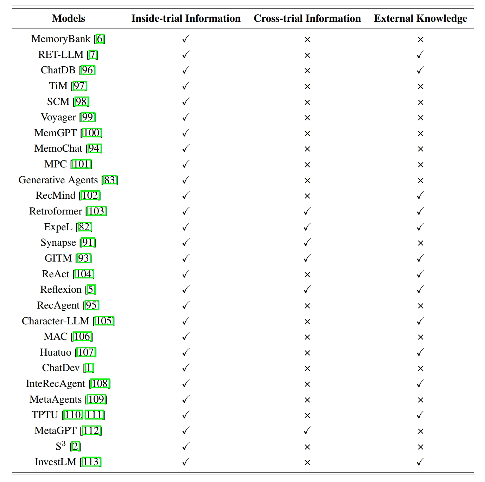
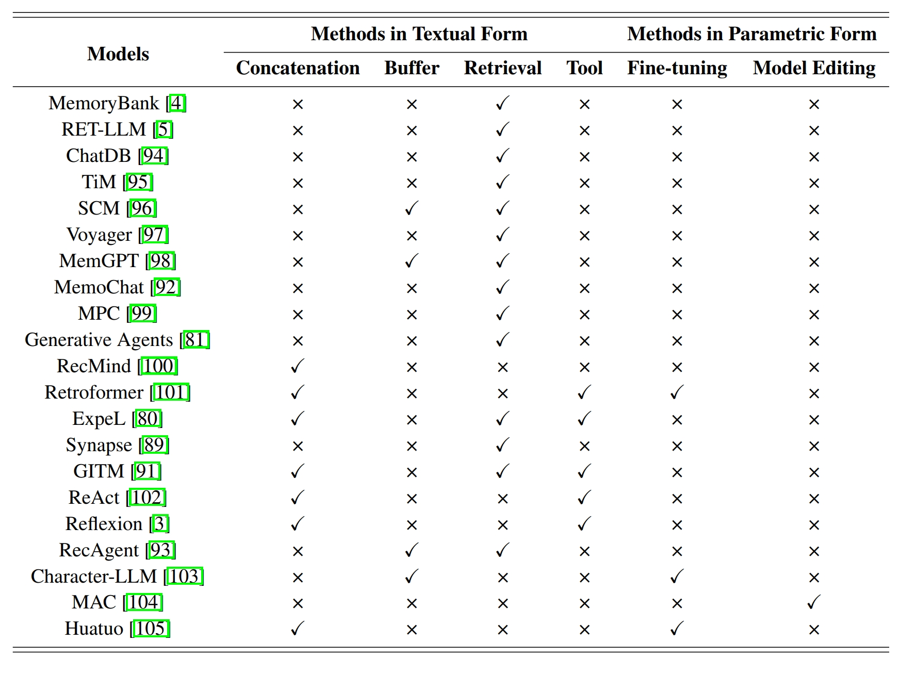
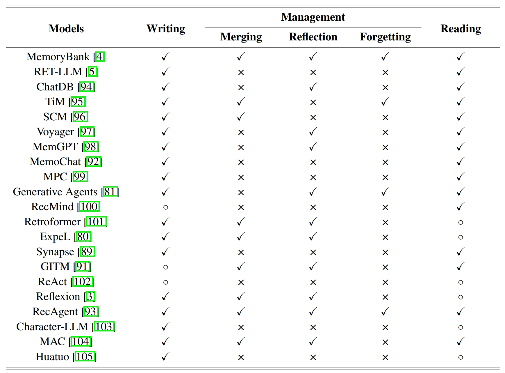
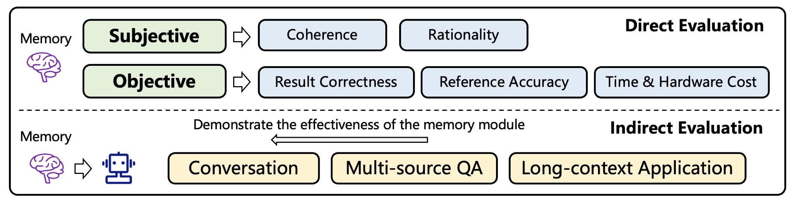

### 一个完整示例：帮 Alice 策划旅行 + 推荐电影

**任务 A：为 Alice 制定北京三日游**

1. Agent 查航班："5 月 1 日上午 9 点出发，5 月 3 日下午 4:30 返回"
2. Agent 查景点："长城、故宫、颐和园都很出名。根据 Alice 喜欢古建筑，推荐故宫和颐和园"
3. Agent 排路线："第一天下午颐和园看日落，第二天故宫，第三天回家"

**任务 B：为 Alice 推荐一部电影**

1. Agent 回忆（从长期记忆）："Alice 以前喜欢晚上 9 点看电影"
2. Agent 查 Netflix 想看列表："《星际穿越》、《恐怖星球》、《鬼吹灯》"
3. Agent 推理："Alice 晚上不看恐怖片 → 推荐《星际穿越》"

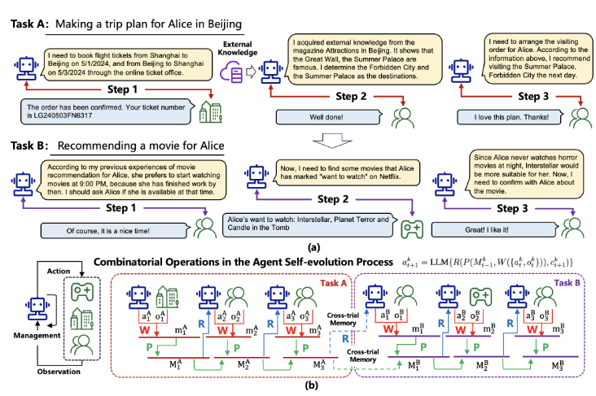

这就是 Memory 的威力——Agent 不只是一问一答，而是能**记住你的偏好、习惯和历史**。

---

## 5. Tool：Agent 怎么用工具？——给 AI 配一个瑞士军刀

Agent 和大模型最大的区别是什么？**大模型只能说话，Agent 能干活。** 这个"干活"靠的就是工具。

### 5.1 Function Call：大模型和工具的"翻译官"

**故事**：你（大模型）在一个外国餐厅，菜单只写英文（API 参数），服务员（外部系统）只懂中文。你需要一个翻译来帮你点菜。

Function Call 就是这个翻译官：
1. 你（大模型）理解用户说"查一下北京的天气"
2. 翻译官（Function Call）告诉服务员："调用 `get_weather`，参数是 `city='北京'`"
3. 服务员返回结果，翻译官再把结果翻译给你
4. 你基于真实数据回答用户

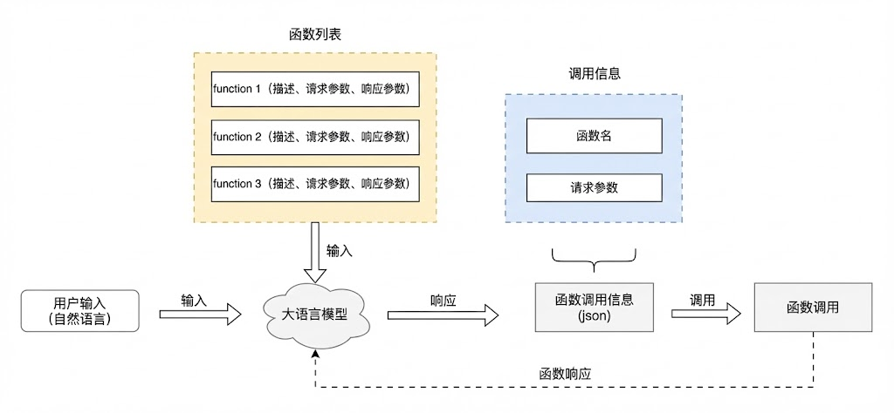

### 5.2 MRKL：大模型当"路由器"

MRKL 的思路是把大模型当作**路由器**——来了一个请求，判断该找哪个"专家"处理。

- 数学问题 → 交给计算器模块
- 天气问题 → 交给天气 API 模块
- 翻译问题 → 交给翻译模块

大模型不亲自解决所有问题，而是"分诊台"的角色。

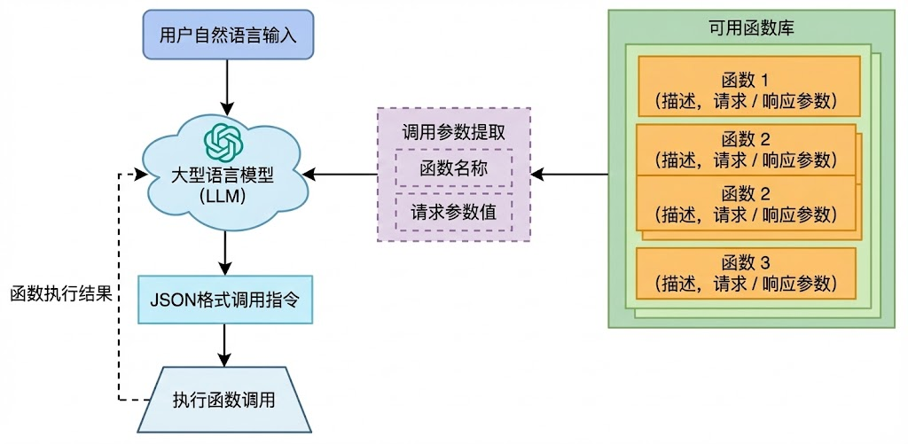

### 5.3 Toolformer：训练大模型"学会"调用工具

Toolformer 不走 Prompt Engineering 路线，而是**微调**模型，让模型自己学会：
- 什么时候该调用什么 API
- 传什么参数
- 拿到结果后怎么用

只需要每个 API 几个示例即可。

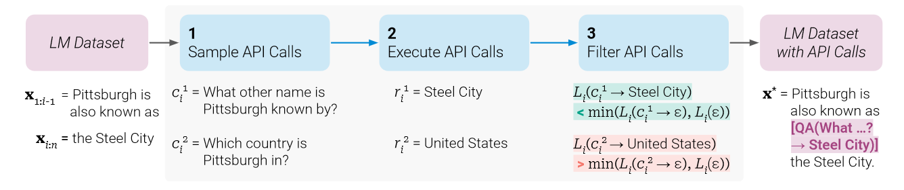

### 5.4 HuggingGPT：大模型当"项目经理"

HuggingGPT 把 ChatGPT 和 HuggingFace 结合：
1. ChatGPT 理解用户意图，拆解任务
2. ChatGPT 从 HuggingFace 上**选择合适的专家模型**来执行每个子任务（比如：图像识别用某个视觉模型，翻译用某个语言模型）
3. 执行结果汇总，生成最终回复

就像项目经理：理解需求 → 评估该找谁干活 → 分配任务 → 汇总结果。

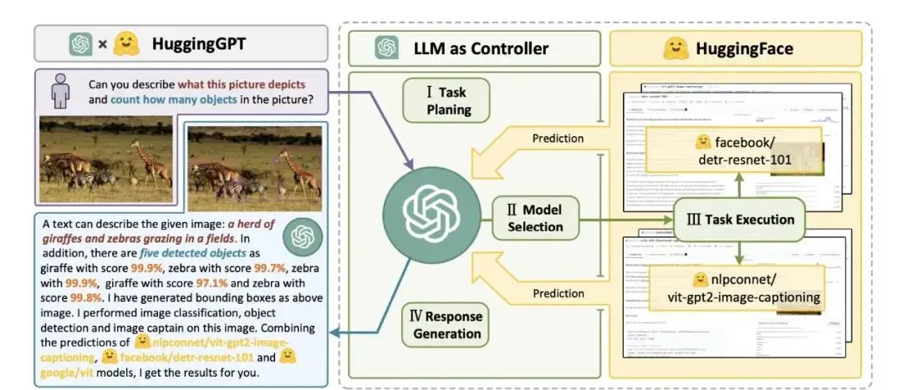

---

## 6. 为什么多智能体老是翻车？——三个和尚没水喝

### 先说直觉

**你可能会想**：一个人干活慢，多找几个人一起干不就快了吗？

**大模型的世界偏偏不是这样。**

人类协作之所以有效，是因为每个人有不同的专业领域和经验——让做前端的人写前端、做后端的人写后端，效率确实高。

但大模型正在变得越来越**通用**——一个强模型可能前端、后端、算法都懂。这时你硬要用多个 Agent 去分工，反而会出问题：
- 沟通成本大增：Agent A 和 Agent B 要对齐数据格式、接口定义、任务边界
- 信息偏差：每个 Agent 对任务的理解不完全一样
- 容易扯皮：A 觉得 B 的代码写得烂，B 觉得 A 的需求不清楚

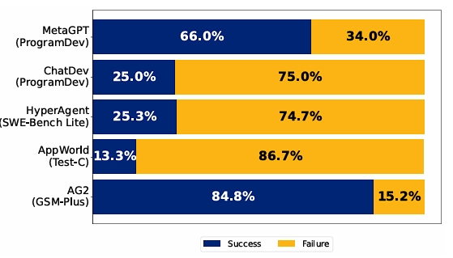

**所以多 Agent 更适合什么场景？**
- **群体智能**：多个 Agent 做相似的事，互相启发或对抗。比如狼人杀、共同审阅论文。
- 而不是简单按技术栈分"前端 Agent、后端 Agent、算法 Agent"。

### 论文：《Why Do Multi-Agent LLM Systems Fail》

这篇论文分析了 5 种主流 MAS 框架、150+ 个任务，总结了 **14 种失败模式**，分为三大类：

#### 第一类：规范和系统设计问题

| 失败模式 | 什么意思 | 例子 |
|---------|---------|------|
| **违反任务规范** | 没按要求做 | 让写国际象棋游戏，结果用鼠标坐标输入代替标准棋谱 |
| **违反角色规范** | 越俎代庖 | CPO（首席产品官）Agent 抢 CEO 的活 |
| **步骤重复** | 反复做同一件事 | 代码明明写好了，还在反复改同一个类 |
| **会话历史丢失** | 忘了说过的话 | 说好用 scikit-learn，过一会又去装 lightgbm |
| **不知道终止条件** | 该停不停 | 正确答案都出来了，还在继续推理 |

#### 第二类：智能体之间的不协调

| 失败模式 | 什么意思 | 例子 |
|---------|---------|------|
| **会话重置** | 聊着聊着重来了 | 同上，上下文丢了 |
| **未能请求澄清** | 不懂也不问 | 明知用邮箱登录不对，也不问 |
| **任务偏离** | 跑偏了 | 算数学题算着算着去解另一个问题了 |
| **信息隐瞒** | 不分享关键信息 | 找到了解法但不告诉 planner |
| **忽略其他 Agent 的输入** | 别人说了不听 | 别人指出错误了，嘴上承认但结果不改 |
| **推理-行动不匹配** | 说的和做的不一样 | 知道正确答案，却告诉了别人错误建议 |

#### 第三类：任务验证和终止失败

| 失败模式 | 什么意思 | 例子 |
|---------|---------|------|
| **过早终止** | 没做完就说完成了 | 声称修改了代码，实际上啥也没改 |
| **无或不完整验证** | 没检查就过了 | 把鱼的数量和成本搞混了也没发现 |
| **验证错误** | 检查了但方法不对 | 单元测试只测了最基本的移动规则 |

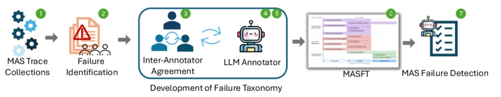
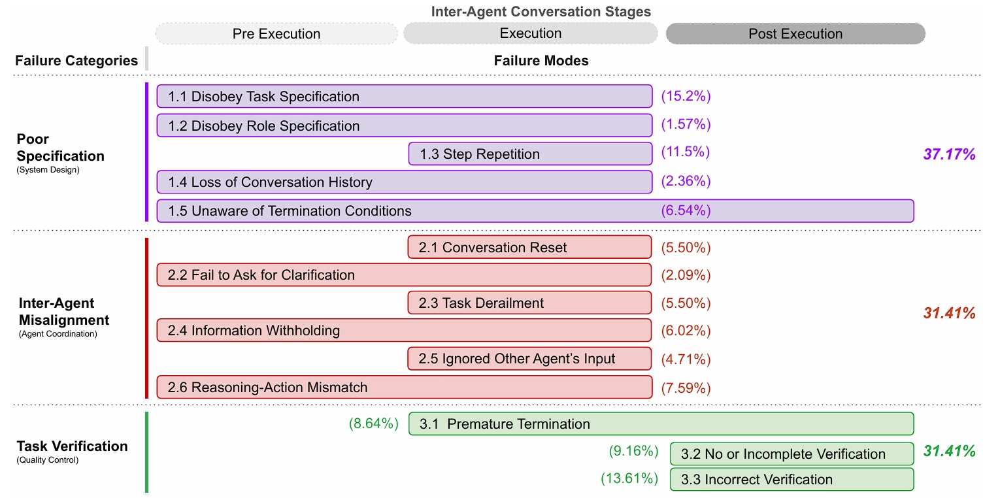

### 怎么改进多智能体系统？

**战术性方法（小修小补）**：
- 把提示词写更清楚（明确角色和任务）
- 让 Agent 学会自我验证
- 模块化设计（简单的、分工明确的 Agent）
- 交叉验证（不同 Agent 出不同方案互相检查）

**结构性策略（大改架构）**：
- 加强验证层
- 标准化通信协议
- 引入强化学习
- 提高记忆和状态管理能力

---

## 7. MCP：给工具调用装一个"统一插头"

### 7.1 从 Function Calling 的痛点说起

Function Calling 虽然能让大模型调用工具，但有个很大的问题——**太麻烦了**。

每接入一个新工具，你要：
1. 写 100+ 行代码实现函数
2. 写 JSON Schema 描述函数（告诉模型这个函数干嘛的、参数是什么）
3. 设计提示词模板（告诉模型什么时候该调用）
4. 处理各种错误情况

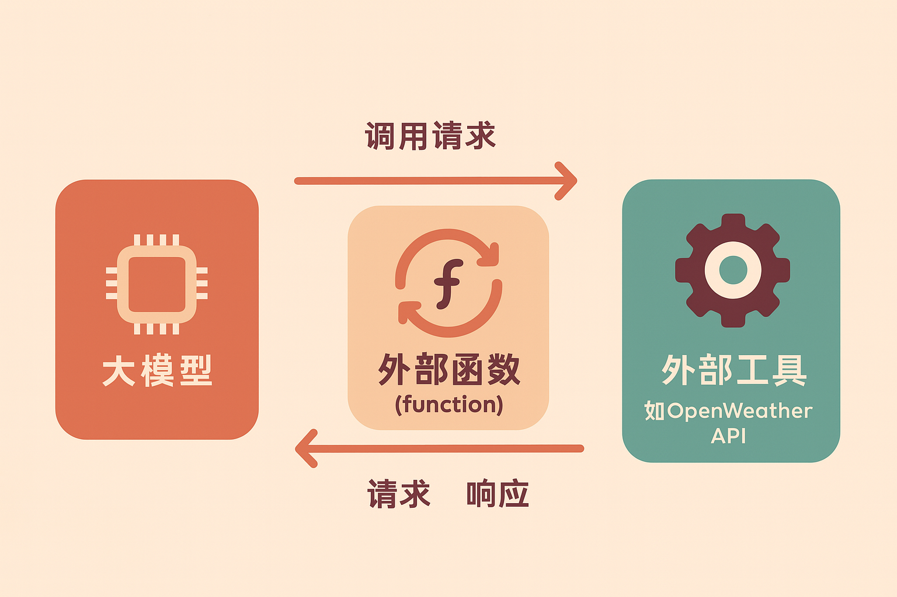

**如果你的项目需要接 10 个工具呢？100 个呢？** 每个都要这样搞一遍，而且不同开发者之间没法复用。你写了一个"查天气"的函数，别人想用还得重新实现一遍。

**这就是 MCP 要解决的问题。**

### 7.2 MCP 是什么？——统一插头标准

**故事**：你家里有一堆电器——手机用 Type-C 充电、笔记本用圆形插头、电吹风用两脚插头。每次出门出差要带一堆不同的充电线。

直到 USB-C 统一了一切。一根线搞定所有设备。

**MCP 就是工具调用的 USB-C**。

MCP（Model Context Protocol）由 Anthropic 在 2024 年 11 月推出，是一套**标准化协议**：
- **MCP Client**（客户端）：大模型运行的环境，比如 Claude Desktop、Cursor、你自己的应用
- **MCP Server**（服务端）：提供具体工具能力的环境，比如"天气查询服务"、"数据库查询服务"

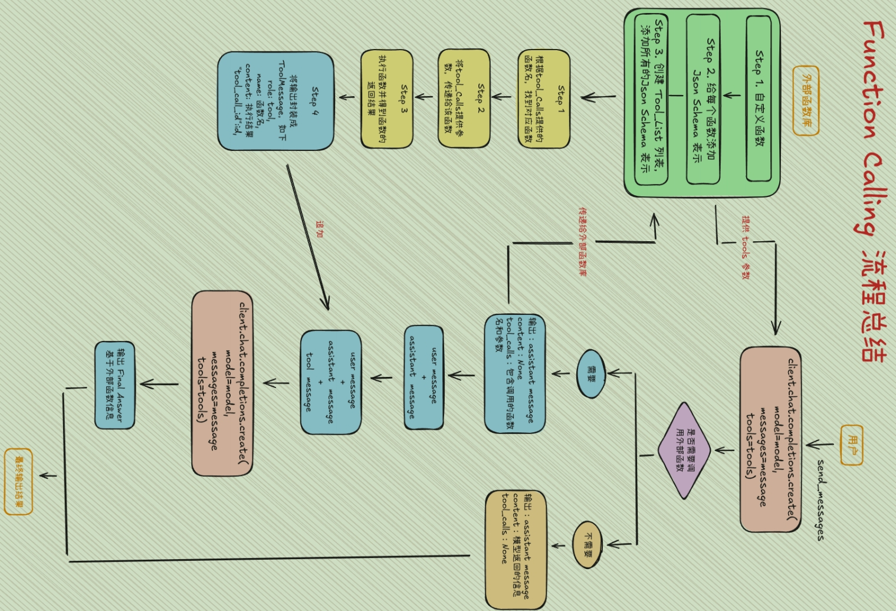
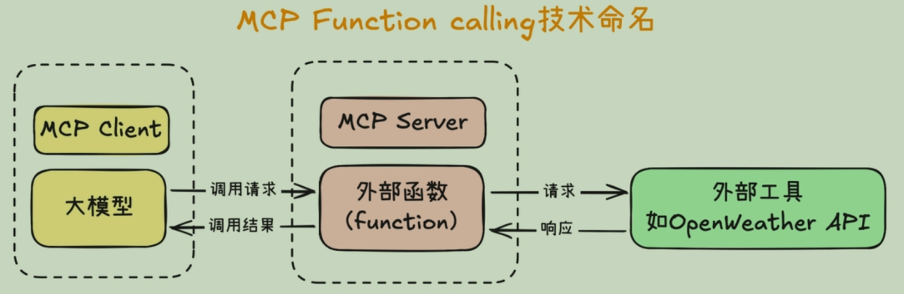

**有了 MCP 之后**：
- 开发者只需要写一次 Server（比如"天气查询服务"），所有支持 MCP 的客户端都能直接调用
- 换个平台？不用重写。换个模型？不用重写。
- 社区可以共享 Server：GitHub 上有成百上千的开源 MCP Server 可以直接用

### 7.3 Function Calling vs MCP —— 一张图看懂

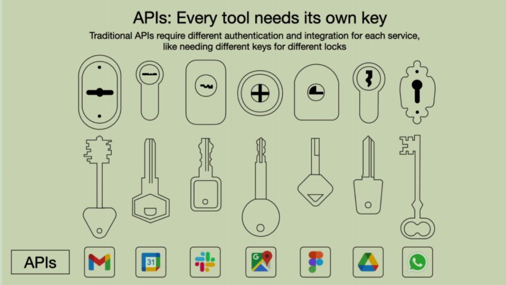
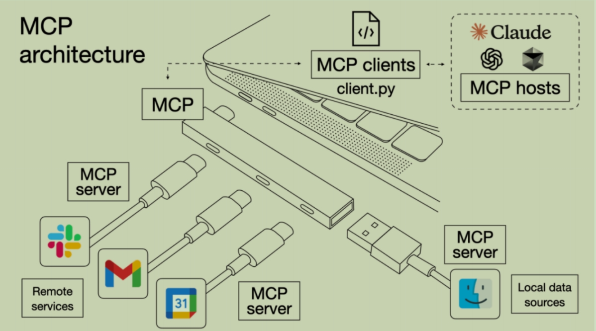

**MCP 就像转接口**——把各种形状的 API 插头，转成统一的 MCP 插口。客户端只管用，不用管背后是哪个 API。

### 7.4 MCP Server 提供的三种能力

| 类型 | 干什么的 | 举例 |
|------|---------|------|
| **Resources（资源）** | 暴露数据和文件 | 读取本地文档、API 返回的数据 |
| **Tools（工具）** | 可执行的操作 | 查天气、发邮件、操作数据库 |
| **Prompts（提示词）** | 预定义的提示模板 | "帮我总结这篇文档"的模板 |

### 7.5 MCP 的两种通信方式

- **stdio（标准输入输出）**：本地通信。Client 把 Server 作为子进程启动，通过标准输入输出交换数据。就像两个人在同一个房间说话。
- **HTTP + SSE**：远程通信。Client 和 Server 在不同机器上，通过 HTTP 协议交互。就像两个人打电话。

---

## 8. Skills：给 Agent 写一本工作手册

### 为什么需要 Skills？

前面讲的 Function Calling 和 MCP 解决了"能调用工具"的问题。但还有两个痛点：

**痛点一**：模型不知道**怎么用好**这个工具。参数怎么填？什么时候调用？调用顺序是什么？失败了怎么办？

**痛点二**：把工具的详细说明全部塞进 Prompt，上下文一下就满了。一个复杂工具的描述可能上千字，10 个工具就是上万 token。

### 什么是 Skill？

**故事**：你新招了一个实习生。你不会跟他说"你会用 Python 对吧？去干活吧"。你会给他一本《工作手册》，里面写了：
- 这个项目怎么搭建开发环境
- 代码规范是什么
- 常见问题怎么处理
- 哪些坑千万别踩

**Skill 就是 Agent 的工作手册。**

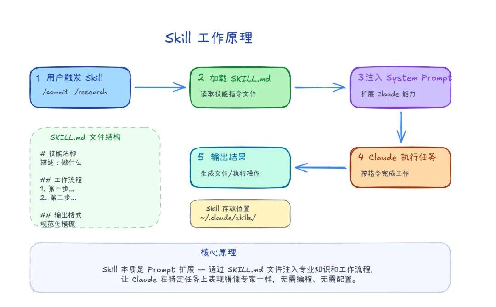

每个 Skill 是一个独立的文件夹，包含三层结构：

### 第一层：元数据层（YAML 头部）

```markdown
name: paper-analyze
description: 深度分析单篇论文，生成详细笔记和评估
```

只告诉 Agent"这个 Skill 叫什么、什么时候该用"。

这只是**目录**——Agent 启动时只加载这部分（才几十个 token），不会被撑爆。

### 第二层：指令层（SKILL.md 正文）

详细的 SOP（标准操作流程），告诉 Agent：
- 第一步做什么
- 第二步做什么
- 常见坑是什么
- 怎么验证结果

**只有 Agent 判断"这个 Skill 现在需要用"的时候，才加载这部分。**

### 第三层：资源层

- **脚本（scripts/）**：Python 或 Bash 脚本。Agent 直接运行，脚本源代码不进上下文。
- **参考文档（references/）**：API 文档、数据库 Schema。只在需要时才读取。
- **模板（assets/）**：PPT 模板、邮件模板等静态资源。

### 为什么要分层？——渐进式加载（Progressive Disclosure）

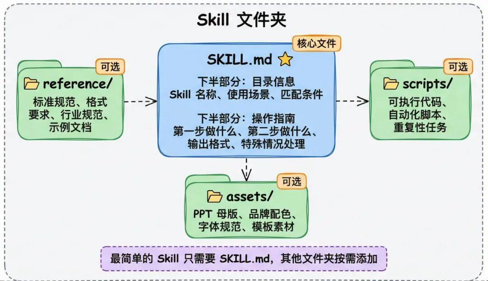

**故事**：图书馆和书店的区别。

- **书店**把所有书都摆在货架上（全量加载）→ 顾客看得眼花，位置也不够。
- **图书馆**只在有人借阅时才去书库取书（按需加载）→ 空间利用率高，不干扰。

Skills 就是图书馆模式：你有 50 个 Skill 也没关系，Agent 只加载当前要用的那几个。互不干扰。

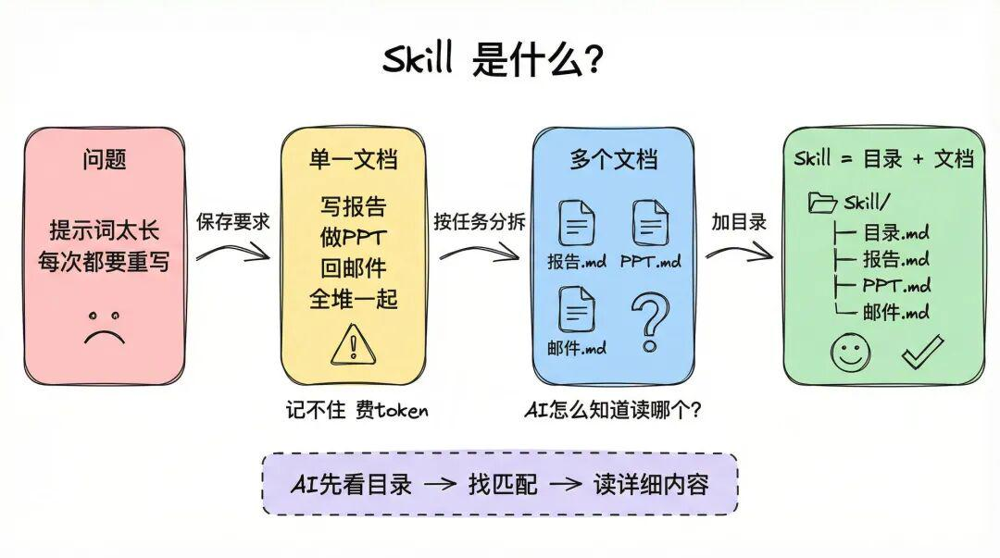
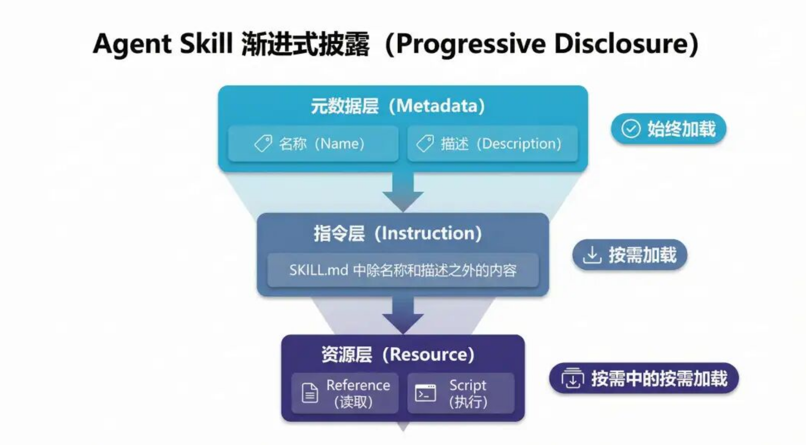

### 怎么获取 Skill？

- **安装别人的**：Anthropic 官方仓库、Skills 市场（skillsmp.com、skillhub.tencent.com）
- **自己定制**：用 Anthropic 的 Skill Creator 工具，自然语言描述需求，自动生成 Skill

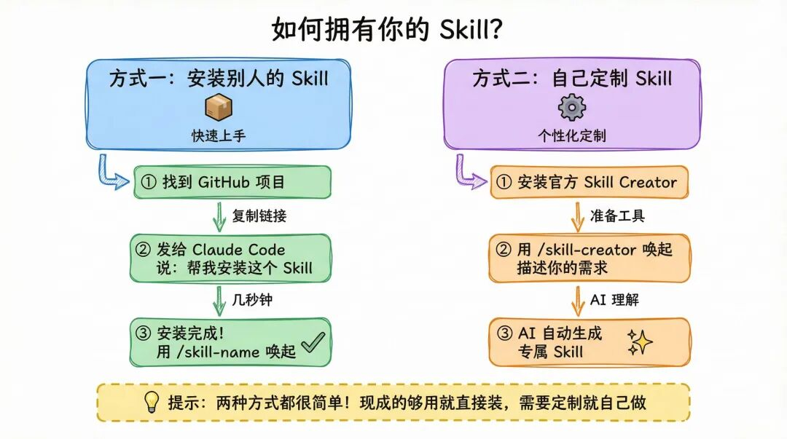

---

## 9. OpenClaw 是怎么设计的？——解剖一个开源 Agent 框架

OpenClaw 是 2026 年开年爆火的开源 AI Agent 项目，GitHub 数万 stars。阿里云、腾讯云、百度都推出了它的一键部署功能。


**一句话定位**：OpenClaw 不是聊天机器人，而是把**本地算力 + 大模型 Agent 自动化**做到极致的框架。让你能用 AI 操作电脑——读写文件、执行命令、浏览网页、管理进程。

### 架构：一条五步流水线

用户发一条微信消息给 Agent，它怎么处理的？一条标准化的流水线：

```
Channel Adapters → Gateway → Agent Runner → Agent Loop → Memory 持久化
```

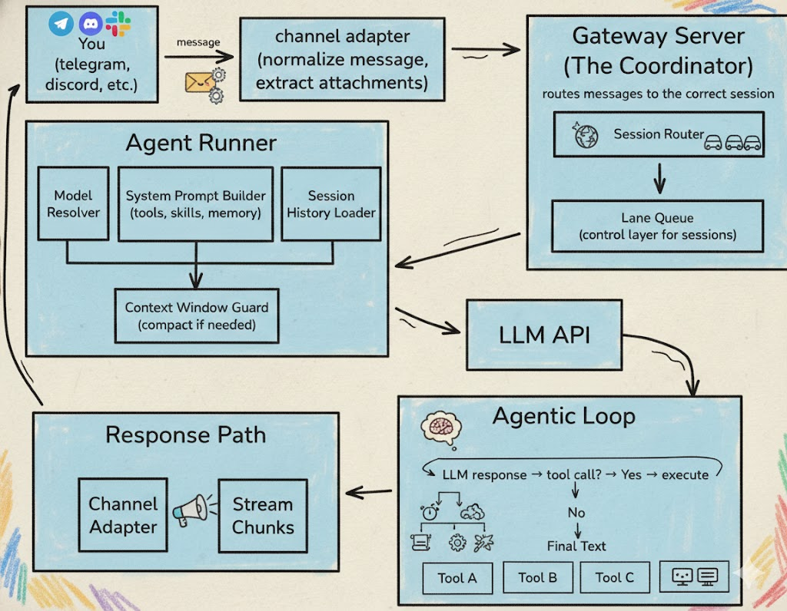

**① Channel Adapters（消息标准化入口）**
- 你的消息可能来自微信、飞书、Telegram、Discord……格式各不相同
- Adapter 负责把各种格式统一，提取附件（图片、文档、音频）
- 每个 IM 有专属 Adapter

**② Gateway（系统中枢）**
- 相当于大脑中枢
- 接收各渠道的消息 → 分发给对应的 Agent 处理 → 把结果回传
- 每个会话有专属执行通道，保证操作有序

**③ Agent Runner（推理引擎）**
- 拼接系统提示词（System Prompt + 配置文件 AGENTS.md）
- 选择合适模型（高流量时自动切换备用模型）
- 调用 LLM 做推理，判断是否需要调工具
- 维护上下文窗口（快满了自动压缩）

**④ Agent Loop（任务执行闭环）**
- 采用经典的 **ReAct 范式**：思考 → 行动 → 观察 → 再思考
- 最多循环 20 次，直到得到最终结果

**⑤ Memory 持久化**
- 全量会话数据（工具调用、执行结果、对话内容）以 `.jsonl` 格式存盘
- 下次会话可以读取，保证长任务的连贯性

### 7 个配置文件定义 Agent 的灵魂

安装后在 `~/openclaw/workspace/` 能看到 7 个 Markdown 文件：

| 文件 | 作用 |
|------|------|
| `AGENTS.md` | 核心操作手册：行为规范、内存管理、安全规则 |
| `BOOTSTRAP.md` | 首次启动引导，与用户对话确定 Agent 身份 |
| `HEARTBEAT.md` | 定时任务配置（如每 4 小时查邮件） |
| `IDENTITY.md` | Agent 的身份证：名称、风格、头像 |
| `SOUL.md` | 核心价值观和行为准则 |
| `TOOLS.md` | 本地可调用工具的配置 |
| `USER.md` | 用户档案：偏好、项目背景、操作习惯 |

### 底层：Pi 轻量内核

OpenClaw 的底层是 **Pi 内核**——用 TypeScript 写的命令行应用（Node.js ≥ 22）。

Pi 是一个**极简推理引擎**，只做四件事：read、write、edit、bash。核心极小，扩展通过插件方式加入。

OpenClaw 通过 SDK 方式把 Pi 内核嵌入，实现**推理引擎、工具链、Skills 的三层解耦**：
- **Pi** 负责"怎么执行"
- **OpenClaw** 负责"有哪些工具可用"
- **Skills** 负责"怎么组合工具解决问题"

### 五大设计亮点

**① 记忆机制**：短期记忆（当天日志）+ 长期记忆（关键信息持久保存）+ 混合检索（向量 + 关键词）→ 长任务不丢上下文。

**② 技术护栏**：直接操作本地电脑——Shell 命令执行、文件系统操作、浏览器自动化（语义快照代替截图，省 Token）、进程管理。

**③ Skills**：基于 Anthropic 开放标准的可复用技能包。

**④ 心跳机制**：通过定时任务，Agent 从被动响应变为主动自治。比如每天早上推送天气、每隔 4 小时检查服务器状态。

**⑤ 安全机制**：命令白名单 + 危险语法拦截（阻止 `rm -rf` 等危险操作）+ 权限分级（允许/拒绝/询问）。

---

## 10. Hermes：一个会"自我进化"的 Agent

2026 年初 OpenClaw 还是王者，两个月后 Hermes 横空出世，GitHub Stars 破十万。

**OpenClaw vs Hermes 的核心区别：**

| | OpenClaw | Hermes |
|--|---------|--------|
| 核心哲学 | 配置即行为 | 经验即能力 |
| 工作方式 | 你手动定义、安装、授权 Skill | Agent 自己判断什么值得记下来 |
| 触发条件 | 人主动 | Agent 自主："完成了一个涉及 5 次以上工具调用的复杂任务，自动保存为 Skill" |
| 记忆写入 | 被动（上下文快爆了才存档） | 主动（约 15 轮对话就触发反思） |


### Skills 自进化的七段式闭环

**① 创建**：Agent 自己判断"该记了"。触发条件：
- 5+ tool calls 的复杂任务
- 修复了一个棘手的错误
- 发现了一个值得复用的工作流

创建过程过七道安全关卡：名称验证、大小限制、分类验证、格式校验、冲突检查、原子写入、安全扫描。

**② 索引**：几十上百个 Skill，每次扫描太慢。两层缓存——内存 LRU + 磁盘快照。只在文件有变化时才全量扫描。

**③ 条件激活**：不是所有 Skill 在所有时候都该出现。通过 `requires_toolsets`、`platforms` 等字段过滤。比如一个 macOS 专用 Skill 在 Linux 上不会出现。

**④ 渐进加载**：三级披露策略。
- Tier 0：只放 Skill 名称和描述（每个约 20 tokens）
- Tier 1：Agent 调用 `skill_view(name)` 加载完整内容
- Tier 2：API 文档等支撑文件按需加载

**⑤ 注入**：最反直觉的决策。Skill 内容不追加到 System Prompt，而是作为 User Message 注入。为什么？**保护 Prompt Cache**。Anthropic 的 Prompt Caching 能省 90% 以上 token，但前提是 System Prompt 不能变。

**⑥ 自改进**：Skill 过时了怎么办？Agent 发现错误后，"在当前任务结束前立即 patch"。用 Fuzzy Match 引擎处理微小的文本差异。

**⑦ 安全扫描**：Skill 本身可能是攻击载体。90+ 种威胁正则模式：环境变量泄漏、越狱攻击、路径穿越、隐形字符、符号链接逃逸。

### Memory vs Skill 怎么分工？

| | Memory | Skill |
|--|--------|-------|
| 回答的问题 | "是什么" | "怎么做" |
| 存什么 | 用户偏好、环境细节、工具脾性 | 执行步骤、处理流程、常见坑点 |
| 举例 | "Alice 喜欢晚上 9 点看电影" | "部署 Next.js 到 Vercel 的步骤" |

### GEPA 自进化：抛弃强化学习行不行？

Hermes 还有一套离线的批量进化算法——**GEPA**（Genetic-Pareto Prompt Evolution），出自 ICLR 2026 Oral 论文。

**核心思想**：不用强化学习，用"进化算法 + 大模型反思"来优化 Skill。

- **反思性变异**：不是瞎猜式随机修改。LLM 读之前的执行轨迹，反思"为什么对了、为什么错了、该改哪几个字"
- **帕累托前沿选择**：不只留最高分的，只要某个候选在任何一项上表现最强就保留
- **自然语言反馈**：不说"得 0.6 分"，而是说"这一步没检查边界条件"

---

## 11. Harness Engineering：驾驭大模型的"马具"

### 什么是 Harness？

**Harness 这个词来自马具。** 马的力量很大，但如果没有马具（缰绳、笼头、鞍），你根本驾驭不了它。

**Harness Engineering 就是给大模型套上"马具"——让模型的能力被可靠地驾驭。**

LangChain 的 Vivek Trivedy 给了一个最干净的定义：**Harness = 模型权重以外的一切。**

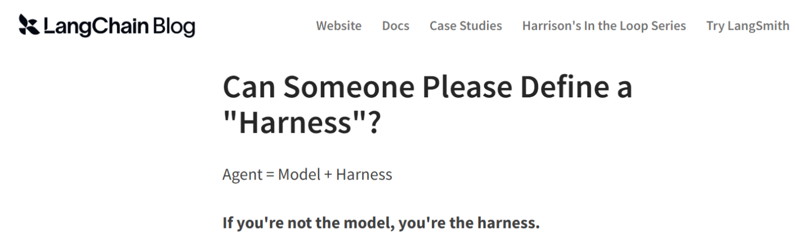

### 为什么 Harness 比你想的重要？

很多人 Agent 做不好，第一反应是："模型还不够聪明，等更好的模型出来就好了。"

**错了。** HumanLayer 团队在上百个 Agent 项目后得出结论：

> "It's not a model problem. It's a configuration problem."（不是模型问题，是配置问题。）

LangChain 用数据证明：同一个模型（GPT-5.2-Codex），只改模型之外的东西（System Prompt、工具配置、Middleware），Terminal Bench 2.0 得分从 52.8 涨到 66.5，排名从 Top 30 直接跳到 Top 5。

**他们改了四件事：**

1. **在 Agent 试图退出时拦截**：Agent 常见毛病——写完代码 → 重读一遍 → 觉得没问题 → 停止，根本没跑测试。加了一个 Middleware：Agent 说要退出时拦截，强制注入 checklist 对照任务逐项验证。这一个改动贡献了最大的分数提升。

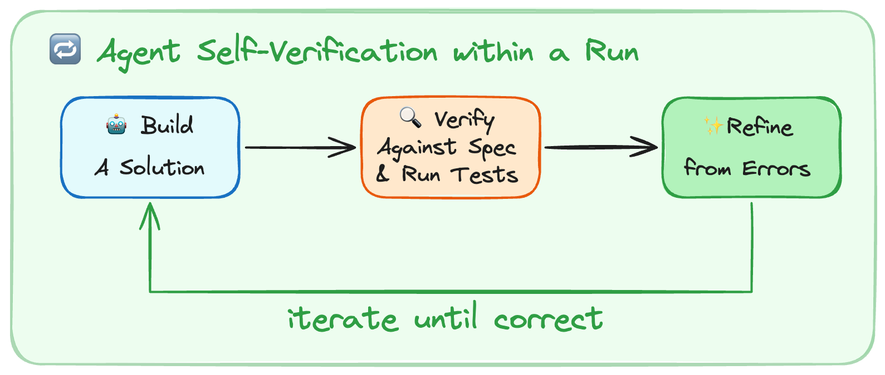

2. **自动扫描并注入环境信息**：Agent 在陌生环境里浪费大量时间探索目录结构。启动时自动扫描环境，结果注入上下文。

3. **追踪编辑次数，超阈值就打断**：Agent 有时在同一个文件上反复改，打转超过 10 次还在原地。追踪每个文件的编辑次数，超阈值就注入"考虑换个方案"的提示。

4. **调整推理强度策略**：全程用最高推理强度反而得分低、容易超时。采用"三明治策略"（xhigh-high-xhigh）。

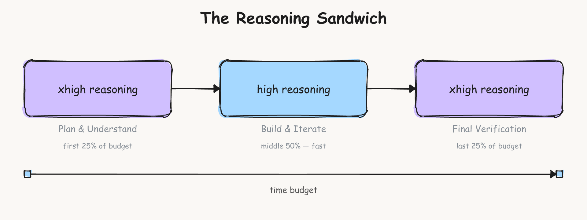

### Claude Code：工业级 Harness 的完整实现

2026 年 3 月，Claude Code 的 51 万行 TypeScript 源码意外泄露，让我们得以一窥工业级 Harness 的全貌。

#### 工具系统

40+ 个工具，分七大类：文件操作、搜索、执行、Web、Agent 协调、规划工作流、MCP 协议。

关键设计：
- `isConcurrencySafe()`：能否并行执行（Read/Glob/Grep 可以，Write/Edit 不行）
- `isDestructive()`：是否不可逆
- 工具粒度细：不合并"FileOperation"，拆成 Read/Write/Edit 三个。选了 Edit = 局部修改，选了 Write = 全量覆写。粒度细也意味着权限控制可以更细。

#### 权限链（五道闸门）

```
① validateInput() → 参数合法才继续
② PreToolUse Hooks → 用户定义的 shell 命令（可批准/拒绝/修改参数）
③ Permission Rules → alwaysDeny/alwaysAllow/alwaysAsk
④ tool.checkPermissions() → 工具自检
⑤ permission mode → auto(AI分类器) / manual(等用户确认)
```

前三关是硬逻辑，不依赖 LLM 推理。被 `alwaysDenyRules` 标记的工具，**连 schema 都不发给模型**——模型根本不知道这个工具存在，从源头杜绝了 Prompt 注入攻击。

#### Hooks：Harness 的拦截层

用户可以在 `settings.json` 里配置任意 shell 命令，在任何工具调用前执行。不需要改 Claude Code 代码，就能做到：
- 日志记录所有操作
- 对某类路径的写入额外要求确认
- 拦截危险命令（如 `rm -rf`）
- 同步到外部合规系统

#### 上下文管理

`autoCompact` 机制：对话接近上下文上限时自动压缩。生成结构化摘要，保留"已完成任务、关键决策、重要文件状态、用户偏好"。子 Agent fork 时，System Prompt 字节级继承，**N 个子 Agent 共享同一份 Prompt Cache**，省掉几百万 token。

#### CLAUDE.md

记忆层，分三级：
- `~/.claude/CLAUDE.md` — 全局
- `PROJECT_ROOT/CLAUDE.md` — 项目级
- `.claude/CLAUDE.md` — 本地级

重要警示：LLM 自动生成的 CLAUDE.md 反而让性能下降。要人工精心编写，少而精——只放"模型自己无法发现的关键约束"。

---

## 12. Harness 综述：ETCLOVG 七层架构

论文研究[https://openreview.net/pdf?id=eONq7FdiHa]提出了 ETCLOVG 七层分类法，把 Harness 拆成七个独立但耦合的工程层：

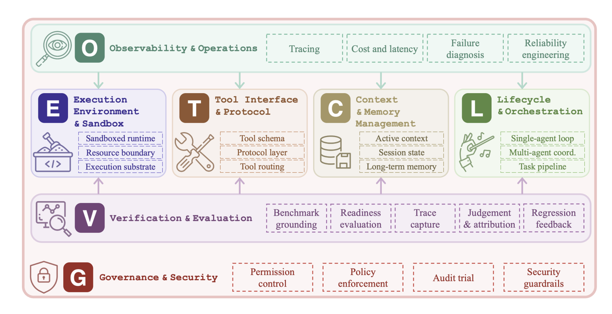
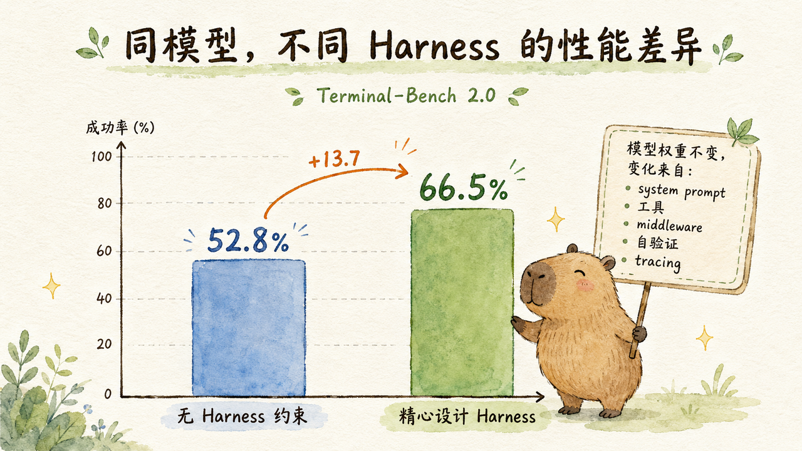

### E — Execution（执行环境与沙箱）

Agent 的代码跑在哪里、受什么约束。

**核心洞察**：沙箱不只是笼子，也是许可证。Anthropic 报告引入 sandboxing 后，Claude Code 的权限弹窗减少了 84%。原因是：当 Agent 在受限区域内可以自由行动时，每步请示人类的死锁就被打破了。

### T — Tool（工具接口与协议）

四个层次：
- Model ↔ Function（函数调用）
- Agent ↔ External（MCP、OpenAPI）
- Agent ↔ Agent（A2A 通信）
- Agent ↔ Repo/Environment（AGENTS.md、CLAUDE.md）

**"工具的选择本身就是 Agent 的意图信号"**——工具粒度越细，权限控制可以越细。

### C — Context（上下文与记忆管理）

**Promp Engineering → Context Engineering → Harness Engineering** 的三次重心迁移：

| 阶段 | 优化对象 | 核心问题 |
|------|---------|---------|
| Prompt Engineering | 单次模型调用 | 怎么让模型听懂一句话？ |
| Context Engineering | 多步上下文构造 | 每一步该看到什么信息？ |
| Harness Engineering | 整个执行系统 | 怎么保证几十上百步的稳定执行？ |

三个反直觉发现：
1. **U 型注意力曲线**：信息放在上下文中间，准确率比两端低 30%+
2. **上下文腐烂**：模型在窗口远未填满时就开始性能退化
3. **KV-cache 是最重要指标**：缓存命中与否差 10 倍成本

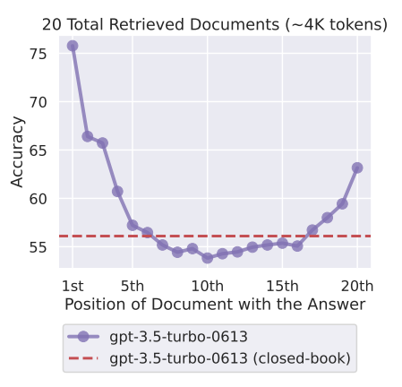
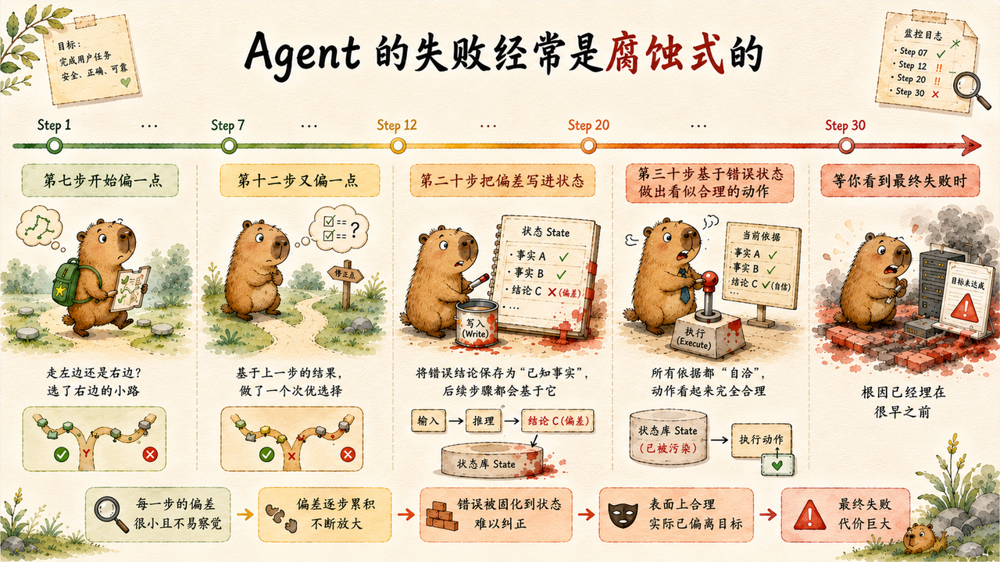
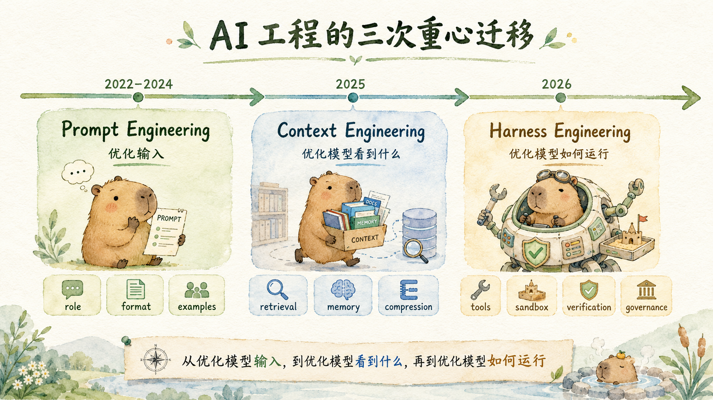

### L — Lifecycle/Orchestration（生命周期与编排）

核心洞察：**所有编排组件，本质都是弥补模型短板。** 模型从 Opus 4.5 升到 4.6 后，原先的补救逻辑变成额外开销。编排层要随模型升级而简化。

### O — Observability（可观测性）

**"只看不判"的陷阱**：89% 的团队有可观测工具，但只有 52.4% 做离线评估。能看到 Agent 做了什么，却判断不了做得对不对。

### V — Verification（验证与评估）

从"打分"转向"诊断"。Agent 失败可能来自模型推理错误、工具描述误导、沙箱配置错误、上下文陈旧、测试 flaky……不做失败归因，"模型准确率"是个被污染的数字。

### G — Governance（治理与安全）

**权限不能只按工具名判断，要按上下文判断。** 同样是写文件，写临时日志和覆盖生产配置不是一个风险等级。

---

## 13. Loop Engineering：让 Agent 自己跑起来

### 什么是 Loop Engineering？

**故事**：你让一个实习生整理资料。

**常规指令**："帮我看看这几个博主的公众号有没有新文章。"

**Loop 版本**："每天上午 10 点检查新文章；发现更新后先去重，再按主题分类；每篇提取 3 个核心观点并附上原文链接；遇到付费墙或难理解的内容，转交人工；每天晚上将新增内容写入同一个文档；连续 3 天没有更新则暂停任务。"

常规指令只规定"这一次做什么"，Loop 版本同时规定了**触发时间、处理步骤、异常分支、结果存储和停止条件**。

**定义**：Loop Engineering 是把 Agent 的多次执行组织成一套可持续运行的自动闭环，由系统决定"下一步做什么、如何验证、何时继续、何时停止"。

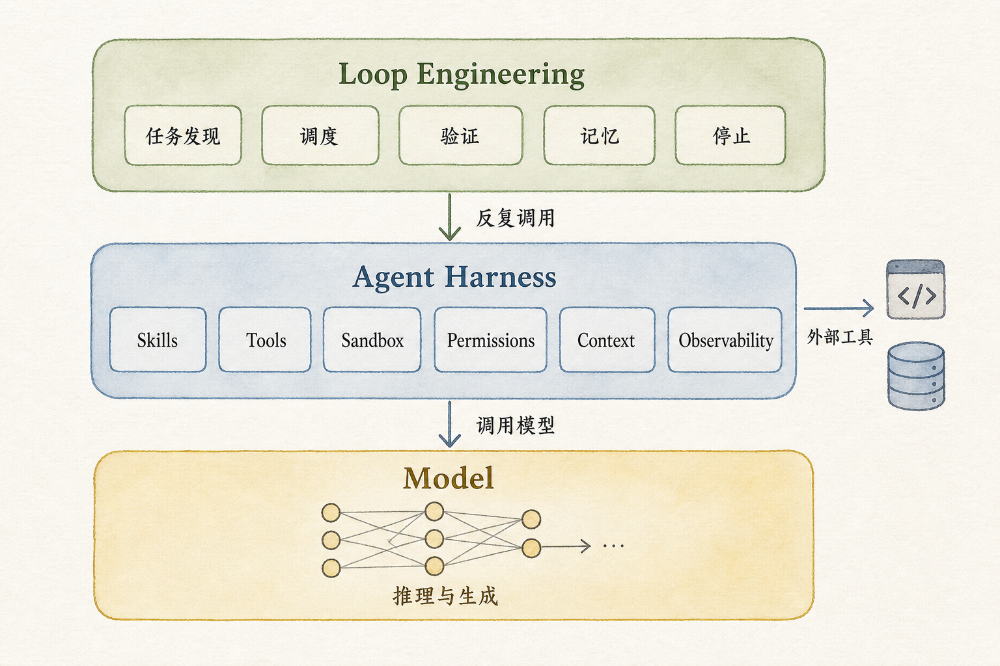

**层级关系**：
- Harness Engineering 管理单次运行的环境
- Loop Engineering 反复启动 Harness，根据执行结果生成下一轮任务

### 一个 Loop 的八个组成部分

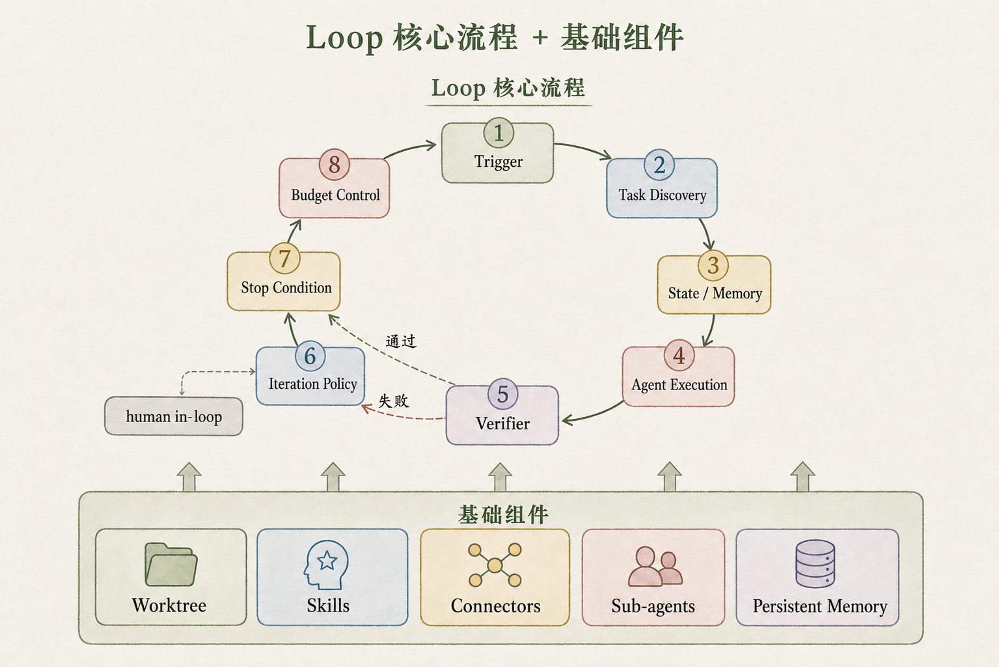

| 组件 | 负责什么 | 关键问题 |
|------|---------|---------|
| **Trigger** | 什么时候启动？ | 定时？事件驱动？人工？ |
| **Task Discovery** | 这一轮做什么？ | 哪些是新的？哪些优先？哪些有依赖？ |
| **State/Memory** | 上次做到哪了？ | 记录进度、失败原因、下次计划 |
| **Agent Execution** | 谁来做？ | 用什么 Agent？权限边界在哪？ |
| **Verifier** | 怎么证明做对了？ | 测试通过？格式正确？人工确认？ |
| **Iteration Policy** | 失败后怎么调整？ | 补上下文？缩小范围？切换 Agent？ |
| **Stop Condition** | 什么时候停？ | 目标达成？多轮无进展？预算耗尽？ |
| **Budget Control** | 最多花多少钱？ | Token 预算、时间预算、并发上限 |

### Loop ≠ cron job + Agent

有人说 Loop Engineering 就是 "cron job + Agent + evaluator + memory"。

**对了一半。**

新的变化不在于"人类发明了循环"，而在于 Agent 的能力已经跨过临界点——可以长时间操作代码库、读取非结构化信息、调用外部工具、根据多轮反馈调整策略。

过去的自动化是"工程师把所有步骤提前写死"。
现在的 Loop 是"把下一步做什么的判断也交给 Agent"。

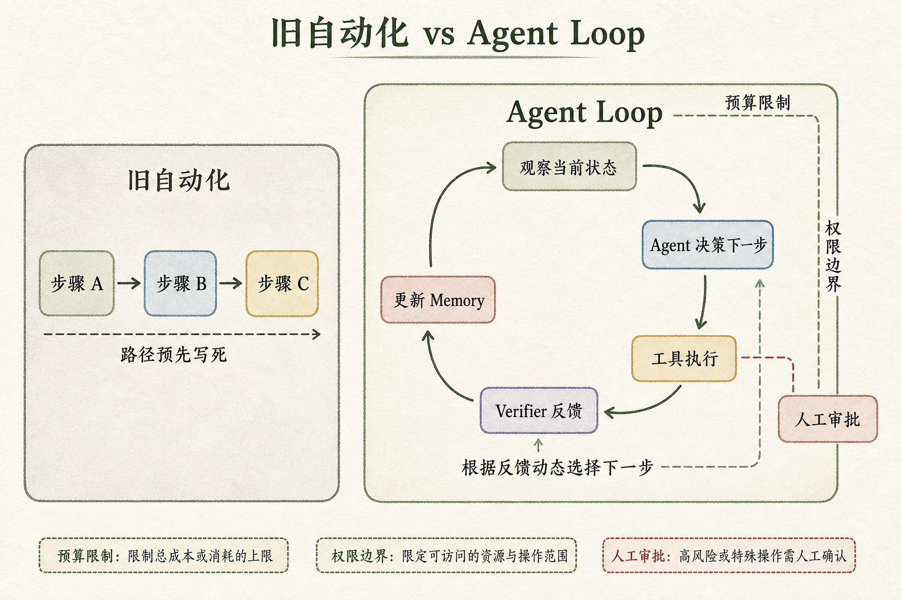

---

## 14. Skills 自进化：Agent 越用越聪明

### 定义

**Skills 自进化**：Agent 在执行任务的过程中，把可复用的操作经验沉淀为外部 Skill，并通过检索、使用、验证、修补、发布和淘汰，让这个 Skill 集合持续变得更适合后续任务。

关键词：**外部化、可验证、可回滚、可传播。**

**为什么强调外部化？** 闭源模型没法改权重，开源模型在线训练成本高、风险大。更现实的路径：把经验写成 `SKILL.md`、脚本、模板、验证步骤这类外部工件。

**Skill ≠ Memory**：Memory 回答"是什么"（用户偏好、环境配置），Skill 回答"怎么做"（执行步骤、处理流程）。

### 八条技术路线

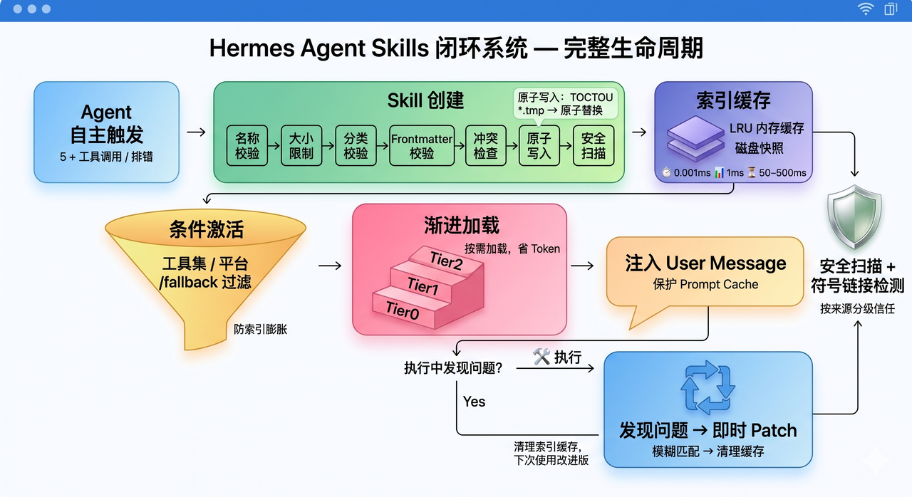

#### 路线一：Hermes（在线闭环）

**思路**：边用边沉淀。Agent 在执行中自主判断什么值得记，记成 Skill。后续使用时发现错误立即 patch。

**适合**：个人 Agent、桌面 Agent、开发者工具。

**风险**：容易把局部经验固化成全局规则。需要工程阈值——简单任务不存、新 Skill 先是草稿、危险操作过安全扫描。

#### 路线二：Trace2Skill（离线批量蒸馏）

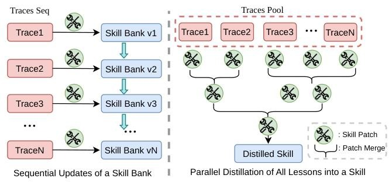

**思路**：不跑一条轨迹就改一次，而是积攒大批轨迹，统一提炼稳定通用的 SOP。就像人类不会只看一次操作就定流程——看多组案例，分清偶发情况和固定规律。

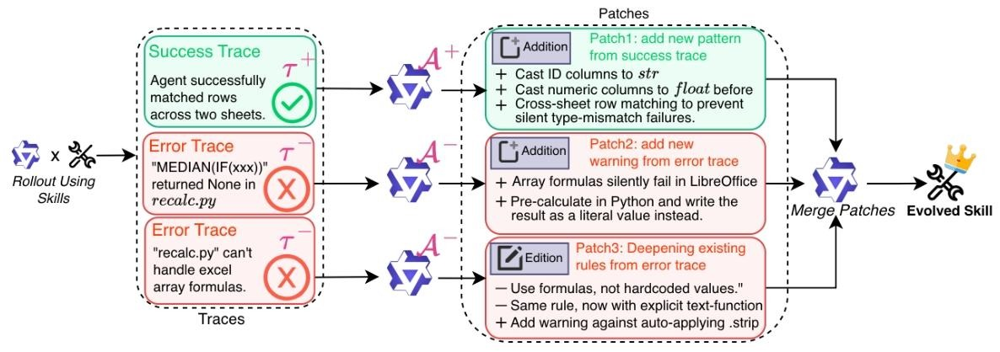

**三步流程**：收集轨迹 → 并行分析（正向分析成功、反向分析失败）→ Merge 去重消冲突。

**优势**：技能不受原模型限制，跨模型迁移效果显著。

#### 路线三：CoEvoSkills（生成器 + 校验器协同进化）

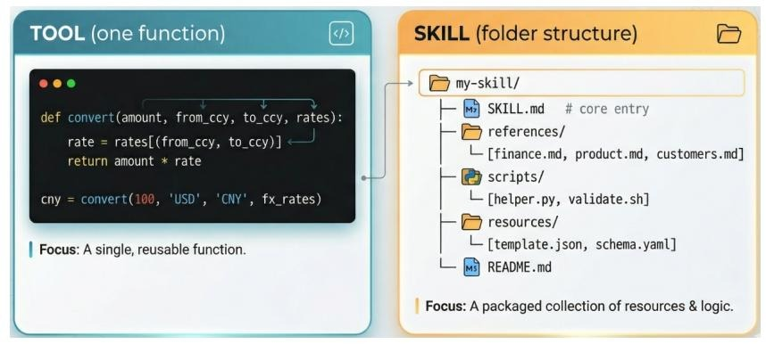

**两套独立 AI 隔离互评**：
- **Skill Generator**：从零迭代产出完整技能包
- **Surrogate Verifier**：看不到生成器思考过程，独立设计测试用例挑错

两者来回循环打磨，只有仿真校验全过才送真值校验终审。仅 5 轮迭代就超越人工手写技能。

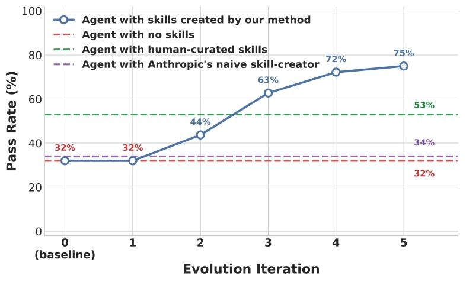
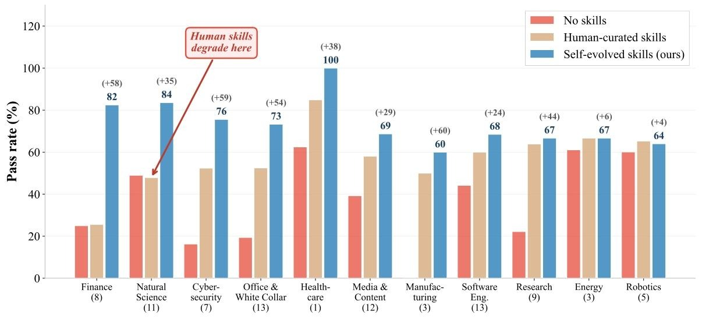
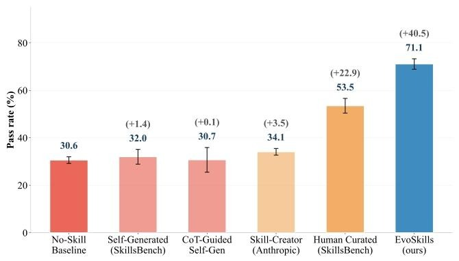

#### 路线四：SkillX（三级分层技能库）

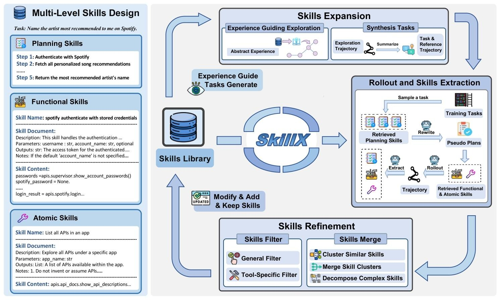

- **Planning Skills**：顶层全局调度（任务拆解、分支判断）
- **Functional Skills**：中层可复用子流程（封装一组工具完成固定子目标）
- **Atomic Skills**：底层工具规范（API 参数、报错处理）

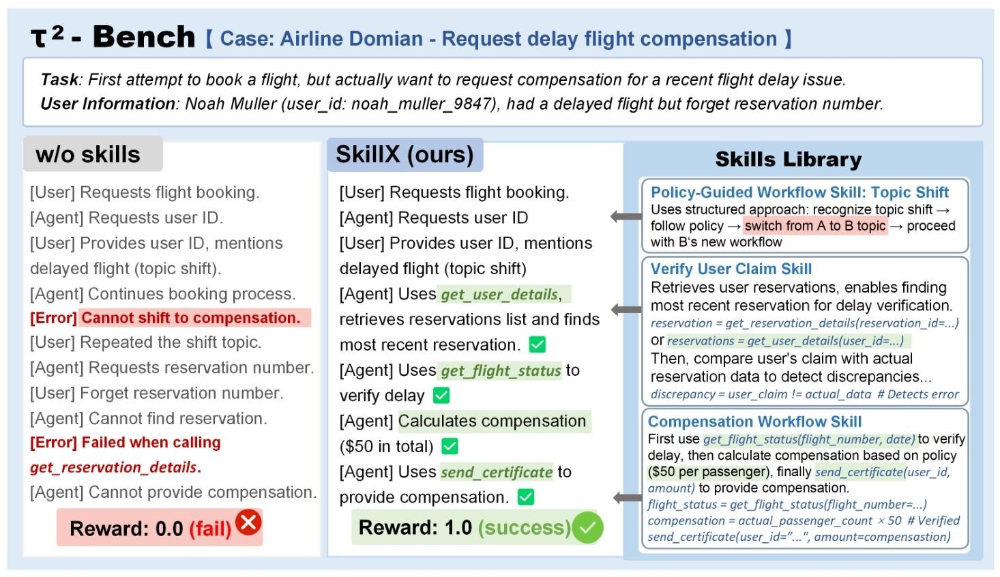

#### 路线五：SkillClaw（多用户集体进化）

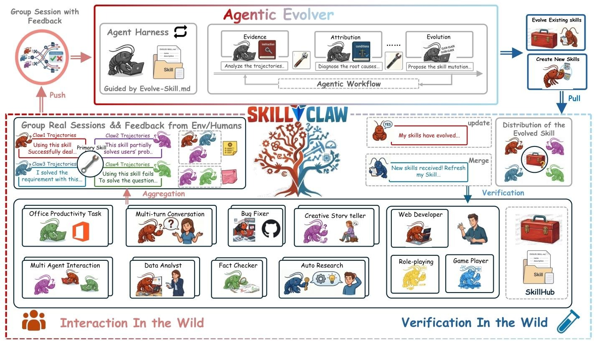

打破"经验孤岛"——A 用户踩的坑，B 用户也能受益。全量用户轨迹后台聚合，批量分析后更新共享 SkillHub。

**适合**：平台型产品（企业 Agent 平台、浏览器 Agent、代码助手生态）。

#### 路线六：SkillOpt（把 Skill 当外部参数优化）

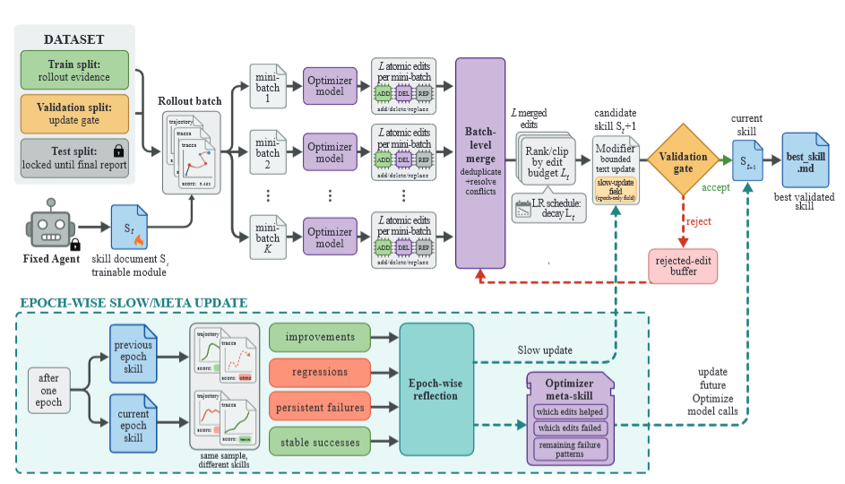

**核心思想**：很多 Skill 自进化实际上在"漂移"——今天加一段，明天删一段，后天全文重写，看着一直在改，实际没稳定变好。

SkillOpt 用三个东西管住：
- **Bounded Edit**：每次只允许有限修改
- **Validation Gate**：没提升就不接受
- **Rejected Buffer**：失败改动也被记住，避免重复犯同样的优化错误

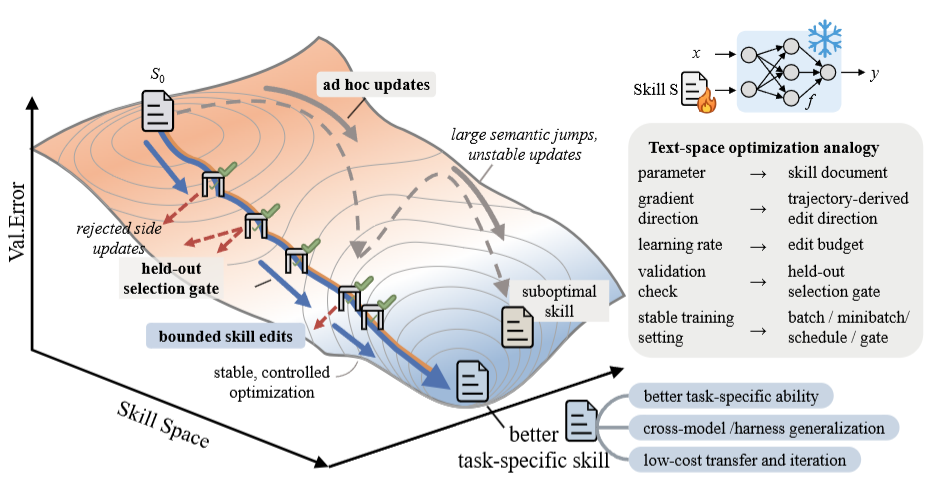
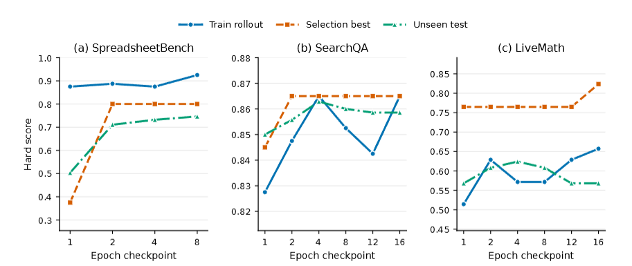

#### 路线七：SkillOS（RL 训练技能管理员）

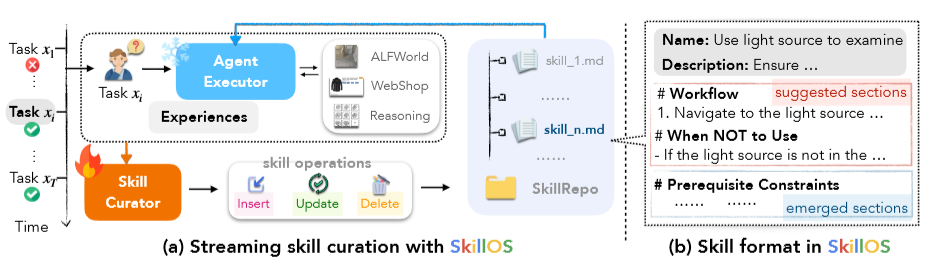

**两个角色**：
- **Agent Executor**：冻结，只负责干活
- **Skill Curator**：可训练，负责对 Skill 仓库做增/删/改

用 GRPO 强化学习训练 Curator——因为技能治理的收益是**延迟**的（现在优化的技能，价值体现在未来的任务）。

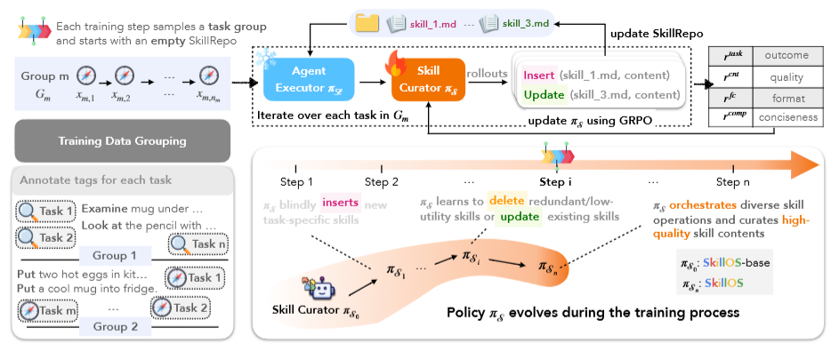
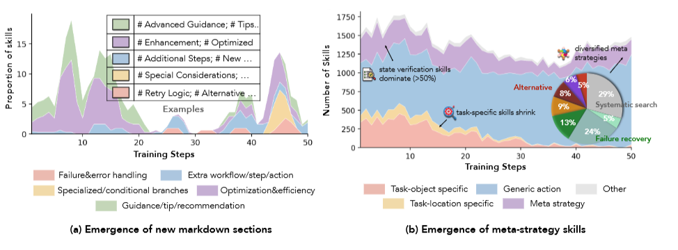

#### 路线八：SKILL0 + Skill1（RL 路线——从使用到内化）

**SKILL0**：训练时有 Skill，推理时不加载 Skill。模型学会了 Skill 的本质能力，不需要外部依赖。

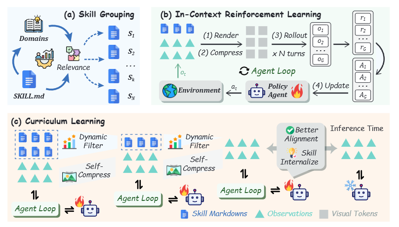
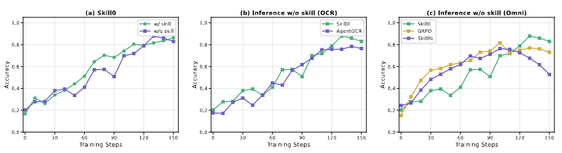

**Skill1**：选择（Selection）、使用（Utilization）、蒸馏（Distillation）三件事用一个 policy 同时训练。ALFWorld 上达到 97.5% 平均成功率。

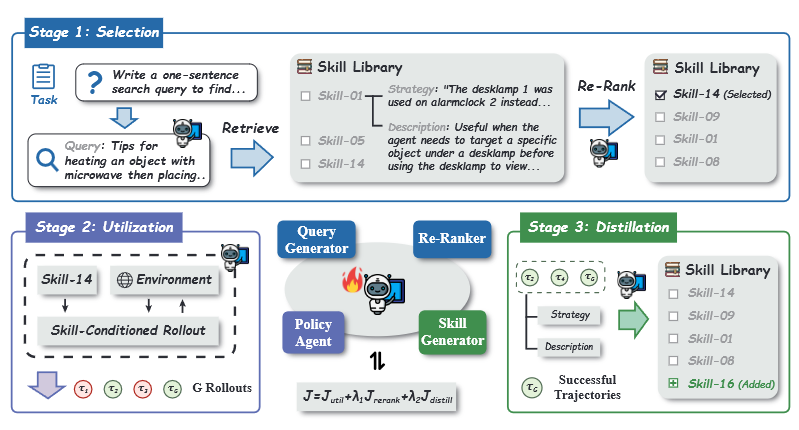
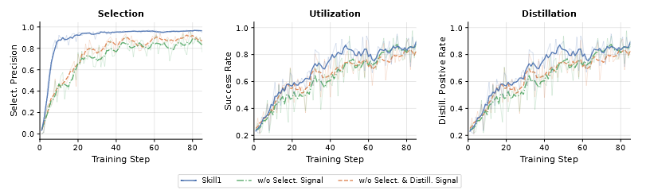

---

## 总结：Agent 学了什么？

| 章节 | 核心内容 | 一句话 |
|------|---------|--------|
| Agent 概述 | 大模型 + 规划 + 记忆 + 工具 | 给 AI 装上手脚，从聊天变干活 |
| Agent 分类 | 单/多/混合 | 一个人干还是团队干，各有取舍 |
| Planning | CoT/ToT/ReAct/ReWoo/Plan&Solve/LLMCompiler | Agent 的大脑，决定"怎么做" |
| Memory | 短期/长期/混合记忆 | Agent 的记事本，告别金鱼记忆 |
| Tool | Function Call/MRKL/HuggingGPT | 给 AI 配瑞士军刀 |
| 多智能体失败 | 14 种失败模式 | 三个和尚没水喝，沟通成本是杀手 |
| MCP | 统一协议 | 给工具调用装 USB-C 插头 |
| Skills | 工作手册 + 渐进加载 | 让 Agent 有标准操作流程 |
| OpenClaw | 五步流水线 + Pi 内核 | 工业级开源 Agent 框架解剖 |
| Hermes | 七段式闭环 + GEPA | 会自我进化的 Agent |
| Harness Engineering | 模型权重之外的一切 | 驾驭大模型的马具 |
| Harness 综述 | ETCLOVG 七层 | 从执行环境到治理的完整框架 |
| Loop Engineering | 八组件闭环 | 让 Agent 自主持续运行 |
| Skills 自进化 | 八条路线 | Agent 越用越聪明的方法论 |

> **工程核心理念**：模型变了，Harness 可以不变；但 Harness 的任何改动，都要以全系统视角测试。Agent 工程的核心竞争力是——能不能把模型包进一个可执行、可观测、可验证、可治理的系统里。

