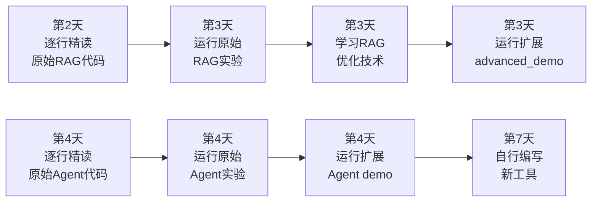

# Tiny-RAG + Tiny-Agent 双项目实战 — 第四节课

> **建议完成时间**：第四周第 6~7 天（直播后）  
> **前置条件**：已观看直播，已注册硅基流动账号并获取 API Key

本项目基于 Datawhale 开源的 **[happy-llm](https://github.com/datawhalechina/happy-llm)** 项目（⭐ 31K+ stars），重点实战**第 7 章**两个核心模块：

| 模块 | 原始位置 | 扩展位置 | 学习目标 |
| --- | --- | --- | --- |
| **Tiny-RAG** | `happy-llm/docs/chapter7/RAG/` | `项目一-TinyRAG扩展/` | 原始版 RAG → 进阶优化（语义分块+BM25+融合检索） |
| **Tiny-Agent** | `happy-llm/docs/chapter7/Agent/` | `项目二-TinyAgent扩展/` | 原始版 Agent(3工具) → 扩展版(15个工具) |

## 仓库结构

```
第四节课/
├── 讲义.md                          # 完整讲义（逐行代码精读 + 扩展项目讲解）
├── README.md                        # 本文件
├── images/                          # 讲义配图
├── happy-llm/                       # Datawhale happy-llm 完整仓库
│   └── docs/chapter7/
│       ├── RAG/                     # ★ 原始 Tiny-RAG（先读这个）
│       └── Agent/                   # ★ 原始 Tiny-Agent（先读这个）
├── 项目一-TinyRAG扩展/              # ★ 扩展版 RAG
│   ├── advanced_demo.py             # 融合检索主入口
│   ├── utils.py                     # 新增：语义分块 + BM25Index
│   ├── Embeddings.py / VectorBase.py / LLM.py / .env_example
│   └── requirements.txt
└── 项目二-TinyAgent扩展/            # ★ 扩展版 Agent
    ├── demo.py                      # CLI 入口（8个工具）
    ├── src/
    │   ├── core.py                  # Agent 核心引擎（增强注释版）
    │   ├── tools.py                 # 15 个工具函数
    │   └── utils.py                 # function_to_json
    └── requirements.txt
```

## 环境准备

两个项目共用**硅基流动（SiliconFlow）**免费 API：

1. 注册 [siliconflow.cn](https://siliconflow.cn/) → 创建 API Key

### 原始Tiny-RAG
```bash
cd happy-llm/docs/chapter7/RAG
cp .env_example .env       # 填入 Key
pip install -r requirements.txt
```

### 原始 Tiny-Agent
```bash
cd happy-llm/docs/chapter7/Agent
pip install -r requirements.txt
# 修改 demo.py 中 api_key="sk-xxx"
```

### 扩展 Tiny-RAG
```bash
cd 项目一-TinyRAG扩展
cp .env_example .env && pip install -r requirements.txt
```

### 扩展 Tiny-Agent
```bash
cd 项目二-TinyAgent扩展
pip install -r requirements.txt
# 修改 demo.py 中 API_KEY
```

## 学习流水线



## 逐文件阅读顺序

### 项目一 Tiny-RAG

| 顺序 | 文件 | 页数 | 重点 |
| --- | --- | ---: | --- |
| 1 | `demo.py` | 19 行 | 五步全流程 |
| 2 | `utils.py` | 188 行 | 分块逻辑 + 文件读取 |
| 3 | `Embeddings.py` | 104 行 | 手写余弦相似度 |
| 4 | `VectorBase.py` | 53 行 | argsort() Top-K 检索 |
| 5 | `LLM.py` | 55 行 | Prompt 模板 |

### 扩展 RAG 新增

| 文件 | 新增内容 | 重点 |
| --- | --- | --- |
| `advanced_demo.py` | 融合检索主循环 | `hybrid_search()` RRF 实现 |
| `utils.py`（新增部分） | `BM25Index` 类 | BM25 公式逐行实现 |
| | `semantic_chunk()` 函数 | 语义断点算法 |

### 项目二 Tiny-Agent

| 顺序 | 文件 | 重点 |
| --- | --- | --- |
| 1 | `src/utils.py` | `function_to_json` — 自动生成 Schema |
| 2 | `src/tools.py` | 工具函数（类型注解 → Schema） |
| 3 | `src/core.py` | `get_completion()` ReAct 循环 |
| 4 | `demo.py` | Agent 创建 + 交互循环 |

### 扩展 Agent 新增

| 文件 | 新增内容 |
| --- | --- |
| `src/tools.py` | +8 个工具：计算器、文件读取、字符串处理、随机数 |

## 实验任务清单

### Tiny-RAG 实验
- [ ] 运行原始 `demo.py`，观察 RAG 问答
- [ ] 运行扩展 `advanced_demo.py`，对比 `USE_HYBRID=True/False`
- [ ] 调整 `ALPHA=0.2/0.5/0.8`，观察融合偏向
- [ ] 修改 `TOP_K=1/3/5`，观察回答质量
- [ ] 修改 `MAX_TOKEN_LEN=300/1200`，观察分块影响

### Tiny-Agent 实验
- [ ] 运行原始 `demo.py`，依次问时间/维基百科/天气
- [ ] 运行扩展 `demo.py`，测试计算器/文件读取/字符串处理
- [ ] 在 `tools.py` 中自行编写 1 个新工具函数
- [ ] 问一个需要 2+ 个工具协作的问题
- [ ] 对比 `tools=[]`（空工具列表）vs `tools=[...]`的差异

## 常见问题

| 问题 | 解决方法 |
| --- | --- |
| RAG `OPENAI_API_KEY` 错误 | `.env` 在项目目录下 |
| Agent `AuthenticationError` | `demo.py` 中 Key 已替换 |
| `No module named 'xxx'` | `pip install -r requirements.txt` |
| 向量化很慢 | API 速率限制，先用小文档 |
| Wikipedia 搜索无结果 | 英文关键词更好 |
| eval() 计算器提示错误 | 仅支持数学表达式 |

> 详细逐行代码讲解见 `../讲义.md`
