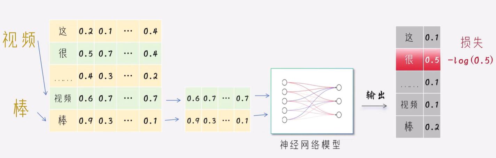
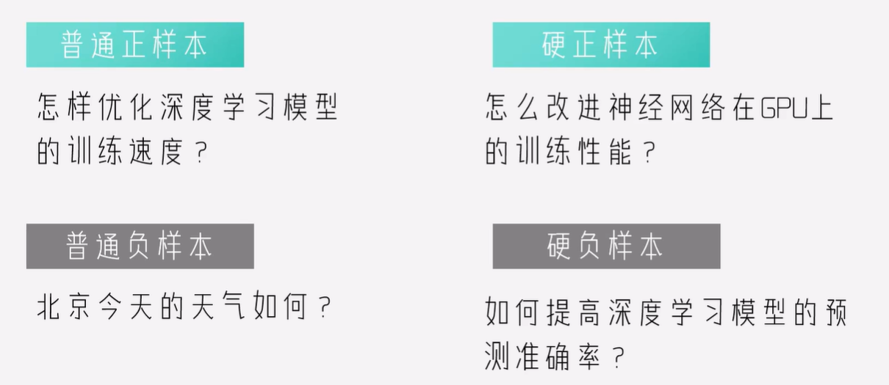
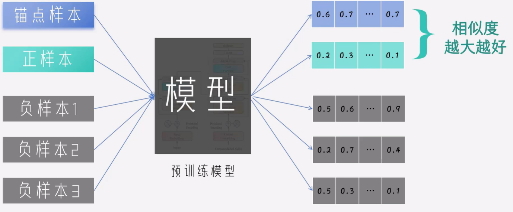
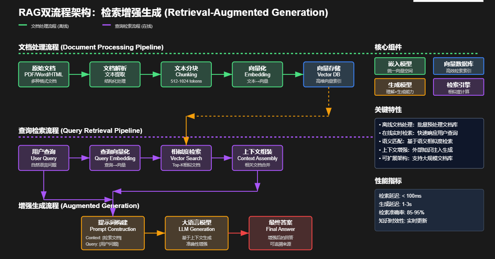
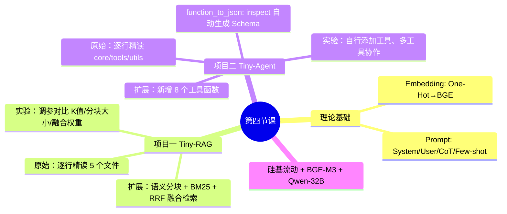

# 第四节课：大模型应用技术与 happy-llm 实战

## 零、课程说明

**课程名称**：零基础深度学习直通大模型  
**适用对象**：已完成前三节课，具备 PyTorch、CLIP 基础的同学  
**第四节课目标**：系统学习大模型应用两大核心技术——**RAG（检索增强生成）** 与 **Agent（智能代理）**，通过 Datawhale 开源项目 **[happy-llm]** 的两个实战模块——**Tiny-RAG** 和 **Tiny-Agent**，从零手写理解每一行代码；在此基础上完成扩展项目，亲手实现 RAG 优化（语义分块、融合检索）和 Agent 扩展工具

### 项目介绍

**[happy-llm]**（Datawhale，⭐ 31K+ stars）是系统性 LLM 学习教程。本课程围绕其**第 7 章**两个核心实战模块展开：

| 模块 | 原始位置 | 扩展位置 | 说明 |
| --- | --- | --- | --- |
| **Tiny-RAG** | `happy-llm/docs/chapter7/RAG/` | `项目一-TinyRAG扩展/` | 原始版 RAG → 进阶优化（语义分块+BM25+融合检索） |
| **Tiny-Agent** | `happy-llm/docs/chapter7/Agent/` | `项目二-TinyAgent扩展/` | 原始版 Agent(3工具) → 扩展版(15个工具) |

### 课程节奏说明

| 类型 | 天数 | 说明 |
| --- | ---: | --- |
| **直播上课** | 1 天 | 逐行精读两个项目原始代码 → 展示扩展版新增代码 → 讲解 RAG 优化数学原理 |
| **自习任务** | 6 天 | 按计划表先运行原始版 → 再运行扩展版 → 对照讲义逐行理解 → 动手修改参数 |

### 第四周学习计划表

**本周主题**：RAG × Agent 双项目实战（原始 → 扩展）  
**直播日**：第 5 天

| 天数 | 类型 | 任务 |
| ---: | --- | --- |
| **第 1 天** | 自习 | 学习「第一部分」理论基础（Embedding + Prompt） |
| **第 2 天** | 自习 | 学习「第二部分」RAG 原理 + 逐行精读 Tiny-RAG 原始代码 |
| **第 3 天** | 自习 | 运行原始 Tiny-RAG → 学习「第二部分」RAG 优化 → 运行扩展版 advanced_demo.py |
| **第 4 天** | 自习 | 学习「第三部分」Agent 原理 + 逐行精读 Tiny-Agent 原始代码 + 扩展版 |
| **第 5 天** | **直播** | 双项目逐行走读 + 扩展代码精讲 + 现场运行 |
| **第 6 天** | 自习 | 项目一扩展实验：调参（K值、分块大小、融合权重）、自备文档 |
| **第 7 天** | 自习 | 项目二扩展实验：为 Agent 编写自定义工具、测试多工具协作 |

#### 第四周自习验收清单

- [ ] 能逐个文件、逐行说出 Tiny-RAG 每行代码的作用
- [ ] 能逐个文件、逐行说出 Tiny-Agent 每行代码的作用
- [ ] 成功运行原始 Tiny-RAG + 扩展版 advanced_demo.py
- [ ] 成功运行原始 Tiny-Agent + 扩展版 demo.py（8 工具）
- [ ] 能解释语义分块、BM25、RRF 融合检索的数学原理
- [ ] 能解释 function_to_json 如何自动生成 Schema
- [ ] 为 Tiny-Agent 添加至少 1 个自定义工具函数

---

# 第一部分：理论基础 — 两个项目的共同基石

## 1.1 文本向量化：为什么需要？

计算机无法直接理解文本，需要将文本转换为数值向量才能计算和比较。

```
文本 → 向量化方法 → 数值向量 → 计算/比较/检索
```

## 1.2 One-Hot 编码

将每个词表示为一个只有一个位置为 1 的向量。假设词表大小为 $V$：

$$\vec{w_i} = [0, 0, ..., 1, ..., 0, 0]$$

**缺点**：维度灾难 + 语义缺失（任意两词余弦相似度均为 0）。

## 1.3 TF-IDF

统计方法。核心思想：**TF 高 → 在当前文档重要；DF 高 → 太常见、区分度低 → IDF 低**。

$$\text{TF-IDF}(t, d, D) = \text{TF}(t, d) \times \log\frac{|D|}{|\{d \in D : t \in d\}|}$$

## 1.4 BM25

改进的 TF-IDF：**词频饱和** + **文档长度归一化**（两个核心改进是后续扩展项目的基础）。

$$BM25(D, Q) = \sum_{i=1}^{n} IDF(q_i) \cdot \frac{f(q_i, D) \cdot (k_1 + 1)}{f(q_i, D) + k_1 \cdot (1 - b + b \cdot \frac{|D|}{avgdl})}$$

## 1.5 Word2Vec

> **"You shall know a word by the company it keeps."** — J.R. Firth



| 模型 | 输入 | 输出 | 特点 |
| --- | --- | --- | --- |
| CBOW | 上下文词 | 目标词 | 训练快 |
| Skip-gram | 目标词 | 上下文词 | 适合低频词 |

经典语义算术：$\vec{v}_{king} - \vec{v}_{man} + \vec{v}_{woman} \approx \vec{v}_{queen}$

## 1.6 BGE 嵌入模型



Tiny-RAG 使用的 **BGE-M3** 是多语言 SOTA 嵌入模型，输出 1024 维向量。

### 对比学习损失（与 CLIP 同源）



$$\mathcal{L} = -\log \frac{\exp(sim(q, d^+) / \tau)}{\exp(sim(q, d^+) / \tau) + \sum_{i=1}^{N} \exp(sim(q, d_i^-) / \tau)}$$

### 余弦相似度（Tiny-RAG 检索的基础）

$$\cos(\vec{A}, \vec{B}) = \frac{\vec{A} \cdot \vec{B}}{|\vec{A}| \cdot |\vec{B}|}$$

## 1.7 Embedding 技术总结

| 方法 | 向量类型 | 语义理解 | 上下文感知 |
| --- | --- | --- | --- |
| One-Hot | 稀疏 | ✗ | ✗ |
| TF-IDF / BM25 | 稀疏/分数 | 部分 | ✗ |
| Word2Vec | 稠密 | ✓ | ✗ |
| BGE | 稠密 | ✓✓ | ✓ |

核心方向：**稀疏→稠密，离散→连续，静态→动态，单词→文档**。

## 1.8 Prompt 工程（两个项目都用）

**Prompt** 是 LLM 交互的接口：
- **Tiny-RAG**：用 Prompt 模板引导 LLM 基于检索到的上下文生成答案
- **Tiny-Agent**：用 System Prompt 定义 Agent 角色，引导其使用工具

### System Prompt vs User Prompt

| 特性 | System Prompt | User Prompt |
| --- | --- | --- |
| 定义 | 定义 AI 角色和行为约束 | 用户具体问题 |
| 设置者 | 开发者 | 终端用户 |
| 持久性 | 整个对话不变 | 每轮可变 |

### Prompt 工程四大技巧

| 技巧 | 说明 |
| --- | --- |
| **Role Playing** | 角色扮演："你是一位专业的..." |
| **CoT** | 思维链："请一步一步思考..." |
| **Few-shot** | 先给出几个示例，再问新问题 |
| **格式控制** | 指定输出格式："请以 JSON 输出..." |

---

# 第二部分：项目一 Tiny-RAG — 从原始到优化

> **原始项目位置**：`happy-llm/docs/chapter7/RAG/`  
> **扩展项目位置**：`项目一-TinyRAG扩展/`  
> **学习路径**：先逐行读懂原始代码 → 运行实验 → 再读扩展版代码（实现进阶优化）

## 2.1 RAG 核心理念

### 为什么需要 RAG？

| 问题 | 纯 LLM | RAG |
| --- | --- | --- |
| 知识时效性 | 训练数据有截止日期 | 接入外部实时文档 |
| 幻觉 | 可能编造虚假信息 | 基于检索到的原文 |
| 私有数据 | 无法访问 | 接入本地知识库 |
| 可追溯性 | 不可查 | 可回溯到具体段落 |

### RAG 全流程（九步）



| 阶段 | 步骤 | 说明 |
| --- | --- | --- |
| **离线建库** | ① 文档加载 | 读取 PDF/MD/TXT |
| | ② 文本分块 | 按 token 切分，块间有重叠 |
| | ③ 向量编码 | 每个块 → BGE-M3 → 1024 维向量 |
| | ④ 向量存储 | 存入本地 JSON |
| **在线问答** | ⑤ 查询编码 | 问题 → 向量 |
| | ⑥ Top-K 检索 | 余弦相似度 → 最相关 K 个块 |
| | ⑦ Prompt 拼接 | 检索结果 + 问题 → Prompt 模板 |
| | ⑧ LLM 生成 | 基于上下文生成答案 |

## 2.2 RAG 核心公式（你需要理解并用在扩展项目里）

**检索相关性**：
$$\text{score}(q, d) = \cos(\vec{E}_q, \vec{E}_d) = \frac{\vec{E}_q \cdot \vec{E}_d}{\|\vec{E}_q\| \cdot \|\vec{E}_d\|}$$

**Top-K 检索**：
$$D_{top-k} = \underset{d \in D}{\text{argmax-k}} \ \text{score}(q, d)$$

**RAG 生成**：
$$P(a|q) = P_{LLM}(a | [context; q])$$

---

## 2.3 原始 Tiny-RAG 逐行精读

### 文件结构概览

```
happy-llm/docs/chapter7/RAG/
├── demo.py          # 主入口：串联全流程（19 行，每行一道关键操作）
├── utils.py         # 文档加载 + token 级分块（188 行）
├── Embeddings.py    # BGE-M3 嵌入 + 手写余弦相似度（104 行）
├── VectorBase.py    # 向量存储 + Top-K 查询 + JSON 持久化（53 行）
└── LLM.py           # Prompt 模板 + LLM API 调用（55 行）
```

---

### 文件 ① `demo.py` — 全流程串联（19 行逐行解读）

```python
# 第1-4行：导入四个核心模块
from VectorBase import VectorStore     # 向量数据库
from utils import ReadFiles             # 文件读取器
from LLM import OpenAIChat              # LLM 调用封装
from Embeddings import OpenAIEmbedding  # 嵌入模型

# 第7行：从 ./data 目录读取所有文件内容并分块
#   max_token_len=600  → 每个块最多 600 token
#   cover_content=150  → 相邻块之间重叠 150 token（保证语义不丢失）
docs = ReadFiles('./data').get_content(max_token_len=600, cover_content=150)

# 第8行：创建向量存储对象（传入所有文档块）
vector = VectorStore(docs)

# 第9行：初始化嵌入模型（BAAI/bge-m3，通过硅基流动 API）
embedding = OpenAIEmbedding()

# 第10行：对每个文档块调用 BGE-M3 编码，得到 1024 维向量
#   这是整个流程中最耗时的步骤（需调用网络 API）
vector.get_vector(EmbeddingModel=embedding)

# 第11行：将向量和原始文档保存到 storage/ 目录
#   下次运行可直接 load_vector() 加载，无需重新编码
vector.persist(path='storage')

# 第14行：定义要查询的问题
question = 'RAG的原理是什么？'

# 第16行：检索最相关的 1 个文档块
#   query() 内部流程：问题编码 → 余弦相似度计算 → 排序 → Top-1
content = vector.query(question, EmbeddingModel=embedding, k=1)[0]

# 第17行：初始化 LLM（Qwen2.5-32B）
chat = OpenAIChat(model='Qwen/Qwen2.5-32B-Instruct')

# 第18行：将检索到的上下文 + 问题填入 Prompt 模板 → 调用 LLM 生成答案
print(chat.chat(question, [], content))
```

> **关键理解**：整个 RAG 流程只有 5 行核心代码——加载→编码→存储→检索→生成。正是因为每个模块都做了恰当的封装。

---

### 文件 ② `utils.py` — 文档加载与分块

#### 类 `ReadFiles`

```python
class ReadFiles:
    def __init__(self, path: str):        # 接收 data/ 目录路径
        self._path = path
        self.file_list = self.get_files()  # 立刻扫描所有文件

    def get_files(self):
        """递归遍历目录，收集 .md / .txt / .pdf 文件"""
        file_list = []
        for filepath, dirnames, filenames in os.walk(self._path):
            # os.walk() 递归遍历所有子目录
            # filepath: 当前目录路径
            # filenames: 当前目录下的文件名列表
            for filename in filenames:
                if filename.endswith((".md", ".txt", ".pdf")):
                    # 仅收集这三种文件类型
                    file_list.append(os.path.join(filepath, filename))
        return file_list
```

> **重点**：`os.walk()` 递归遍历所有子目录，这意味着你可以在 `data/` 下建子文件夹分类管理文档。

#### `get_content()` — 入口函数

```python
def get_content(self, max_token_len=600, cover_content=150):
    docs = []
    for file in self.file_list:
        content = self.read_file_content(file)      # ① 读取原文
        chunk_content = self.get_chunk(             # ② 切分成块
            content, max_token_len, cover_content)
        docs.extend(chunk_content)                  # ③ 合并结果
    return docs
```

#### `get_chunk()` — 核心分块逻辑

```python
@classmethod
def get_chunk(cls, text, max_token_len=600, cover_content=150):
    chunk_text = []                     # 存放最终的分块结果
    curr_len = 0                        # 当前块已累积的 token 数
    curr_chunk = ''                     # 当前正在构建的文本块
    token_len = max_token_len - cover_content  # 新内容可用上限

    lines = text.splitlines()           # 按换行符拆分为多行

    for line in lines:
        line = line.strip()
        line_len = len(enc.encode(line))  # 用 tiktoken 计算本行 token 数

        if curr_len + line_len + 1 <= token_len:
            # ★ 情况1：当前行可以加入当前块
            curr_chunk += '\n' + line
            curr_len += line_len + 1
        else:
            # ★ 情况2：当前块已满，保存当前块，开始新块
            chunk_text.append(curr_chunk)

            # 新块的开头 = 上一个块的末尾片段（重叠区）
            prev_chunk = chunk_text[-1]
            cover = prev_chunk[-cover_content:]  # 取末尾 cover_content 个字符
            curr_chunk = cover + '\n' + line
            curr_len = len(enc.encode(cover)) + 1 + line_len

    if curr_chunk:
        chunk_text.append(curr_chunk)   # 追加最后一块
    return chunk_text
```

> **为什么需要重叠？** 假设某句话刚好被从中间切断——"今天天气很好，适合去"和"公园散步"分到两个块中。如果没有重叠，检索时可能只命中前半个块，丢失"公园散步"这个关键信息。重叠区域保证了语义串接。

#### 三种文件读取方式

```python
# PDF: 使用 PyPDF2.PdfReader 逐页提取
# Markdown: markdown → HTML → BeautifulSoup 提取纯文本
# TXT: 直接 open().read()
```

---

### 文件 ③ `Embeddings.py` — 向量编码

#### `OpenAIEmbedding` 类

```python
class OpenAIEmbedding:
    def __init__(self):
        self.client = OpenAI()  # 创建 OpenAI 兼容客户端
        # 从 .env 文件读取配置（硅基流动）
        self.client.api_key = os.getenv("OPENAI_API_KEY")
        self.client.base_url = os.getenv("OPENAI_BASE_URL")
```

> **关键**：`python-dotenv` 库的 `load_dotenv(find_dotenv())` 会自动从 `.env` 文件加载环境变量，`os.getenv()` 读取。这意味着你只需要创建 `.env` 文件，代码中不需要硬编码 API Key。

#### `get_embedding()` — 核心编码函数

```python
def get_embedding(self, text, model="BAAI/bge-m3"):
    text = text.replace("\n", " ")            # 去掉换行符减少 Token
    resp = self.client.embeddings.create(      # 调用硅基流动 API
        input=[text],                           # 输入文本
        model=model                             # BAAI/bge-m3
    )
    return resp.data[0].embedding              # 返回 1024 维浮点数向量
```

#### `cosine_similarity()` — 手写余弦相似度（非调库）

```python
@staticmethod
def cosine_similarity(v1, v2):
    a = np.array(v1, dtype=np.float32)        # 转为 NumPy 数组
    b = np.array(v2, dtype=np.float32)

    if not np.all(np.isfinite(a)) or not np.all(np.isfinite(b)):
        return 0.0                            # 防御：无穷大/NaN 直接返回 0

    dot = np.dot(a, b)                        # 点积: a₁b₁ + a₂b₂ + ...
    norm_a = np.linalg.norm(a)                # ||a|| = √(Σaᵢ²)
    norm_b = np.linalg.norm(b)                # ||b|| = √(Σbᵢ²)

    if norm_a == 0 or norm_b == 0:
        return 0.0                            # 防止除零
    return float(dot / (norm_a * norm_b))     # cos θ = (a·b)/(||a||·||b||)
```

> **为什么要手写而不是调 `sklearn.cosine_similarity`？** 减少依赖，且让你真正理解余弦相似度的计算过程——点积除以范数积。

---

### 文件 ④ `VectorBase.py` — 向量存储与检索

#### `VectorStore` 类

```python
class VectorStore:
    def __init__(self, documents):       # documents 是文档块列表
        self.document = documents        # 原始文本
        self.vectors = []                # 对应的向量（初始为空）
```

#### `persist()` — 持久化

```python
def persist(self, path='storage'):
    os.makedirs(path, exist_ok=True)     # 创建目录（如果不存在）
    # 保存原始文档（ensure_ascii=False 保留中文）
    with open(f"{path}/documents.json", 'w', encoding='utf-8') as f:
        json.dump(self.document, f, ensure_ascii=False)
    # 保存向量列表
    if self.vectors:
        with open(f"{path}/vectors.json", 'w', encoding='utf-8') as f:
            json.dump(self.vectors, f)
```

#### `query()` — 核心检索函数

```python
def query(self, query, EmbeddingModel, k=1):
    # 步骤1：将查询文本转为向量
    query_vector = EmbeddingModel.get_embedding(query)

    # 步骤2：计算查询向量与所有文档向量的余弦相似度
    #   → 列表推导式，对每个文档向量做一次余弦计算
    scores = [EmbeddingModel.cosine_similarity(query_vector, v)
              for v in self.vectors]

    # 步骤3：排序取 Top-K
    #   argsort() 返回从小到大的索引排序
    #   [-k:] 取后k个（相似度最高的k个）
    #   [::-1] 反转，从大到小
    #   np.array().tolist() 转为 Python 列表
    scores_arr = np.array(scores)
    top_indices = scores_arr.argsort()[-k:][::-1]
    return np.array(self.document)[top_indices].tolist()
```

> **`argsort()` 技巧**：`[3.2, 1.5, 4.0, 2.1]` → `argsort()` → `[1, 3, 0, 2]`（索引按值从小到大）。取 `[-2:]` → `[0, 2]` → `[::-1]` 反转 → `[2, 0]`，即最相似的 2 个文档的索引。

---

### 文件 ⑤ `LLM.py` — 大模型调用

```python
# RAG Prompt 模板：两个关键指令
#   1. "使用以上下文来回答" → 告诉 LLM 必须基于检索片段回答
#   2. "如果给定的上下文无法让你做出回答" → 防止 LLM 自己编造
RAG_PROMPT_TEMPLATE = """
使用以上下文来回答用户的问题。如果你不知道答案，就说你不知道。
问题: {question}
可参考的上下文：
···
{context}
···
如果给定的上下文无法让你做出回答，请回答数据库中没有这个内容，你不知道。
"""

class OpenAIChat:
    def chat(self, prompt, history, content):
        client = OpenAI()
        client.api_key = os.getenv("OPENAI_API_KEY")
        client.base_url = os.getenv("OPENAI_BASE_URL")

        # 关键：将问题和上下文填入模板
        history.append({
            'role': 'user',
            'content': RAG_PROMPT_TEMPLATE.format(
                question=prompt,     # 填入用户问题
                context=content      # 填入检索到的上下文
            )
        })

        response = client.chat.completions.create(
            model=self.model,
            messages=history,
            max_tokens=2048,        # 最大生成 2048 token
            temperature=0.1,        # 低温度 → 更确定性，减少幻觉
        )
        return response.choices[0].message.content
```

> **temperature=0.1 的作用**：越低回答越确定、越"保守"——适合 RAG 场景，我们希望 LLM 忠实于检索到的原文，而不是自由发挥。

---

## 2.4 【先做实验】运行原始 Tiny-RAG

```bash
cd happy-llm/docs/chapter7/RAG
cp .env_example .env                    # 填入你的 API Key
pip install -r requirements.txt
mkdir data
# 把 ../../讲义.md 复制到 data/ 或放入你自己的 PDF
python demo.py
```

观察输出：LLM 生成的回答是否引用了 data/ 中文档的内容？如果没有 API 错误，你应该看到类似"RAG 是 Retrieval-Augmented Generation..."的回答。

---

## 2.5 RAG 进阶优化技术（数学原理）

> 这一节是扩展项目 `advanced_demo.py` 的理论基础。请先理解以下 5 种优化技术的原理，再去看扩展代码。

### 2.5.1 语义分块（Semantic Chunking）

**问题**：原始 `get_chunk()` 按固定 token 数切分，可能在句子中间切断。

**解法**：计算相邻句子的语义向量相似度，在"语义断点"处切分。

**算法步骤**：

1. 将文档按句子分割：$S = [s_1, s_2, ..., s_n]$
2. 计算相邻句子相似度：$sim_i = \cos(\vec{E}_{s_i}, \vec{E}_{s_{i+1}})$
3. 找到断点（相似度低于阈值）：$breakpoints = \{i : sim_i < threshold\}$
4. 在断点处切分

**示例**：

```
"人工智能正在改变世界。机器学习是其重要分支。" |← 语义断点（下一句讲天气，话题突变）
"今天天气很好。我想去公园散步。"             |← 语义断点
"北京是中国的首都。故宫是著名景点。"           （同类话题，不切分）
```

---

### 2.5.2 分块大小的影响

| 分块大小 | 检索精度 | 上下文完整性 | Token 消耗 |
| --- | --- | --- | --- |
| 小（100~300 token） | 高 | 低（可能丢失上下文） | 低 |
| 中（500~1000 token） | 中 | 中 | 中 |
| 大（1000~2000 token） | 低 | 高（但噪声多） | 高 |

**推荐配置**：`chunk_size=512~1024`，`overlap=50~200`

---

### 2.5.3 重排序（Reranking）：Bi-Encoder vs Cross-Encoder

| 特性 | Bi-Encoder（向量检索） | Cross-Encoder（重排序） |
| --- | --- | --- |
| 编码方式 | Query 和 Doc **分别**编码 | Query 和 Doc **拼接后一起**编码 |
| 速度 | 快（向量可预计算） | 慢（需实时计算） |
| 精度 | 较低（分别编码丢失交互信息） | 高（考虑 query-doc 交互） |
| 适用 | 粗排召回（从全库筛 100 条） | 精排（从 100 条选 10 条） |

**典型用法**：先向量检索召回 Top-100 → 再用 Cross-Encoder 精排到 Top-10。

---

### 2.5.4 上下文压缩（Context Compression）

检索到的文档块可能包含与查询无关的内容，浪费 Token 且引入噪声。

**示例**：

查询："故宫是什么时候建的？"  
原始检索块："北京是中国的首都...故宫是明清两代的皇家宫殿，也称紫禁城..."

压缩后："故宫是明清两代的皇家宫殿，也称紫禁城..."（去掉了"首都、气候、人口"等无关内容）

---

### 2.5.5 融合检索（Hybrid Search）+ RRF 公式 ★

**动机**：向量检索善解语义但可能漏掉精确关键词；BM25 精确匹配关键词但缺乏语义理解。融合两者！

#### RRF（Reciprocal Rank Fusion）公式

$$\text{RRF}(d) = \sum_{r \in R} \frac{1}{k + \text{rank}_r(d)}$$

其中 $k=60$ 为平滑参数，$R$ 为所有排序列表集合。

#### 计算例题（理解 RRF 为什么有效）

| 文档 | 向量检索排名 | BM25 排名 |
| --- | --- | --- |
| A | 1 | 5 |
| B | 3 | 1 |
| C | 2 | 3 |
| D | 5 | 2 |

$$\text{RRF(A)} = \frac{1}{61} + \frac{1}{65} = 0.0318$$

$$\text{RRF(B)} = \frac{1}{63} + \frac{1}{61} = \textbf{0.0323} \text{（第1名）}$$

$$\text{RRF(C)} = \frac{1}{62} + \frac{1}{63} = 0.0320$$

$$\text{RRF(D)} = \frac{1}{65} + \frac{1}{62} = 0.0315$$

> **关键观察**：B 在向量检索中只排第 3，但 BM25 排第 1，融合后**反超到第 1**。这就是融合检索的价值——两个视角互补。

---

### 2.5.6 分层检索（Hierarchical Retrieval）

```
1000 篇技术文档
    ↓ 第一层：文档级检索
20 篇相关文档
    ↓ 第二层：章节级检索
50 个相关章节
    ↓ 第三层：段落级检索
10 个最相关段落 → 返回给 LLM
```

"先粗后细"——逐步缩小搜索范围，提高精度。

---

## 2.6 扩展代码精读：`项目一-TinyRAG扩展/`

### 新增文件一览

```
项目一-TinyRAG扩展/
├── advanced_demo.py    # ★ 主入口：融合检索 + 交互式问答
├── utils.py            # 在原始基础上新增：语义分块 + BM25Index 类
├── Embeddings.py       # 增强注释版（逻辑与原始一致）
├── VectorBase.py       # 增强注释版（逻辑与原始一致）
├── LLM.py              # 增强注释版（逻辑与原始一致）
└── .env_example
```

### `utils.py` 新增一：`BM25Index` 类（逐行解读）

```python
class BM25Index:
    def __init__(self, documents, k1=1.5, b=0.75):
        self.documents = documents
        self.k1 = k1              # 词频饱和参数（1.2~2.0）
        self.b = b                # 文档长度归一化参数（0~1）
        self.N = len(documents)   # 文档总数

        # 分词并统计词频（中文按字/词，英文按空格）
        self.doc_tokens = [self._tokenize(doc) for doc in documents]
        self.doc_len = [len(t) for t in self.doc_tokens]  # 各文档长度
        self.avgdl = sum(self.doc_len) / self.N            # 平均文档长度

        self.idf = {}              # 存储每个词的 IDF 值
        self._compute_idf()        # 计算 IDF
```

> **`_tokenize` 分词函数**：使用正则 `[a-zA-Z\u4e00-\u9fff0-9]+` 提取中/英/数字，转小写，过滤长度<2的词。

```python
    def _compute_idf(self):
        """计算每个词的 IDF 值"""
        df = Counter()                     # 文档频率统计
        for tokens in self.doc_tokens:
            df.update(set(tokens))          # 每个文档中每个词只计 1 次

        for term, freq in df.items():
            # IDF = log((N - df + 0.5) / (df + 0.5))
            #   N: 总文档数
            #   df: 出现该词的文档数
            #   词出现在越少文档中 → IDF 越高 → 区分度越大
            self.idf[term] = math.log(
                (self.N - freq + 0.5) / (freq + 0.5)
            )
```

> **IDF 的意义**：如果"的"出现在 100 篇文档中 → $IDF \approx 0$ → 无区分度。如果"RAG"只出现在 2 篇 → IDF 很高 → 很好的检索词。

```python
    def search(self, query, top_k=5):
        """BM25 评分 + Top-K 排序"""
        query_tokens = self._tokenize(query)   # 查询分词
        scores = []

        for idx, tokens in enumerate(self.doc_tokens):
            score = 0.0
            tf = Counter(tokens)               # 本文档中每个词的词频
            for qt in query_tokens:
                if qt not in self.idf:
                    continue
                f = tf.get(qt, 0)              # 该词在文档中的词频
                if f == 0:
                    continue

                # ★ BM25 核心公式
                numerator = f * (self.k1 + 1)
                denominator = f + self.k1 * (
                    1 - self.b + self.b * self.doc_len[idx] / self.avgdl
                )
                score += self.idf[qt] * numerator / denominator

            scores.append((idx, score))

        scores.sort(key=lambda x: x[1], reverse=True)
        return scores[:top_k]
```

> **公式中的 `(1 - b + b * len/avgdl)` 部分**：当 `b=1` 且文档长度 > 平均长度时，分母变大，分数降低——这就是"长文档惩罚"。当 `b=0` 时，不惩罚长文档。

### `utils.py` 新增二：`semantic_chunk()` 函数

```python
def semantic_chunk(text, embedding_model, threshold=0.5):
    """在语义断点处切分文档"""
    # 步骤1：按句号/换行/问号/感叹号分句
    sentences = re.split(r'(?<=[。！？\n])\s*', text)
    sentences = [s.strip() for s in sentences if s.strip()]

    if len(sentences) <= 1:
        return [text]

    # 步骤2：对每个句子编码
    embeddings = [embedding_model.get_embedding(s) for s in sentences]

    # 步骤3：计算相邻句子相似度
    sims = [
        embedding_model.cosine_similarity(embeddings[i], embeddings[i+1])
        for i in range(len(embeddings) - 1)
    ]

    # 步骤4：在断点处切分
    chunks, current = [], sentences[0]
    for i, sim in enumerate(sims):
        if sim < threshold:          # 相似度低于阈值 → 切分
            chunks.append(current)
            current = sentences[i+1]
        else:                        # 相似度高 → 合并
            current += '。' + sentences[i+1]

    if current:
        chunks.append(current)
    return chunks
```

> **threshold=0.5 的含义**：相邻句子余弦相似度低于 0.5 时认为话题发生了转变（如从"机器学习"切换到"天气"），在此切分。

### `advanced_demo.py` — 融合检索主流程（逐行解读）

```python
def load_or_build_index(data_dir, max_token_len, cover_content):
    """智能加载：已有缓存则直接加载，否则构建新索引"""
    if os.path.exists('storage/vectors.json'):
        print("[系统] 发现已有向量库，从 storage/ 加载...")
        docs = ReadFiles(data_dir).get_content(max_token_len, cover_content)
        vector = VectorStore(docs)
        vector.load_vector('./storage')      # ★ 加载缓存，避免重新编码
        return vector
    else:
        print("[系统] 未找到向量库，正在构建...")
        # ... (与原始 demo.py 相同) ...
```

> **设计价值**：首次运行编码文档（慢），后续运行直接加载 JSON 缓存（秒级）。这是向量数据库的基本优化策略。

```python
def hybrid_search(query, vector_store, bm25_index, embedding_model, k=3, alpha=0.5):
    """
    RRF 融合检索

    参数:
        alpha: 向量检索权重（0~1）
            alpha=1.0 → 纯向量检索
            alpha=0.0 → 纯 BM25
            alpha=0.5 → 两者等权重融合
    """
    # ① 向量检索
    query_vec = embedding_model.get_embedding(query)
    sims = [embedding_model.cosine_similarity(query_vec, v)
            for v in vector_store.vectors]
    vec_ranked = sorted(range(len(sims)), key=lambda i: sims[i],
                        reverse=True)[:max(k*3, 10)]

    # ② BM25 关键词检索
    bm25_scores = bm25_index.search(query, top_k=max(k*3, 10))

    # ③ RRF 融合
    rrf_scores = {}
    K = 60  # RRF 平滑参数
    for rank, idx in enumerate(vec_ranked):
        rrf_scores[idx] = rrf_scores.get(idx, 0) + alpha / (K + rank + 1)
    for rank, (idx, _) in enumerate(bm25_scores):
        rrf_scores[idx] = rrf_scores.get(idx, 0) + (1-alpha) / (K + rank + 1)

    # ④ 按 RRF 分数排序取 Top-K
    sorted_ids = sorted(rrf_scores, key=lambda i: rrf_scores[i],
                        reverse=True)[:k]
    return [vector_store.document[i] for i in sorted_ids]
```

> **注意**：先取 `max(k*3, 10)` 个候选再做融合——"粗排多取，精排少取"的典型策略。

### 运行扩展版

```bash
cd 项目一-TinyRAG扩展
cp .env_example .env
pip install -r requirements.txt
mkdir data
python advanced_demo.py
```

**交互式体验**：程序会打印检索到的片段预览，你可以看到哪些文档块被选中。

### 实验任务

1. 对比 `USE_HYBRID=True` vs `False` 的检索结果差异
2. 调整 `ALPHA` 值（0.2/0.5/0.8）观察偏向哪个检索源
3. 修改 `TOP_K=1` → `TOP_K=5`，看 LLM 回答是否更详细
4. 修改 `MAX_TOKEN_LEN=300` → `MAX_TOKEN_LEN=1200`，观察分块大小影响

---

# 第三部分：项目二 Tiny-Agent — 从原始到扩展

> **原始项目位置**：`happy-llm/docs/chapter7/Agent/`  
> **扩展项目位置**：`项目二-TinyAgent扩展/`  
> **学习路径**：先逐行读懂原始代码 → 运行实验 → 再读扩展版代码（新增 8 个工具）

## 3.1 Agent 核心理念

### Agent 是什么？

**Agent（智能代理）** 是以 LLM 为核心推理引擎，具备自主规划、工具调用和记忆能力的智能系统。

| 特性 | 传统聊天机器人 | Agent |
| --- | --- | --- |
| 交互模式 | 单轮问答 | 多轮自主循环 |
| 能力边界 | 仅语言生成 | 可搜索、计算、调 API |
| 任务复杂度 | 简单 | 复杂多步 |

### Agent 五大核心组件

| 组件 | 说明 | Tiny-Agent 对应 |
| --- | --- | --- |
| **大脑 Brain** | LLM 推理与决策 | `core.py` 的 LLM 调用 |
| **工具 Tools** | 搜索/计算/API | `tools.py` 的函数集合 |
| **记忆 Memory** | 对话历史 | `self.messages` 列表 |
| **规划 Planning** | 任务分解 | ReAct 循环 |
| **行动 Action** | 执行工具调用 | `handle_tool_call()` |

### ReAct 框架

```
用户 → 提出任务
Agent(LLM) ⇄ 工具集
  ┌─ Thought（思考分析）
  ├─ Action（决定用什么工具）
  ├─ Action Input（调用工具）
  └─ Observation（返回结果）
（循环直到完成）
Agent → Final Answer
```

### ReAct 示例

```
Question: 2024年诺贝尔物理学奖得主是谁？

Thought: 训练数据可能没有，需要搜索。
Action: web_search
Action Input: {"query": "2024年诺贝尔物理学奖得主"}

Observation: 授予了John J. Hopfield和Geoffrey E. Hinton...

Thought: 我还需要他们的具体贡献。
Action: web_search
Action Input: {"query": "Hopfield Hinton 神经网络贡献"}

Observation: Hopfield创建了Hopfield网络，Hinton发明了玻尔兹曼机...

Thought: 信息足够了。
Final Answer: 2024年诺贝尔物理学奖得主是Hopfield和Hinton...
```

### Function Calling

LLM 以**结构化 JSON**（而非自由文本）输出要调用的函数和参数。

```
用户 → 应用 → LLM（请求 + 函数定义 JSON Schema）
              → LLM 返回 tool_calls (JSON)
              → 应用执行函数
              → 结果反馈给 LLM
              → LLM 生成最终回答
```

---

## 3.2 原始 Tiny-Agent 逐行精读

### 文件结构

```
Agent/
├── demo.py              # CLI 入口（25 行）
├── web_demo.py          # Web UI 入口（61 行）
└── src/
    ├── core.py          # Agent 核心引擎（109 行）★
    ├── tools.py         # 工具函数集合（131 行，7 个函数）
    └── utils.py         # 核心工具（60 行）：function_to_json ★
```

---

### 文件 ① `utils.py` — `function_to_json()` ★ 全项目最精妙的设计

```python
import inspect

def function_to_json(func) -> dict:
    """将任意 Python 函数自动转为 OpenAI Function Calling JSON Schema"""

    # ① Python 类型 → JSON 类型映射表
    type_map = {
        str: "string", int: "integer", float: "number",
        bool: "boolean", list: "array", dict: "object",
        type(None): "null",
    }

    # ② 用 inspect.signature 获取函数的参数签名
    signature = inspect.signature(func)
    #    例如 def add(a: float, b: float): → signature.parameters = {'a': <Param>, 'b': <Param>}

    # ③ 遍历参数，构建参数字典
    parameters = {}
    for param in signature.parameters.values():
        param_type = type_map.get(param.annotation, "string")  # 取类型注解
        parameters[param.name] = {"type": param_type}          # {"a": {"type": "number"}, ...}

    # ④ 找出必需参数（没有默认值的参数）
    required = [
        p.name for p in signature.parameters.values()
        if p.default == inspect._empty          # inspect._empty 表示"没有默认值"
    ]

    # ⑤ 组装最终的 JSON Schema
    return {
        "type": "function",
        "function": {
            "name": func.__name__,              # 函数名
            "description": func.__doc__ or "",   # 函数文档字符串 → 工具描述
            "parameters": {
                "type": "object",
                "properties": parameters,        # 参数定义
                "required": required,            # 必需参数列表
            },
        },
    }
```

> **核心要点**：`func.__doc__` 就是函数的文档字符串（"""..."""），它直接作为工具的描述——LLM 据此判断"什么时候该用这个工具"。  
> **这意味着添加新工具只需要正常写 Python 函数 + 类型注解 + docstring**，Schema 全自动生成。

---

### 文件 ② `tools.py` — 工具函数集合（原始 7 个）

| 函数 | 功能 | 关键实现细节 |
| --- | --- | --- |
| `get_current_datetime()` | 返回当前日期时间 | `datetime.datetime.now()` |
| `add(a,b)` | 加法 | 类型注解 `a:float` → Schema 中 type="number" |
| `compare(a,b)` | 比较大小 | 返回中文比较结果 |
| `count_letter_in_string(a,b)` | 统计字符出现次数 | `a.lower().count(b.lower())` |
| `search_wikipedia(query)` | Wikipedia 搜索 | `wikipedia.search()` → 取前 3 个页面摘要 |
| `get_current_temperature(lat,lon)` | Open-Meteo API 实时天气 | 解析时间 → 找最接近当前时刻的温度 |

> **每个函数都自带类型注解和中文 docstring**，`function_to_json` 会自动提取生成 Schema。

---

### 文件 ③ `core.py` — Agent 核心引擎（逐行解读）

#### 初始化 `__init__`

```python
class Agent:
    def __init__(self, client, model, tools, verbose=True):
        self.client = client                    # OpenAI 兼容客户端
        self.tools = tools or []                # 工具函数列表
        self.model = model                      # 模型名称
        # ★ messages 是 Agent 的"记忆"——整个对话的历史记录
        self.messages = [{"role": "system", "content": SYSTEM_PROMPT}]
        # ★ tool_map 是函数名→函数对象的映射，用于 O(1) 查找
        self.tool_map = {tool.__name__: tool for tool in self.tools}
        self.verbose = verbose
```

#### `get_tool_schema()` — 所有工具的 JSON Schema

```python
def get_tool_schema(self):
    return [function_to_json(tool) for tool in self.tools]
```

一行代码：遍历所有工具 → 调用 `function_to_json` → 返回 Schema 列表。LLM 通过这个列表"了解"有哪些工具可用、各自有什么参数。

#### `handle_tool_call()` — 工具调用分发器

```python
def handle_tool_call(self, tool_call):
    function_name = tool_call.function.name        # "search_wikipedia"
    function_args = tool_call.function.arguments   # '{"query": "深度学习"}'
    function_id = tool_call.id                     # 工具调用唯一 ID

    # ① 安全解析 JSON 参数（防止 LLM 返回无效 JSON）
    try:
        args_dict = json.loads(function_args)      # {"query": "深度学习"}
    except json.JSONDecodeError:
        args_dict = {}

    # ② 从 tool_map 查找函数（O(1) 时间复杂度）
    func = self.tool_map.get(function_name)
    if func:
        result = func(**args_dict)                 # ★ 解包字典为参数，调用函数！
    else:
        result = f"Error: 找不到名为 {function_name} 的工具"

    # ③ 返回标准 tool message
    return {"role": "tool", "content": str(result), "tool_call_id": function_id}
```

#### `get_completion()` — Agent 主循环 ★★★

```python
def get_completion(self, prompt) -> str:
    # ① 将用户消息追加到历史
    self.messages.append({"role": "user", "content": prompt})

    # ② 调用 LLM（携带完整历史 + 工具 Schema）
    response = self.client.chat.completions.create(
        model=self.model,
        messages=self.messages,          # 完整对话历史
        tools=self.get_tool_schema(),    # 工具定义
        stream=False,
    )

    # ③ 如果 LLM 返回了 tool_calls，说明它决定使用工具
    if response.choices[0].message.tool_calls:
        # 3a. 保存 assistant 的工具调用消息到历史
        assistant_message = {
            "role": "assistant",
            "content": response.choices[0].message.content,
            "tool_calls": [
                {
                    "id": tc.id, "type": "function",
                    "function": {"name": tc.function.name,
                                 "arguments": tc.function.arguments}
                }
                for tc in response.choices[0].message.tool_calls
            ]
        }
        self.messages.append(assistant_message)

        # 3b. 逐个执行工具调用，结果追加到历史
        for tc in response.choices[0].message.tool_calls:
            self.messages.append(self.handle_tool_call(tc))

        # 3c. 将工具结果反馈给 LLM，再次调用生成最终答案
        response = self.client.chat.completions.create(
            model=self.model,
            messages=self.messages,        # 历史中现在包含了工具调用结果
            tools=self.get_tool_schema(),
            stream=False,
        )

    # ④ 将最终回答保存到历史并返回
    final_answer = response.choices[0].message.content
    self.messages.append({"role": "assistant", "content": final_answer})
    return final_answer
```

> **关键理解**：Agent 实际上调用了 **两次** LLM——第一次判断"需要哪些工具"，第二次根据工具执行结果生成最终回答。`self.messages` 在两次调用之间起到"记忆桥"的作用。

### 文件 ④ `demo.py` — CLI 入口

```python
agent = Agent(
    client=client,
    tools=[get_current_datetime, search_wikipedia, get_current_temperature],
    verbose=True,  # 打印工具调用详情
)

while True:
    prompt = input("\033[94mUser: \033[0m")    # 蓝色输入
    if prompt == "exit":
        break
    response = agent.get_completion(prompt)
    print("\033[92mAssistant: \033[0m", response)  # 绿色回答
```

> `\033[94m` 和 `\033[92m` 是 ANSI 转义码——命令行中显示彩色文字的小技巧。

---

## 3.3 【先做实验】运行原始 Tiny-Agent

```bash
cd happy-llm/docs/chapter7/Agent
# 修改 demo.py 中的 api_key="sk-xxx"
pip install -r requirements.txt
python demo.py
```

**实验问题**（依次输入）：

| 输入 | 预期观察 |
| --- | --- |
| `现在几点了` | 调用 `get_current_datetime()` |
| `维基百科查一下Python` | 调用 `search_wikipedia("Python")` |
| `北京现在的温度是多少` | 调用 `get_current_temperature(39.9, 116.4)` |
| `3和5哪个大` | 调用 `compare(3, 5)` |

每输入一个问题后，观察终端打印的 `[调用工具]` 信息——这就是 `verbose=True` 的效果。

---

## 3.4 扩展代码精读：`项目二-TinyAgent扩展/`

### 新增文件一览

```
项目二-TinyAgent扩展/
├── demo.py                # ★ CLI 入口：注册 8 个工具
├── src/
│   ├── core.py            # 增强注释版（逻辑与原始一致）
│   ├── tools.py           # ★ 15 个工具函数（原始 7 个 + 新增 8 个）
│   └── utils.py           # 增强注释版（逻辑与原始一致）
└── requirements.txt
```

### 新增工具一览

| 新增函数 | 功能 | 分类 |
| --- | --- | --- |
| `calculator(expression)` | 计算数学表达式（如 "3 + 5 * 2"） | 计算器 |
| `power(base, exponent)` | 幂运算 | 计算器 |
| `sqrt(number)` | 平方根 | 计算器 |
| `read_file(file_path)` | 读取 .txt/.md 文件内容 | 文件操作 |
| `reverse_string(text)` | 反转字符串 | 字符串处理 |
| `word_count(text)` | 统计字数/单词数/行数 | 字符串处理 |
| `to_uppercase(text)` | 转大写 | 字符串处理 |
| `random_number(min, max)` | 生成随机浮点数 | 工具 |
| `random_integer(min, max)` | 生成随机整数 | 工具 |

### `tools.py` 新增工具逐行解读

#### 计算器

```python
def calculator(expression: str) -> str:
    """计算数学表达式。如 '3 + 5 * 2'"""
    try:
        # eval() 执行字符串表达式
        # __builtins__=None 禁用内置函数（安全限制）
        result = eval(expression, {"__builtins__": None}, {})
        return f"计算结果: {expression} = {result}"
    except Exception as e:
        return f"计算失败: {str(e)}"
```

#### 文件读取器

```python
def read_file(file_path: str) -> str:
    """读取指定文件的内容"""
    if not os.path.exists(file_path):
        return f"错误：文件 '{file_path}' 不存在"
    if not file_path.endswith(('.txt', '.md')):
        return f"错误：不支持的文件类型"

    with open(file_path, 'r', encoding='utf-8') as f:
        content = f.read()
    # 截断到 2000 字符，防止 Token 爆炸
    if len(content) > 2000:
        content = content[:2000] + f"\n\n... (文件共 {len(content)} 字符)"
    return content
```

> **安全设计**：限制文件类型（仅 .txt/.md）、截断长文件——防止学生错误读取大文件耗尽 Token。

#### 字符串处理

```python
def reverse_string(text: str) -> str:
    return f"反转结果: {text[::-1]}"    # [::-1] 是 Python 切片反转

def word_count(text: str) -> str:
    char_count = len(text)              # 字符数
    word_count = len(text.split())       # 单词数（按空格分割）
    line_count = text.count('\n') + 1    # 行数
    return f"字符数: {char_count}, 单词数: {word_count}, 行数: {line_count}"
```

### 运行扩展版

```bash
cd 项目二-TinyAgent扩展
pip install -r requirements.txt
# 修改 demo.py 中 api_key="sk-xxx"
python demo.py
```

### 交互示例

```
User: 计算 3.14 * 2.5 的平方
  [调用工具] [['calculator', '{"expression": "3.14 * 2.5"}'], ['power', '{"base": 7.85, "exponent": 2}']]
Assistant: 3.14 × 2.5 = 7.85，7.85 的平方 = 61.6225

User: 这个文件有多少字？请读取 ../../讲义.md
  [调用工具] [['read_file', '{"file_path": "../../讲义.md"}'], ['word_count', '{"text": "第四节课：大模型应用技术..."}']]
Assistant: 该文件共有 12,345 字符，2,100 单词，500 行。

User: 反转 hello world 这个字符串
  [调用工具] [['reverse_string', '{"text": "hello world"}]]
Assistant: 反转结果是 dlrow olleh
```

> **重点观察**：第一个问题触发了**两次**工具调用——先计算乘法，再算平方。Agent 自动将复杂任务拆解为多步工具调用，这正是 ReAct 循环的体现。

### 实验任务

1. **观察工具调用日志**：提问时仔细观察 `[调用工具]` 输出
2. **自行添加工具**：在 `tools.py` 中模仿现有函数写一个新工具（如 `translate`、`get_news`），在 `demo.py` 的 `tools` 列表中加上它
3. **多工具协作**：问一个需要 2+ 个工具协作的问题（如"随机生成两个数，计算它们的和与积"）
4. **对比有无工具**：将 `tools=[]`（空列表），观察 Agent 如何回答"现在几点了"

---

# 第四部分：环境配置

两个项目共用**硅基流动（SiliconFlow）**免费 API：

1. 注册 [siliconflow.cn](https://siliconflow.cn/)
2. 创建 API Key
3. **原始项目**：在 `RAG/` 下 `cp .env_example .env`；在 `Agent/demo.py` 中直接修改 `api_key`
4. **扩展项目**：同上，在对应目录下操作

```bash
# 原始 Tiny-RAG
cd happy-llm/docs/chapter7/RAG
cp .env_example .env && pip install -r requirements.txt && python demo.py

# 扩展 Tiny-RAG
cd 项目一-TinyRAG扩展
cp .env_example .env && pip install -r requirements.txt && python advanced_demo.py

# 原始 Tiny-Agent
cd happy-llm/docs/chapter7/Agent
pip install -r requirements.txt && python demo.py

# 扩展 Tiny-Agent
cd 项目二-TinyAgent扩展
pip install -r requirements.txt && python demo.py
```

## 常见问题

| 问题 | 解决方法 |
| --- | --- |
| `OPENAI_API_KEY` 错误 | RAG：`.env` 在项目目录下；Agent：`demo.py` 中 Key 已替换 |
| `ModuleNotFoundError` | `pip install -r requirements.txt` |
| 向量化很慢 | API 速率限制，先用小文档测试 |
| Wikipedia 搜索无英文结果 | 中文效果有限，试试 "python programming" |

---

## 总结



> **下一节课预告**：大模型多模态应用进阶——结合前三节课知识构建端到端多模态系统。

---

### 拓展阅读

1. [happy-llm GitHub](https://github.com/datawhalechina/happy-llm)
2. [happy-llm 在线阅读](https://datawhalechina.github.io/happy-llm/)
3. [RAG 原始论文 (Lewis et al., 2020)](https://arxiv.org/abs/2005.11401)
4. [BGE-M3 嵌入模型](https://huggingface.co/BAAI/bge-m3)
5. [OpenAI Function Calling 文档](https://platform.openai.com/docs/guides/function-calling)
